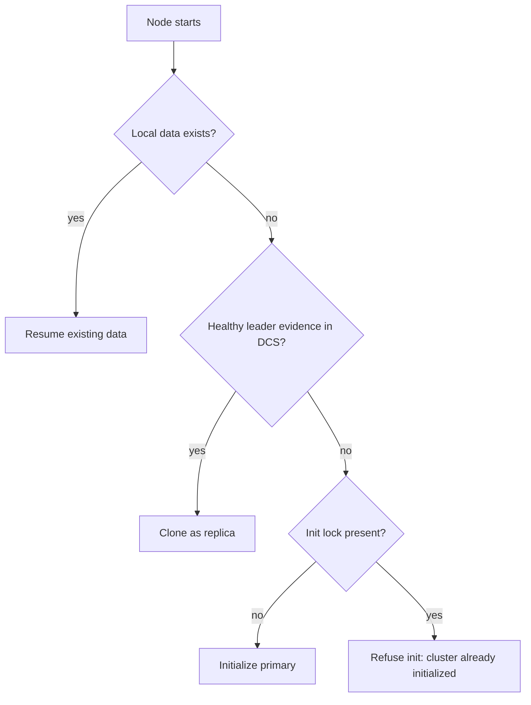

# Bootstrap and Startup Planning

At startup, the node chooses one safe initialization path before entering steady-state reconciliation.

The startup planner selects among:
- initializing a new primary
- cloning as a replica from a healthy source
- resuming existing local data

## Why this exists

Unsafe startup choices can create long-lived divergence. The planner exists to constrain first actions so the node begins from the least risky path available.

## Tradeoffs

Startup does one DCS cache probe before deciding a mode and then proceeds directly. It is single-pass plan selection, not a prolonged evidence-gathering loop.

## When this matters in operations

Startup symptoms often determine later failover quality. If bootstrap repeatedly fails, common causes include binary wiring, data directory permissions, replication auth, and DCS scope consistency; check these before forcing manual role assumptions.
