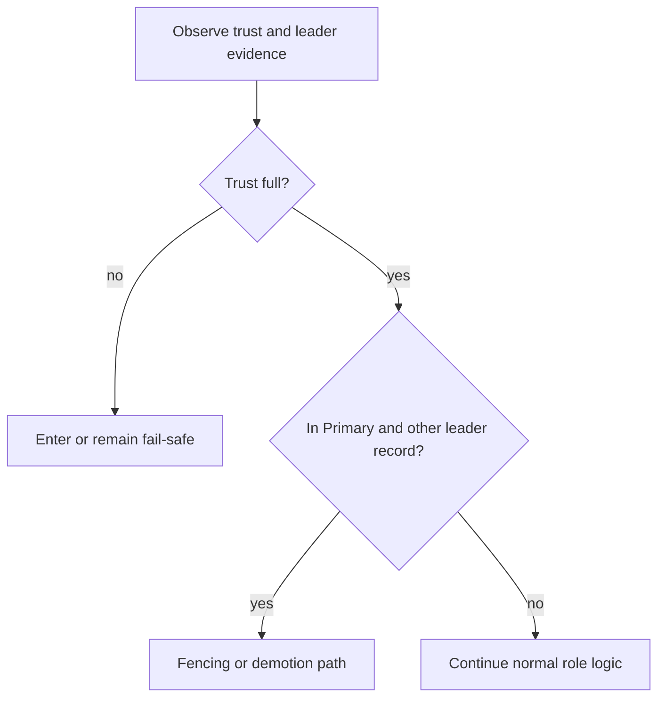

# Fail-Safe and Fencing

Fail-safe and fencing are the lifecycle's safety brakes.

- Fail-safe: coordination trust is degraded enough that normal HA actions should be constrained.
- Fencing: when trust is full and the node observes conflicting leadership evidence while it believes it is primary, it takes demotion-oriented behavior to reduce split-brain risk.

## Reading fail-safe correctly

Operators should treat fail-safe as a meaningful phase, not as noise. It means coordination assumptions are currently too weak for normal promotion behavior. You should see that via `/ha/state` as `ha_phase = "FailSafe"` even if the underlying cluster is still partially reachable.

After fail-safe is selected, the HA worker publishes that phase before slower DCS cleanup completes. In practice that means the API should keep showing `FailSafe` even when lease release or other coordination writes are blocked or timing out.

## Reading fencing correctly

Fencing is different from fail-safe. It is the demotion-oriented response to conflicting leadership evidence while the node still believes it is primary and trust is otherwise strong enough to take action.

That distinction matters during incidents:

- fail-safe means "do not trust coordination enough to promote"
- fencing means "trust is strong enough to react to a conflicting leader and step down safely"
