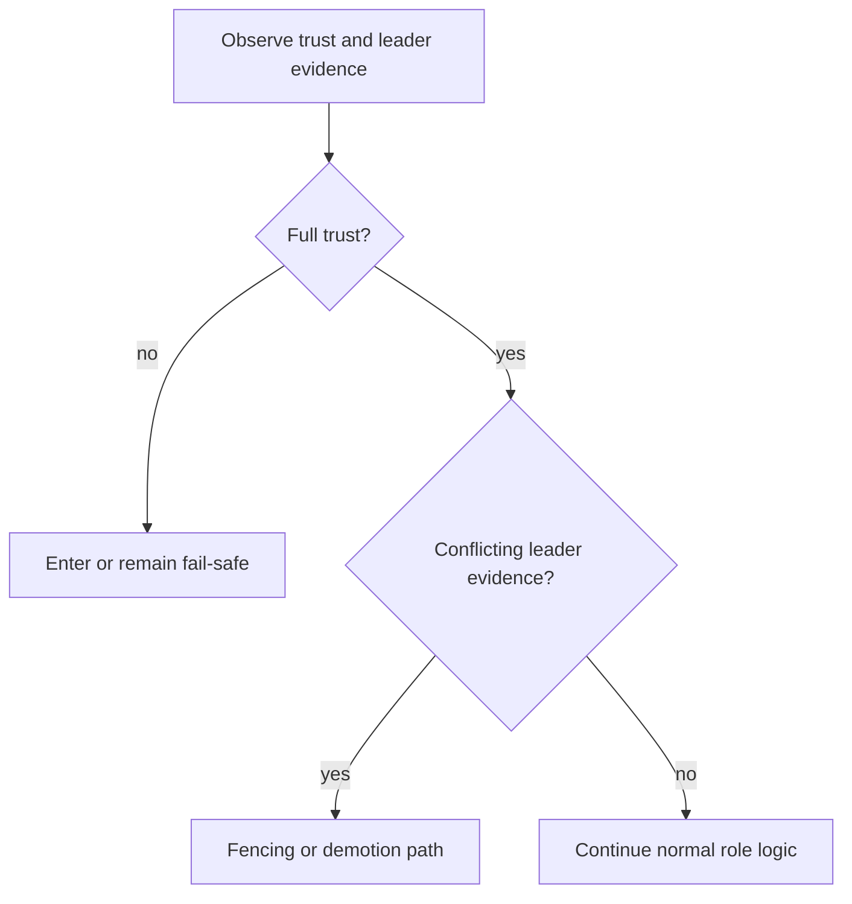

# Fail-Safe and Fencing

Fail-safe and fencing are the lifecycle's safety brakes.

- Fail-safe: coordination trust is degraded enough that normal HA actions should be constrained.
- Fencing: conflicting leader evidence or unsafe primary conditions trigger demotion-oriented behavior to reduce split-brain risk.

## Why this exists

Distributed failures can produce contradictory signals. Safety mechanisms provide deterministic behavior in that ambiguity.

## Tradeoffs

Safety states may reduce immediate availability. This is intentional when the alternative is unsafe concurrent primaries.

## When this matters in operations

Operators should treat fail-safe as a meaningful status, not as noise. It indicates that coordination assumptions are currently insufficient for normal promotion behavior.
