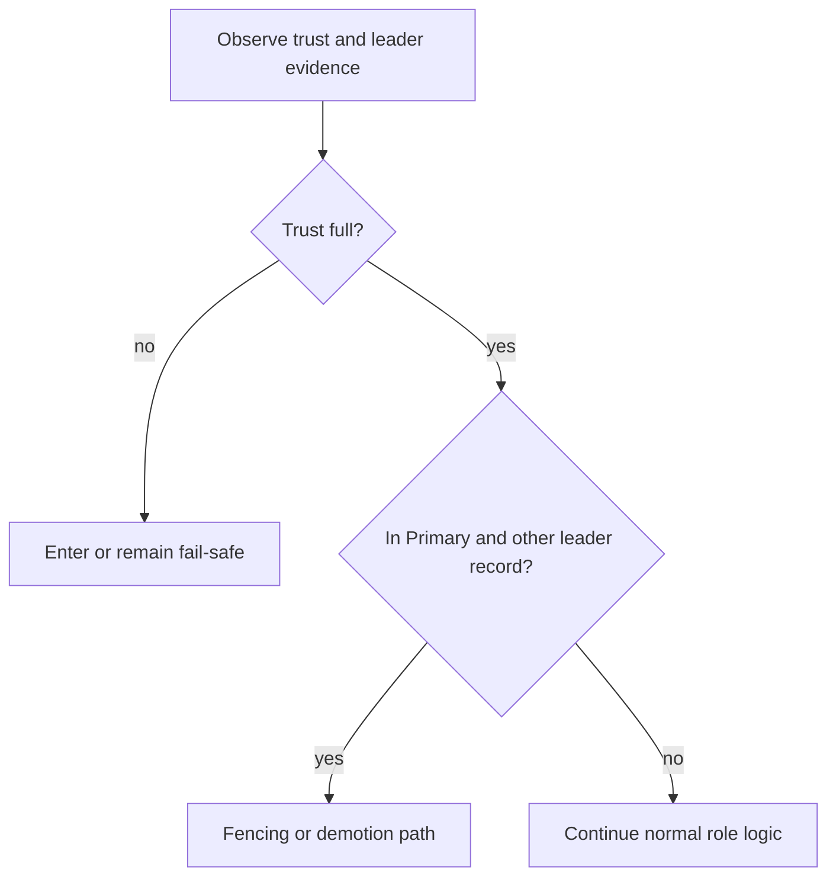

# Fail-Safe and Fencing

Fail-safe and fencing are the lifecycle's safety brakes.

- Fail-safe: coordination trust is degraded enough that normal HA actions should be constrained.
- Fencing: when trust is full and the node observes conflicting leadership evidence while it believes it is primary, it takes demotion-oriented behavior to reduce split-brain risk.

## Reading fail-safe correctly

Operators should treat fail-safe as a meaningful phase, not as noise. It means coordination assumptions are currently too weak for normal promotion behavior. You should see that via `/ha/state` as `ha_phase = "FailSafe"` even if the underlying cluster is still partially reachable.

After fail-safe is selected, the HA worker publishes that phase before slower DCS cleanup completes. In practice that means the API should keep showing `FailSafe` even when lease release or other coordination writes are blocked or timing out.

## Reading fencing correctly

Fencing is different from fail-safe. It is the demotion-oriented response to conflicting leadership evidence while the node still believes it is primary and trust is otherwise strong enough to take action.

That distinction matters during incidents:

- fail-safe means "do not trust coordination enough to promote"
- fencing means "trust is strong enough to react to a conflicting leader and step down safely"

## Fail-safe behavior in detail

The fail-safe path begins whenever DCS trust is not full quorum. From there, the exact outcome still depends on local state. If the node is primary from PostgreSQL's point of view, the runtime can enter fail-safe with an explicit fail-safe decision rather than pretending normal leadership logic still applies. If the node believes it owns leadership but is not currently primary, it may attempt lease release behavior while remaining conservative. If it is neither primary nor in a position to cleanly release leadership, it waits for DCS trust to recover.

The important operational point is that fail-safe is bounded conservatism, not a full explanation of every side effect that may follow. API state can move into fail-safe before all coordination cleanup has completed, and later steps may still depend on process activity and DCS writes succeeding.

## What fail-safe does not guarantee

Fail-safe does not mean the cluster is healed.
Fail-safe does not mean every dangerous condition has already been cleaned up.
Fail-safe does not mean the node will keep serving writes indefinitely.

It means the runtime has stopped treating the current coordination picture as good enough for normal promotion and role-change behavior. That is a crucial safety property, but it is not the same thing as full recovery.

## Fencing behavior in detail

Fencing is entered when the node is in the primary phase, trust is full, and another active leader becomes visible. This is a stronger and more specific condition than ordinary trust degradation. The runtime is effectively saying, "I trust coordination enough to believe this conflict is real enough to act on, and the safe action is to demote rather than continue writing."

While fencing work is running, the node remains in the fencing phase. If fencing succeeds, the runtime moves back toward waiting-for-trusted-DCS and releases leadership for the fencing-complete reason. If fencing work fails, the runtime falls back to fail-safe rather than pretending the danger has disappeared.

That outcome is intentionally cautious. A failed fencing attempt is not evidence that the original conflict was harmless.

## How to interpret API availability during degraded coordination

The API may remain reachable during fail-safe or after fencing begins. Do not confuse API availability with healthy write eligibility. The node can still report state and accept some read-style operations while refusing or delaying role changes. In the quick-start lab, debug routes may still be exposed on the same listener as the HA API, which helps diagnosis but should not be read as evidence that the cluster is otherwise comfortable.

## Practical caution points

- If you see fail-safe, investigate trust freshness, member freshness, and DCS health before you consider manual promotion.
- If you see fencing, look immediately for conflicting leader evidence and demotion side effects rather than treating it like a generic error phase.
- If fail-safe or fencing persists, use recovery and troubleshooting guidance to understand whether the node is waiting for clearer evidence, for process completion, or for explicit repair work.
