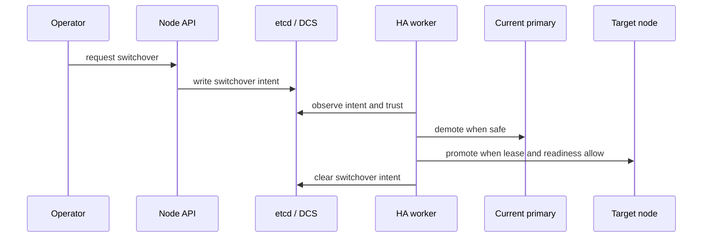

# Planned Switchover

Switchover is an operator-driven transition. It starts from explicit intent and progresses through demotion and promotion under safety checks.

## How it starts

An operator requests switchover through the API or CLI, which writes a `/<scope>/switchover` record. The HA loop then decides whether the request is currently safe to execute.

## What successful progress looks like

The useful checkpoints are:

- the switchover request appears in DCS and in `/ha/state`
- the current primary begins a controlled step-down path
- the target node becomes eligible and promotes only when the lease and readiness checks allow it
- the HA worker clears the switchover record after handling completes

## When it stalls

Treat a stalled switchover as a precondition wait until you prove otherwise. Common blockers are:

- trust is not at full quorum
- the requested successor is not healthy or not visible as a viable member
- the current leader cannot step down safely yet
- PostgreSQL readiness or process work is still in progress
