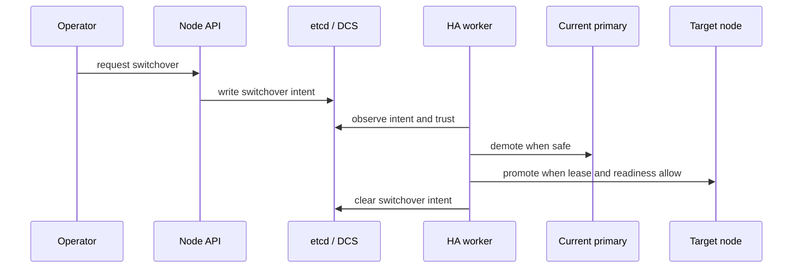

# Planned Switchover

Switchover is an operator-driven transition. It starts from explicit intent and progresses through demotion and promotion under safety checks.

## How it starts

An operator requests switchover through the API or CLI, which writes a `/<scope>/switchover` record. The HA loop then decides whether the request is currently safe to execute.

## What successful progress looks like

The useful checkpoints are:

- the switchover request appears in DCS and in `/ha/state`
- the current primary begins a controlled step-down path
- the target node becomes eligible and promotes only when the lease and readiness checks allow it
- the HA worker clears the switchover record after handling completes

## When it stalls

Treat a stalled switchover as a precondition wait until you prove otherwise. Common blockers are:

- trust is not at full quorum
- the requested successor is not healthy or not visible as a viable member
- the current leader cannot step down safely yet
- PostgreSQL readiness or process work is still in progress

## Accepted intent versus completed transition

This is the most important semantic distinction in the switchover flow. The API acknowledges that the switchover request was recorded. It does not promise that the topology changed immediately. The record simply becomes new evidence for the HA loop to evaluate.

In the current decision model, the primary reacts to visible switchover intent by producing a step-down plan that releases leadership, clears switchover intent, and moves into a waiting-successor phase. That makes the handoff explicit. The old primary is no longer "trying to remain primary until someone else happens to win". It is deliberately entering a state where successor visibility matters.

Operationally, that means you should expect a sequence:

1. intent is accepted and visible
2. the current primary starts a controlled demotion path
3. another member becomes the believable active leader
4. the old primary shifts back into replica-style following

If you stop reading after step 1, you can easily misinterpret a safe wait as a broken switchover.

## Preconditions that really matter

### Full trust still matters for planned work

Planned maintenance does not bypass trust evaluation. If the DCS is not trusted enough for ordinary role changes, it is not trusted enough for a planned switchover either. This is one of the most important safety properties in the project because it prevents "maintenance mode" from becoming a loophole around the same evidence standards used during incidents.

### Successor visibility matters more than operator confidence

The current primary can only step aside safely if another member is visible as a credible follow or promotion target. A human may know which node they want to become primary, but the runtime still needs enough live evidence to act on that desire. That is why the waiting-switchover-successor phase exists at all.

### PostgreSQL reachability still matters during the handoff

If PostgreSQL becomes unreachable in the middle of a switchover, the runtime no longer has the same safe action set it had a moment earlier. The transition may stop being a clean planned handoff and start looking more like an incident combined with recovery work. The right response is to reclassify the state from fresh evidence, not to force the original maintenance narrative onto a now-different failure mode.

## Reading the waiting-successor phase

The waiting-successor phase is not a generic holding pen. It specifically means the previous primary has observed switchover intent and is waiting for a believable replacement leader to appear. If the leader record still points to self or is absent, the node remains cautious. Once another active leader is visible and local PostgreSQL is reachable, the node can move back into following behavior.

This phase is easy to misread because it often appears during a successful switchover that has simply not finished yet. The safest interpretation is "the handoff is in progress but not yet proven complete".

## Failure-path interpretation

When switchover does not complete quickly, do not jump straight to "the feature is broken". Classify the failure path first:

- intent written but never observed: look at API write visibility and DCS state
- intent observed but no demotion: inspect trust and primary-side preconditions
- demotion happened but no successor appeared: inspect candidate eligibility and leader visibility
- successor appeared but old primary did not settle: inspect local PostgreSQL reachability and follow target coherence

This breakdown matters because the remediation differs. Some cases are safe waits, some are coordination problems, and some have already crossed into failover or recovery semantics.
