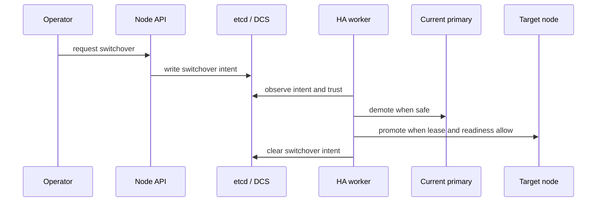

# Planned Switchover

Switchover is an operator-driven transition. It starts from explicit intent and progresses through demotion and promotion under safety checks.

## Why this exists

Planned role changes should be explicit and observable. Intent records provide durable coordination and allow operators to track progress through standard state surfaces.

## Tradeoffs

A strict sequence can be slower than forceful manual promotion. The benefit is lower risk of overlapping primaries and clearer auditability.

## When this matters in operations

If a switchover stalls, treat it as a precondition wait while trust, lease ownership/state, and PostgreSQL readiness constraints are enforced. Check trust posture, node reachability/readiness, and leader lease state first.
