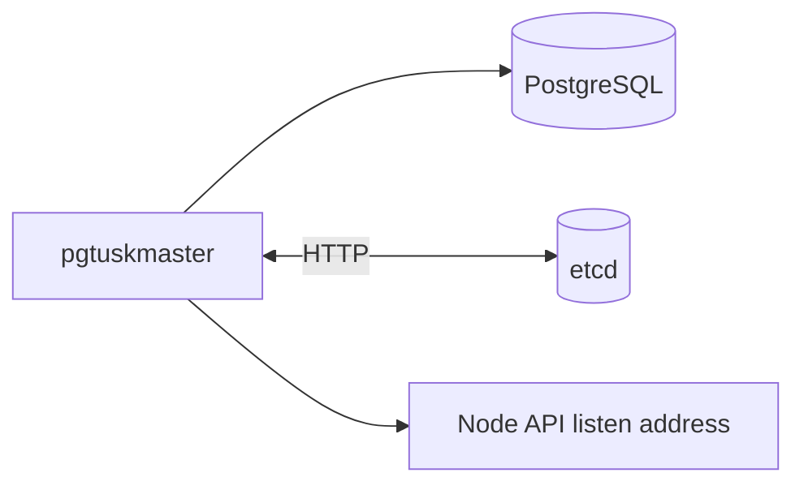

# Deployment

This page captures the operational assumptions a new operator should know.

## What runs where
- One `pgtuskmaster` process per PostgreSQL instance.
- A shared etcd cluster reachable by all nodes.

## Practical concerns
- Ensure data directories have correct permissions (PostgreSQL requires strict ownership/permissions).
- Keep Unix socket paths short (long paths can cause Postgres startup flakes).
- Treat TLS and auth tokens as deployment configuration, not as runtime toggles.

