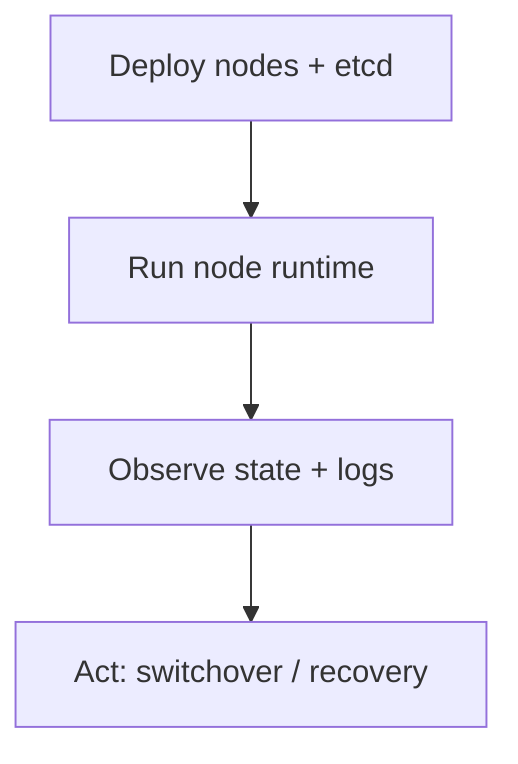

# Operations

This section describes how to run and operate the system: deployment assumptions, directories, ports, and where to look first when something is wrong.

If you only remember three things:
1. Local PostgreSQL truth matters most; DCS is coordination.
2. Trust degradation changes behavior; it is not a simple “retry until etcd returns”.
3. Observability should tell you *why* the node chose a conservative action.

