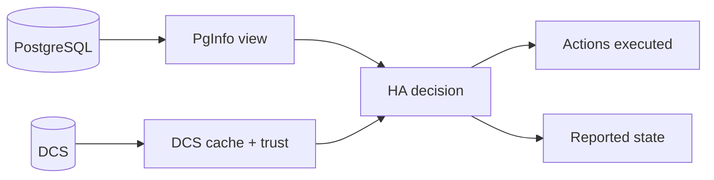

# Observability and Debugging

When the system behaves unexpectedly, you want answers to three questions:
1. What did PostgreSQL look like?
2. What did the DCS look like (and did we trust it)?
3. What decision did HA make, and why?

Start with:
- node logs for the current phase and decision points
- the debug interface (if enabled) for “what changed”
- the HA state endpoint for a summary of current role/phase

