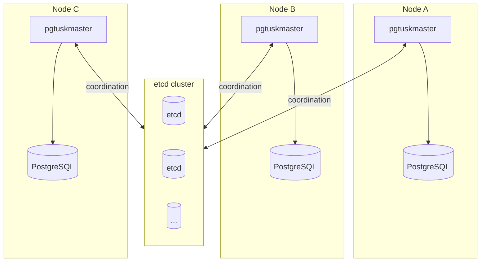

# Deployment and Topology

A standard deployment runs one `pgtuskmaster` process per PostgreSQL instance, with all nodes connected to a shared etcd cluster for coordination.

This layout keeps responsibilities clean:

- PostgreSQL stays local to the host that stores its data directory.
- `pgtuskmaster` makes decisions from local PostgreSQL state plus shared coordination state.
- etcd is coordination memory, not the source of truth for database health.

## What must be consistent across nodes

Some settings should match across every member in the same cluster:

- `[cluster].name`
- `[dcs].scope`
- the etcd deployment they are talking to
- the basic HA timing model, unless you have a specific reason to diverge

If those drift, the cluster can look split even when PostgreSQL is healthy.

## What should remain node-specific

These values normally differ per node:

- `[cluster].member_id`
- PostgreSQL `data_dir`, `listen_host`, and local filesystem paths
- API `listen_addr` and certificates
- any host-specific secret paths

Treat copy-pasted configs with only one or two edits as a risk. The easiest way to create an impossible cluster is to duplicate a `member_id` or leave one node pointing at the wrong scope.

## API exposure choices

The recommended progression is:

1. First run: keep `api.listen_addr = "127.0.0.1:8080"` and use the CLI locally.
2. Real deployment: move the API to a deliberate network address, require TLS, and enable role tokens.

Do not expose an unauthenticated, plaintext API on `0.0.0.0` unless the host is isolated specifically for a short-lived lab.

## Checks before you call the deployment healthy

- PostgreSQL data directories have the required ownership and permissions.
- Socket paths are short and deterministic.
- Every node can reach its configured etcd endpoints.
- Every node advertises the same cluster scope.
- API security matches the actual exposure level of the listener.
- Required binaries exist at the configured absolute paths.

During network partitions or etcd instability, nodes can enter conservative states even if local PostgreSQL still looks healthy. Read that through `dcs_trust` and lifecycle phase, not through process count alone.
