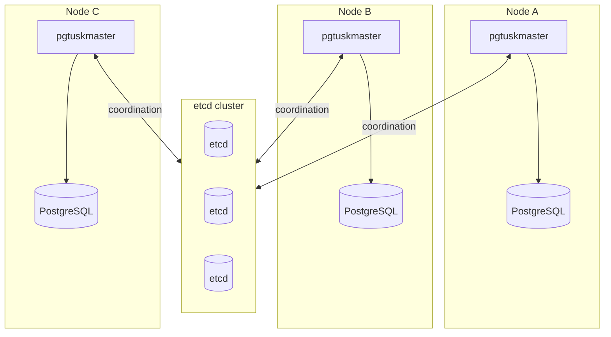

# Deployment and Topology

A standard deployment runs one `pgtuskmaster` process per PostgreSQL instance, with all nodes connected to a shared etcd cluster for coordination.

## Why this exists

This topology keeps data-plane and control-plane responsibilities clear. PostgreSQL stays local to each node. DCS is shared coordination memory, not a substitute for local database health.

## Tradeoffs

A distributed control plane introduces dependence on etcd availability for full coordination trust. The benefit is explicit cluster-wide intent and leader visibility.

## When this matters in operations

During network partitions or etcd instability, nodes may enter conservative states even if local PostgreSQL looks healthy. That behavior is expected and should be interpreted through trust state, not process count alone.

## Deployment checks that prevent common failures

- Keep PostgreSQL data directories with strict required permissions.
- Keep socket paths short and deterministic.
- Validate that each node can reach every configured etcd endpoint.
- Use consistent scope naming across all nodes in the same cluster.
- Confirm API security posture before exposing operator endpoints.
