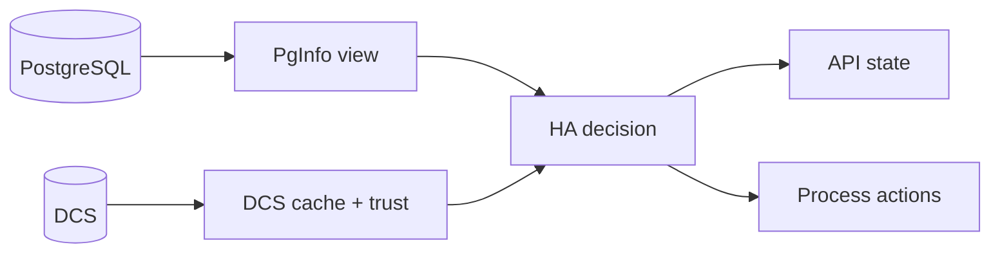

# Observability and Day-2 Operations

Operational confidence depends on three simultaneous views: local PostgreSQL state, DCS trust and cache state, and HA decision output.



## Why this exists

No single surface explains HA behavior. Logs, API state, and DCS records together provide the full context for role decisions and blocked actions.

## Tradeoffs

Richer observability creates more data to read. The benefit is that operators can reconstruct decision context without guessing hidden state.

## When this matters in operations

When a node appears "stuck," you need to determine whether it is unhealthy, waiting on trust, or blocked on a safety precondition. These cases look similar from a distance but require different responses.

## Day-2 operator routine

- Check `/ha/state` for current phase and trust posture.
- Correlate with recent logs around phase transitions and action attempts.
- Inspect DCS records for leader and switchover intent coherence.
- Validate PostgreSQL reachability and readiness on the local node.
- If behavior is conservative, confirm whether trust degradation is the trigger.

## Useful command surfaces

```console
pgtuskmasterctl ha state
pgtuskmasterctl switchover --to <member-id>
pgtuskmasterctl switchover cancel
```

Use planned switchover workflows for controlled role transitions. Avoid ad-hoc out-of-band interventions unless the documented lifecycle path is confirmed blocked.
