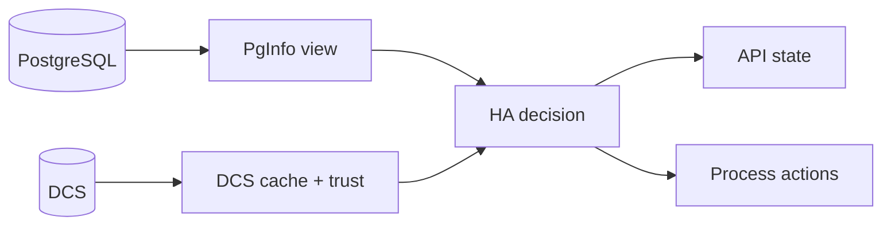

# Observability and Day-2 Operations

Operational confidence depends on three simultaneous views: local PostgreSQL state, DCS trust and cache state, and HA decision output.



No single surface explains HA behavior. Correlate `/ha/state` with logs, DCS records, and debug payloads when enabled instead of trusting any one view in isolation.

## Read these surfaces in order

- Check `/ha/state` for current phase and trust posture.
- Correlate with recent logs around phase transitions and action attempts.
- Inspect DCS records for leader and switchover intent coherence.
- Validate PostgreSQL reachability and readiness on the local node.
- If behavior is conservative, confirm whether trust degradation is the trigger.

During no-quorum events, `/ha/state` should continue answering even while DCS writes or lease cleanup are timing out. Treat an API blackout during fail-safe convergence as a bug, not expected behavior.

## Useful command surfaces

```console
pgtuskmasterctl ha state
pgtuskmasterctl ha switchover request --requested-by <member-id>
pgtuskmasterctl ha switchover clear
```

Use planned switchover workflows for controlled role transitions. Avoid ad-hoc out-of-band interventions unless the documented lifecycle path is confirmed blocked.

## Structured runtime event logs

pgtuskmaster models runtime logs as typed application events and typed raw external records first, then routes the resulting structured `LogRecord` payloads through the logging backend.

Today that backend writes JSONL to stderr and optional file sinks. The backend implementation is tracing-backed, but tracing does not define the application event taxonomy: event identity, domain, result, and structured fields remain owned by the typed logging contract.

OpenTelemetry export is intentionally deferred. The current operator-facing contract is the typed event/raw-record model plus the stderr/file JSONL destinations described in configuration.

Most runtime records include a small event taxonomy in attributes:

- `event.name`: a stable event identifier
- `event.domain`: subsystem such as `runtime`, `ha`, `process`, `api`, `dcs`, `pginfo`, or `postgres_ingest`
- `event.result`: outcome label such as `ok`, `failed`, `started`, `recovered`, or `skipped`

Common correlation attributes:

- `scope`, `member_id`
- `startup_run_id`
- `ha_tick`, `ha_dispatch_seq`, `action_id`, `action_kind`, `action_index`
- `job_id`, `job_kind`, `binary`
- `stream` for captured subprocess output
- `api.peer_addr`, `api.method`, `api.route_template`, `api.status_code`

Recommended operator workflow:

1. Start from lifecycle markers such as `runtime.startup.*` and `ha.phase.transition`.
2. Correlate intent, dispatch, and outcome:
   - `ha.action.intent` -> `ha.action.dispatch` -> `ha.action.result`
   - `process.job.started` -> `process.job.exited|process.job.timeout|process.job.poll_failed`
3. Use warning and error events as the explanation layer:
   - DCS: `dcs.local_member.write_failed`, `dcs.watch.*_failed`
   - PgInfo: `pginfo.poll_failed`, `pginfo.sql_transition`
   - API: `api.step_once_failed`, `api.tls_handshake_failed`

The real node runs workers on a multi-thread Tokio runtime, so a blocked DCS caller should not starve API or debug observability on the same process.

## Debug routes

When `debug.enabled = true`, the most useful extra surface is `/debug/verbose`. It adds a structured timeline and change stream without forcing you to scrape raw logs first. `/debug/ui` is a thin browser view over the same data. `/debug/snapshot` still exists, but it is mainly a compatibility route rather than the best day-2 interface.

## Postgres log ingest health

The Postgres ingest worker tails configured inputs and emits internal diagnostic records when ingestion or cleanup encounters errors instead of failing silently.

What to look for in logs:

- internal log records with `event.domain=postgres_ingest`
- event identifiers like `postgres_ingest.iteration`, `postgres_ingest.step_once_failed`, and `postgres_ingest.recovered`
- stable tags in the message payload such as `stage=... kind=... path=...`
- `suppressed=N` when repeated identical failures are rate-limited

When a node looks "stuck," the combination of `/ha/state`, `ha.phase.transition`, and process-job outcomes usually answers the question faster than staring at PostgreSQL alone.
