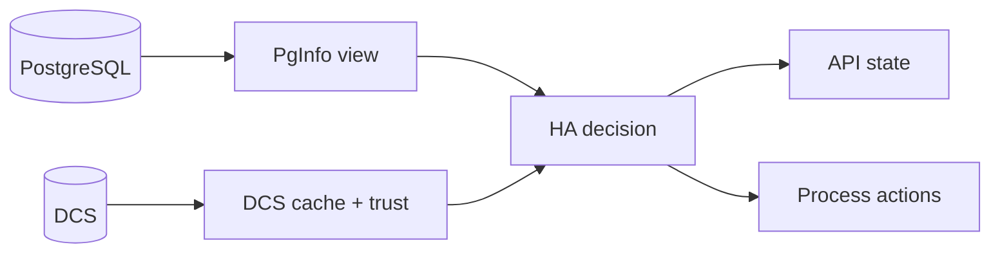

# Observability and Day-2 Operations

Operational confidence depends on three simultaneous views: local PostgreSQL state, DCS trust and cache state, and HA decision output.



## Why this exists

No single surface explains HA behavior. Correlate `/ha/state` with debug payloads (like `/debug/verbose` when enabled), recent logs, and DCS record views rather than relying on any single view.

## Tradeoffs

Richer observability creates more data to read. The benefit is that operators can reconstruct decision context without guessing hidden state.

## When this matters in operations

When a node appears "stuck," you need to determine whether it is unhealthy, waiting on trust, or blocked on a safety precondition. These cases look similar from a distance but require different responses.

## Day-2 operator routine

- Check `/ha/state` for current phase and trust posture.
- Correlate with recent logs around phase transitions and action attempts.
- Inspect DCS records for leader and switchover intent coherence.
- Validate PostgreSQL reachability and readiness on the local node.
- If behavior is conservative, confirm whether trust degradation is the trigger.

During no-quorum events, `/ha/state` should continue answering even while DCS writes or lease cleanup are timing out. Treat an API blackout during fail-safe convergence as a bug, not expected behavior.

## Useful command surfaces

```console
pgtuskmasterctl ha state
pgtuskmasterctl switchover --to <member-id>
pgtuskmasterctl switchover cancel
```

Use planned switchover workflows for controlled role transitions. Avoid ad-hoc out-of-band interventions unless the documented lifecycle path is confirmed blocked.

## Structured runtime event logs

pgtuskmaster models runtime logs as typed application events and typed raw external records first, then routes the resulting structured `LogRecord` payloads through the logging backend.

Today that backend writes JSONL to stderr and optional file sinks. The backend implementation is tracing-backed, but tracing does not define the application event taxonomy: event identity, domain, result, and structured fields remain owned by the typed logging contract.

OpenTelemetry export is intentionally deferred. The current operator-facing contract is the typed event/raw-record model plus the stderr/file JSONL destinations described in configuration.

Most runtime records include a small event taxonomy in attributes:

- `event.name`: a stable event identifier (machine-friendly)
- `event.domain`: subsystem (for example `runtime`, `ha`, `process`, `api`, `dcs`, `pginfo`, `postgres_ingest`)
- `event.result`: outcome label (`ok`, `failed`, `started`, `recovered`, `skipped`, etc.)

Common correlation attributes:

- **Node identity:** `scope`, `member_id`
- **Startup:** `startup_run_id`
- **HA:** `ha_tick`, `ha_dispatch_seq`, `action_id`, `action_kind`, `action_index`
- **Process jobs:** `job_id`, `job_kind`, `binary`
- **Subprocess output:** `stream` (`stdout|stderr`) when captured
- **API:** `api.peer_addr`, `api.method`, `api.route_template`, `api.status_code`

Recommended operator workflow:

1. Start from the high-level lifecycle markers (`runtime.startup.*`, `ha.phase.transition`).
2. Correlate intent → dispatch → outcome:
   - `ha.action.intent` → `ha.action.dispatch` → `ha.action.result`
   - `process.job.started` → `process.job.exited|process.job.timeout|process.job.poll_failed`
3. Use warning/error events as the “why” layer:
   - DCS: `dcs.local_member.write_failed`, `dcs.watch.*_failed`
   - PgInfo: `pginfo.poll_failed`, `pginfo.sql_transition`
   - API: `api.step_once_failed`, `api.tls_handshake_failed`

Runtime note: the real node runs workers on a multi-thread Tokio runtime so a blocked DCS caller does not starve API/debug observability on the same process.

## Postgres log ingest health

The Postgres ingest worker tails configured inputs and emits internal diagnostic records when ingestion or cleanup encounters errors (instead of failing silently).

What to look for in logs:

- internal log records with `event.domain=postgres_ingest` (and usually `origin=postgres_ingest::...`)
- event identifiers like:
  - `postgres_ingest.iteration` (debug breadcrumbs)
  - `postgres_ingest.step_once_failed` (warn/error)
  - `postgres_ingest.recovered` (recovery marker)
- stable tags in the message payload: `stage=... kind=... path=...`
- `suppressed=N` when repeated identical failures are rate-limited
