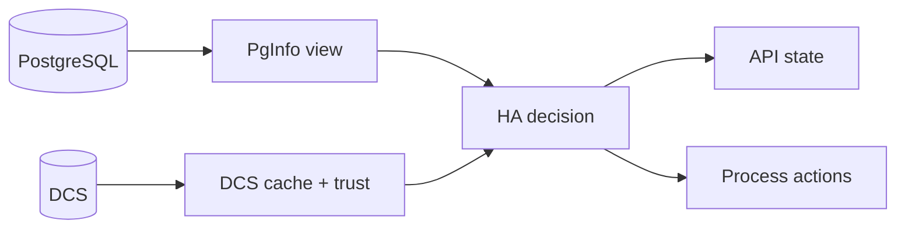

# Observability and Day-2 Operations

Operational confidence depends on three simultaneous views: local PostgreSQL state, DCS trust and cache state, and HA decision output.

No single surface explains HA behavior by itself. A node can be alive while PostgreSQL is unhealthy. PostgreSQL can be reachable while trust is too weak to permit promotion. The API can accept a switchover request while the lifecycle still refuses to execute it. Operators should therefore correlate state rather than hunting for one "source of truth" that answers every question alone.

## Read the signals in a fixed order

Start diagnosis in this sequence:

1. read `/ha/state` or `pgtuskmasterctl ha state`
2. correlate with recent structured logs
3. inspect DCS records and trust posture
4. confirm local PostgreSQL readiness and reachability
5. use `/debug/verbose` when you need the richer timeline

That order mirrors the runtime architecture. It also helps separate three very different situations:

- the node is healthy and the current behavior is expected
- the node is conservative because trust or recovery conditions are weak
- the node is failing to make progress because an action, dependency, or config assumption is broken

## `/ha/state`: the first contract-level answer

`/ha/state` should be your first stop because it tells you what the runtime currently believes:

- cluster identity and self member ID
- current leader, if known
- pending switchover requester, if one exists
- `dcs_trust`
- `ha_phase`
- `ha_decision`
- snapshot sequence

Interpret these fields together, not independently. For example:

- `ha_phase = "FailSafe"` with weak trust is often a protective outcome, not a defect
- `ha_decision = "attempt_leadership"` with no leader may be healthy candidate behavior rather than a stuck loop
- a present `switchover_requested_by` with unchanged roles usually means accepted intent is still waiting on safe preconditions

The tests in this repo explicitly expect `/ha/state` observability during no-quorum fail-safe scenarios. If the API disappears exactly when coordination becomes ambiguous, treat that as suspicious and not as the intended operator experience.

## Structured logs: the explanation layer

`pgtuskmaster` emits typed application events and raw external records through structured logging. That matters because the logs are not only free-form text. They carry stable event names, domains, results, and attributes that help you correlate what happened.

Most records include a small event taxonomy:

- `event.name`: stable event identifier
- `event.domain`: subsystem such as `runtime`, `ha`, `process`, `api`, `dcs`, `pginfo`, or `postgres_ingest`
- `event.result`: outcome label such as `ok`, `failed`, `started`, `recovered`, or `skipped`

Common correlation fields include:

- `scope`, `member_id`
- `startup_run_id`
- `ha_tick`, `ha_dispatch_seq`, `action_id`, `action_kind`, `action_index`
- `job_id`, `job_kind`, `binary`
- `api.peer_addr`, `api.method`, `api.route_template`, `api.status_code`

Useful operator pattern:

1. start from lifecycle markers like `runtime.startup.*` and `ha.phase.transition`
2. correlate intent, dispatch, and outcome:
   - `ha.action.intent`
   - `ha.action.dispatch`
   - `ha.action.result`
3. map process work:
   - `process.job.started`
   - `process.job.exited`
   - `process.job.timeout`
   - `process.job.poll_failed`

This tells you whether the node is blocked in reasoning, blocked in process execution, or blocked on a dependency.

## DCS and trust interpretation

The DCS view tells you whether the cluster still has a shared picture worth acting on. Important operator questions are:

- does every node appear under the same scope
- is there a current leader record
- is switchover intent present or already cleared
- is the runtime treating trust as full quorum, fail-safe, or not trusted

Trust transitions matter more than many operators expect. A conservative fail-safe phase in the presence of DCS instability is often the correct behavior, because the runtime is refusing to promote based on evidence it no longer considers reliable.

## Debug routes: when to use them

When `debug.enabled = true`, `/debug/verbose` is the most useful extra surface. It exposes a structured timeline and change stream, optionally filtered by `?since=<sequence>`, so you can inspect recent state evolution without rebuilding the whole story from logs alone.

Use debug routes when:

- the current state is understandable, but the recent path into it is not
- you need to confirm whether snapshots are still advancing
- you are in a lab or controlled environment where the broader debug surface is acceptable

Do not lean on debug as the first or only interface in routine operations. It is an extra diagnosis tool, not the core contract surface.

## PostgreSQL and process-state interpretation

A running PostgreSQL port is necessary but not sufficient. Correlate it with:

- local SQL reachability
- process worker outcomes for start, rewind, base backup, bootstrap, or fencing jobs
- HA decisions that explain why no further action is occurring

Typical interpretations:

- PostgreSQL reachable + no leader + `attempt_leadership`: candidate behavior, not necessarily failure
- PostgreSQL unreachable + release or recovery decisions: likely transition into rewind/bootstrap/fencing logic
- repeated process-job failures: execution layer problem, not just a coordination problem

## Day-2 habits that prevent confusion

- read state before issuing write intent
- compare trust and phase before calling conservative behavior a bug
- use logs to explain state changes, not just to confirm that a process exists
- keep the lifecycle chapter open when a phase name appears repeatedly and the reason is unclear

Those habits turn the observability surfaces into a coherent narrative instead of a pile of independent signals.
