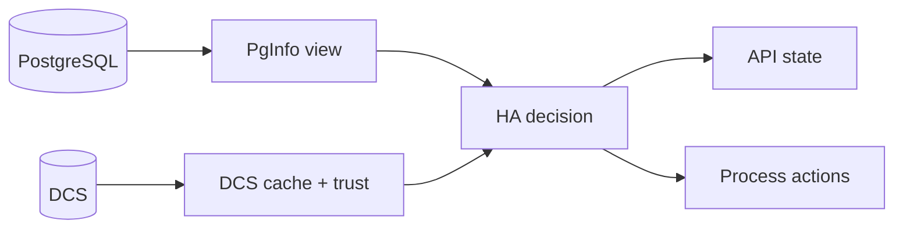

# Observability and Day-2 Operations

Operational confidence depends on three simultaneous views: local PostgreSQL state, DCS trust and cache state, and HA decision output.



## Why this exists

No single surface explains HA behavior. Correlate `/ha/state` with debug payloads (like `/debug/verbose` when enabled), recent logs, and DCS record views rather than relying on any single view.

## Tradeoffs

Richer observability creates more data to read. The benefit is that operators can reconstruct decision context without guessing hidden state.

## When this matters in operations

When a node appears "stuck," you need to determine whether it is unhealthy, waiting on trust, or blocked on a safety precondition. These cases look similar from a distance but require different responses.

## Day-2 operator routine

- Check `/ha/state` for current phase and trust posture.
- Correlate with recent logs around phase transitions and action attempts.
- Inspect DCS records for leader and switchover intent coherence.
- Validate PostgreSQL reachability and readiness on the local node.
- If behavior is conservative, confirm whether trust degradation is the trigger.

## Useful command surfaces

```console
pgtuskmasterctl ha state
pgtuskmasterctl switchover --to <member-id>
pgtuskmasterctl switchover cancel
```

Use planned switchover workflows for controlled role transitions. Avoid ad-hoc out-of-band interventions unless the documented lifecycle path is confirmed blocked.

## Backup / archive command events

When `backup.enabled = true`, pgtuskmaster owns `archive_command` and `restore_command` via a generated wrapper and writes **one JSON line per invocation** to `logging.postgres.archive_command_log_file`.

These records are ingested by the Postgres log ingest worker and normalized into stable attributes on the resulting log records:

- `backup.schema_version` (number)
- `backup.provider` (`"pgbackrest"`)
- `backup.event_kind` (`"archive_push"` or `"archive_get"`)
- `backup.invocation_id` (string)
- `backup.ts_ms` (number; epoch ms)
- `backup.stanza`, `backup.repo`, `backup.pg1_path`
- `backup.wal_path` (push only)
- `backup.wal_segment`, `backup.destination_path` (get only)
- `backup.status_code` (number; pgBackRest exit code)
- `backup.success` (bool)
- `backup.output` (string; single-line, truncated)
- `backup.output_truncated` (bool)

Operational use:

- Use `backup.event_kind=archive_get` spikes to correlate recovery stalls (WAL fetch failures).
- Use `backup.status_code != 0` and `backup.output` to diagnose repo/auth/path misconfigurations without shell access.

## Postgres log ingest health

The Postgres ingest worker tails configured inputs and emits internal diagnostic records when ingestion or cleanup encounters errors (instead of failing silently).

What to look for in logs:

- internal log records with `origin=postgres_ingest`
- stable tags in the message payload: `stage=... kind=... path=...`
- `suppressed=N` when repeated identical failures are rate-limited
