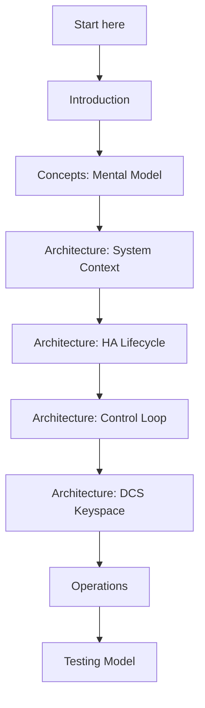

# Reading Guide

This book is organized as a “system book”, not a tutorial. Pick a path based on your goal.

## If you have ~15 minutes
1. [Introduction](./introduction.md) (what the system is)
2. [Concepts / Mental Model](./concepts/mental-model.md) (what the moving parts are)
3. [Architecture / System Context](./architecture/system-context.md) (what talks to what)
4. [Architecture / HA Lifecycle](./architecture/ha-lifecycle.md) (what “healthy” looks like)

## If you have ~60 minutes
1. Everything in the 15-minute path
2. [Architecture / Control Loop](./architecture/control-loop.md)
3. [Architecture / Startup Planner](./architecture/startup-planner.md)
4. [Architecture / DCS Keyspace](./architecture/dcs-keyspace.md)
5. [Architecture / Failover and Recovery](./architecture/failover-and-recovery.md)
6. [Architecture / Safety and Fencing](./architecture/safety-and-fencing.md)
7. [Operations / Observability](./operations/observability.md)

## If you’re here for a specific job
- Operator/SRE: [Operations](./operations/index.md) + [Interfaces / Node API](./interfaces/node-api.md)
- HA behavior: [Architecture / HA Lifecycle](./architecture/ha-lifecycle.md) + [Failover and Recovery](./architecture/failover-and-recovery.md)
- Security posture: [Interfaces / Node API](./interfaces/node-api.md) + [Architecture / Safety and Fencing](./architecture/safety-and-fencing.md)

