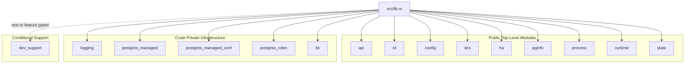

# Code Organization Reference

This document describes the module structure, visibility boundaries, and workspace composition of the `pgtuskmaster_rust` codebase.

## Crate Root Structure

The main crate organizes code into domain-oriented modules under `src/`. Module visibility is explicitly controlled at the crate root level.

### Top-Level Module Classification

```text
src/lib.rs
├── Public Domain Modules (pub mod)
│   ├── api          - HTTP API surface and node state DTOs
│   ├── cli          - Command-line interface integration
│   ├── config       - Configuration parsing and schema
│   ├── dcs          - Distributed coordination service domain
│   ├── ha           - High-availability decision engine types
│   ├── pginfo       - PostgreSQL observation state
│   ├── process      - Process management domain
│   ├── runtime      - Application node startup wiring
│   └── state        - Shared identifiers and state primitives
│
├── Internal Infrastructure Modules (pub(crate) mod)
│   ├── logging          - Event logging runtime and ingestion
│   ├── postgres_managed - PostgreSQL instance lifecycle
│   ├── postgres_managed_conf - Configuration templating
│   ├── postgres_roles   - Role management logic
│   └── tls              - TLS certificate handling
│
└── Conditional Test Modules
    └── dev_support      - Test infrastructure (test-only or feature-gated)
```

## Public API Surface

The public surface exposes domain models and orchestration types needed across the codebase. Public modules selectively re-export stable interfaces while hiding implementation details.

### API Module (`src/api/`)

Exposes HTTP-facing data transfer objects and the worker entry point.

**Public exports:**

- `pub mod worker` - API server worker entry
- `NodeState` - Composite node state snapshot
- `AcceptedResponse`, `ReloadCertificatesResponse` - API response types
- `ApiCertificateReloadStep`, `PostgresCertificateReloadStep` - Reload step enums
- `PostgresReloadSignal` - Signal enumeration

**Internal components:**

- `pub(crate) mod controller` - HTTP request handlers
- `pub(crate) mod startup` - Server initialization glue

### HA Module (`src/ha/`)

Exposes high-availability state and domain models while keeping decision logic internal.

**Public exports:**

- `pub mod state` - HA state enumerations and views
- `pub mod types` - Decision and reconciliation types

**Internal components:**

- `pub(crate) mod decide` - Decision engine core
- `pub(crate) mod reconcile` - State reconciliation loop
- `pub(crate) mod process_dispatch` - Process action dispatch
- `pub(crate) mod startup` - HA subsystem bootstrap
- `pub(crate) mod worker` - Decision worker execution

### DCS Module (`src/dcs/`)

Provides read-only cluster views and coordination primitives.

**Public re-exports from state:**

- `ClusterMemberView`
- `ClusterView`
- `DcsMode`
- `DcsView`
- `LeadershipObservation`
- `MemberPostgresView`
- `NotTrustedView`
- `SwitchoverView`

**Internal components:**

- `mod command` - DCS command module; `DcsHandle` is re-exported as `pub(crate)`
- `pub(crate) mod startup` - DCS client initialization
- `pub(crate) mod worker` - DCS event processing loop
- `pub(crate) mod log_event` - DCS-related log events

### Process Module (`src/process/`)

Exposes process intents and state while protecting spawn mechanisms.

**Public exports:**

- `pub mod jobs` - Process job definitions
- `pub mod state` - Process state enumerations

**Internal components:**

- `pub(crate) mod postmaster` - PostgreSQL postmaster interaction
- `pub(crate) mod source` - Process source resolution
- `pub(crate) mod startup` - Process subsystem bootstrap
- `pub(crate) mod worker` - Process monitoring loop
- `pub(crate) mod log_event` - Process-related log events

## Internal-Only Infrastructure

These modules implement cross-cutting concerns and remain crate-private by design.

### Logging Module (`src/logging/`)

Provides structured event logging with a split internal architecture:

```text
src/logging/
├── event.rs             - Derive-facing log trait and DTO model
├── core/
│   ├── mod.rs           - Core logging re-exports and private queue wiring
│   ├── runtime.rs       - Runtime log dispatch, sinks, worker, and bootstrap
│   └── queued_record.rs - Record queuing and DTO materialization
├── postgres_ingest.rs   - PostgreSQL log ingestion pipeline
└── tailer.rs            - Log tailing implementation
```

**Visibility:** `pub(crate)` at crate root. Not exposed externally.

### PostgreSQL Management Modules

- `postgres_managed` - PostgreSQL instance lifecycle and state management
- `postgres_managed_conf` - Configuration file templating and rendering
- `postgres_roles` - Role creation and permission management

**Visibility:** all `pub(crate)` at crate root.

### TLS Module (`src/tls.rs`)

Certificate parsing and validation logic for client and server TLS operations.

**Visibility:** `pub(crate)` at crate root.

## Workspace Structure

The repository defines a Cargo workspace with two additional members beyond the main crate.

```text
Workspace Root
├── pgtuskmaster_rust (main crate)
├── crates/
│   ├── pgtm_log_derive/           - Proc-macro crate for logging derives
│   └── pgtuskmaster_test_support/ - Integration test infrastructure
```

### Workspace Members

**`pgtm_log_derive`**

- Purpose: procedural macros for generating log event code
- Used by: main crate's logging subsystem
- Visibility: internal dependency only

**`pgtuskmaster_test_support`**

- Purpose: provides `ha_runner` and re-exports `pgtuskmaster_rust::dev_support::{api, runtime_config, HarnessError}`
- Used by: integration tests
- Visibility: `dev-dependencies` only

## Feature Flags

The main crate defines one optional feature:

**`internal-test-support`**

- Exports `dev_support` outside test context
- Purpose: allow external tooling to access test infrastructure
- Usage: `cargo build --features internal-test-support`
- Status: exceptional tooling support, not part of normal runtime API

## Module Dependency Flow



## Visibility Enforcement

The codebase uses explicit visibility modifiers with compiler-enforced restrictions:

- Workspace lint policy in `Cargo.toml` denies warnings plus `clippy::unwrap_used`, `clippy::expect_used`, `clippy::panic`, `clippy::todo`, and `clippy::unimplemented`
- `pub(crate)` for internal modules
- selective `pub mod` for domain APIs
- feature-gated conditional compilation for test-only code

Key principle: public modules do not imply all submodules are public. Each submodule's visibility is independently determined based on whether it represents stable domain models or implementation details.
