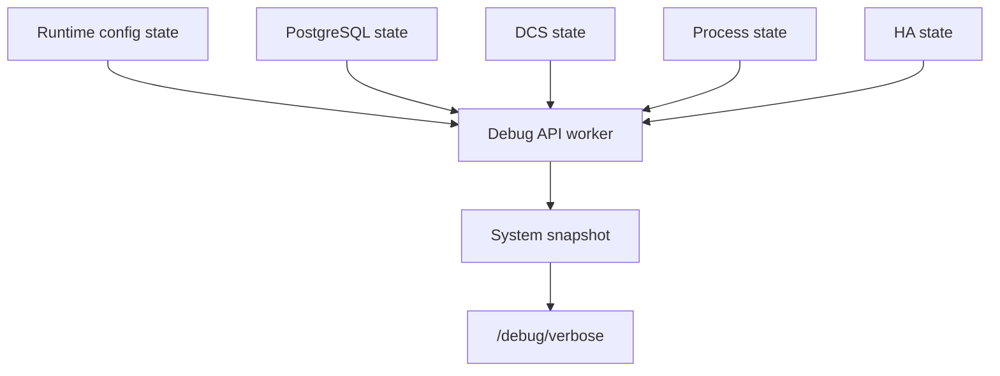

# Debug API

The debug API is a built-in read-only observability surface. It is available only when `debug.enabled` is true in the runtime configuration.

For day-to-day investigation, operators usually start with the CLI:

- `pgtm status -v` for the cluster-wide table, explicit debug availability, and per-node detail block
- `pgtm debug verbose` for a single node's stable verbose payload

This page stays focused on the underlying HTTP contract that those CLI commands read.

## Availability

The debug endpoints run on the same listener as the main HTTP API and inherit its TLS and bearer-token settings.

- When `debug.enabled` is `false`, the debug endpoints return `404 Not Found`.
- When API auth is disabled, the debug endpoints are reachable without a bearer token.
- When API role tokens are configured, the debug endpoints require read access.

## Endpoints

| Method | Path | Purpose |
| --- | --- | --- |
| `GET` | `/debug/verbose` | Stable JSON view of current state plus retained history |
| `GET` | `/debug/snapshot` | Raw diagnostic snapshot surface |
| `GET` | `/debug/ui` | Browser UI built on top of `/debug/verbose` |

## `GET /debug/verbose`

`/debug/verbose` is the structured endpoint to automate against.

### Query parameter

| Name | Type | Meaning |
| --- | --- | --- |
| `since` | integer, optional | Return only `changes` and `timeline` entries with `sequence > since` |

### Top-level shape

```text
{
  "meta": {},
  "config": {},
  "pginfo": {},
  "dcs": {},
  "process": {},
  "ha": {},
  "api": {},
  "debug": {},
  "changes": [],
  "timeline": []
}
```

### `meta`

| Field | Meaning |
| --- | --- |
| `schema_version` | Verbose payload schema version. The current value is `"v1"` |
| `generated_at_ms` | Snapshot generation time in Unix milliseconds |
| `channel_updated_at_ms` | Last update time of the published snapshot channel |
| `channel_version` | Current published snapshot channel version |
| `app_lifecycle` | Application lifecycle label |
| `sequence` | Monotonic sequence number for the current snapshot |

### `config`

| Field | Meaning |
| --- | --- |
| `version` | Runtime-config channel version |
| `updated_at_ms` | Config publish time |
| `cluster_name` | Configured cluster name |
| `member_id` | Local member id |
| `scope` | Configured DCS scope |
| `debug_enabled` | Whether debug mode is enabled |
| `tls_enabled` | Whether API TLS is enabled |

### `pginfo`

| Field | Meaning |
| --- | --- |
| `version` | PostgreSQL-state channel version |
| `updated_at_ms` | PostgreSQL-state publish time |
| `variant` | `Unknown`, `Primary`, or `Replica` |
| `worker` | Worker status label |
| `sql` | SQL health label |
| `readiness` | Readiness label |
| `timeline` | Current timeline when known |
| `summary` | Compact human-readable summary |

### `dcs`

| Field | Meaning |
| --- | --- |
| `version` | DCS-state channel version |
| `updated_at_ms` | DCS-state publish time |
| `worker` | Worker status label |
| `trust` | Trust label: `FullQuorum`, `FailSafe`, or `NotTrusted` |
| `member_count` | Count of cached members |
| `leader` | Current leader member id when present |
| `has_switchover_request` | Whether a switchover request is currently cached |

### `process`

| Field | Meaning |
| --- | --- |
| `version` | Process-state channel version |
| `updated_at_ms` | Process-state publish time |
| `worker` | Worker status label |
| `state` | `Idle` or `Running` |
| `running_job_id` | Active job id when the process worker is running |
| `last_outcome` | Last completed job outcome when idle |

### `ha`

| Field | Meaning |
| --- | --- |
| `version` | HA-state channel version |
| `updated_at_ms` | HA-state publish time |
| `worker` | Worker status label |
| `phase` | Current local HA role label |
| `tick` | HA loop tick |
| `decision` | Compact authority projection string |
| `decision_detail` | Debug-oriented detail string for the current role |
| `planned_actions` | Number of ordered reconcile actions currently planned |

The response-facing `ha.phase` labels are the current `ha_role` labels from `/ha/state`:

- `leader`
- `candidate`
- `follower`
- `fail_safe`
- `demoting_for_switchover`
- `fenced`
- `idle`

The response-facing `ha.decision` value is not a tagged enum anymore. It is the authority string projection:

- `primary:<member_id>#<generation>` when primary authority is published
- `no_primary:<Reason>` when the node deliberately withholds primary authority
- `unknown` during startup before publication converges

`ha.decision_detail` is the Rust-debug rendering of the current role. Treat it as incident detail, not as a normalized automation contract.

### `api`

`api.endpoints` is a static list of surfaced routes:

```text
[
  "/debug/snapshot",
  "/debug/verbose",
  "/debug/ui",
  "/fallback/cluster",
  "/switchover",
  "/ha/state",
  "/ha/switchover"
]
```

### `debug`

| Field | Meaning |
| --- | --- |
| `history_changes` | Count of retained change events |
| `history_timeline` | Count of retained timeline entries |
| `last_sequence` | Highest retained sequence number |

### `changes`

Each change row contains:

- `sequence`
- `at_ms`
- `domain`
- `previous_version`
- `current_version`
- `summary`

### `timeline`

Each timeline row contains:

- `sequence`
- `at_ms`
- `category`
- `message`

## Incremental polling and retention

The debug worker retains bounded in-memory history. The current default history limit is `300` entries for `changes` and `timeline`.

If you want the CLI wrapper for the same flow, use:

```bash
pgtm -c config.toml debug verbose
pgtm -c config.toml debug verbose --since 42
```

For raw HTTP clients, use `meta.sequence` or `debug.last_sequence` as your next `since` cursor:

```bash
last_seq=$(curl --fail --silent http://127.0.0.1:8080/debug/verbose | jq '.meta.sequence')
curl --fail --silent "http://127.0.0.1:8080/debug/verbose?since=${last_seq}"
```

When `since` is present, only `changes` and `timeline` are filtered. The other top-level sections still describe the current snapshot.

## `GET /debug/snapshot`

`/debug/snapshot` exposes the raw snapshot-oriented diagnostic surface. Use it for troubleshooting, not as a stable machine contract. For structured automation, prefer `/debug/verbose`.

## `GET /debug/ui`

`/debug/ui` is the built-in HTML viewer for the debug data. It polls `/debug/verbose?since=...` and renders the same change and timeline history for a browser.

## How the snapshot is built



The worker samples the versioned subsystem states, records meaningful changes, appends timeline entries, trims history to the configured limit, and then publishes the composite snapshot.
