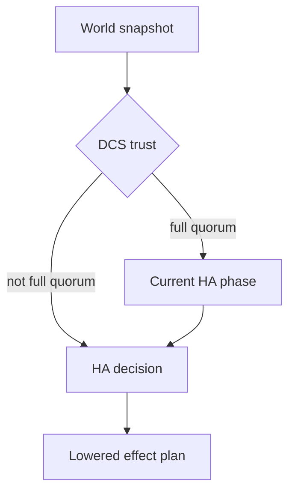

# HA Decisions

This page catalogs the HA decision variants exposed through `GET /ha/state`.

Use it when you need to interpret the `ha_decision` field without reading the Rust enums directly.

## Where decisions appear

`GET /ha/state` returns:

- `dcs_trust`
- `ha_phase`
- `ha_tick`
- `ha_decision`
- `snapshot_sequence`

`ha_decision` is a tagged JSON enum. The controller maps internal HA decisions into the response shapes described below.

## Trust gate first

The decision engine is trust-gated.

- When DCS trust is not `FullQuorum`, normal phase logic is bypassed.
- If local PostgreSQL is primary while trust is degraded, the node enters `FailSafe` with `enter_fail_safe`.
- If local PostgreSQL is not primary while trust is degraded, the node moves into `FailSafe` with `no_change`.

That is why some decisions only appear during healthy DCS trust.

## Decision variants

### `no_change`

```json
{
  "kind": "no_change"
}
```

No new action is requested for this tick.

### `wait_for_postgres`

```json
{
  "kind": "wait_for_postgres",
  "start_requested": true,
  "leader_member_id": "node-a"
}
```

Fields:

- `start_requested`: whether the process layer may request PostgreSQL startup
- `leader_member_id`: optional leader context for the wait

This decision is used when PostgreSQL is not yet reachable enough for the next HA step.

### `wait_for_dcs_trust`

```json
{
  "kind": "wait_for_dcs_trust"
}
```

PostgreSQL is reachable enough to continue, but the node is still waiting for trusted DCS state.

### `attempt_leadership`

```json
{
  "kind": "attempt_leadership"
}
```

The node should try to acquire leadership.

### `follow_leader`

```json
{
  "kind": "follow_leader",
  "leader_member_id": "node-a"
}
```

Field:

- `leader_member_id`: the member to follow as a replica

### `become_primary`

```json
{
  "kind": "become_primary",
  "promote": true
}
```

Field:

- `promote`: whether the node should run promotion work instead of simply remaining primary

### `step_down`

```json
{
  "kind": "step_down",
  "reason": {
    "kind": "switchover"
  },
  "release_leader_lease": true,
  "clear_switchover": true,
  "fence": false
}
```

Fields:

- `reason`
- `release_leader_lease`
- `clear_switchover`
- `fence`

`step_down` is a structured plan, not just a label.

`reason` can be:

- `{"kind":"switchover"}`
- `{"kind":"foreign_leader_detected","leader_member_id":"node-b"}`

### `recover_replica`

```json
{
  "kind": "recover_replica",
  "strategy": {
    "kind": "rewind",
    "leader_member_id": "node-a"
  }
}
```

`strategy` can be:

- `{"kind":"rewind","leader_member_id":"node-a"}`
- `{"kind":"base_backup","leader_member_id":"node-a"}`
- `{"kind":"bootstrap"}`

### `fence_node`

```json
{
  "kind": "fence_node"
}
```

The node should enter fencing behavior to protect against unsafe primary behavior.

### `release_leader_lease`

```json
{
  "kind": "release_leader_lease",
  "reason": "postgres_unreachable"
}
```

`reason` can be:

- `fencing_complete`
- `postgres_unreachable`

### `enter_fail_safe`

```json
{
  "kind": "enter_fail_safe",
  "release_leader_lease": false
}
```

Field:

- `release_leader_lease`: whether fail-safe entry also releases the leader lease

## Related HA phases

The phase machine exposes these phases:

- `init`
- `waiting_postgres_reachable`
- `waiting_dcs_trusted`
- `waiting_switchover_successor`
- `replica`
- `candidate_leader`
- `primary`
- `rewinding`
- `bootstrapping`
- `fencing`
- `fail_safe`

The decision and phase move together, but they are not the same thing:

- the phase tells you where the node is in the HA state machine
- the decision tells you what action the node wants next

## How decisions map to work

The HA layer lowers decisions into effect plans. At a high level:

- `attempt_leadership` drives lease acquisition
- `follow_leader` drives replica-follow behavior
- `become_primary` drives primary behavior and promotion
- `recover_replica` drives rewind, base-backup, or bootstrap recovery
- `step_down`, `release_leader_lease`, and `enter_fail_safe` drive safety and lease changes
- `fence_node` drives fencing

## Reading decisions during operations

Common operator interpretations:

- `wait_for_postgres`: local PostgreSQL is not ready for the next HA step
- `wait_for_dcs_trust`: the node is waiting for a trustworthy cluster view
- `attempt_leadership`: no healthy leader is being followed and this node is trying to lead
- `follow_leader`: the node has a leader and intends to remain a replica
- `recover_replica`: replica rejoin or divergence handling is in progress
- `step_down` or `release_leader_lease`: leadership is being given up deliberately
- `enter_fail_safe` or `fence_node`: safety behavior is taking precedence over availability

## Diagram


