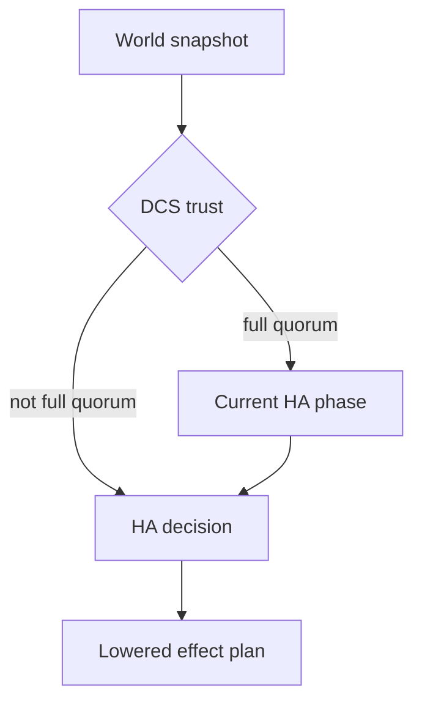

# HA Decisions

This page catalogs the HA decision variants exposed through `GET /ha/state`.

Use it when you need to interpret the `ha_decision` field without reading the Rust enums directly.

## Where decisions appear

`GET /ha/state` returns:

- `dcs_trust`
- `ha_phase`
- `ha_tick`
- `ha_decision`
- `snapshot_sequence`

`ha_decision` is a tagged JSON enum. The controller maps internal HA decisions into the response shapes described below.

## Trust gate first

The decision engine is trust-gated.

- When DCS trust is not `FullQuorum`, normal phase logic is bypassed.
- If local PostgreSQL is primary while trust is degraded, the node enters `FailSafe` with `enter_fail_safe`.
- If local PostgreSQL is not primary while trust is degraded, the node moves into `FailSafe` with `no_change`.

That is why some decisions only appear during healthy DCS trust.

## Decision variants

### `no_change`

```text
{
  "kind": "no_change"
}
```

No new action is requested for this tick.

### `wait_for_postgres`

```text
{
  "kind": "wait_for_postgres",
  "start_requested": true,
  "leader_member_id": "node-a"
}
```

Fields:

- `start_requested`: whether the process layer may request PostgreSQL startup
- `leader_member_id`: optional leader context for the wait

This decision is used when PostgreSQL is not yet reachable enough for the next HA step.

### `wait_for_dcs_trust`

```text
{
  "kind": "wait_for_dcs_trust"
}
```

PostgreSQL is reachable enough to continue, but the node is still waiting for trusted DCS state.

### `wait_for_promotion_safety`

```text
{
  "kind": "wait_for_promotion_safety",
  "blocker": {
    "kind": "lagging_fresh_wal",
    "timeline": 3,
    "required_lsn": 123456,
    "local_replay_lsn": 123400,
    "source_member_id": "node-b"
  }
}
```

Field:

- `blocker`: the structured reason promotion is being held back

This decision appears when there is no leader to follow, the local node is not already primary, and promotion is not yet safe.

Promotion safety is evaluated against the freshest DCS evidence visible to the node:

- the highest fresh timeline seen in member records
- the highest fresh WAL position seen on that timeline

The node waits instead of attempting leadership until it can prove it is caught up enough to promote safely.

`blocker.kind` can be:

- `not_healthy_replica`
- `missing_local_timeline`
- `missing_local_replay_lsn`
- `higher_fresh_timeline`
- `lagging_fresh_wal`

### `attempt_leadership`

```text
{
  "kind": "attempt_leadership"
}
```

The node should try to acquire leadership.

### `follow_leader`

```text
{
  "kind": "follow_leader",
  "leader_member_id": "node-a"
}
```

Field:

- `leader_member_id`: the member to follow as a replica

### `become_primary`

```text
{
  "kind": "become_primary",
  "promote": true
}
```

Field:

- `promote`: whether the node should run promotion work instead of simply remaining primary

### `complete_switchover`

```text
{
  "kind": "complete_switchover"
}
```

This decision clears the DCS switchover request after the new primary can safely observe that leadership has already moved away from the old primary.

### `step_down`

```text
{
  "kind": "step_down",
  "reason": {
    "kind": "switchover"
  },
  "release_leader_lease": true,
  "fence": false
}
```

Fields:

- `reason`
- `release_leader_lease`
- `fence`

`step_down` is a structured plan, not just a label.

`reason` can be:

- `{"kind":"switchover"}`
- `{"kind":"foreign_leader_detected","leader_member_id":"node-b"}`

For switchovers, `step_down` demotes the current primary and releases leadership, but it does not clear the switchover request. Cleanup happens later through `complete_switchover`.

### `recover_replica`

```text
{
  "kind": "recover_replica",
  "strategy": {
    "kind": "rewind",
    "leader_member_id": "node-a"
  }
}
```

`strategy` can be:

- `{"kind":"rewind","leader_member_id":"node-a"}`
- `{"kind":"base_backup","leader_member_id":"node-a"}`
- `{"kind":"bootstrap"}`

### `fence_node`

```text
{
  "kind": "fence_node"
}
```

The node should enter fencing behavior to protect against unsafe primary behavior.

### `release_leader_lease`

```text
{
  "kind": "release_leader_lease",
  "reason": "postgres_unreachable"
}
```

`reason` can be:

- `fencing_complete`
- `postgres_unreachable`

### `enter_fail_safe`

```text
{
  "kind": "enter_fail_safe",
  "release_leader_lease": false
}
```

Field:

- `release_leader_lease`: whether fail-safe entry also releases the leader lease

## Related HA phases

The phase machine exposes these phases:

- `init`
- `waiting_postgres_reachable`
- `waiting_dcs_trusted`
- `waiting_switchover_successor`
- `replica`
- `candidate_leader`
- `primary`
- `rewinding`
- `bootstrapping`
- `fencing`
- `fail_safe`

The decision and phase move together, but they are not the same thing:

- the phase tells you where the node is in the HA state machine
- the decision tells you what action the node wants next

## How decisions map to work

The HA layer lowers decisions into effect plans. At a high level:

- `wait_for_promotion_safety` intentionally lowers to no side effects; it is a safety hold, not a work request
- `attempt_leadership` drives lease acquisition
- `follow_leader` drives replica-follow behavior
- `become_primary` drives primary behavior and promotion
- `complete_switchover` clears a completed switchover request from DCS
- `recover_replica` drives rewind, base-backup, or bootstrap recovery
- `step_down`, `release_leader_lease`, and `enter_fail_safe` drive safety and lease changes
- `fence_node` drives fencing

## Reading decisions during operations

Common operator interpretations:

- `wait_for_postgres`: local PostgreSQL is not ready for the next HA step
- `wait_for_dcs_trust`: the node is waiting for a trustworthy cluster view
- `wait_for_promotion_safety`: the node sees fresher WAL or a higher timeline elsewhere, or lacks enough local replay evidence to prove promotion is safe
- `attempt_leadership`: no healthy leader is being followed and this node is trying to lead
- `follow_leader`: the node has a leader and intends to remain a replica
- `complete_switchover`: the new primary has taken over and is clearing the now-satisfied switchover request
- `recover_replica`: replica rejoin or divergence handling is in progress
- `step_down` or `release_leader_lease`: leadership is being given up deliberately
- `enter_fail_safe` or `fence_node`: safety behavior is taking precedence over availability

## Diagram


