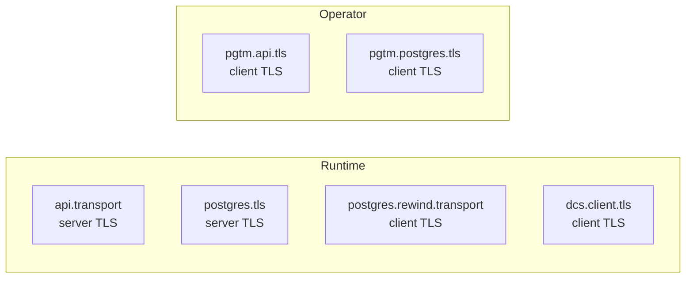

# TLS Configuration Reference

## TLS Surfaces Overview

pgtuskmaster exposes six distinct TLS configuration surfaces across runtime and operator schemas.

### Runtime Configuration Surfaces

| Surface | Config Path | Direction | Purpose |
|---------|-------------|-----------|---------|
| API server | `api.transport` | Server | Secures management API |
| PostgreSQL server | `postgres.tls` | Server | Secures PostgreSQL connections |
| PostgreSQL client (rewind) | `postgres.rewind.transport` | Client | TLS for `pg_rewind` operations |
| DCS client | `dcs.client.tls` | Client | TLS for etcd communication |

### Operator Configuration Surfaces

| Surface | Config Path | Direction | Purpose |
|---------|-------------|-----------|---------|
| API client | `pgtm.api.tls` | Client | TLS for operator API calls |
| PostgreSQL client | `pgtm.postgres.tls` | Client | TLS for operator PostgreSQL access |



## Shared Building Blocks

### InlineOrPath

Certificate material may be provided via filesystem path or inline content.

```text
pub enum InlineOrPath {
    Path(PathBuf),
    PathConfig { path: PathBuf },
    Inline { content: String },
}
```

### SecretSource

Secrets may be sourced from environment, files, or direct strings.

```text
pub enum SecretSource {
    None,
    Env { env: String },
    File { path: PathBuf },
    String { value: String },
}
```

## Server Identity Configuration

### API Server Identity

```text
pub struct ApiTlsConfig {
    pub identity: TlsServerIdentityConfig,
    pub client_auth: ApiClientAuthConfig,
}

pub struct TlsServerIdentityConfig {
    pub cert_chain: InlineOrPath,
    pub private_key: InlineOrPath,
}
```

### PostgreSQL Server Identity

```text
pub enum TlsServerConfig {
    Disabled,
    Enabled {
        identity: TlsServerIdentityConfig,
        client_auth: Option<TlsClientAuthConfig>,
    },
}
```

## Client Identity Configuration

### Operator API and PostgreSQL Client Identity

```text
pub struct PgtmClientTlsConfig {
    pub ca_cert: Option<InlineOrPath>,
    pub identity: Option<TlsClientIdentityConfig>,
}

pub struct TlsClientIdentityConfig {
    pub cert: InlineOrPath,
    pub key: SecretSource,
}
```

### DCS Client Identity

```text
pub enum DcsTlsConfig {
    Disabled,
    Enabled {
        ca_cert: Option<InlineOrPath>,
        identity: Option<TlsClientIdentityConfig>,
        server_name: Option<String>,
    },
}
```

## Client Authentication Configuration

### API Server Client Authentication

```text
pub enum ApiClientAuthConfig {
    Disabled,
    Optional { client_ca: InlineOrPath },
    Required {
        client_ca: InlineOrPath,
        allowed_common_names: Vec<ClientCommonName>,
    },
}
```

### PostgreSQL Server Client Authentication

```text
pub struct TlsClientAuthConfig {
    pub client_ca: InlineOrPath,
    pub client_certificate: ClientCertificateMode,
}

pub enum ClientCertificateMode {
    Optional,
    Required,
}
```

## Additional Client Transport Configuration

### PostgreSQL Rewind Transport

```text
pub struct PostgresClientTransportConfig {
    pub ssl_mode: PgSslMode,
    pub ca_cert: Option<InlineOrPath>,
}
```

`PgSslMode` supports these values:

- `disable`
- `allow`
- `prefer`
- `require`
- `verify-ca`
- `verify-full`

## Validation Rules

The configuration parser enforces this TLS-specific validation:

- If any DCS endpoint uses the `https` scheme, `dcs.client.tls` must not be `Disabled`.

```text
if cfg
    .dcs
    .endpoints
    .iter()
    .any(|endpoint| matches!(endpoint.scheme(), crate::config::DcsEndpointScheme::Https))
    && matches!(cfg.dcs.client.tls, DcsTlsConfig::Disabled)
{
    return Err(ConfigError::Validation {
        field: "dcs.client.tls",
        message: "https DCS endpoints require `dcs.client.tls` to be configured".to_string(),
    });
}
```

Beyond that rule, `src/config/parser.rs` does not currently add additional TLS-specific cross-field validation. The schema shapes still constrain which fields can appear together, but parse-time checks do not currently enforce certificate existence, `verify-full` CA requirements, or broader TLS completeness rules.

## Example Certificate Paths

Docker node configurations consistently use these path conventions:

- Server certificate: `/etc/pgtuskmaster/certs/node-<id>/tls.crt`
- Server private key: `/etc/pgtuskmaster/certs/node-<id>/tls.key`
- CA certificate: `/etc/pgtuskmaster/certs/ca.crt`
- Operator client certificate: `/etc/pgtuskmaster/certs/pgtm-client/tls.crt`
- Operator client key: `/etc/pgtuskmaster/certs/pgtm-client/tls.key`

The docker examples enable TLS for the API server, PostgreSQL server, operator API client, operator PostgreSQL client, and PostgreSQL rewind transport. They do not enable `dcs.client.tls`; the example DCS endpoints remain `http://etcd:2379`.
