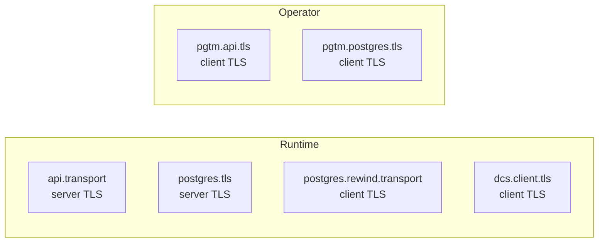

# TLS Configuration Reference

## TLS Surfaces Overview

pgtuskmaster exposes six distinct TLS configuration surfaces across runtime and operator schemas.

### Runtime Configuration Surfaces

| Surface | Config Path | Direction | Purpose |
|---------|-------------|-----------|---------|
| API server | `api.transport` | Server | Secures management API |
| PostgreSQL server | `postgres.tls` | Server | Secures PostgreSQL connections |
| PostgreSQL client (rewind) | `postgres.rewind.transport` | Client | TLS for `pg_rewind` operations |
| DCS client | `dcs.client.tls` | Client | TLS for etcd communication |

### Operator Configuration Surfaces

| Surface | Config Path | Direction | Purpose |
|---------|-------------|-----------|---------|
| API client | `pgtm.api.tls` | Client | TLS for operator API calls |
| PostgreSQL client | `pgtm.postgres.tls` | Client | TLS for operator PostgreSQL access |



## Shared Value Forms

### Path-backed and Inline Material

Certificate and CA fields accept either a filesystem path or inline PEM content.

```toml
cert_chain = "/etc/pgtuskmaster/tls/server-chain.pem"
cert_chain = { path = "/etc/pgtuskmaster/tls/server-chain.pem" }
cert_chain = { content = "-----BEGIN CERTIFICATE-----\n...\n-----END CERTIFICATE-----" }
```

### Secret-backed Material

Secret fields such as private keys and API tokens accept these encodings:

```toml
key = { path = "/run/secrets/api-key.pem" }
key = { type = "file", path = "/run/secrets/api-key.pem" }
key = { type = "env", env = "PGTM_API_KEY" }
key = { type = "string", value = "inline-secret" }
```

## Server Identity Configuration

### API Server Identity

```toml
[api]
transport = { transport = "https", tls = { identity = { cert_chain = { path = "/etc/pgtuskmaster/tls/api-chain.pem" }, private_key = { path = "/etc/pgtuskmaster/tls/api-key.pem" } } } }
```

### PostgreSQL Server Identity

```toml
[postgres]
tls = { mode = "enabled", identity = { cert_chain = { path = "/etc/pgtuskmaster/tls/postgres-chain.pem" }, private_key = { path = "/etc/pgtuskmaster/tls/postgres-key.pem" } } }
```

## Client Identity Configuration

### Operator API and PostgreSQL Client Identity

```toml
[api.tls]
ca_cert = { path = "/etc/pgtuskmaster/tls/ca.pem" }

[api.tls.identity]
cert = { path = "/etc/pgtuskmaster/tls/client.crt" }
key = { type = "file", path = "/run/secrets/client-key.pem" }
```

### DCS Client Identity

```toml
[dcs.client]
tls = { mode = "enabled", ca_cert = { path = "/etc/pgtuskmaster/tls/etcd-ca.pem" }, identity = { cert = { path = "/etc/pgtuskmaster/tls/etcd-client.crt" }, key = { type = "file", path = "/run/secrets/etcd-client.key" } }, server_name = "etcd.internal" }
```

## Client Authentication Configuration

### API Server Client Authentication

```toml
[api]
transport = { transport = "https", tls = { identity = { cert_chain = { path = "/etc/pgtuskmaster/tls/api-chain.pem" }, private_key = { path = "/etc/pgtuskmaster/tls/api-key.pem" } }, client_auth = { client_certificate = "optional", client_ca = { path = "/etc/pgtuskmaster/tls/client-ca.pem" } } } }

[api]
transport = { transport = "https", tls = { identity = { cert_chain = { path = "/etc/pgtuskmaster/tls/api-chain.pem" }, private_key = { path = "/etc/pgtuskmaster/tls/api-key.pem" } }, client_auth = { client_certificate = "required", client_ca = { path = "/etc/pgtuskmaster/tls/client-ca.pem" }, allowed_common_names = ["operator-a"] } } }
```

### PostgreSQL Server Client Authentication

```toml
[postgres]
tls = { mode = "enabled", identity = { cert_chain = { path = "/etc/pgtuskmaster/tls/postgres-chain.pem" }, private_key = { path = "/etc/pgtuskmaster/tls/postgres-key.pem" } }, client_auth = { client_ca = { path = "/etc/pgtuskmaster/tls/client-ca.pem" }, client_certificate = "required" } }
```

## Additional Client Transport Configuration

### PostgreSQL Rewind Transport

```toml
[postgres.rewind.transport]
ssl_mode = "verify_full"
ca_cert = { path = "/etc/pgtuskmaster/tls/postgres-ca.pem" }
```

`PgSslMode` supports these values:

- `disable`
- `allow`
- `prefer`
- `require`
- `verify-ca`
- `verify-full`

## Validation Rules

The configuration parser enforces this TLS-specific validation:

- If any DCS endpoint uses the `https` scheme, `dcs.client.tls` must not be `Disabled`.

Beyond that rule, the parser enforces path-only requirements where runtime components need concrete files, plus the transport-specific invariants described in the runtime and operator config references.

## Example Certificate Paths

Docker node configurations consistently use these path conventions:

- Server certificate: `/etc/pgtuskmaster/certs/node-<id>/tls.crt`
- Server private key: `/etc/pgtuskmaster/certs/node-<id>/tls.key`
- CA certificate: `/etc/pgtuskmaster/certs/ca.crt`
- Operator client certificate: `/etc/pgtuskmaster/certs/pgtm-client/tls.crt`
- Operator client key: `/etc/pgtuskmaster/certs/pgtm-client/tls.key`

The docker examples enable TLS for the API server, PostgreSQL server, operator API client, operator PostgreSQL client, and PostgreSQL rewind transport. They do not enable `dcs.client.tls`; the example DCS endpoints remain `http://etcd:2379`.
