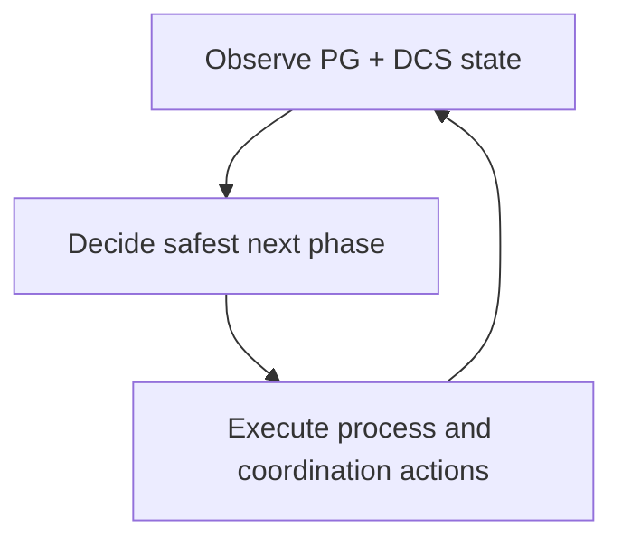

# How The System Solves It

The runtime follows a continuous observe-decide-act loop. It combines local PostgreSQL signals with distributed coordination data, then applies role decisions through controlled actions.

At a high level, each node does three things repeatedly:

- It observes local PostgreSQL state and shared DCS state.
- It evaluates trust and role conditions.
- It executes bounded actions, then reevaluates.

This design keeps decisions current. Instead of assuming one static cluster view, every loop rechecks the evidence before progressing.

## Why this matters

Role changes are not single events. They are state transitions with preconditions. The loop model makes those preconditions explicit and continuously validated.

## Tradeoffs

A loop-based controller can look cautious, because it revalidates instead of rushing actions. That caution adds decision latency in some cases, but it prevents many unsafe transitions that appear fast only because they skip verification.

## When this matters in operations

During incidents, operators can reason about current behavior by asking three questions: what is the node observing, what decision did it make, and what action is blocked or running. That mental model maps directly to logs, API state, and DCS records.
