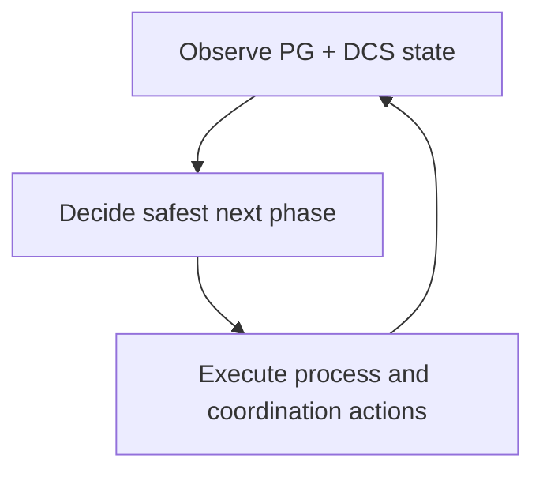

# How The System Solves It

The runtime follows a continuous observe-decide-act loop. It combines local PostgreSQL signals with distributed coordination data, then applies role decisions through controlled actions.

At a high level, each node does three things repeatedly:

- observe local PostgreSQL state and shared DCS state
- evaluate trust, phase, and role conditions
- execute bounded actions, then reevaluate from fresh state

## Why the loop matters

Role changes are not single events. They are transitions with preconditions. The loop model keeps those preconditions explicit and continuously revalidated instead of letting one stale view drive a long chain of actions.

## How to reason about behavior during an incident

When something looks wrong, ask three questions in order:

1. What is the node observing locally and in DCS?
2. What decision did the HA loop publish?
3. Which action is running, blocked, or being refused?

In practice, correlate `/ha/state` with debug payloads such as `/debug/verbose` when enabled, plus DCS record views and relevant logs.
