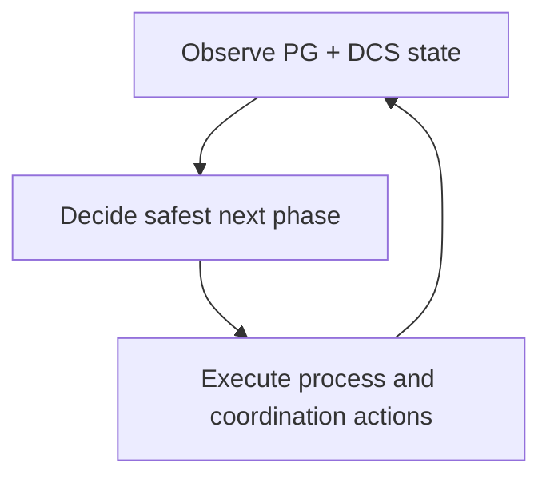

# How The System Solves It

The runtime follows a continuous observe-decide-act loop. It combines local PostgreSQL signals with distributed coordination data, then applies role decisions through controlled actions.

At a high level, each node does three things repeatedly:

- observe local PostgreSQL state and shared DCS state
- evaluate trust, phase, and role conditions
- execute bounded actions, then reevaluate from fresh state

## Why the loop matters

Role changes are not single events. They are transitions with preconditions. The loop model keeps those preconditions explicit and continuously revalidated instead of letting one stale view drive a long chain of actions.

## How to reason about behavior during an incident

When something looks wrong, ask three questions in order:

1. What is the node observing locally and in DCS?
2. What decision did the HA loop publish?
3. Which action is running, blocked, or being refused?

In practice, correlate `/ha/state` with debug payloads such as `/debug/verbose` when enabled, plus DCS record views and relevant logs.

## Where the decision boundaries actually sit

The observe-decide-act summary is useful only if the boundaries stay clear. `pgtuskmaster` does not ask etcd to decide PostgreSQL topology for it, and it does not ask PostgreSQL alone to decide whether promotion is globally safe. Instead, each subsystem contributes one kind of evidence to a local decision loop:

- PostgreSQL observation answers questions such as "is the local server reachable", "is it already primary", and "would following or rewind be required".
- DCS state answers questions such as "who currently holds leadership", "how many members are visible", and "has an operator requested a switchover".
- The HA worker combines those inputs with the current phase and trust posture to choose the next safe action.
- The process worker performs the concrete action, such as start, follow, promote, rewind, bootstrap, or fenced shutdown work, and then the loop re-observes the result.

That separation matters because it limits what each signal can prove. A healthy local database does not prove the cluster should promote it. A DCS record that names a leader does not prove the local process is already following correctly. A requested switchover does not bypass the same evidence gates used for unplanned transitions. The system stays safe by making those limits explicit instead of letting any single subsystem over-speak.

## Why planned and unplanned transitions share the same machinery

Planned operations are safer when they are not a separate secret control plane. In this implementation, a switchover request is just another piece of shared intent written into the coordination model, and the normal HA loop still decides whether and when it can be honored safely. That design keeps operator intent visible, auditable, and subject to the same trust and reachability checks as ordinary leadership changes.

The practical consequence is that "request accepted" and "transition complete" are deliberately different states. The API can acknowledge the request quickly, but the runtime may still remain in a waiting phase while it checks successor visibility, leader health, and followability. That can feel slower than a forceful runbook, but it prevents a planned maintenance action from silently becoming an unsafe split-brain event.

## How the conservative tradeoff shows up in real behavior

The project is optimized for correct refusal as much as for successful action. When the DCS trust drops below full quorum, the decision logic moves into fail-safe handling instead of pretending it still has the same confidence as a healthy cluster. When a primary sees conflicting leadership evidence, the step-down and fencing logic is allowed to interrupt normal service in order to reduce concurrent-writer risk. When a node cannot safely recover in place, the recovery path may prefer rewind or a fresh base backup over a quick but unsafe rejoin.

That means the system's "solution" is not "always keep writes available". The solution is "keep role changes tied to evidence, and make the reasons for conservative behavior inspectable". Operators who understand that contract can read a delayed promotion, a waiting phase, or a recovery refusal as part of the design rather than as unexplained misbehavior.

## What to read next

Continue in three different directions depending on what you need:

- Read the **Quick Start** if you want to see the checked-in container path prove those surfaces end to end.
- Read **System Lifecycle** if you need the detailed meaning of phases such as waiting, primary, rewinding, fail-safe, or fencing.
- Read **Architecture Assurance** if you need to know what the system is trying to guarantee, what assumptions those guarantees depend on, and where the guarantees intentionally stop.
