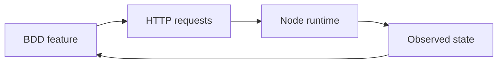

# BDD Coverage

BDD tests validate system behavior from the perspective of external users of the interfaces.

The goal is not maximum endpoint coverage; it is to validate the most important “contract surfaces”:
- safety restrictions
- allowed operator actions
- consistent state reporting

