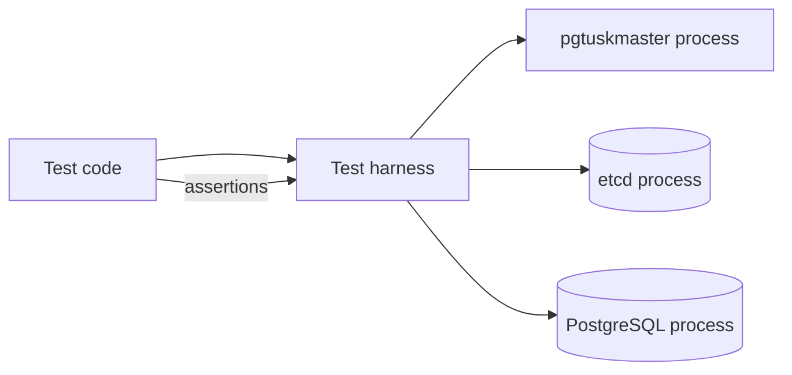

# Harness Architecture

Many tests run the real node binaries and external dependencies (etcd, PostgreSQL) under a harness.

The harness exists to make stateful scenarios reproducible:
- multi-node topologies
- failover transitions
- fencing and safety invariants

