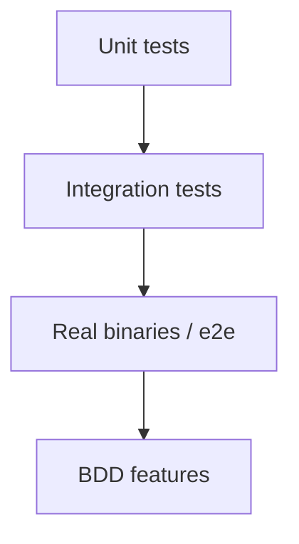

# Testing Model

The project’s test strategy is designed to validate behavior at multiple levels, including “real binary” integration paths.

The architectural intent:
- unit tests validate small components
- integration/e2e validate control-plane behavior with real etcd/PostgreSQL processes
- BDD validates external-facing behavioral contracts

