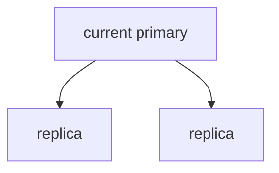
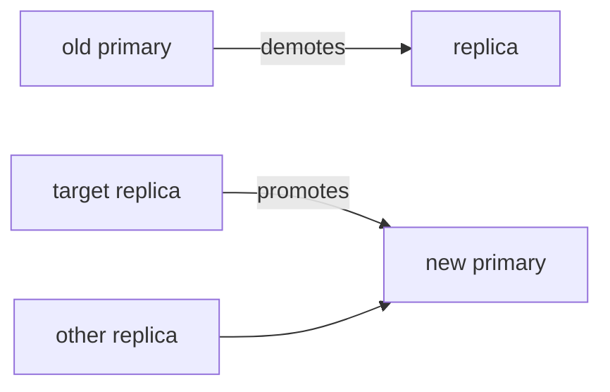
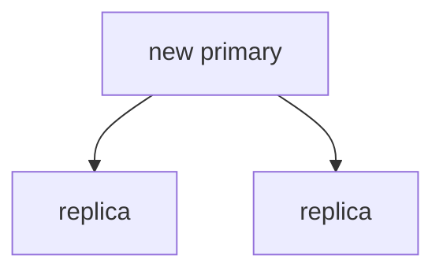

# Performing a Planned Switchover

In this tutorial, we will practice transferring cluster leadership from one node to another through a controlled switchover. You will perform both a generic switchover where the cluster chooses the target, and a targeted switchover where you specify the exact replica.

We assume you have completed the previous tutorials and have a running three-node cluster using the Docker Compose setup.

## Check the Initial Cluster State

First, we verify the cluster is healthy and identify the current primary.

Run this command to see the status:

```bash
pgtm -c docs/examples/docker-cluster-node-a.toml status -v
```

The output shows a cluster-oriented table. Identify the row where `ROLE` is `primary`; that is your current leader. Before proceeding, make sure the cluster is healthy, the leader is unambiguous, and the replicas report steady replica behavior.



## Record a Baseline

We create a marker in the database to confirm replication works through the switchover.

Connect to the current primary and create a proof table:

```bash
PGPASSWORD=$(cat docker/secrets/postgres-superuser-password) \
  psql "$(pgtm -c docs/examples/docker-cluster-node-a.toml primary --tls)" \
  -U postgres \
  -c "CREATE TABLE IF NOT EXISTS tutorial_proof (id TEXT PRIMARY KEY);"
```

Insert a row to establish baseline replication:

```bash
PGPASSWORD=$(cat docker/secrets/postgres-superuser-password) \
  psql "$(pgtm -c docs/examples/docker-cluster-node-a.toml primary --tls)" \
  -U postgres \
  -c "INSERT INTO tutorial_proof VALUES ('1:before-switchover');"
```

Verify the row exists on all replicas:

```bash
PGPASSWORD=$(cat docker/secrets/postgres-superuser-password) \
  psql -h <replica-host> -U postgres -c "SELECT * FROM tutorial_proof;"
```

Each replica should show the inserted row.

## Request a Generic Switchover

We request a switchover without specifying a target. The cluster will promote the most up-to-date eligible replica.

Send the request to the **current primary**.
Use the configuration file for whichever node is currently primary, not necessarily `docker-cluster-node-a.toml`.

```bash
pgtm -c docs/examples/docker-cluster-node-<current-primary>.toml switchover request
```

Expected response:

```text
accepted=true
```

The primary received your request and will begin the switchover.

## Monitor the Transition

Watch status to see the switchover progress:

```bash
pgtm -c docs/examples/docker-cluster-node-a.toml status --watch
```

You will see a **switchover: pending -> auto** line appear while the operation proceeds. The table updates automatically every few seconds.



Within 10-30 seconds, the table should show a **different node** as primary. The old primary now appears as a replica.

Press Ctrl-C to stop watching.

## Verify the Switchover Completed

Check the final state with verbose status:

```bash
pgtm -c docs/examples/docker-cluster-node-a.toml status -v
```

Confirm these checkpoints:

1. A **different node** is now primary
2. The previous primary is now a replica
3. All nodes show **full_quorum** trust and **Ready** readiness
4. No warnings appear

Check that `pgtm primary` resolves the writable connection target:

```bash
pgtm -c docs/examples/docker-cluster-node-a.toml primary
```

Check that `pgtm replicas` lists the non-primary nodes:

```bash
pgtm -c docs/examples/docker-cluster-node-a.toml replicas
```

Insert a new row through the **new primary** to verify replication continues:

```bash
PGPASSWORD=$(cat docker/secrets/postgres-superuser-password) \
  psql "$(pgtm -c docs/examples/docker-cluster-node-a.toml primary --tls)" \
  -U postgres \
  -c "INSERT INTO tutorial_proof VALUES ('2:after-switchover');"
```

Verify this new row appears on all replicas.



## Perform a Targeted Switchover

Now we promote a specific replica of our choosing.

First, identify your target replica from the current status output. Choose any node that is currently a replica and shows **Ready** readiness.

Request a targeted switchover to that specific node.
Use the configuration file for whichever node is currently primary.

```bash
pgtm -c docs/examples/docker-cluster-node-<current-primary>.toml switchover request --switchover-to node-c
```

The response again shows:

```text
accepted=true
```

Monitor the transition:

```bash
pgtm -c docs/examples/docker-cluster-node-a.toml status --watch
```

This time you will see **switchover: pending -> node-c**.

Wait until the target node becomes primary and the previous primary becomes a replica. Press Ctrl-C.

Verify the new primary is exactly the node you requested:

```bash
pgtm -c docs/examples/docker-cluster-node-a.toml status -v
```

The **ROLE** column should show **primary** for your requested target and **replica** for the previous primary.

## Observe a Rejected Switchover

Attempt to switchover to an ineligible target to see how the system protects itself.

Try targeting the current primary:

```bash
pgtm -c docs/examples/docker-cluster-node-<current-primary>.toml switchover request --switchover-to <current-primary-name>
```

The CLI immediately rejects this with:

```text
cannot target member '<current-primary-name>' for switchover: it is already the leader
```

The HA test suite also covers a degraded-target case: when a replica is isolated and no longer appears as a ready replica in the seed node DCS view, a targeted switchover request is rejected and the current primary remains authoritative.

## Clear a Pending Switchover

If a switchover request cannot complete, you can clear it.

Check if a switchover is pending:

```bash
pgtm -c docs/examples/docker-cluster-node-a.toml status
```

If you see a **switchover: pending** line, clear it:

```bash
pgtm -c docs/examples/docker-cluster-node-a.toml switchover clear
```

Response:

```text
accepted=true
```

The pending request is removed and the cluster maintains its current primary.

## Key Takeaways

You have now performed multiple types of switchovers and observed the cluster's behavior:

- Generic switchovers let the cluster select the best replica
- Targeted switchovers let you specify the exact replica to promote
- The system validates requests and rejects invalid targets
- During switchover, the old primary becomes a replica, not offline
- Replication continues through the transition
- You must send requests to the current authoritative primary

These operations work only when the cluster reports **full_quorum** DCS trust. If you see **degraded** trust, switchover requests will be rejected to protect data integrity.

## Next Steps

Now that you can perform controlled leadership transfers, you are ready to explore more advanced cluster validation in the next tutorial.
