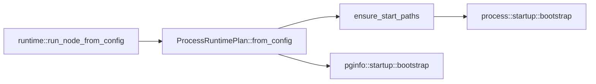
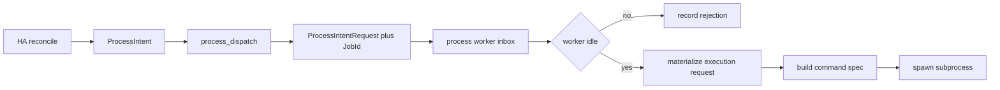
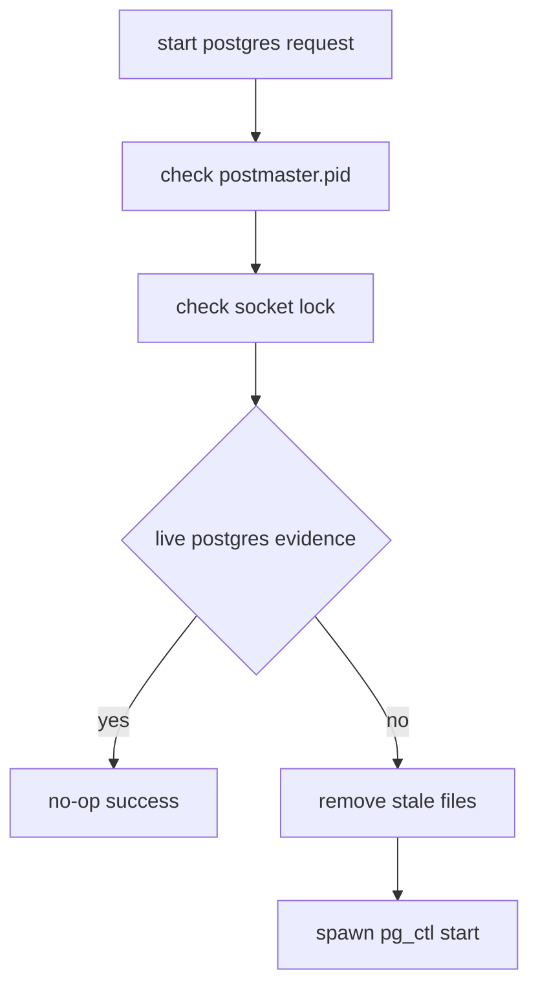
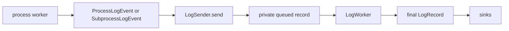

You are drafting exactly one documentation file.

Rules:
- Follow Diataxis strictly.
- Use only the supplied repo facts and supplied Diataxis summary.
- If a fact is missing, say "missing source support" instead of inventing.
- ASCII only.
- No em dashes.
- Add diagrams where deemed fitting

Behavior requirements:
- Read the target path and infer the intended page boundary from it.
- Use the Diataxis type that best matches the supplied target and evidence.
- Keep unsupported claims out of the document.
- If an important fact is missing, write "missing source support" at the exact point where that fact would otherwise be needed.

Follow Diataxis method, write one real page, and include diagrams when needed using the syntax:

[diagram about x, y showing relation between z and a, **more details on diagram**]


# target docs path

docs/src/explanation/process-management.md

# docs/src file listing

# docs/src file listing

docs/src/SUMMARY.md
docs/src/explanation/architecture.md
docs/src/explanation/failure-modes.md
docs/src/explanation/ha-decision-engine.md
docs/src/explanation/introduction.md
docs/src/explanation/overview.md
docs/src/explanation/process-management.md
docs/src/explanation/trust-model.md
docs/src/how-to/add-cluster-node.md
docs/src/how-to/backup-and-restore.md
docs/src/how-to/bootstrap-cluster.md
docs/src/how-to/check-cluster-health.md
docs/src/how-to/configure-tls-security.md
docs/src/how-to/configure-tls.md
docs/src/how-to/debug-cluster-issues.md
docs/src/how-to/handle-complex-failures.md
docs/src/how-to/handle-network-partition.md
docs/src/how-to/handle-primary-failure.md
docs/src/how-to/monitor-via-metrics.md
docs/src/how-to/overview.md
docs/src/how-to/perform-switchover.md
docs/src/how-to/remove-cluster-node.md
docs/src/how-to/run-tests.md
docs/src/overview.md
docs/src/reference/code-organization.md
docs/src/reference/dcs-state-model.md
docs/src/reference/ha-decisions.md
docs/src/reference/http-api.md
docs/src/reference/overview.md
docs/src/reference/pgtm-cli.md
docs/src/reference/pgtuskmaster-cli.md
docs/src/reference/runtime-configuration.md
docs/src/reference/tls-configuration.md
docs/src/tutorial/first-ha-cluster.md
docs/src/tutorial/observing-failover.md
docs/src/tutorial/overview.md
docs/src/tutorial/performing-switchover.md
docs/src/tutorial/validating-cluster-behavior.md


# current docs summary context

===== docs/src/SUMMARY.md =====
# Summary

- [Overview](overview.md)

# Tutorials
- [Tutorials](tutorial/overview.md)
    - [First HA Cluster](tutorial/first-ha-cluster.md)
    - [Observing a Failover Event](tutorial/observing-failover.md)
    - [Performing a Planned Switchover](tutorial/performing-switchover.md)
    - [Validating Cluster Behavior](tutorial/validating-cluster-behavior.md)

# How-To

- [How-To](how-to/overview.md)
    - [Bootstrap a New Cluster from Zero State](how-to/bootstrap-cluster.md)
    - [Check Cluster Health](how-to/check-cluster-health.md)
    - [Add a Cluster Node](how-to/add-cluster-node.md)
    - [Perform Backup and Restore Operations](how-to/backup-and-restore.md)
    - [Configure TLS](how-to/configure-tls.md)
    - [Configure TLS Security](how-to/configure-tls-security.md)
    - [Debug Cluster Issues](how-to/debug-cluster-issues.md)
    - [Handle Complex Failures](how-to/handle-complex-failures.md)
    - [Handle a Network Partition](how-to/handle-network-partition.md)
    - [Handle Primary Failure](how-to/handle-primary-failure.md)
    - [Monitor via CLI Signals](how-to/monitor-via-metrics.md)
    - [Remove a Cluster Node](how-to/remove-cluster-node.md)
    - [Perform a Planned Switchover](how-to/perform-switchover.md)
    - [Run The Test Suite](how-to/run-tests.md)

# Explanation

- [Explanation](explanation/overview.md)
    - [Introduction](explanation/introduction.md)
    - [Architecture](explanation/architecture.md)
    - [Failure Modes and Recovery Behavior](explanation/failure-modes.md)
    - [HA Decision Engine](explanation/ha-decision-engine.md)
    - [Process Management and Execution Domain](explanation/process-management.md)
    - [Trust Model and DCS Coordination Modes](explanation/trust-model.md)

# Reference

- [Reference](reference/overview.md)
    - [Code Organization Reference](reference/code-organization.md)
    - [HTTP API](reference/http-api.md)
    - [HA Decisions](reference/ha-decisions.md)
    - [DCS State Model](reference/dcs-state-model.md)
    - [pgtm CLI](reference/pgtm-cli.md)
    - [pgtuskmaster CLI](reference/pgtuskmaster-cli.md)
    - [Runtime Configuration](reference/runtime-configuration.md)
    - [TLS Configuration Reference](reference/tls-configuration.md)


# diataxis summary markdown

# Diátaxis Framework: Comprehensive Reference Document

## Introduction and Overview

Diátaxis is a systematic approach to technical documentation authoring that identifies four distinct documentation needs and their corresponding forms. The name derives from Ancient Greek δῐᾰ́τᾰξῐς: "dia" (across) and "taxis" (arrangement). It solves problems related to documentation content (what to write), style (how to write it), and architecture (how to organise it).

The framework is pragmatic and lightweight, designed to be easy to grasp and straightforward to apply without imposing implementation constraints. It is built upon the principle that documentation must serve the needs of its users, specifically practitioners in a domain of skill. Diátaxis has been proven in practice and adopted successfully in hundreds of documentation projects, including major organizations like Vonage, Gatsby, and Cloudflare.

### Core Premise

Documentation serves practitioners in a craft. A craft contains both action (practical knowledge, knowing how, what we do) and cognition (theoretical knowledge, knowing that, what we think). Similarly, a practitioner must both acquire and apply their craft. These two dimensions create four distinct territories, each representing a specific user need that documentation must address.

## The Four Kinds of Documentation

### Tutorials

**Definition and Purpose**: A tutorial is an experience that takes place under the guidance of a tutor and is always learning-oriented. It is a practical activity where the student learns by doing something meaningful towards an achievable goal. Tutorials serve the user's acquisition of skills and knowledge—their study—not to help them get something done, but to help them learn. The user learns through what they do, not because someone has tried to teach them.

**Key Characteristics**:
- Tutorials are lessons that take a student by the hand through a learning experience
- They introduce, educate, and lead the user
- Answer the question: "Can you teach me to...?"
- Oriented to learning
- Form: a lesson
- Analogy: teaching a child how to cook

**Essential Obligations of the Teacher**:
The tutorial creator must realize that nearly all responsibility falls upon the teacher. The teacher is responsible for what the pupil is to learn, what the pupil will do to learn it, and for the pupil's success. The pupil's only responsibility is to be attentive and follow directions. The exercise must be meaningful, successful, logical, and usefully complete.

**Key Principles for Writing Tutorials**:

1. **Show the learner where they'll be going**: Provide a picture of what will be achieved from the start to help set expectations and allow the learner to see themselves building towards the completed goal.

2. **Deliver visible results early and often**: Each step should produce a comprehensible result, however small, to help the learner make connections between causes and effects.

3. **Maintain a narrative of the expected**: Keep providing feedback that the learner is on the right path. Show example output or exact expected output. Flag likely signs of going wrong. Prepare the user for possibly surprising actions.

4. **Point out what the learner should notice**: Learning requires reflection and observation. Close the loops of learning by pointing things out as the lesson moves along.

5. **Target the feeling of doing**: The accomplished practitioner experiences a joined-up purpose, action, thinking, and result that flows in a confident rhythm. The tutorial must tie together purpose and action to cradle this feeling.

6. **Encourage and permit repetition**: Learners will return to exercises that give them success. Repetition is key to establishing the feeling of doing.

7. **Ruthlessly minimise explanation**: A tutorial is not the place for explanation. Users are focused on following directions and getting results. Explanation distracts from learning. Provide minimal explanation and link to extended discussions for later.

8. **Ignore options and alternatives**: Guidance must remain focused on what's required to reach the conclusion. Everything else can be left for another time.

9. **Aspire to perfect reliability**: The tutorial must inspire confidence. At every stage, when the learner follows directions, they must see the promised result. A learner who doesn't get expected results quickly loses confidence.

10. **Focus on concrete and particular**: Maintain focus on this problem, this action, this result, leading the learner from step to concrete step. General patterns emerge naturally from concrete examples.

**Language Patterns**:
- "We ..." (first-person plural affirms tutor-learner relationship)
- "In this tutorial, we will ..." (describe what the learner will accomplish)
- "First, do x. Now, do y. Now that you have done y, do z." (no ambiguity)
- "We must always do x before we do y because..." (minimal explanation, link to details)
- "The output should look something like ..." (clear expectations)
- "Notice that ... Remember that ... Let's check ..." (orientation clues)
- "You have built a secure, three-layer hylomorphic stasis engine..." (admire accomplishment)

**Challenges and Difficulties**: Tutorials are rarely done well because they are genuinely difficult to create. The product often evolves rapidly, requiring constant updates. Unlike other documentation where changes can be made discretely, tutorials often require cascading changes through the entire learning journey. The creator must distinguish between what is to be learned and what is to be done, devising a meaningful journey that delivers all required knowledge.

**Food and Cooking Analogy**: Teaching a child to cook demonstrates tutorial principles. The value lies not in the culinary outcome but what the child gains. Success is measured by acquired knowledge and skills, not by whether the child can repeat the process independently. The lesson might be framed around a particular dish, but what the child actually learns are fundamentals like washing hands, holding a knife, understanding heat, timing, and measurement. The child learns through activities done alongside the teacher, not from explanations. Children's short attention spans mean lessons often end before completion, but as long as the child achieved something and enjoyed it, learning has occurred.

### How-to Guides

**Definition and Purpose**: How-to guides are directions that guide the reader through a problem or towards a result. They are goal-oriented and help the user get something done correctly and safely by guiding the user's action. They're concerned with work—navigating from one side to the other of a real-world problem-field.

**Key Characteristics**:
- How-to guides guide the reader
- Answer the question: "How do I...?"
- Oriented to goals
- Purpose: to help achieve a particular goal
- Form: a series of steps
- Analogy: a recipe in a cookery book

**Essential Nature**: A how-to guide addresses a real-world goal or problem by providing practical directions to help the user who is in that situation. It assumes the user is already competent and expects them to use the guide to help them get work done. The guide's purpose is to help the already-competent user perform a particular task correctly. It serves the user's work, not their study.

**Key Principles**:

1. **Address real-world complexity**: A how-to guide must be adaptable to real-world use-cases. It cannot be useless except for exactly the narrow case addressed. Find ways to remain open to possibilities so users can adapt guidance to their needs.

2. **Omit the unnecessary**: Practical usability is more helpful than completeness. Unlike tutorials that must be complete end-to-end guides, how-to guides should start and end in reasonable, meaningful places, requiring readers to join it to their own work.

3. **Provide a set of instructions**: A how-to guide describes an executable solution to a real-world problem. It's a contract: if you're facing this situation, you can work through it by taking the steps outlined. Steps are actions, which include physical acts, thinking, and judgment.

4. **Describe a logical sequence**: The fundamental structure is a sequence implying logical ordering in time. Sometimes ordering is imposed by necessity (step two requires step one). Sometimes it's more subtle—operations might be possible in either order, but one helps set up the environment or thinking for the other.

5. **Seek flow**: Ground sequences in patterns of user activities and thinking so the guide acquires smooth progress. Flow means successfully understanding the user. Pay attention to what you're asking the user to think about and how their thinking flows from subject to subject. Action has pace and rhythm. Badly-judged pace or disrupted rhythm damage flow. At its best, how-to documentation anticipates the user.

6. **Pay attention to naming**: Choose titles that say exactly what the guide shows. Good: "How to integrate application performance monitoring." Bad: "Integrating application performance monitoring" (maybe it's about deciding whether to). Very bad: "Application performance monitoring" (could be about how, whether, or what it is). Good titles help both humans and search engines.

**What How-to Guides Are NOT**: How-to guides are wholly distinct from tutorials, though often confused. Solving a problem cannot always be reduced to a procedure. Real-world problems don't always offer linear solutions. Sequences sometimes need to fork and overlap with multiple entry and exit points. How-to guides often require users to rely on their judgment.

**Language Patterns**:
- "This guide shows you how to..." (describe the problem or task)
- "If you want x, do y. To achieve w, do z." (conditional imperatives)
- "Refer to the x reference guide for a full list of options." (don't pollute with completeness)

**Food and Cooking Analogy**: A recipe is an excellent model. A recipe clearly defines what will be achieved and addresses a specific question ("How do I make...?" or "What can I make with...?"). It's not the responsibility of a recipe to teach you how to make something. A professional chef who has made the same thing many times may still follow a recipe to ensure correctness. Following a recipe requires at least basic competence—someone who has never cooked should not be expected to succeed with a recipe alone. A good recipe follows a well-established format that excludes both teaching and discussion, focusing only on "how" to make the dish.

### Reference

**Definition and Purpose**: Reference guides are technical descriptions of the machinery and how to operate it. Reference material is information-oriented and contains propositional or theoretical knowledge that a user looks to in their work. The only purpose is to describe, as succinctly as possible and in an orderly way. Reference material is led by the product it describes, not by user needs.

**Key Characteristics**:
- Reference guides state, describe, and inform
- Answer the question: "What is...?"
- Oriented to information
- Purpose: to describe the machinery
- Form: dry description
- Analogy: information on the back of a food packet

**Essential Nature**: Reference material describes the machinery in an austere manner. One hardly "reads" reference material; one "consults" it. There should be no doubt or ambiguity—it must be wholly authoritative. Reference material is like a map: it tells you what you need to know about the territory without having to check the territory yourself.

**Key Principles**:

1. **Describe and only describe**: Neutral description is the key imperative. It's not natural to describe something neutrally. The temptation is to explain, instruct, discuss, or opine, but these run counter to reference needs. Instead, link to how-to guides and explanations.

2. **Adopt standard patterns**: Reference material is useful when consistent. Place material where users expect to find it, in familiar formats. Reference is not the place to delight readers with extensive vocabulary or multiple styles.

3. **Respect the structure of the machinery**: The way a map corresponds to territory helps us navigate. Similarly, documentation structure should mirror product structure so users can work through both simultaneously. This doesn't mean forcing unnatural structures, but the logical, conceptual arrangement within code should help make sense of documentation.

4. **Provide examples**: Examples are valuable for illustration while avoiding distraction from description. An example of command usage can succinctly illustrate context without falling into explanation.

**Language Patterns**:
- "Django's default logging configuration inherits Python's defaults. It's available as `django.utils.log.DEFAULT_LOGGING` and defined in `django/utils/log.py`" (state facts about machinery)
- "Sub-commands are: a, b, c, d, e, f." (list commands, options, operations, features, flags, limitations, error messages)
- "You must use a. You must not apply b unless c. Never d." (provide warnings)

**Food and Cooking Analogy**: Checking information on a food packet helps make decisions. When seeking facts, you don't want opinions, speculation, instructions, or interpretation. You expect standard presentation so you can quickly find nutritional properties, storage instructions, ingredients, health implications. You expect reliability: "May contain traces of wheat" or "Net weight: 1000g". You won't find recipes or marketing claims mixed with this information—that could be dangerous. The presentation is so important it's usually governed by law, and the same seriousness should apply to all reference documentation.

### Explanation

**Definition and Purpose**: Explanation is a discursive treatment of a subject that permits reflection. It is understanding-oriented and deepens/broadens the reader's understanding by bringing clarity, light, and context. The concept of reflection is important—reflection occurs after something else, depends on something else, yet brings something new to the subject matter. Its perspective is higher and wider than other types.

**Key Characteristics**:
- Explanation guides explain, clarify, and discuss
- Answer the question: "Why...?"
- Oriented to understanding
- Purpose: to illuminate a topic
- Form: discursive explanation
- Analogy: an article on culinary social history

**Essential Nature**: For the user, explanation joins things together. It's an answer to: "Can you tell me about...?" It's documentation that makes sense to read while away from the product itself (the only kind that might make sense to read in the bath). It serves the user's study (like tutorials) but belongs to theoretical knowledge (like reference).

**The Value and Place of Explanation**:
Explanation is characterized by distance from active concerns. It's sometimes seen as less important, but this is a mistake—it may be less urgent but is no less important; it's not a luxury. No practitioner can afford to be without understanding of their craft. Explanation helps weave together understanding. Without it, knowledge is loose, fragmented, fragile, and exercise of craft is anxious.

**Alternative Names**: Explanation documentation doesn't need to be called "Explanation." Alternatives include Discussion, Background, Conceptual guides, or Topics.

**Key Principles**:

1. **Make connections**: Help weave a web of understanding by connecting to other things, even outside the immediate topic.

2. **Provide context**: Explain why things are so—design decisions, historical reasons, technical constraints. Draw implications and mention specific examples.

3. **Talk about the subject**: Explanation guides are about a topic in the sense of being around it. Names should reflect this—you should be able to place an implicit (or explicit) "about" in front of each title: "About user authentication" or "About database connection policies."

4. **Admit opinion and perspective**: All human activity is invested with opinion, beliefs, and thoughts. Explanation must consider alternatives, counter-examples, or multiple approaches. You're opening up the topic for consideration, not giving instruction or describing facts.

5. **Keep explanation closely bounded**: One risk is that explanation absorbs other things. Writers feel the urge to include instruction or technical description, but documentation already has other places for these. Allowing them to creep in interferes with explanation and removes material from correct locations.

**Language Patterns**:
- "The reason for x is because historically, y..." (explain)
- "W is better than z, because..." (offer judgments and opinions)
- "An x in system y is analogous to a w in system z. However..." (provide context)
- "Some users prefer w (because z). This can be a good approach, but..." (weigh alternatives)
- "An x interacts with a y as follows: ..." (unfold internal secrets)

**Food and Cooking Analogy**: In 1984, Harold McGee published "On Food and Cooking." The book doesn't teach how to cook, doesn't contain recipes (except as historical examples), and isn't reference. Instead, it places food and cooking in context of history, society, science, and technology. It explains why we do what we do in the kitchen and how that has changed. It's not a book to read while cooking, but when reflecting on cooking. It illuminates the subject from multiple perspectives. After reading, understanding is changed—knowledge is richer and deeper. What is learned may or may not be immediately applicable, but it changes how you think about the craft and affects practice.

## Theoretical Foundations

### Two Dimensions of Craft

Diátaxis is based on understanding that a skill or craft contains both action (practical knowledge, knowing how) and cognition (theoretical knowledge, knowing that). These are completely bound up with each other but are counterparts—wholly distinct aspects of the same thing.

Similarly, a practitioner must both acquire and apply their craft. Being "at work" (applying skill) and being "at study" (acquiring skill) are counterparts, distinct but bound together.

### The Map of the Territory

These two dimensions can be laid out on a map—a complete map of the territory of craft. This is a complete map: there are only two dimensions, and they don't just cover the entire territory, they define it. This is why there are necessarily four quarters, and there could not be three or five. It is not an arbitrary number.

### Serving Needs

The map of craft territory gives us the familiar Diátaxis map of documentation. The map answers: what must documentation do to align with these qualities of skill, and to what need is it oriented in each case?

The four needs are:
1. **Learning**: addressed in tutorials, where the user acquires their craft, and documentation informs action
2. **Goals**: addressed in how-to guides, where the user applies their craft, and documentation informs action
3. **Information**: addressed in reference, where the user applies their craft, and documentation informs cognition
4. **Understanding**: addressed in explanation, where the user acquires their craft, and documentation informs cognition

### Why Four and Only Four

The Diátaxis map is memorable and approachable, but reliable only if it adequately describes reality. Diátaxis is underpinned by systematic description and analysis of generalized user needs. This is why the four types are a complete enumeration of documentation serving practitioners. There is simply no other territory to cover.

## The Map and Compass

### The Map

Diátaxis is effective because it describes a two-dimensional structure rather than a list. It places documentation forms into relationships, each occupying a space in mental territory, with boundaries highlighting distinctions.

**Structure Problems**: When documentation fails to attain good structure, architectural faults infect and undermine content. Without clear architecture, creators structure work around product features, leading to inconsistency. Any orderly attempt to organize into clear content types helps, but authors often find content that fails to fit well within categories.

**Expectations and Guidance**: The Diátaxis structure provides clear expectations (to the reader) and guidance (to the author). It clarifies purpose, specifies writing style, and shows placement.

**Blur and Collapse**: There's natural affinity between neighboring forms and a tendency to blur distinctions. When allowed to blur, documentation bleeds into inappropriate forms, causing structural problems that make maintenance harder. In the worst case, tutorials and how-to guides collapse into each other, making it impossible to meet needs served by either.

**Journey Around the Map**: Diátaxis helps documentation better serve users in their cycle of interaction. While users don't literally encounter types in order (tutorials > how-to > reference > explanation), there is sense and meaning to this ordering corresponding to how people become expert. The learning-oriented phase involves diving in under guidance. The goal-oriented phase puts skill to work. The information-oriented phase requires consulting reference. The explanation-oriented phase reflects away from work. Then the cycle repeats.

### The Compass

The compass is a truth-table or decision-tree reducing a complex two-dimensional problem to simpler parts, providing a course-correction tool. It can be applied to user situations needing documentation or to documentation itself that needs moving or improving.

**Using the Compass**: Ask two questions—action or cognition? acquisition or application? The compass yields the answer.

**Table of Contents**:
- If content informs action and serves acquisition of skill → tutorial
- If content informs action and serves application of skill → how-to guide
- If content informs cognition and serves application of skill → reference
- If content informs cognition and serves acquisition of skill → explanation

**Application**: The compass is particularly effective when you're troubled by doubt or difficulty. It forces reconsideration. Use its terms flexibly:
- action: practical steps, doing
- cognition: theoretical knowledge, thinking
- acquisition: study
- application: work

Use the questions in different ways: "Do I think I am writing for x or y?" "Is this writing engaged in x or y?" "Does the user need x or y?" "Do I want to x or y?" Apply them at sentence/ word level or at entire document level.

## Practical Application

### Workflow

Diátaxis is both a guide to content and to documentation process. Most people must make decisions about how to work as they work. Documentation is usually an ongoing project that evolves with the product. Diátaxis provides an approach that discourages planning and top-down workflows, preferring small, responsive iterations from which patterns emerge.

**Use Diátaxis as a Guide, Not a Plan**: Diátaxis describes a complete picture, but its structure is not a plan to complete. It's a guide, a map to check you're in the right place and going in the right direction. It provides tools to assess documentation, identify problems, and judge improvements.

**Don't Worry About Structure**: Don't spend energy trying to get structure correct. If you follow Diátaxis prompts, documentation will assume Diátaxis structure—but because it has been improved, not the other way around. Getting started doesn't require dividing documentation into four sections. Certainly don't create empty structures for each category with nothing in them.

**Work One Step at a Time**: Diátaxis prescribes structure, but whatever the state of existing documentation—even a complete mess—you can improve it iteratively. Avoid completing large tranches before publishing. Every step in the right direction is worth publishing immediately. Don't work on the big picture. Diátaxis guides small steps; keep taking small steps.

**Just Do Something**: 

1. **Choose something**: Any piece of documentation. If you don't have something specific, look at what's in front of you—the file you're in, the last page you read. If nothing, choose literally at random.

2. **Assess it**: Consider it critically, preferably a small thing (page, paragraph, sentence). Challenge it according to Diátaxis standards: What user need is represented? How well does it serve that need? What can be added, moved, removed, or changed to serve that need better? Do language and logic meet mode requirements?

3. **Decide what to do**: Based on answers, decide what single next action will produce immediate improvement.

4. **Do it**: Complete that single action and consider it completed—publish or commit it. Don't feel you need anything else.

This cycle reduces the paralysis of deciding what to do, keeps work flowing, and expends no energy on planning.

**Allow Organic Development**: Documentation should be as complex as it needs to be but no more. A good model is well-formed organic growth that adapts to external conditions. Growth takes place at the cellular level. The organism's structure is guaranteed by healthy cell development according to appropriate rules, not by imposed structure. Similarly, documentation attains healthy structure when internal components are well-formed, building from the inside-out, one cell at a time.

**Complete, Not Finished**: Like a plant, documentation is never finished—it can always develop further. But at every stage, it should be complete—never missing something, always in a state appropriate to its development stage. Documentation should be complete: useful, appropriate to its current stage, in a healthy structural state, and ready for the next stage.

## Complex Documentation Scenarios

### Basic Structure

Application is straightforward when product boundaries are clear:

```
Home                      <- landing page
    Tutorial              <- landing page
        Part 1
        Part 2
        Part 3
    How-to guides         <- landing page
        Install
        Deploy
        Scale
    Reference             <- landing page
        Command-line tool
        Available endpoints
        API
    Explanation           <- landing page
        Best practice recommendations
        Security overview
        Performance
```

Each landing page contains an overview. After a while, grouping within sections might be wise by adding hierarchy:

```
Home                      <- landing page
    Tutorial              <- landing page
        Part 1
        Part 2
        Part 3
    How-to guides         <- landing page
        Install           <- landing page
            Local installation
            Docker
            Virtual machine
            Linux container
        Deploy
        Scale
```

### Contents Pages

Contents pages (home page and landing pages) provide overview of material. There's an art to creating good contents pages; user experience deserves careful consideration.

**The Problem of Lists**: Lists longer than a few items are hard to read unless they have mechanical order (numerical or alphabetical). Seven items seems a comfortable general limit. If you have longer lists, find ways to break them into smaller ones. What matters most is the reader's experience.

**Overviews and Introductory Text**: Landing page content should read like an overview, not just present lists. Remember you're authoring for humans, not fulfilling scheme demands. Headings and snippets catch the eye and provide context. For example, a how-to landing page should have introductory text for each section grouping.

### Two-Dimensional Problems

A more difficult problem occurs when Diátaxis structure meets another structure—often topic areas within documentation or different user types.

**Examples**:
- Product used on land, sea, and air, used differently in each case
- Documentation addressing users, developers building around the product, and contributors maintaining it
- Product deployable on different public clouds with different workflows, commands, APIs, constraints

These scenarios present two-dimensional problems. You could structure by Diátaxis first, then by audience:

```
tutorial
    for users on land
    for users at sea
    for users in the air
[and so on for how-to, reference, explanation]
```

Or by audience first, then Diátaxis:

```
for users on land
    tutorial
    how-to guides
    reference
    explanation
for users at sea
    [...]
```

Both approaches have repetition. What about material that can be shared?

**Understanding the Problem**: The problem isn't limited to Diátaxis—it exists in any documentation system. However, Diátaxis reveals and brings it into focus. A common misunderstanding is seeing Diátaxis as four boxes into which documentation must be placed. Instead, Diátaxis should be understood as an approach, a way of working that identifies four needs to author and structure documentation effectively.

**User-First Thinking**: Diátaxis is underpinned by attention to user needs. We must document the product as it is for the user, as it is in their hands and minds. If the product on land, sea, and air is effectively three different products for three different users, let that be the starting point. If documentation must meet needs of users, developers, and contributors, consider how they see the product. Perhaps developers need understanding of how it's used, and contributors need what developers know. Then be freer with structure, allowing developer-facing content to follow user-facing material in some parts while separating contributor material completely.

**Let Documentation Be Complex**: Documentation should be as complex as it needs to be. Even complex structures can be straightforward to navigate if logical and incorporate patterns fitting user needs.

## Quality Theory

Diátaxis is an approach to quality in documentation. "Quality" is a word in danger of losing meaning—we all approve of it but rarely describe it rigorously. We can point to examples and identify lapses, suggesting we have a useful grasp of quality.

### Functional Quality

Documentation must meet standards of accuracy, completeness, consistency, usefulness, precision. These are aspects of functional quality. A failure in any one means failing a key function. These properties are independent—documentation can be accurate without complete, complete but inaccurate, or accurate, complete, consistent, and useless.

Attaining functional quality means meeting high, objectively-measurable standards consistently across multiple independent dimensions. It requires discipline, attention to detail, and technical skill. Any failure is readily apparent to users.

### Deep Quality

**Characteristics**:
- Feeling good to use
- Having flow
- Fitting human needs
- Being beautiful
- Anticipating the user

Unlike functional quality, these are interdependent. They cannot be checked or measured but can be identified. They are assessed against human needs, not against the world. Deep quality is conditional upon functional quality—documentation cannot have deep quality without being accurate, complete, and consistent. No user will experience it as beautiful if it's inaccurate.

Functional quality presents as constraints—each is a test or challenge we might fail, requiring constant vigilance. Deep quality represents liberation—the work of creativity or taste. To attain functional quality we must conform to constraints; to attain deep quality we must invent.

**How We Recognize Deep Quality**: Consider clothing quality. Clothes must have functional quality (warmth, durability), which is objectively measurable. But quality of materials or workmanship requires understanding clothing. Being able to judge that an item hangs well or moves well requires developing an eye. Yet even without expertise, anyone can recognize excellent clothing because it feels good to wear—your body knows it. Similarly, good documentation feels good; you feel pleasure and satisfaction using it.

### Diátaxis and Quality

Diátaxis cannot address functional quality—it's concerned only with certain aspects of deep quality. However, it can serve functional quality by exposing lapses. Applying Diátaxis to existing documentation often makes previously obscured problems apparent. For example, recommending that reference architecture reflect code architecture makes gaps more visible. Moving explanatory verbiage out of a tutorial often highlights where readers have been left to work things out themselves.

In deep quality, Diátaxis can do more. It helps documentation fit user needs by describing modes based on them. It preserves flow by preventing disruption (like explanation interrupting a how-to guide). However, Diátaxis can never be all that's required for deep quality. It doesn't make documentation beautiful by itself. It offers principles, not a formula. It cannot bypass skills of user experience, interaction design, or visual design. Using Diátaxis does not guarantee deep quality, but it lays down conditions for the possibility of deep quality.

## Distinguishing Documentation Types

### Tutorials vs. How-to Guides

The most common conflation in software documentation is between tutorials and how-to guides. They are similar in being practical guides containing directions to follow. Both set out steps, promise success if followed, and require hands-on interaction.

**What Matters**: The distinction comes from user needs. Sometimes the user is at study, sometimes at work. A tutorial serves study needs—its obligation is to provide a successful learning experience. A how-to guide serves work needs—its obligation is to help accomplish a task. These are completely different needs.

**Medical Example**: Learning to suture a wound in medical school is a tutorial—it's a lesson safely in an instructor's hands. An appendectomy clinical manual is a how-to guide—it guides already-competent practitioners safely through a task. The manual isn't there to teach; it's there to serve work.

**Key Distinctions**:
- Tutorial purpose: help pupil acquire basic competence vs. How-to guide purpose: help already-competent user perform a task
- Tutorial provides learning experience vs. How-to guide directs user's work
- Tutorial follows carefully-managed path vs. How-to guide path can't be managed (real world)
- Tutorial familiarizes learner with tools vs. How-to guide assumes familiarity
- Tutorial takes place in contrived setting vs. How-to guide applies to real world
- Tutorial eliminates unexpected vs. How-to guide prepares for unexpected
- Tutorial follows single line without choices vs. How-to guide forks and branches
- Tutorial must be safe vs. How-to guide cannot promise safety
- In tutorial, responsibility lies with teacher vs. In how-to guide, user has responsibility
- Tutorial learner may not have competence to ask questions vs. How-to guide user asks right questions
- Tutorial is explicit about basic things vs. How-to guide relies on implicit knowledge
- Tutorial is concrete and particular vs. How-to guide is general
- Tutorial teaches general skills vs. How-to guide user completes particular task

**Not Basic vs. Advanced**: How-to guides can cover basic or well-known procedures. Tutorials can present complex or advanced material. The difference is the need served: study vs. work.

### Reference vs. Explanation

Both belong to the theory half of the Diátaxis map—they contain theoretical knowledge, not steps.

**Mostly Straightforward**: Most of the time it's clear which you're dealing with. Reference is well understood from early education. A tidal chart is clearly reference; an article explaining why there are tides is explanation.

**Rules of Thumb**:
- If it's boring and unmemorable, it's probably reference
- Lists and tables generally belong in reference
- If you can imagine reading it in the bath, it's probably explanation
- Asking a friend "Can you tell me more about <topic>?" yields explanation

**Work vs. Study Test**: The real test is: would someone turn to this while working (executing a task) or while stepping away from work to think about it? Reference helps apply knowledge while working. Explanation helps acquire knowledge during study.

**Dangers**: While writing reference that becomes expansive, it's tempting to develop examples into explanation (showing why, what if, or how it came to be). This results in explanatory material sprinkled into reference, which is bad for both—reference is interrupted, and explanation can't develop appropriately.

## Getting Started and Resources

### Quick Start

You don't need to read everything or wait to understand Diátaxis before applying it. In fact, you won't understand it until you start using it. As soon as you have an idea worth applying, try it. Come back to documentation when you need clarity or reassurance. Iterate between work and reflecting on work.

**The Five-Minute Version**:
1. Learn the four kinds: tutorials, how-to guides, reference, explanation
2. Understand the Diátaxis map showing relationships
3. Use the compass (action/cognition? acquisition/application?) to guide decisions
4. Follow the workflow: consider what you see, ask if it could be improved, decide on one small improvement, do it, repeat
5. Do what you like with Diátaxis—it's pragmatic, no exam required. Use what seems worthwhile

### The Website and Community

Diátaxis is the work of Daniele Procida (https://vurt.eu). It has been developed over years and continues to be elaborated. The original context was software product documentation. In 2021, a Fellowship of the Software Sustainability Institute explored its application in scientific research. More recent exploration includes internal corporate documentation, organizational management, education, and application at scale.

**Contact**: Email Daniele at daniele@vurt.org. He enjoys hearing about experiences and reads everything, though can't promise to respond to every message due to volume. For discussion with other users, see the #diataxis channel on the Write the Docs Slack group or the Discussions section of the GitHub repository for the website.

**Citation**: To cite Diátaxis, refer to the website diataxis.fr. The Git repository contains a CITATION.cff file. APA and BibTeX metadata are available from the "Cite this repository" option. You can submit pull requests for improvements or file issues.

**Website**: Built with Sphinx and hosted on Read the Docs, using a modified version of Pradyun Gedam's Furo theme.

### Applying Diátaxis

The pages concerning application are for putting Diátaxis into practice. Diátaxis is underpinned by systematic theoretical principles, but understanding them isn't necessary for effective use. Most key principles can be grasped intuitively. Don't wait to understand before practicing—you won't understand until you start using it.

The core is the four kinds of documentation. If encountering Diátaxis for the first time, start with these. Once you've begun, tools and methods will help smooth your way: the compass, and the workflow (how-to-use-diataxis).

---

Missing source support: None. All requested information is available in the provided Diátaxis source files.


# project manifests and docs config

===== Cargo.toml =====
[package]
name = "pgtuskmaster_rust"
version = "0.1.0"
edition = "2021"

[workspace]
members = ["crates/pgtm_log_derive", "crates/pgtuskmaster_test_support"]

[features]
default = []
internal-test-support = []

[dependencies]
pgtm_log_derive = { path = "crates/pgtm_log_derive" }
clap = { version = "4.5.47", features = ["derive", "env"] }
serde = { version = "1.0.219", features = ["derive"] }
serde_json = "1.0.140"
sha2 = "0.10.9"
thiserror = "2.0.12"
tokio = { version = "1.44.1", features = ["sync", "rt", "rt-multi-thread", "macros", "time", "process", "net", "io-util", "fs", "signal"] }
tokio-postgres = "0.7.13"
toml = "0.8.20"
axum = { version = "0.8.6", features = ["http1", "http2", "json", "tokio"] }
axum-server = { version = "0.8.0", features = ["tls-rustls"] }
etcd-client = { version = "0.14.1", features = ["tls"] }
reqwest = { version = "0.12.24", default-features = false, features = ["blocking", "json", "rustls-tls"] }
rustls = { version = "0.23.28", features = ["ring"] }
rustls-pemfile = "2.2.0"
tower = { version = "0.5.2", features = ["util"] }
tower-http = { version = "0.6.2", features = ["trace"] }
tracing = "0.1.41"
tracing-subscriber = "0.3.20"
x509-parser = "0.18.0"

[target.'cfg(unix)'.dependencies]
libc = "0.2"

[dev-dependencies]
cucumber = "0.22.1"
futures = "0.3.31"
pgtuskmaster_test_support = { path = "crates/pgtuskmaster_test_support" }
rcgen = "0.14.5"


===== docs/book.toml =====
[book]
authors = ["Joshua Azimullah"]
language = "en"
multilingual = false
src = "src"
title = "pgtuskmaster"

[preprocessor.mermaid]
command = "mdbook-mermaid"

[output]

[output.html]
additional-js = ["mermaid.min.js", "mermaid-init.js"]


# src and test file listing

# src and test file listing

src/api/controller.rs
src/api/mod.rs
src/api/startup.rs
src/api/worker.rs
src/bin/pgtm.rs
src/bin/pgtuskmaster.rs
src/cli/args.rs
src/cli/client.rs
src/cli/config.rs
src/cli/connect.rs
src/cli/error.rs
src/cli/mod.rs
src/cli/output.rs
src/cli/status.rs
src/cli/switchover.rs
src/command/mod.rs
src/config/defaults.rs
src/config/endpoint.rs
src/config/materialize.rs
src/config/mod.rs
src/config/parser.rs
src/config/schema.rs
src/dcs/command.rs
src/dcs/log_event.rs
src/dcs/mod.rs
src/dcs/startup.rs
src/dcs/state.rs
src/dcs/worker.rs
src/dev_support/api.rs
src/dev_support/auth.rs
src/dev_support/binaries.rs
src/dev_support/etcd3.rs
src/dev_support/mod.rs
src/dev_support/namespace.rs
src/dev_support/pg16.rs
src/dev_support/ports.rs
src/dev_support/provenance.rs
src/dev_support/runtime_config.rs
src/dev_support/signals.rs
src/dev_support/tls.rs
src/ha/decide.rs
src/ha/mod.rs
src/ha/process_dispatch.rs
src/ha/reconcile.rs
src/ha/startup.rs
src/ha/state.rs
src/ha/types.rs
src/ha/worker.rs
src/lib.rs
src/logging/core/mod.rs
src/logging/core/queued_record.rs
src/logging/core/runtime.rs
src/logging/event.rs
src/logging/mod.rs
src/logging/postgres_ingest.rs
src/logging/tailer.rs
src/pginfo/conninfo.rs
src/pginfo/log_event.rs
src/pginfo/mod.rs
src/pginfo/query.rs
src/pginfo/startup.rs
src/pginfo/state.rs
src/pginfo/worker.rs
src/postgres_managed.rs
src/postgres_managed_conf.rs
src/postgres_roles.rs
src/process/cluster.rs
src/process/jobs.rs
src/process/log_event.rs
src/process/mod.rs
src/process/planner.rs
src/process/postmaster.rs
src/process/session.rs
src/process/source.rs
src/process/startup.rs
src/process/state.rs
src/process/tools.rs
src/process/worker.rs
src/runtime/log_event.rs
src/runtime/mod.rs
src/runtime/node.rs
src/state/coordination.rs
src/state/errors.rs
src/state/ids.rs
src/state/mod.rs
src/state/net.rs
src/state/time.rs
src/state/watch_state.rs
src/tls.rs
tests/AGENTS.md
tests/bdd_api_http.rs
tests/bdd_state_watch.rs
tests/cli_binary.rs
tests/docker/entrypoint.sh
tests/docker/wrappers/pg_basebackup
tests/docker/wrappers/pg_rewind
tests/docker/wrappers/postgres
tests/ha.rs
tests/ha/features/ha_operator_switchovers/ha_operator_switchovers.feature
tests/ha/features/ha_primary_faults_fail_over_then_recover/ha_primary_faults_fail_over_then_recover.feature
tests/ha/features/ha_quorum_loss_and_dcs_loss/ha_quorum_loss_and_dcs_loss.feature
tests/ha/features/ha_rejoin_and_restart_recovery/ha_rejoin_and_restart_recovery.feature
tests/ha/features/ha_replica_faults_keep_cluster_healthy/ha_replica_faults_keep_cluster_healthy.feature
tests/ha/givens/compose/three_node_shared_single.yml
tests/ha/givens/compose/three_node_three_etcd.yml
tests/ha/givens/three_node_shared/configs/pg_hba.conf
tests/ha/givens/three_node_shared/configs/pg_ident.conf
tests/ha/givens/three_node_shared/configs/tls/ca.crt
tests/ha/givens/three_node_shared/configs/tls/node-a.crt
tests/ha/givens/three_node_shared/configs/tls/node-a.key
tests/ha/givens/three_node_shared/configs/tls/node-b.crt
tests/ha/givens/three_node_shared/configs/tls/node-b.key
tests/ha/givens/three_node_shared/configs/tls/node-c.crt
tests/ha/givens/three_node_shared/configs/tls/node-c.key
tests/ha/givens/three_node_shared/configs/tls/observer.crt
tests/ha/givens/three_node_shared/configs/tls/observer.key
tests/ha/givens/three_node_shared/secrets/api-admin-token
tests/ha/givens/three_node_shared/secrets/api-read-token
tests/ha/givens/three_node_shared/secrets/postgres-superuser-password
tests/ha/givens/three_node_shared/secrets/replicator-password
tests/ha/givens/three_node_shared/secrets/rewinder-password
tests/ha/harness.toml
tests/ha/runs/.gitignore
tests/ha/support/config.rs
tests/ha/support/docker/cli.rs
tests/ha/support/docker/mod.rs
tests/ha/support/docker/ryuk.rs
tests/ha/support/error.rs
tests/ha/support/faults/mod.rs
tests/ha/support/givens/mod.rs
tests/ha/support/invariant.rs
tests/ha/support/mod.rs
tests/ha/support/observer/mod.rs
tests/ha/support/observer/pgtm.rs
tests/ha/support/observer/sql.rs
tests/ha/support/process/mod.rs
tests/ha/support/runner/mod.rs
tests/ha/support/steps/mod.rs
tests/ha/support/timeouts/mod.rs
tests/ha/support/topology.rs
tests/ha/support/world/mod.rs
tests/nextest_config_contract.rs


# docker and docs support file listing

docker/Dockerfile
docker/certs/ca.crt
docker/certs/ca.srl
docker/certs/node-a/tls.crt
docker/certs/node-a/tls.key
docker/certs/node-b/tls.crt
docker/certs/node-b/tls.key
docker/certs/node-c/tls.crt
docker/certs/node-c/tls.key
docker/certs/pgtm-client/tls.crt
docker/certs/pgtm-client/tls.key
docker/certs/pgtm/tls.crt
docker/certs/pgtm/tls.key
docker/compose.yml
docker/docker-compose.node.yml
docker/node-a.toml
docker/node-b.toml
docker/node-c.toml
docker/pg/pg_hba.conf
docker/pg/pg_ident.conf
docker/pgtm.toml
docs/book.toml
docs/draft/docs/src/explanation/failure-modes.md
docs/draft/docs/src/explanation/failure-modes.revised.md
docs/draft/docs/src/explanation/failure-modes.surgical.md
docs/draft/docs/src/explanation/process-management.md
docs/draft/docs/src/explanation/trust-model.md
docs/examples/docker-cluster-node-a.toml
docs/examples/docker-cluster-node-b.toml
docs/examples/docker-cluster-node-c.toml
docs/mermaid-init.js
docs/mermaid.min.js
docs/src/SUMMARY.md
docs/src/explanation/architecture.md
docs/src/explanation/failure-modes.md
docs/src/explanation/ha-decision-engine.md
docs/src/explanation/introduction.md
docs/src/explanation/overview.md
docs/src/explanation/process-management.md
docs/src/explanation/trust-model.md
docs/src/how-to/add-cluster-node.md
docs/src/how-to/backup-and-restore.md
docs/src/how-to/bootstrap-cluster.md
docs/src/how-to/check-cluster-health.md
docs/src/how-to/configure-tls-security.md
docs/src/how-to/configure-tls.md
docs/src/how-to/debug-cluster-issues.md
docs/src/how-to/handle-complex-failures.md
docs/src/how-to/handle-network-partition.md
docs/src/how-to/handle-primary-failure.md
docs/src/how-to/monitor-via-metrics.md
docs/src/how-to/overview.md
docs/src/how-to/perform-switchover.md
docs/src/how-to/remove-cluster-node.md
docs/src/how-to/run-tests.md
docs/src/overview.md
docs/src/reference/code-organization.md
docs/src/reference/dcs-state-model.md
docs/src/reference/ha-decisions.md
docs/src/reference/http-api.md
docs/src/reference/overview.md
docs/src/reference/pgtm-cli.md
docs/src/reference/pgtuskmaster-cli.md
docs/src/reference/runtime-configuration.md
docs/src/reference/tls-configuration.md
docs/src/tutorial/first-ha-cluster.md
docs/src/tutorial/observing-failover.md
docs/src/tutorial/overview.md
docs/src/tutorial/performing-switchover.md
docs/src/tutorial/validating-cluster-behavior.md
docs/tmp/docs/src/explanation/failure-modes.prompt.md
docs/tmp/docs/src/explanation/process-management.prompt.md
docs/tmp/docs/src/explanation/trust-model.prompt.md
docs/tmp/verbose_extra_context/ha-invariant-runners.md
docs/tmp/verbose_extra_context/ha-primary-count-invariant-runner.md
docs/tmp/verbose_extra_context/managed-postgres-roles.md
docs/tmp/verbose_extra_context/process-logging-boundary.md
docs/tmp/verbose_extra_context/process-management-refactor.md
docs/tmp/verbose_extra_context/trust-model.md


===== docs/src/explanation/process-management.md =====
# Process Management and Execution Domain

Process management is the execution boundary between the HA reconciler and the operating system. The HA side decides what should happen next based on cluster state and policy. The process domain turns that decision into concrete PostgreSQL subprocess work, records the outcome, and publishes state for the rest of the node. This separation keeps HA logic pure and ensures process execution concerns do not leak into higher-level decision-making.

## Why This Boundary Exists

The HA decision engine must remain focused on cluster state and safety invariants. It should not contain code that knows how to spawn `postgres`, `pg_rewind`, or `pg_basebackup`. Conversely, the process layer should not need to understand HA concepts like quorum, fencing, or switchover coordination. The boundary between them is a narrow channel of typed intents.


## Startup Composition

Runtime startup moved process-specific policy into `ProcessRuntimePlan` and `process::startup::bootstrap`. The plan is a typed projection of runtime config that the process and pginfo domains need repeatedly:

- Managed PostgreSQL paths and listen port
- Replication-source defaults for replicator and rewinder jobs
- Connection defaults such as database name, SSL mode, CA path, and connect timeout

`ProcessRuntimePlan::ensure_start_paths()` creates the data directory parent, data directory, socket directory, and log parent before workers start. On Unix systems it additionally sets `0o700` permissions on the data directory to match PostgreSQL expectations.

At the composition root, `src/runtime/node.rs` creates the plan once, prepares paths once, and passes the typed plan into owning startup modules instead of rebuilding loose strings across domains.



## Worker Context Shape

`ProcessWorkerCtx` groups concerns into narrower abstract data types:

- `cadence`: worker poll interval and time source
- `config`: process-level timeout and binary configuration
- `identity`: the local `MemberId`
- `observed`: live `RuntimeConfig` and `DcsView` subscribers
- `plan`: the stable `ProcessRuntimePlan`
- `state_channel`: current `ProcessState`, publisher, and last rejection
- `control`: the inbox plus optional active runtime
- `runtime`: logging, subprocess-output capture flag, and command runner

That split keeps the startup boundary smaller and makes cross-domain dependencies more explicit. The worker reads local identity and long-lived runtime defaults from typed bundles instead of from many unrelated top-level fields.

## Intent Flow from HA to Process

The HA reconciler never spawns a subprocess directly. It emits `ProcessIntent` values such as:

- `Bootstrap`
- `ProvisionReplica(BaseBackup | PgRewind)`
- `Start(Primary | DetachedStandby | Replica)`
- `Promote`
- `Demote(Fast | Immediate)`

`src/ha/process_dispatch.rs` converts each intent into a `ProcessIntentRequest` with a deterministic `JobId` built from scope, member id, HA tick, action index, and intent label. That request is sent through the process worker inbox. If the worker is already busy, the new request is rejected without starting a second job. That rejection is recorded in `state_channel.last_rejection` and logged as a worker event.



## Materialization and Validation

The process worker turns `ProcessIntentRequest` into a concrete `ProcessExecutionRequest` inside `materialize_execution_request(...)`. For replica-provisioning paths, materialization reads the latest DCS view and validates the chosen leader before building connection info:

- The source member must not be `self`
- The advertised PostgreSQL host must be non-empty
- The source member must currently present as a primary in DCS

Those checks live in `src/process/source.rs` and use the typed replication-source defaults stored in `ProcessRuntimePlan`. That keeps replication-source policy in the process domain instead of leaving it spread across HA and runtime startup code.

The same materialization step also converts start intents into concrete PostgreSQL start specifications, including detached-standby and replica-start managed configuration.

## Job Lifecycle and Timeouts

`ProcessState` exposes two high-level states:

- `Idle { worker, last_outcome }`
- `Running { worker, active }`

Internally, `ActiveRuntime` holds the execution request, deadline, process handle, and structured log identity for the running job.

Timeouts are enforced by deadline checks inside `tick_active_job(...)`. Different execution kinds resolve to different timeout defaults from `ProcessConfig`:

- bootstrap, basebackup, promote, and start-postgres use the bootstrap timeout unless the spec overrides it
- pg_rewind uses the pg_rewind timeout unless overridden
- demote uses the fencing timeout unless overridden

When the deadline is exceeded, the worker logs a timeout event, calls the process handle cancellation path, drains any remaining output, and transitions back to idle. In the current implementation that cancellation path is kill-based: `TokioProcessHandle::cancel()` uses `start_kill()` followed by `wait()`. A successful cancellation produces `JobOutcome::Timeout`; a cancellation failure becomes `JobOutcome::Failure`.

Subprocess output is drained during execution and again during shutdown paths. When `logging.capture_subprocess_output` is enabled, the process startup bundle projects that setting into `ProcessRuntime.capture_subprocess_output`, and stdout/stderr lines cross into the logging subsystem as typed subprocess events. The logging package then serializes those events into final log records tagged with the job identity.

## PostgreSQL Preflight Safety

The start-postgres path does extra preflight work before spawning `pg_ctl start`:

- It checks `postmaster.pid` in the configured data directory
- It verifies whether that PID still exists and, on Unix, whether `/proc/<pid>/cmdline` looks like a PostgreSQL postmaster for the same data directory
- It checks the PostgreSQL socket lock file for the configured port
- If the PID or socket-lock evidence is stale, it removes the stale files before continuing
- If PostgreSQL already appears to be running for that data directory or port, the start job becomes a no-op success instead of spawning another process

This keeps the start path crash-tolerant and reduces false-positive "already running" failures after unclean shutdowns.



## Integration with PgInfo and API

The pginfo domain now shares the same `ProcessRuntimePlan` at startup rather than rebuilding its local socket target in `runtime/node.rs`. `PgProbeTarget::local_from_config(...)` derives the local probe connection info from the runtime config plus the process plan, so the process and pginfo domains agree on the managed socket directory and port.

The API domain no longer reaches into process startup details either. It consumes published process state through its live observed-state bundle. During startup, the API can stay in `ApiObservedState::Unavailable` until the full live subscriber set is ready, which avoids pretending that partially wired state is already live.

## Logging Boundary

The logging subsystem centers on an opaque `LogSender` handle. Process code does not create JSON records or interact with tracing APIs. Instead, each domain owns typed log ADTs that implement a sealed logging contract.

The process domain defines:

- `ProcessLogEvent` for worker lifecycle and job control events
- `SubprocessLogEvent` for stdout/stderr lines from child processes

Process worker code constructs these typed events and calls `ctx.runtime.log.send(...)` directly. The `LogSender` filters by minimum severity, materializes events into a private queue shape, and forwards them to the background worker. Backend sink failures after enqueue remain internal to logging and do not affect process execution.

This boundary ensures process execution code remains focused on process supervision while still producing rich, structured logs for observability.



## Why This Boundary Is Better

The rewrite makes `src/runtime/node.rs` a smaller composition root:

- runtime validates top-level config and boots global services
- process startup owns process-specific path preparation and runtime projection
- pginfo startup owns its local probe target
- HA sends typed intents instead of process commands
- API consumes published state instead of process internals

That boundary reduces startup duplication, shrinks the number of raw fields runtime must know about, and keeps process execution policy close to the code that actually launches and supervises PostgreSQL subprocesses.


===== docs/tmp/verbose_extra_context/process-management-refactor.md =====
# Verbose Extra Context: Process Management Refactor

This context file exists to update `docs/src/explanation/process-management.md` after the process-domain refactor completed in March 2026.

The existing explanation page is stale in one important way:

- It still says the worker turns `ProcessIntentRequest` into `ProcessExecutionRequest` inside `materialize_execution_request(...)`.
- It still says the worker then lowers commands in `build_command(...)`.
- Those statements are no longer true.

The current architecture after the refactor is:

1. HA still emits the same small `ProcessIntent` surface.
2. `process_dispatch` still turns that into `ProcessIntentRequest`.
3. `src/process/worker.rs` remains responsible for:
   - inbox polling
   - busy rejection
   - start-postgres noop preflight
   - active-job state transitions
   - timeout handling
   - subprocess output draining
   - subprocess spawn lifecycle
   - logging and state publication
4. The worker no longer owns the internal switch that mixes planning, managed PostgreSQL config/session materialization, and external command lowering.
5. The worker now constructs a `ProcessCluster` facade and calls `ProcessCluster::prepare(...)`.

The new private process-domain modules are:

- `src/process/cluster.rs`
- `src/process/planner.rs`
- `src/process/session.rs`
- `src/process/tools.rs`

The intended explanation should describe those modules and their responsibilities accurately.

## Exact role of each new module

### `src/process/cluster.rs`

`ProcessCluster` is the concrete internal facade used by the worker.

It owns:

- the local process identity
- the stable `ProcessRuntimePlan`
- a typed `ProcessObservedSnapshot`
- a `ProcessIntentPlanner`
- a `ManagedPostgresSessionMaterializer`
- an `ExternalToolLowerer`

`ProcessCluster::production_from_ctx(...)` reads observed state once from the worker context and creates a typed snapshot that includes:

- latest `RuntimeConfig`
- latest `DcsView`
- inspected `ManagedRecoverySignal`

That snapshot is represented by `ProcessObservedSnapshot` in `src/process/state.rs`.

`ProcessCluster::prepare(...)` runs the internal process-domain pipeline:

1. planner: turn `ProcessIntent` into a first-class `ClusterProcessPlan`
2. session materializer: materialize authoritative managed PostgreSQL artifacts for start flows
3. tool lowerer: turn the plan plus prepared session into a `ProcessExecutionRequest` and `ProcessCommandSpec`

`PreparedProcessLaunch` now carries:

- `request: ProcessExecutionRequest`
- `command: ProcessCommandSpec`

`ProcessPreparationError` keeps stage-specific attribution:

- `Planning`
- `SessionMaterialization`
- `ToolLowering`

The worker logs those stage failures with stage-specific cause text, so observability still distinguishes planning/session/tool-lowering failures from spawn/runtime failures.

### `src/process/planner.rs`

This module owns intent planning.

Important ADTs introduced here:

- `ClusterProcessPlan`
- `ManagedStartPlan`
- `DesiredManagedPostgresSession`
- `ReplicaFollowPlan`

`DesiredManagedPostgresSession` is the new first-class desired managed PostgreSQL session/config ADT.

Current variants:

- `Primary`
- `DetachedStandby`
- `Follow(Box<ReplicaFollowPlan>)`

The `Follow` variant is boxed because clippy rejected the large enum variant shape otherwise.

The planner is now where the process domain owns:

- DCS trust/member lookup
- source-member validation
- basebackup source selection
- pg_rewind source selection
- primary-start rejection when managed recovery state is still present
- derivation of the desired managed PostgreSQL session for replica starts

The planner does not write files and does not spawn commands.

For replica-following starts, the planner reuses the existing source ADT:

- `MandatoryRoleSourceConn`

That means the plan explicitly carries:

- conninfo
- auth
- source role

instead of hiding those details in worker-local helper functions.

### `src/process/session.rs`

This module owns authoritative managed PostgreSQL runtime-file materialization for start flows.

It reuses:

- `ManagedPostgresStartIntent`
- `materialize_managed_postgres_config(...)`
- `managed_standby_auth_from_role_auth(...)`

The new boundary is:

- planner decides the desired session shape with `DesiredManagedPostgresSession`
- session materializer converts that shape into canonical `ManagedPostgresStartIntent`
- session materializer writes authoritative runtime artifacts and returns `PreparedManagedPostgresSession`

`PreparedManagedPostgresSession` currently wraps the produced `ManagedPostgresConfig`.

Important behavioral detail:

- `ProcessRuntimePlan::ensure_start_paths()` is now called from the session materializer for start flows before managed files are written.

Non-start plans return `None` from the session materializer.

### `src/process/tools.rs`

This module owns external tool lowering.

It now contains:

- lowering from `ClusterProcessPlan` plus optional prepared session into `ProcessExecutionRequest`
- command construction from `ProcessExecutionKind` into `ProcessCommandSpec`
- destructive data-dir wiping for bootstrap/basebackup preparation
- helper mappings for active job kind and execution job kind

This means `worker.rs` no longer contains the large `build_command(...)` match.

The external tool lowerer is also where bootstrap/basebackup destructive preparation now happens. That keeps planning pure and moves the destructive preparation closer to external tool execution.

### `src/process/state.rs`

This module gained `ProcessObservedSnapshot`:

- `runtime_config: RuntimeConfig`
- `dcs: DcsView`
- `managed_recovery_state: ManagedRecoverySignal`

The explanation page should say clearly that the worker hands a typed observed snapshot to the deeper process boundary instead of letting the worker-owned switch read runtime config, DCS, and managed recovery state ad hoc during execution-request construction.

## What remains unchanged externally

These facts should remain in the doc:

- HA still emits `ProcessIntent`
- the caller-facing process boundary remains small
- the worker still handles admission, preflight, lifecycle, timeout, output drain, spawn, and publication
- start-postgres preflight/noop behavior still exists in the worker
- subprocess logging still flows through `ProcessLogEvent` / `SubprocessLogEvent`

## What should be removed or rewritten from the existing explanation

Please remove or rewrite any statements that claim:

- `materialize_execution_request(...)` is the current mixed worker-owned boundary
- `build_command(...)` is still inside `src/process/worker.rs`
- the worker itself directly performs source resolution, primary/replica start-intent derivation, managed config materialization, and command lowering in one switch

Those descriptions are now obsolete.

## New tests added by the refactor

The refactor added deeper boundary tests:

- `process::planner::tests::planner_maps_process_intents_to_expected_plan_variants`
- `process::planner::tests::planner_rejects_primary_start_with_existing_managed_replica_state`
- `process::planner::tests::planner_uses_distinct_source_roles_for_basebackup_and_rewind`
- `process::session::tests::materialize_follow_session_writes_managed_files_without_tool_lowering`
- `process::session::tests::materialize_skips_non_start_plans`
- `process::tools::tests::lower_execution_request_for_basebackup_wipes_existing_data_dir_contents`
- `process::tools::tests::build_command_for_start_postgres_uses_prepared_session_paths`
- `process::cluster::tests::prepare_replica_start_runs_through_planner_session_and_tool_layers`

Those tests are relevant evidence that the new boundary is planner/session/tool/facade oriented rather than only worker-helper oriented.

## Validation results from this task

All required task gates passed after this refactor:

- `make check`
- `make test`
- `make lint`
- `make test-long`

If the doc mentions validation evidence, keep it factual and concise.


===== src/process/cluster.rs =====
use thiserror::Error;

use crate::{
    postgres_managed::inspect_managed_recovery_state,
    process::{
        planner::ProcessIntentPlanner,
        session::ManagedPostgresSessionMaterializer,
        state::{
            ProcessExecutionRequest, ProcessIntentRequest, ProcessObservedSnapshot,
            ProcessRuntimePlan, ProcessWorkerCtx,
        },
        tools::ExternalToolLowerer,
    },
};

use super::jobs::{ProcessCommandSpec, ProcessError};

#[derive(Clone, Debug, PartialEq, Eq)]
pub(crate) struct PreparedProcessLaunch {
    pub(crate) request: ProcessExecutionRequest,
    pub(crate) command: ProcessCommandSpec,
}

#[derive(Clone, Debug, Error, PartialEq, Eq)]
pub(crate) enum ProcessPreparationError {
    #[error("process planning failed: {0}")]
    Planning(ProcessError),
    #[error("managed session materialization failed: {0}")]
    SessionMaterialization(ProcessError),
    #[error("external tool lowering failed: {0}")]
    ToolLowering(ProcessError),
}

impl ProcessPreparationError {
    pub(crate) fn into_process_error(self) -> ProcessError {
        match self {
            Self::Planning(error)
            | Self::SessionMaterialization(error)
            | Self::ToolLowering(error) => error,
        }
    }

    pub(crate) fn stage_label(&self) -> &'static str {
        match self {
            Self::Planning(_) => "planning",
            Self::SessionMaterialization(_) => "managed session materialization",
            Self::ToolLowering(_) => "external tool lowering",
        }
    }
}

pub(crate) struct ProcessCluster {
    identity: crate::process::state::ProcessNodeIdentity,
    runtime: ProcessRuntimePlan,
    observed: ProcessObservedSnapshot,
    planner: ProcessIntentPlanner,
    sessions: ManagedPostgresSessionMaterializer,
    tools: ExternalToolLowerer,
}

impl ProcessCluster {
    pub(crate) fn production_from_ctx(ctx: &ProcessWorkerCtx) -> Result<Self, ProcessError> {
        let runtime_config = ctx.observed.runtime_config.latest();
        let managed_recovery_state =
            inspect_managed_recovery_state(runtime_config.postgres.paths.data_dir.as_path())
                .map_err(|err| {
                    ProcessError::InvalidSpec(format!(
                        "inspect managed recovery state failed: {err}"
                    ))
                })?;
        Ok(Self::from_snapshot(
            ctx.identity.clone(),
            ctx.plan.clone(),
            ProcessObservedSnapshot {
                dcs: ctx.observed.dcs.latest(),
                runtime_config,
                managed_recovery_state,
            },
        ))
    }

    pub(crate) fn from_snapshot(
        identity: crate::process::state::ProcessNodeIdentity,
        runtime: ProcessRuntimePlan,
        observed: ProcessObservedSnapshot,
    ) -> Self {
        Self {
            identity,
            runtime,
            observed,
            planner: ProcessIntentPlanner,
            sessions: ManagedPostgresSessionMaterializer,
            tools: ExternalToolLowerer,
        }
    }

    pub(crate) fn prepare(
        &self,
        request: &ProcessIntentRequest,
        config: &crate::config::ProcessConfig,
        capture_output: bool,
    ) -> Result<PreparedProcessLaunch, ProcessPreparationError> {
        let plan = self
            .planner
            .plan(
                &self.identity,
                &self.runtime,
                &self.observed,
                &request.intent,
            )
            .map_err(ProcessPreparationError::Planning)?;
        let prepared_session = self
            .sessions
            .materialize(&self.observed.runtime_config, &self.runtime, &plan)
            .map_err(ProcessPreparationError::SessionMaterialization)?;
        let execution_request = self
            .tools
            .lower_execution_request(
                request.id.clone(),
                &plan,
                &self.runtime,
                &self.observed,
                prepared_session.as_ref(),
            )
            .map_err(ProcessPreparationError::ToolLowering)?;
        let command = self
            .tools
            .build_command(config, &execution_request.kind, capture_output)
            .map_err(ProcessPreparationError::ToolLowering)?;
        Ok(PreparedProcessLaunch {
            request: execution_request,
            command,
        })
    }
}

#[cfg(test)]
mod tests {
    use std::{
        collections::BTreeMap,
        fs,
        path::PathBuf,
        time::{SystemTime, UNIX_EPOCH},
    };

    use crate::{
        dcs::{ClusterMemberView, DcsView, MemberPostgresView},
        dev_support::runtime_config::{sample_binary_paths, RuntimeConfigBuilder},
        pginfo::state::{PgConfig, PgInfoCommon, Readiness, SqlStatus},
        postgres_managed_conf::ManagedRecoverySignal,
        process::{
            jobs::{PostgresStartIntent, ProcessIntent},
            state::{ProcessIntentRequest, ProcessObservedSnapshot, ProcessRuntimePlan},
        },
        state::{
            ClusterName, JobId, MemberId, NodeIdentity, PgTcpTarget, ScopeName, SwitchoverState,
            SystemIdentifier, TimelineId, UnixMillis, WalLsn, WorkerStatus,
        },
    };

    use super::ProcessCluster;

    fn unique_test_dir(label: &str) -> Result<PathBuf, String> {
        let millis = SystemTime::now()
            .duration_since(UNIX_EPOCH)
            .map_err(|err| format!("clock error for test dir: {err}"))?
            .as_millis();
        let dir = std::env::temp_dir().join(format!(
            "pgtm-process-cluster-{label}-{}-{millis}",
            std::process::id()
        ));
        fs::create_dir_all(&dir)
            .map_err(|err| format!("create test dir {} failed: {err}", dir.display()))?;
        Ok(dir)
    }

    fn sample_identity() -> NodeIdentity {
        NodeIdentity {
            cluster_name: ClusterName("cluster-a".to_string()),
            scope: ScopeName("scope-a".to_string()),
            member_id: MemberId("node-a".to_string()),
        }
    }

    fn sample_runtime_config(data_dir: PathBuf) -> crate::config::RuntimeConfig {
        RuntimeConfigBuilder::new()
            .with_postgres_data_dir(data_dir)
            .build()
    }

    fn primary_member(host: &str, port: u16) -> Result<ClusterMemberView, String> {
        Ok(ClusterMemberView {
            postgres_endpoint: PgTcpTarget::new(host.to_string(), port)?,
            postgres: MemberPostgresView::Primary {
                common: PgInfoCommon {
                    worker: WorkerStatus::Running,
                    sql: SqlStatus::Healthy,
                    readiness: Readiness::Ready,
                    timeline: Some(TimelineId(7)),
                    system_identifier: Some(SystemIdentifier(41)),
                    pg_config: PgConfig {
                        port: Some(port),
                        hot_standby: Some(false),
                        primary_conninfo: None,
                        primary_slot_name: None,
                        extra: BTreeMap::new(),
                    },
                    last_refresh_at: Some(UnixMillis(123)),
                },
                wal_lsn: WalLsn(91),
                slots: Vec::new(),
            },
        })
    }

    #[test]
    fn prepare_replica_start_runs_through_planner_session_and_tool_layers() -> Result<(), String> {
        let root = unique_test_dir("replica-start")?;
        let data_dir = root.join("data");
        let runtime_config = sample_runtime_config(data_dir.clone());
        let runtime = ProcessRuntimePlan::from_config(&runtime_config);
        let leader = MemberId("node-b".to_string());
        let snapshot = ProcessObservedSnapshot {
            runtime_config: runtime_config.clone(),
            dcs: DcsView::quorum(
                None,
                SwitchoverState::None,
                BTreeMap::from([(leader.clone(), primary_member("10.0.0.13", 5432)?)]),
            ),
            managed_recovery_state: ManagedRecoverySignal::None,
        };
        let cluster = ProcessCluster::from_snapshot(sample_identity(), runtime, snapshot);
        let request = ProcessIntentRequest {
            id: JobId("job-start-replica".to_string()),
            intent: ProcessIntent::Start(PostgresStartIntent::Replica { leader }),
        };

        let prepared = cluster
            .prepare(
                &request,
                &crate::config::ProcessConfig {
                    binaries: sample_binary_paths(),
                    ..runtime_config.process.clone()
                },
                true,
            )
            .map_err(|err| format!("prepare replica start failed: {err}"))?;

        if prepared.command.job_kind != crate::process::jobs::ProcessJobKind::StartPostgres {
            return Err(format!(
                "unexpected prepared command job kind: {:?}",
                prepared.command.job_kind
            ));
        }
        match prepared.request.kind {
            crate::process::state::ProcessExecutionKind::StartPostgres(spec) => {
                if spec.mode != crate::process::jobs::PostgresStartMode::Replica {
                    return Err(format!("unexpected start mode: {:?}", spec.mode));
                }
                if !spec.config_file.exists() {
                    return Err(format!(
                        "expected prepared managed config file to exist at {}",
                        spec.config_file.display()
                    ));
                }
            }
            other => return Err(format!("unexpected execution request kind: {other:?}")),
        }

        Ok(())
    }
}


===== src/process/planner.rs =====
use crate::{
    dcs::{ClusterMemberView, DcsView},
    postgres_managed_conf::ManagedRecoverySignal,
    process::{
        jobs::{
            BaseBackupSpec, BootstrapSpec, DemoteSpec, MandatoryRoleSourceConn, PgRewindSpec,
            PostgresStartIntent, PostgresStartMode, ProcessError, ProcessIntent, PromoteSpec,
            ReplicaProvisionIntent,
        },
        source::{basebackup_source_from_member, rewind_source_from_member},
        state::{ProcessNodeIdentity, ProcessObservedSnapshot, ProcessRuntimePlan},
    },
    state::MemberId,
};

#[derive(Clone, Debug, PartialEq, Eq)]
pub(crate) enum ClusterProcessPlan {
    Bootstrap(BootstrapSpec),
    BaseBackup(BaseBackupSpec),
    PgRewind(PgRewindSpec),
    StartManagedPostgres(ManagedStartPlan),
    Promote(PromoteSpec),
    Demote(DemoteSpec),
}

#[derive(Clone, Debug, PartialEq, Eq)]
pub(crate) struct ManagedStartPlan {
    pub(crate) mode: PostgresStartMode,
    pub(crate) desired_session: DesiredManagedPostgresSession,
}

#[derive(Clone, Debug, PartialEq, Eq)]
pub(crate) enum DesiredManagedPostgresSession {
    Primary,
    DetachedStandby,
    Follow(Box<ReplicaFollowPlan>),
}

#[derive(Clone, Debug, PartialEq, Eq)]
pub(crate) struct ReplicaFollowPlan {
    pub(crate) source: MandatoryRoleSourceConn,
    pub(crate) primary_slot_name: Option<String>,
}

#[derive(Default)]
pub(crate) struct ProcessIntentPlanner;

impl ProcessIntentPlanner {
    pub(crate) fn plan(
        &self,
        identity: &ProcessNodeIdentity,
        runtime: &ProcessRuntimePlan,
        observed: &ProcessObservedSnapshot,
        intent: &ProcessIntent,
    ) -> Result<ClusterProcessPlan, ProcessError> {
        match intent {
            ProcessIntent::Bootstrap => Ok(ClusterProcessPlan::Bootstrap(BootstrapSpec {
                data_dir: observed.runtime_config.postgres.paths.data_dir.clone(),
                superuser: observed
                    .runtime_config
                    .postgres
                    .roles
                    .mandatory
                    .superuser
                    .username
                    .clone(),
                timeout_ms: None,
            })),
            ProcessIntent::ProvisionReplica(ReplicaProvisionIntent::BaseBackup { leader }) => {
                let source = basebackup_source_from_leader(
                    &identity.member_id,
                    runtime,
                    &observed.dcs,
                    leader,
                )?;
                Ok(ClusterProcessPlan::BaseBackup(BaseBackupSpec {
                    data_dir: observed.runtime_config.postgres.paths.data_dir.clone(),
                    source,
                    timeout_ms: Some(observed.runtime_config.process.timeouts.bootstrap_ms),
                }))
            }
            ProcessIntent::ProvisionReplica(ReplicaProvisionIntent::PgRewind { leader }) => {
                let source =
                    rewind_source_from_leader(&identity.member_id, runtime, &observed.dcs, leader)?;
                Ok(ClusterProcessPlan::PgRewind(PgRewindSpec {
                    target_data_dir: observed.runtime_config.postgres.paths.data_dir.clone(),
                    source,
                    timeout_ms: None,
                }))
            }
            ProcessIntent::Start(PostgresStartIntent::Primary) => {
                if observed.managed_recovery_state != ManagedRecoverySignal::None {
                    return Err(ProcessError::InvalidSpec(
                        "existing postgres data dir contains managed replica recovery state but no leader-derived source is available to rebuild authoritative managed config".to_string(),
                    ));
                }
                Ok(ClusterProcessPlan::StartManagedPostgres(ManagedStartPlan {
                    mode: PostgresStartMode::Primary,
                    desired_session: DesiredManagedPostgresSession::Primary,
                }))
            }
            ProcessIntent::Start(PostgresStartIntent::DetachedStandby) => {
                Ok(ClusterProcessPlan::StartManagedPostgres(ManagedStartPlan {
                    mode: PostgresStartMode::DetachedStandby,
                    desired_session: DesiredManagedPostgresSession::DetachedStandby,
                }))
            }
            ProcessIntent::Start(PostgresStartIntent::Replica { leader }) => {
                let source = basebackup_source_from_leader(
                    &identity.member_id,
                    runtime,
                    &observed.dcs,
                    leader,
                )?;
                Ok(ClusterProcessPlan::StartManagedPostgres(ManagedStartPlan {
                    mode: PostgresStartMode::Replica,
                    desired_session: DesiredManagedPostgresSession::Follow(Box::new(
                        ReplicaFollowPlan {
                            source,
                            primary_slot_name: None,
                        },
                    )),
                }))
            }
            ProcessIntent::Promote => Ok(ClusterProcessPlan::Promote(PromoteSpec {
                data_dir: observed.runtime_config.postgres.paths.data_dir.clone(),
                wait_seconds: None,
                timeout_ms: None,
            })),
            ProcessIntent::Demote(mode) => Ok(ClusterProcessPlan::Demote(DemoteSpec {
                data_dir: observed.runtime_config.postgres.paths.data_dir.clone(),
                mode: mode.clone(),
                timeout_ms: None,
            })),
        }
    }
}

fn basebackup_source_from_leader(
    self_id: &MemberId,
    runtime: &ProcessRuntimePlan,
    dcs: &DcsView,
    leader: &MemberId,
) -> Result<MandatoryRoleSourceConn, ProcessError> {
    let (source_member_id, source_member) = resolve_source_member(dcs, leader)?;
    basebackup_source_from_member(self_id, runtime, source_member_id, source_member)
        .map_err(source_materialization_error)
}

fn rewind_source_from_leader(
    self_id: &MemberId,
    runtime: &ProcessRuntimePlan,
    dcs: &DcsView,
    leader: &MemberId,
) -> Result<MandatoryRoleSourceConn, ProcessError> {
    let (source_member_id, source_member) = resolve_source_member(dcs, leader)?;
    rewind_source_from_member(self_id, runtime, source_member_id, source_member)
        .map_err(source_materialization_error)
}

fn resolve_source_member<'a>(
    dcs: &'a DcsView,
    leader: &'a MemberId,
) -> Result<(&'a MemberId, &'a ClusterMemberView), ProcessError> {
    let cluster = dcs.quorum_state().ok_or_else(|| {
        ProcessError::InvalidSpec(
            "source member resolution requires a DCS cluster view, but DCS is currently not trusted"
                .to_string(),
        )
    })?;
    cluster
        .member(leader)
        .map(|member| (leader, member))
        .ok_or_else(|| {
            ProcessError::InvalidSpec(format!(
                "target member `{}` not present in DCS view",
                leader.0
            ))
        })
}

fn source_materialization_error(error: super::source::SourceMaterializationError) -> ProcessError {
    ProcessError::InvalidSpec(error.to_string())
}

#[cfg(test)]
mod tests {
    use std::{
        collections::BTreeMap,
        path::PathBuf,
        time::{SystemTime, UNIX_EPOCH},
    };

    use crate::{
        dcs::{ClusterMemberView, DcsView, MemberPostgresView},
        dev_support::runtime_config::RuntimeConfigBuilder,
        pginfo::state::{PgConfig, PgInfoCommon, Readiness, SqlStatus},
        postgres_managed_conf::ManagedRecoverySignal,
        process::{
            jobs::{
                MandatorySourceRole, PostgresStartIntent, ProcessIntent, ReplicaProvisionIntent,
                ShutdownMode,
            },
            state::{ProcessNodeIdentity, ProcessObservedSnapshot, ProcessRuntimePlan},
        },
        state::{
            ClusterName, MemberId, NodeIdentity, PgTcpTarget, ScopeName, SwitchoverState,
            SystemIdentifier, TimelineId, UnixMillis, WalLsn, WorkerStatus,
        },
    };

    use super::{ClusterProcessPlan, DesiredManagedPostgresSession, ProcessIntentPlanner};

    fn unique_test_dir(label: &str) -> Result<PathBuf, String> {
        let millis = SystemTime::now()
            .duration_since(UNIX_EPOCH)
            .map_err(|err| format!("clock error for test dir: {err}"))?
            .as_millis();
        let dir = std::env::temp_dir().join(format!(
            "pgtm-process-planner-{label}-{}-{millis}",
            std::process::id()
        ));
        std::fs::create_dir_all(&dir)
            .map_err(|err| format!("create test dir {} failed: {err}", dir.display()))?;
        Ok(dir)
    }

    fn sample_identity() -> ProcessNodeIdentity {
        NodeIdentity {
            cluster_name: ClusterName("cluster-a".to_string()),
            scope: ScopeName("scope-a".to_string()),
            member_id: MemberId("node-a".to_string()),
        }
    }

    fn sample_runtime(data_dir: PathBuf) -> crate::config::RuntimeConfig {
        RuntimeConfigBuilder::new()
            .with_postgres_data_dir(data_dir)
            .build()
    }

    fn primary_member(host: &str, port: u16) -> Result<ClusterMemberView, String> {
        Ok(ClusterMemberView {
            postgres_endpoint: PgTcpTarget::new(host.to_string(), port)?,
            postgres: MemberPostgresView::Primary {
                common: PgInfoCommon {
                    worker: WorkerStatus::Running,
                    sql: SqlStatus::Healthy,
                    readiness: Readiness::Ready,
                    timeline: Some(TimelineId(7)),
                    system_identifier: Some(SystemIdentifier(41)),
                    pg_config: PgConfig {
                        port: Some(port),
                        hot_standby: Some(false),
                        primary_conninfo: None,
                        primary_slot_name: None,
                        extra: BTreeMap::new(),
                    },
                    last_refresh_at: Some(UnixMillis(123)),
                },
                wal_lsn: WalLsn(99),
                slots: Vec::new(),
            },
        })
    }

    fn observed_snapshot(
        runtime_config: crate::config::RuntimeConfig,
        dcs: DcsView,
        managed_recovery_state: ManagedRecoverySignal,
    ) -> ProcessObservedSnapshot {
        ProcessObservedSnapshot {
            runtime_config,
            dcs,
            managed_recovery_state,
        }
    }

    #[test]
    fn planner_maps_process_intents_to_expected_plan_variants() -> Result<(), String> {
        let root = unique_test_dir("intent-variants")?;
        let runtime_config = sample_runtime(root.join("data"));
        let leader = MemberId("node-b".to_string());
        let dcs = DcsView::quorum(
            None,
            SwitchoverState::None,
            BTreeMap::from([(leader.clone(), primary_member("10.0.0.8", 5432)?)]),
        );
        let snapshot = observed_snapshot(runtime_config.clone(), dcs, ManagedRecoverySignal::None);
        let runtime = ProcessRuntimePlan::from_config(&runtime_config);
        let planner = ProcessIntentPlanner;
        let identity = sample_identity();

        let cases = [
            (ProcessIntent::Bootstrap, "bootstrap"),
            (
                ProcessIntent::Start(PostgresStartIntent::Primary),
                "start-primary",
            ),
            (
                ProcessIntent::Start(PostgresStartIntent::DetachedStandby),
                "start-detached-standby",
            ),
            (
                ProcessIntent::Start(PostgresStartIntent::Replica {
                    leader: leader.clone(),
                }),
                "start-replica",
            ),
            (
                ProcessIntent::ProvisionReplica(ReplicaProvisionIntent::BaseBackup {
                    leader: leader.clone(),
                }),
                "basebackup",
            ),
            (
                ProcessIntent::ProvisionReplica(ReplicaProvisionIntent::PgRewind {
                    leader: leader.clone(),
                }),
                "pg-rewind",
            ),
            (ProcessIntent::Promote, "promote"),
            (ProcessIntent::Demote(ShutdownMode::Fast), "demote"),
        ];

        for (intent, label) in cases {
            let plan = planner
                .plan(&identity, &runtime, &snapshot, &intent)
                .map_err(|err| format!("planning {label} failed: {err}"))?;
            let matches_expected = matches!(
                (&plan, label),
                (ClusterProcessPlan::Bootstrap(_), "bootstrap")
                    | (ClusterProcessPlan::StartManagedPostgres(_), "start-primary")
                    | (
                        ClusterProcessPlan::StartManagedPostgres(_),
                        "start-detached-standby"
                    )
                    | (ClusterProcessPlan::StartManagedPostgres(_), "start-replica")
                    | (ClusterProcessPlan::BaseBackup(_), "basebackup")
                    | (ClusterProcessPlan::PgRewind(_), "pg-rewind")
                    | (ClusterProcessPlan::Promote(_), "promote")
                    | (ClusterProcessPlan::Demote(_), "demote")
            );
            if !matches_expected {
                return Err(format!("unexpected plan for {label}: {plan:?}"));
            }
        }

        Ok(())
    }

    #[test]
    fn planner_rejects_primary_start_with_existing_managed_replica_state() -> Result<(), String> {
        let root = unique_test_dir("primary-reject")?;
        let runtime_config = sample_runtime(root.join("data"));
        let snapshot = observed_snapshot(
            runtime_config.clone(),
            DcsView::starting(),
            ManagedRecoverySignal::Standby,
        );
        let runtime = ProcessRuntimePlan::from_config(&runtime_config);
        let planner = ProcessIntentPlanner;
        let error = planner
            .plan(
                &sample_identity(),
                &runtime,
                &snapshot,
                &ProcessIntent::Start(PostgresStartIntent::Primary),
            )
            .err()
            .ok_or_else(|| "expected primary start to be rejected".to_string())?;

        if !error.to_string().contains("managed replica recovery state") {
            return Err(format!("unexpected primary-start rejection: {error}"));
        }

        Ok(())
    }

    #[test]
    fn planner_uses_distinct_source_roles_for_basebackup_and_rewind() -> Result<(), String> {
        let root = unique_test_dir("source-roles")?;
        let runtime_config = sample_runtime(root.join("data"));
        let leader = MemberId("node-b".to_string());
        let dcs = DcsView::quorum(
            None,
            SwitchoverState::None,
            BTreeMap::from([(leader.clone(), primary_member("10.0.0.9", 5432)?)]),
        );
        let snapshot = observed_snapshot(runtime_config.clone(), dcs, ManagedRecoverySignal::None);
        let runtime = ProcessRuntimePlan::from_config(&runtime_config);
        let planner = ProcessIntentPlanner;
        let identity = sample_identity();

        let basebackup_plan = planner
            .plan(
                &identity,
                &runtime,
                &snapshot,
                &ProcessIntent::ProvisionReplica(ReplicaProvisionIntent::BaseBackup {
                    leader: leader.clone(),
                }),
            )
            .map_err(|err| format!("plan basebackup failed: {err}"))?;
        let rewind_plan = planner
            .plan(
                &identity,
                &runtime,
                &snapshot,
                &ProcessIntent::ProvisionReplica(ReplicaProvisionIntent::PgRewind { leader }),
            )
            .map_err(|err| format!("plan rewind failed: {err}"))?;

        let basebackup_role = match basebackup_plan {
            ClusterProcessPlan::BaseBackup(spec) => spec.source.role,
            other => return Err(format!("unexpected basebackup plan: {other:?}")),
        };
        let rewind_role = match rewind_plan {
            ClusterProcessPlan::PgRewind(spec) => spec.source.role,
            other => return Err(format!("unexpected rewind plan: {other:?}")),
        };

        if basebackup_role != MandatorySourceRole::Replicator {
            return Err(format!(
                "basebackup should use replicator role, observed {basebackup_role:?}"
            ));
        }
        if rewind_role != MandatorySourceRole::Rewinder {
            return Err(format!(
                "rewind should use rewinder role, observed {rewind_role:?}"
            ));
        }

        let replica_plan = planner
            .plan(
                &identity,
                &runtime,
                &snapshot,
                &ProcessIntent::Start(PostgresStartIntent::Replica {
                    leader: MemberId("node-b".to_string()),
                }),
            )
            .map_err(|err| format!("plan replica start failed: {err}"))?;
        match replica_plan {
            ClusterProcessPlan::StartManagedPostgres(start) => match start.desired_session {
                DesiredManagedPostgresSession::Follow(follow) => {
                    if follow.source.role != MandatorySourceRole::Replicator {
                        return Err(format!(
                            "replica start should use replicator role, observed {:?}",
                            follow.source.role
                        ));
                    }
                }
                other => return Err(format!("unexpected replica desired session: {other:?}")),
            },
            other => return Err(format!("unexpected replica start plan: {other:?}")),
        }

        Ok(())
    }
}


===== src/process/session.rs =====
use std::path::Path;

use crate::{
    config::RuntimeConfig,
    postgres_managed::{materialize_managed_postgres_config, ManagedPostgresConfig},
    postgres_managed_conf::{managed_standby_auth_from_role_auth, ManagedPostgresStartIntent},
    process::{
        planner::{ClusterProcessPlan, DesiredManagedPostgresSession},
        state::ProcessRuntimePlan,
    },
};

#[derive(Clone, Debug, PartialEq, Eq)]
pub(crate) struct PreparedManagedPostgresSession {
    pub(crate) config: ManagedPostgresConfig,
}

#[derive(Default)]
pub(crate) struct ManagedPostgresSessionMaterializer;

impl ManagedPostgresSessionMaterializer {
    pub(crate) fn materialize(
        &self,
        runtime_config: &RuntimeConfig,
        runtime: &ProcessRuntimePlan,
        plan: &ClusterProcessPlan,
    ) -> Result<Option<PreparedManagedPostgresSession>, crate::process::jobs::ProcessError> {
        match plan {
            ClusterProcessPlan::StartManagedPostgres(start) => {
                runtime.ensure_start_paths()?;
                let start_intent = start
                    .desired_session
                    .clone()
                    .into_start_intent(runtime_config.postgres.paths.data_dir.as_path());
                let config = materialize_managed_postgres_config(runtime_config, &start_intent)
                    .map_err(|err| {
                        crate::process::jobs::ProcessError::InvalidSpec(format!(
                            "materialize managed postgres config failed: {err}"
                        ))
                    })?;
                Ok(Some(PreparedManagedPostgresSession { config }))
            }
            ClusterProcessPlan::Bootstrap(_)
            | ClusterProcessPlan::BaseBackup(_)
            | ClusterProcessPlan::PgRewind(_)
            | ClusterProcessPlan::Promote(_)
            | ClusterProcessPlan::Demote(_) => Ok(None),
        }
    }
}

impl DesiredManagedPostgresSession {
    fn into_start_intent(self, data_dir: &Path) -> ManagedPostgresStartIntent {
        match self {
            Self::Primary => ManagedPostgresStartIntent::primary(),
            Self::DetachedStandby => ManagedPostgresStartIntent::detached_standby(),
            Self::Follow(plan) => ManagedPostgresStartIntent::replica(
                plan.source.conninfo,
                managed_standby_auth_from_role_auth(&plan.source.auth, data_dir),
                plan.primary_slot_name,
            ),
        }
    }
}

#[cfg(test)]
mod tests {
    use std::{
        fs,
        path::PathBuf,
        time::{SystemTime, UNIX_EPOCH},
    };

    use crate::{
        dev_support::runtime_config::RuntimeConfigBuilder,
        postgres_managed_conf::{managed_standby_passfile_path, MANAGED_POSTGRESQL_CONF_NAME},
        process::{
            jobs::{MandatoryRoleSourceConn, MandatorySourceRole},
            planner::{
                ClusterProcessPlan, DesiredManagedPostgresSession, ManagedStartPlan,
                ReplicaFollowPlan,
            },
            state::ProcessRuntimePlan,
        },
        state::PgTcpTarget,
    };

    use super::ManagedPostgresSessionMaterializer;

    fn unique_test_dir(label: &str) -> Result<PathBuf, String> {
        let millis = SystemTime::now()
            .duration_since(UNIX_EPOCH)
            .map_err(|err| format!("clock error for test dir: {err}"))?
            .as_millis();
        let dir = std::env::temp_dir().join(format!(
            "pgtm-process-session-{label}-{}-{millis}",
            std::process::id()
        ));
        fs::create_dir_all(&dir)
            .map_err(|err| format!("create test dir {} failed: {err}", dir.display()))?;
        Ok(dir)
    }

    fn sample_runtime_config(data_dir: PathBuf) -> crate::config::RuntimeConfig {
        RuntimeConfigBuilder::new()
            .with_postgres_data_dir(data_dir)
            .build()
    }

    #[test]
    fn materialize_follow_session_writes_managed_files_without_tool_lowering() -> Result<(), String>
    {
        let root = unique_test_dir("follow")?;
        let data_dir = root.join("data");
        let runtime_config = sample_runtime_config(data_dir.clone());
        let runtime = ProcessRuntimePlan::from_config(&runtime_config);
        let source = MandatoryRoleSourceConn {
            role: MandatorySourceRole::Replicator,
            conninfo: crate::pginfo::state::PgConnInfo {
                endpoint: PgTcpTarget::new("10.0.0.10".to_string(), 5432)?,
                user: "replicator".to_string(),
                dbname: "postgres".to_string(),
                application_name: None,
                connect_timeout_s: Some(5),
                ssl_mode: crate::pginfo::state::PgSslMode::Prefer,
                ssl_root_cert: None,
                options: None,
                tls: crate::pginfo::conninfo::PgClientTls {
                    mode: crate::pginfo::state::PgSslMode::Prefer,
                    root_cert: None,
                    client_cert: None,
                    client_key: None,
                },
            },
            auth: runtime.replica_access.roles.replicator.auth.clone(),
        };
        let plan = ClusterProcessPlan::StartManagedPostgres(ManagedStartPlan {
            mode: crate::process::jobs::PostgresStartMode::Replica,
            desired_session: DesiredManagedPostgresSession::Follow(Box::new(ReplicaFollowPlan {
                source,
                primary_slot_name: None,
            })),
        });

        let prepared = ManagedPostgresSessionMaterializer
            .materialize(&runtime_config, &runtime, &plan)
            .map_err(|err| format!("materialize follow session failed: {err}"))?
            .ok_or_else(|| "expected prepared managed session".to_string())?;

        if !prepared.config.postgresql_conf_path.exists() {
            return Err(format!(
                "managed postgres config file was not written at {}",
                prepared.config.postgresql_conf_path.display()
            ));
        }
        let managed_conf_name = prepared
            .config
            .postgresql_conf_path
            .file_name()
            .and_then(|value| value.to_str())
            .ok_or_else(|| "managed postgres conf path is not valid UTF-8".to_string())?;
        if managed_conf_name != MANAGED_POSTGRESQL_CONF_NAME {
            return Err(format!(
                "unexpected managed conf file name: {managed_conf_name}"
            ));
        }
        let passfile_path = managed_standby_passfile_path(&data_dir);
        if !passfile_path.exists() {
            return Err(format!(
                "expected standby passfile to exist at {}",
                passfile_path.display()
            ));
        }

        Ok(())
    }

    #[test]
    fn materialize_skips_non_start_plans() -> Result<(), String> {
        let root = unique_test_dir("skip-non-start")?;
        let runtime_config = sample_runtime_config(root.join("data"));
        let runtime = ProcessRuntimePlan::from_config(&runtime_config);
        let plan = ClusterProcessPlan::Promote(crate::process::jobs::PromoteSpec {
            data_dir: runtime_config.postgres.paths.data_dir.clone(),
            wait_seconds: None,
            timeout_ms: None,
        });

        let prepared = ManagedPostgresSessionMaterializer
            .materialize(&runtime_config, &runtime, &plan)
            .map_err(|err| format!("materialize non-start plan failed: {err}"))?;
        if prepared.is_some() {
            return Err("non-start plan should not materialize managed session".to_string());
        }

        Ok(())
    }
}


===== src/process/tools.rs =====
use std::{fs, path::Path};

use crate::{
    config::{PostgresBinaryName, ProcessConfig, RoleAuthConfig},
    pginfo::state::render_pg_conninfo,
    process::{
        jobs::{
            ActiveJobKind, PostgresStartMode, ProcessCommandSpec, ProcessEnvValue, ProcessEnvVar,
            ProcessError, ProcessIntent, ProcessJobKind, ReplicaProvisionIntent, StartPostgresSpec,
        },
        planner::ClusterProcessPlan,
        session::PreparedManagedPostgresSession,
        state::{
            ProcessExecutionKind, ProcessExecutionRequest, ProcessObservedSnapshot,
            ProcessRuntimePlan,
        },
    },
};

const PG_CTL_DEFAULT_WAIT_SECONDS: u64 = 30;

#[derive(Default)]
pub(crate) struct ExternalToolLowerer;

impl ExternalToolLowerer {
    pub(crate) fn lower_execution_request(
        &self,
        request_id: crate::state::JobId,
        plan: &ClusterProcessPlan,
        runtime: &ProcessRuntimePlan,
        observed: &ProcessObservedSnapshot,
        prepared_session: Option<&PreparedManagedPostgresSession>,
    ) -> Result<ProcessExecutionRequest, ProcessError> {
        let kind = match plan {
            ClusterProcessPlan::Bootstrap(spec) => {
                wipe_data_dir(spec.data_dir.as_path())?;
                ProcessExecutionKind::Bootstrap(spec.clone())
            }
            ClusterProcessPlan::BaseBackup(spec) => {
                wipe_data_dir(spec.data_dir.as_path())?;
                ProcessExecutionKind::BaseBackup(spec.clone())
            }
            ClusterProcessPlan::PgRewind(spec) => ProcessExecutionKind::PgRewind(spec.clone()),
            ClusterProcessPlan::StartManagedPostgres(start) => {
                let prepared_session = prepared_session.ok_or_else(|| {
                    ProcessError::InvalidSpec(
                        "managed postgres start requires prepared session artifacts".to_string(),
                    )
                })?;
                ProcessExecutionKind::StartPostgres(StartPostgresSpec {
                    mode: start.mode,
                    data_dir: observed.runtime_config.postgres.paths.data_dir.clone(),
                    socket_dir: runtime.postgres.paths.socket_dir.clone(),
                    port: runtime.postgres.port,
                    config_file: prepared_session.config.postgresql_conf_path.clone(),
                    log_file: runtime.postgres.paths.log_file.clone(),
                    wait_seconds: None,
                    timeout_ms: None,
                })
            }
            ClusterProcessPlan::Promote(spec) => ProcessExecutionKind::Promote(spec.clone()),
            ClusterProcessPlan::Demote(spec) => ProcessExecutionKind::Demote(spec.clone()),
        };

        Ok(ProcessExecutionRequest {
            id: request_id,
            kind,
        })
    }

    pub(crate) fn build_command(
        &self,
        config: &ProcessConfig,
        kind: &ProcessExecutionKind,
        capture_output: bool,
    ) -> Result<ProcessCommandSpec, ProcessError> {
        match kind {
            ProcessExecutionKind::Bootstrap(spec) => {
                validate_non_empty_path("bootstrap.data_dir", &spec.data_dir)?;
                if spec.superuser.as_str().trim().is_empty() {
                    return Err(ProcessError::InvalidSpec(
                        "bootstrap.superuser must not be empty".to_string(),
                    ));
                }
                let program = resolve_process_binary(config, PostgresBinaryName::Initdb)?;
                Ok(ProcessCommandSpec {
                    program: program.clone(),
                    args: vec![
                        "-D".to_string(),
                        spec.data_dir.display().to_string(),
                        "-A".to_string(),
                        "trust".to_string(),
                        "-U".to_string(),
                        spec.superuser.as_str().to_string(),
                    ],
                    env: Vec::new(),
                    capture_output,
                    job_kind: process_job_kind_from_execution(kind),
                })
            }
            ProcessExecutionKind::BaseBackup(spec) => {
                validate_non_empty_path("basebackup.data_dir", &spec.data_dir)?;
                validate_non_empty_pg_endpoint(
                    "basebackup.source_conninfo.endpoint",
                    &spec.source.conninfo.endpoint,
                )?;
                if spec.source.conninfo.user.trim().is_empty() {
                    return Err(ProcessError::InvalidSpec(
                        "basebackup.source_conninfo.user must not be empty".to_string(),
                    ));
                }
                if spec.source.conninfo.dbname.trim().is_empty() {
                    return Err(ProcessError::InvalidSpec(
                        "basebackup.source_conninfo.dbname must not be empty".to_string(),
                    ));
                }
                let program = resolve_process_binary(config, PostgresBinaryName::PgBasebackup)?;
                Ok(ProcessCommandSpec {
                    program: program.clone(),
                    args: vec![
                        "--dbname".to_string(),
                        render_pg_conninfo(&spec.source.conninfo),
                        "-D".to_string(),
                        spec.data_dir.display().to_string(),
                        "-Fp".to_string(),
                        "-Xs".to_string(),
                    ],
                    env: role_auth_env(&spec.source.auth),
                    capture_output,
                    job_kind: process_job_kind_from_execution(kind),
                })
            }
            ProcessExecutionKind::PgRewind(spec) => {
                validate_non_empty_path("pg_rewind.target_data_dir", &spec.target_data_dir)?;
                validate_non_empty_pg_endpoint(
                    "pg_rewind.source_conninfo.endpoint",
                    &spec.source.conninfo.endpoint,
                )?;
                if spec.source.conninfo.user.trim().is_empty() {
                    return Err(ProcessError::InvalidSpec(
                        "pg_rewind.source_conninfo.user must not be empty".to_string(),
                    ));
                }
                if spec.source.conninfo.dbname.trim().is_empty() {
                    return Err(ProcessError::InvalidSpec(
                        "pg_rewind.source_conninfo.dbname must not be empty".to_string(),
                    ));
                }
                let program = resolve_process_binary(config, PostgresBinaryName::PgRewind)?;
                Ok(ProcessCommandSpec {
                    program: program.clone(),
                    args: vec![
                        "--target-pgdata".to_string(),
                        spec.target_data_dir.display().to_string(),
                        "--source-server".to_string(),
                        render_pg_conninfo(&spec.source.conninfo),
                    ],
                    env: role_auth_env(&spec.source.auth),
                    capture_output,
                    job_kind: process_job_kind_from_execution(kind),
                })
            }
            ProcessExecutionKind::Promote(spec) => {
                validate_non_empty_path("promote.data_dir", &spec.data_dir)?;
                let mut args = vec![
                    "-D".to_string(),
                    spec.data_dir.display().to_string(),
                    "promote".to_string(),
                    "-w".to_string(),
                ];
                if let Some(wait_seconds) = spec.wait_seconds {
                    args.push("-t".to_string());
                    args.push(wait_seconds.to_string());
                }
                let program = resolve_process_binary(config, PostgresBinaryName::PgCtl)?;
                Ok(ProcessCommandSpec {
                    program: program.clone(),
                    args,
                    env: Vec::new(),
                    capture_output,
                    job_kind: process_job_kind_from_execution(kind),
                })
            }
            ProcessExecutionKind::Demote(spec) => {
                validate_non_empty_path("demote.data_dir", &spec.data_dir)?;
                let program = resolve_process_binary(config, PostgresBinaryName::PgCtl)?;
                Ok(ProcessCommandSpec {
                    program: program.clone(),
                    args: vec![
                        "-D".to_string(),
                        spec.data_dir.display().to_string(),
                        "stop".to_string(),
                        "-m".to_string(),
                        spec.mode.as_pg_ctl_arg().to_string(),
                        "-w".to_string(),
                    ],
                    env: Vec::new(),
                    capture_output,
                    job_kind: process_job_kind_from_execution(kind),
                })
            }
            ProcessExecutionKind::StartPostgres(spec) => {
                validate_non_empty_path("start_postgres.data_dir", &spec.data_dir)?;
                validate_non_empty_path("start_postgres.config_file", &spec.config_file)?;
                validate_non_empty_path("start_postgres.log_file", &spec.log_file)?;
                let wait_seconds = spec.wait_seconds.unwrap_or(PG_CTL_DEFAULT_WAIT_SECONDS);
                let option_tokens = vec![
                    "-c".to_string(),
                    format!("config_file={}", spec.config_file.display()),
                ];
                let options = render_pg_ctl_option_string(&option_tokens)?;
                let program = resolve_process_binary(config, PostgresBinaryName::PgCtl)?;
                Ok(ProcessCommandSpec {
                    program: program.clone(),
                    args: vec![
                        "-D".to_string(),
                        spec.data_dir.display().to_string(),
                        "-l".to_string(),
                        spec.log_file.display().to_string(),
                        "-o".to_string(),
                        options,
                        "start".to_string(),
                        "-w".to_string(),
                        "-t".to_string(),
                        wait_seconds.to_string(),
                    ],
                    env: Vec::new(),
                    capture_output,
                    job_kind: process_job_kind_from_execution(kind),
                })
            }
        }
    }
}

pub(crate) fn active_kind_from_intent(intent: &ProcessIntent) -> ActiveJobKind {
    match intent {
        ProcessIntent::Bootstrap => ActiveJobKind::Bootstrap,
        ProcessIntent::ProvisionReplica(ReplicaProvisionIntent::BaseBackup { .. }) => {
            ActiveJobKind::BaseBackup
        }
        ProcessIntent::ProvisionReplica(ReplicaProvisionIntent::PgRewind { .. }) => {
            ActiveJobKind::PgRewind
        }
        ProcessIntent::Promote => ActiveJobKind::Promote,
        ProcessIntent::Demote(_) => ActiveJobKind::Demote,
        ProcessIntent::Start(crate::process::jobs::PostgresStartIntent::Primary) => {
            ActiveJobKind::StartPrimary
        }
        ProcessIntent::Start(crate::process::jobs::PostgresStartIntent::DetachedStandby) => {
            ActiveJobKind::StartDetachedStandby
        }
        ProcessIntent::Start(crate::process::jobs::PostgresStartIntent::Replica { .. }) => {
            ActiveJobKind::StartReplica
        }
    }
}

pub(crate) fn active_kind(kind: &ProcessExecutionKind) -> ActiveJobKind {
    match kind {
        ProcessExecutionKind::Bootstrap(_) => ActiveJobKind::Bootstrap,
        ProcessExecutionKind::BaseBackup(_) => ActiveJobKind::BaseBackup,
        ProcessExecutionKind::PgRewind(_) => ActiveJobKind::PgRewind,
        ProcessExecutionKind::Promote(_) => ActiveJobKind::Promote,
        ProcessExecutionKind::Demote(_) => ActiveJobKind::Demote,
        ProcessExecutionKind::StartPostgres(spec) => match spec.mode {
            PostgresStartMode::Primary => ActiveJobKind::StartPrimary,
            PostgresStartMode::DetachedStandby => ActiveJobKind::StartDetachedStandby,
            PostgresStartMode::Replica => ActiveJobKind::StartReplica,
        },
    }
}

pub(crate) fn process_job_kind_from_execution(kind: &ProcessExecutionKind) -> ProcessJobKind {
    match kind {
        ProcessExecutionKind::Bootstrap(_) => ProcessJobKind::Bootstrap,
        ProcessExecutionKind::BaseBackup(_) => ProcessJobKind::BaseBackup,
        ProcessExecutionKind::PgRewind(_) => ProcessJobKind::PgRewind,
        ProcessExecutionKind::Promote(_) => ProcessJobKind::Promote,
        ProcessExecutionKind::Demote(_) => ProcessJobKind::Demote,
        ProcessExecutionKind::StartPostgres(_) => ProcessJobKind::StartPostgres,
    }
}

fn resolve_process_binary(
    config: &ProcessConfig,
    binary: PostgresBinaryName,
) -> Result<std::path::PathBuf, ProcessError> {
    config
        .binaries
        .resolve_binary_path(binary)
        .map_err(ProcessError::InvalidSpec)
}

fn role_auth_env(auth: &RoleAuthConfig) -> Vec<ProcessEnvVar> {
    match auth {
        RoleAuthConfig::Password { password } => vec![ProcessEnvVar {
            key: "PGPASSWORD".to_string(),
            value: ProcessEnvValue::Secret(password.clone()),
        }],
    }
}

fn wipe_data_dir(data_dir: &Path) -> Result<(), ProcessError> {
    if data_dir.as_os_str().is_empty() {
        return Err(ProcessError::InvalidSpec(
            "wipe_data_dir data_dir must not be empty".to_string(),
        ));
    }
    if data_dir.exists() {
        wipe_data_dir_contents(data_dir)?;
    } else {
        fs::create_dir_all(data_dir).map_err(|err| {
            ProcessError::InvalidSpec(format!("wipe_data_dir create_dir_all failed: {err}"))
        })?;
    }

    #[cfg(unix)]
    {
        use std::os::unix::fs::PermissionsExt;

        fs::set_permissions(data_dir, fs::Permissions::from_mode(0o700)).map_err(|err| {
            ProcessError::InvalidSpec(format!("wipe_data_dir set_permissions failed: {err}"))
        })?;
    }

    Ok(())
}

fn wipe_data_dir_contents(data_dir: &Path) -> Result<(), ProcessError> {
    let entries = fs::read_dir(data_dir).map_err(|err| {
        ProcessError::InvalidSpec(format!("wipe_data_dir read_dir failed: {err}"))
    })?;
    for entry_result in entries {
        let entry = entry_result.map_err(|err| {
            ProcessError::InvalidSpec(format!("wipe_data_dir read_dir entry failed: {err}"))
        })?;
        let file_type = entry.file_type().map_err(|err| {
            ProcessError::InvalidSpec(format!("wipe_data_dir file_type failed: {err}"))
        })?;
        let path = entry.path();
        if file_type.is_dir() {
            fs::remove_dir_all(&path).map_err(|err| {
                ProcessError::InvalidSpec(format!(
                    "wipe_data_dir remove_dir_all failed for {}: {err}",
                    path.display()
                ))
            })?;
        } else {
            fs::remove_file(&path).map_err(|err| {
                ProcessError::InvalidSpec(format!(
                    "wipe_data_dir remove_file failed for {}: {err}",
                    path.display()
                ))
            })?;
        }
    }
    Ok(())
}

fn validate_non_empty_path(field: &str, value: &Path) -> Result<(), ProcessError> {
    if value.as_os_str().is_empty() {
        return Err(ProcessError::InvalidSpec(format!(
            "{field} must not be empty"
        )));
    }
    Ok(())
}

fn validate_non_empty_pg_endpoint(
    field: &str,
    value: &crate::state::PgEndpoint,
) -> Result<(), ProcessError> {
    if value.host().trim().is_empty() {
        return Err(ProcessError::InvalidSpec(format!(
            "{field}.host must not be empty"
        )));
    }
    Ok(())
}

fn render_pg_ctl_option_string(tokens: &[String]) -> Result<String, ProcessError> {
    if tokens.is_empty() {
        return Err(ProcessError::InvalidSpec(
            "pg_ctl options must not be empty".to_string(),
        ));
    }

    let rendered = tokens
        .iter()
        .map(|token| {
            if token.is_empty() {
                return Err(ProcessError::InvalidSpec(
                    "pg_ctl option token must not be empty".to_string(),
                ));
            }

            if token
                .chars()
                .any(|ch| ch == '\0' || ch == '\n' || ch == '\r')
            {
                return Err(ProcessError::InvalidSpec(format!(
                    "pg_ctl option token contains control characters: `{token}`"
                )));
            }

            if token
                .chars()
                .all(|ch| !ch.is_whitespace() && ch != '\'' && ch != '"' && ch != '\\')
            {
                Ok(token.clone())
            } else {
                let escaped = token
                    .chars()
                    .map(|ch| match ch {
                        '\\' => "\\\\".to_string(),
                        '"' => "\\\"".to_string(),
                        other => other.to_string(),
                    })
                    .collect::<String>();
                Ok(format!("\"{escaped}\""))
            }
        })
        .collect::<Result<Vec<_>, _>>()?;

    Ok(rendered.join(" "))
}

#[cfg(test)]
mod tests {
    use std::{
        fs,
        path::PathBuf,
        time::{SystemTime, UNIX_EPOCH},
    };

    use crate::{
        dev_support::runtime_config::{sample_binary_paths, RuntimeConfigBuilder},
        pginfo::{conninfo::PgClientTls, state::PgConnInfo},
        postgres_managed::ManagedPostgresConfig,
        postgres_managed_conf::ManagedRecoverySignal,
        process::{
            jobs::{MandatoryRoleSourceConn, MandatorySourceRole},
            planner::{
                ClusterProcessPlan, DesiredManagedPostgresSession, ManagedStartPlan,
                ReplicaFollowPlan,
            },
            session::PreparedManagedPostgresSession,
            state::{ProcessObservedSnapshot, ProcessRuntimePlan},
        },
        state::PgTcpTarget,
    };

    use super::ExternalToolLowerer;

    fn unique_test_dir(label: &str) -> Result<PathBuf, String> {
        let millis = SystemTime::now()
            .duration_since(UNIX_EPOCH)
            .map_err(|err| format!("clock error for test dir: {err}"))?
            .as_millis();
        let dir = std::env::temp_dir().join(format!(
            "pgtm-process-tools-{label}-{}-{millis}",
            std::process::id()
        ));
        fs::create_dir_all(&dir)
            .map_err(|err| format!("create test dir {} failed: {err}", dir.display()))?;
        Ok(dir)
    }

    fn sample_runtime_config(data_dir: PathBuf) -> crate::config::RuntimeConfig {
        RuntimeConfigBuilder::new()
            .with_postgres_data_dir(data_dir)
            .build()
    }

    #[test]
    fn lower_execution_request_for_basebackup_wipes_existing_data_dir_contents(
    ) -> Result<(), String> {
        let root = unique_test_dir("wipe-basebackup")?;
        let data_dir = root.join("data");
        fs::create_dir_all(&data_dir)
            .map_err(|err| format!("create data dir {} failed: {err}", data_dir.display()))?;
        let stale = data_dir.join("stale.txt");
        fs::write(&stale, "stale")
            .map_err(|err| format!("write stale file {} failed: {err}", stale.display()))?;

        let runtime_config = sample_runtime_config(data_dir.clone());
        let runtime = ProcessRuntimePlan::from_config(&runtime_config);
        let observed = ProcessObservedSnapshot {
            runtime_config: runtime_config.clone(),
            dcs: crate::dcs::DcsView::starting(),
            managed_recovery_state: ManagedRecoverySignal::None,
        };
        let plan = ClusterProcessPlan::BaseBackup(crate::process::jobs::BaseBackupSpec {
            data_dir: data_dir.clone(),
            source: MandatoryRoleSourceConn {
                role: MandatorySourceRole::Replicator,
                conninfo: PgConnInfo {
                    endpoint: PgTcpTarget::new("10.0.0.11".to_string(), 5432)?,
                    user: "replicator".to_string(),
                    dbname: "postgres".to_string(),
                    application_name: None,
                    connect_timeout_s: Some(5),
                    ssl_mode: crate::pginfo::state::PgSslMode::Prefer,
                    ssl_root_cert: None,
                    options: None,
                    tls: PgClientTls {
                        mode: crate::pginfo::state::PgSslMode::Prefer,
                        root_cert: None,
                        client_cert: None,
                        client_key: None,
                    },
                },
                auth: runtime.replica_access.roles.replicator.auth.clone(),
            },
            timeout_ms: None,
        });

        let request = ExternalToolLowerer
            .lower_execution_request(
                crate::state::JobId("job-basebackup".to_string()),
                &plan,
                &runtime,
                &observed,
                None,
            )
            .map_err(|err| format!("lower execution request failed: {err}"))?;

        if !matches!(
            request.kind,
            crate::process::state::ProcessExecutionKind::BaseBackup(_)
        ) {
            return Err(format!(
                "unexpected execution request kind: {:?}",
                request.kind
            ));
        }
        if stale.exists() {
            return Err(format!(
                "basebackup lowering should wipe stale data dir contents at {}",
                stale.display()
            ));
        }

        Ok(())
    }

    #[test]
    fn build_command_for_start_postgres_uses_prepared_session_paths() -> Result<(), String> {
        let root = unique_test_dir("start-command")?;
        let data_dir = root.join("data");
        let runtime_config = sample_runtime_config(data_dir.clone());
        let runtime = ProcessRuntimePlan::from_config(&runtime_config);
        let observed = ProcessObservedSnapshot {
            runtime_config: runtime_config.clone(),
            dcs: crate::dcs::DcsView::starting(),
            managed_recovery_state: ManagedRecoverySignal::None,
        };
        let config_file = data_dir.join("pgtm.postgresql.conf");
        let prepared_session = PreparedManagedPostgresSession {
            config: ManagedPostgresConfig {
                postgresql_conf_path: config_file.clone(),
                hba_path: data_dir.join("pgtm.pg_hba.conf"),
                ident_path: data_dir.join("pgtm.pg_ident.conf"),
                standby_passfile_path: None,
                tls_cert_path: None,
                tls_key_path: None,
                tls_client_ca_path: None,
                standby_signal_path: data_dir.join("standby.signal"),
                recovery_signal_path: data_dir.join("recovery.signal"),
                postgresql_auto_conf_path: data_dir.join("postgresql.auto.conf"),
                quarantined_postgresql_auto_conf_path: data_dir
                    .join("pgtm.unmanaged.postgresql.auto.conf"),
            },
        };
        let plan = ClusterProcessPlan::StartManagedPostgres(ManagedStartPlan {
            mode: crate::process::jobs::PostgresStartMode::Replica,
            desired_session: DesiredManagedPostgresSession::Follow(Box::new(ReplicaFollowPlan {
                source: MandatoryRoleSourceConn {
                    role: MandatorySourceRole::Replicator,
                    conninfo: PgConnInfo {
                        endpoint: PgTcpTarget::new("10.0.0.12".to_string(), 5432)?,
                        user: "replicator".to_string(),
                        dbname: "postgres".to_string(),
                        application_name: None,
                        connect_timeout_s: Some(5),
                        ssl_mode: crate::pginfo::state::PgSslMode::Prefer,
                        ssl_root_cert: None,
                        options: None,
                        tls: PgClientTls {
                            mode: crate::pginfo::state::PgSslMode::Prefer,
                            root_cert: None,
                            client_cert: None,
                            client_key: None,
                        },
                    },
                    auth: runtime.replica_access.roles.replicator.auth.clone(),
                },
                primary_slot_name: None,
            })),
        });

        let execution_request = ExternalToolLowerer
            .lower_execution_request(
                crate::state::JobId("job-start".to_string()),
                &plan,
                &runtime,
                &observed,
                Some(&prepared_session),
            )
            .map_err(|err| format!("lower start execution request failed: {err}"))?;
        let command = ExternalToolLowerer
            .build_command(
                &crate::config::ProcessConfig {
                    binaries: sample_binary_paths(),
                    ..runtime_config.process.clone()
                },
                &execution_request.kind,
                true,
            )
            .map_err(|err| format!("build start command failed: {err}"))?;

        if command.job_kind != crate::process::jobs::ProcessJobKind::StartPostgres {
            return Err(format!("unexpected start job kind: {:?}", command.job_kind));
        }
        let has_config_file = command
            .args
            .iter()
            .any(|arg| arg.contains(config_file.display().to_string().as_str()));
        if !has_config_file {
            return Err(format!(
                "start command did not include prepared config path {}",
                config_file.display()
            ));
        }

        Ok(())
    }
}


===== src/process/worker.rs =====
use std::{fs, path::Path, process::Stdio};

use tokio::{
    io::{AsyncRead, AsyncReadExt},
    process::{Child, Command},
    sync::mpsc::error::TryRecvError,
};

use crate::{
    config::ProcessConfig,
    process::{
        cluster::{ProcessCluster, ProcessPreparationError},
        postmaster::{lookup_managed_postmaster, ManagedPostmasterError, ManagedPostmasterTarget},
        tools::{active_kind, active_kind_from_intent, process_job_kind_from_execution},
    },
    state::{UnixMillis, WorkerError, WorkerStatus},
};

use super::{
    jobs::{
        ActiveJob, PostgresStartIntent, ProcessCommandSpec, ProcessError, ProcessExit,
        ProcessHandle, ProcessIntent, ProcessJobKind, ProcessOutputLine, ProcessOutputStream,
        ReplicaProvisionIntent,
    },
    log_event::{CapturedStream, ProcessLogEvent, SubprocessLogEvent},
    state::{
        ActiveRuntime, JobOutcome, ProcessExecutionKind, ProcessIntentRequest, ProcessJobRejection,
        ProcessState, ProcessWorkerCtx,
    },
};

const PROCESS_OUTPUT_READ_CHUNK_BYTES: usize = 8192;
const PROCESS_OUTPUT_READ_TIMEOUT: std::time::Duration = std::time::Duration::from_millis(1);
const PROCESS_OUTPUT_DRAIN_MAX_BYTES: usize = 256 * 1024;
#[derive(Default)]
pub(crate) struct TokioCommandRunner;

fn process_job_kind_from_intent(intent: &ProcessIntent) -> ProcessJobKind {
    match intent {
        ProcessIntent::Bootstrap => ProcessJobKind::Bootstrap,
        ProcessIntent::ProvisionReplica(ReplicaProvisionIntent::BaseBackup { .. }) => {
            ProcessJobKind::BaseBackup
        }
        ProcessIntent::ProvisionReplica(ReplicaProvisionIntent::PgRewind { .. }) => {
            ProcessJobKind::PgRewind
        }
        ProcessIntent::Start(PostgresStartIntent::Primary) => ProcessJobKind::StartPrimary,
        ProcessIntent::Start(PostgresStartIntent::DetachedStandby) => {
            ProcessJobKind::StartDetachedStandby
        }
        ProcessIntent::Start(PostgresStartIntent::Replica { .. }) => ProcessJobKind::StartReplica,
        ProcessIntent::Promote => ProcessJobKind::Promote,
        ProcessIntent::Demote(_) => ProcessJobKind::Demote,
    }
}

struct TokioProcessHandle {
    child: Child,
    stdout: Option<tokio::process::ChildStdout>,
    stderr: Option<tokio::process::ChildStderr>,
    stdout_pending: Vec<u8>,
    stderr_pending: Vec<u8>,
    stdout_eof: bool,
    stderr_eof: bool,
}

impl ProcessHandle for TokioProcessHandle {
    fn poll_exit(&mut self) -> Result<Option<ProcessExit>, ProcessError> {
        let status = self
            .child
            .try_wait()
            .map_err(|err| ProcessError::SpawnFailure {
                binary: "process-child".to_string(),
                message: err.to_string(),
            })?;

        Ok(status.map(|exit| {
            if exit.success() {
                ProcessExit::Success
            } else {
                ProcessExit::Failure { code: exit.code() }
            }
        }))
    }

    fn drain_output<'a>(
        &'a mut self,
        max_bytes: usize,
    ) -> std::pin::Pin<
        Box<
            dyn std::future::Future<
                    Output = Result<Vec<super::jobs::ProcessOutputLine>, ProcessError>,
                > + Send
                + 'a,
        >,
    > {
        Box::pin(async move {
            if max_bytes == 0 {
                return Ok(Vec::new());
            }

            let mut out = Vec::new();
            let mut remaining = max_bytes;
            drain_one_stream(
                &mut out,
                &mut remaining,
                super::jobs::ProcessOutputStream::Stdout,
                &mut self.stdout,
                &mut self.stdout_pending,
                &mut self.stdout_eof,
            )
            .await;
            drain_one_stream(
                &mut out,
                &mut remaining,
                super::jobs::ProcessOutputStream::Stderr,
                &mut self.stderr,
                &mut self.stderr_pending,
                &mut self.stderr_eof,
            )
            .await;
            Ok(out)
        })
    }

    fn cancel<'a>(
        &'a mut self,
    ) -> std::pin::Pin<Box<dyn std::future::Future<Output = Result<(), ProcessError>> + Send + 'a>>
    {
        Box::pin(async move {
            if self
                .child
                .try_wait()
                .map_err(|err| ProcessError::CancelFailure(err.to_string()))?
                .is_some()
            {
                return Ok(());
            }

            self.child
                .start_kill()
                .map_err(|err| ProcessError::CancelFailure(err.to_string()))?;
            self.child
                .wait()
                .await
                .map_err(|err| ProcessError::CancelFailure(err.to_string()))?;
            Ok(())
        })
    }
}

impl super::jobs::ProcessCommandRunner for TokioCommandRunner {
    fn spawn(&mut self, spec: ProcessCommandSpec) -> Result<Box<dyn ProcessHandle>, ProcessError> {
        let ProcessCommandSpec {
            program,
            args,
            env,
            capture_output,
            job_kind: _,
        } = spec;
        let binary = program.display().to_string();
        if !program.is_absolute() {
            return Err(ProcessError::InvalidSpec(format!(
                "program must be an absolute path, got `{}`",
                program.display()
            )));
        }

        let mut command = Command::new(&program);
        command.args(args).stdin(Stdio::null());
        for var in env {
            let value = var.value.resolve_string_for_key(var.key.as_str())?;
            command.env(var.key, value);
        }
        if capture_output {
            command.stdout(Stdio::piped()).stderr(Stdio::piped());
        } else {
            command.stdout(Stdio::null()).stderr(Stdio::null());
        }

        let mut child = command.spawn().map_err(|err| ProcessError::SpawnFailure {
            binary,
            message: err.to_string(),
        })?;

        let stdout = if capture_output {
            child.stdout.take()
        } else {
            None
        };
        let stderr = if capture_output {
            child.stderr.take()
        } else {
            None
        };

        Ok(Box::new(TokioProcessHandle {
            child,
            stdout,
            stderr,
            stdout_pending: Vec::new(),
            stderr_pending: Vec::new(),
            stdout_eof: false,
            stderr_eof: false,
        }))
    }
}

async fn drain_one_stream(
    out: &mut Vec<super::jobs::ProcessOutputLine>,
    remaining: &mut usize,
    stream: super::jobs::ProcessOutputStream,
    handle: &mut Option<impl AsyncRead + Unpin>,
    pending: &mut Vec<u8>,
    eof: &mut bool,
) {
    if *remaining == 0 || *eof {
        return;
    }
    let Some(handle) = handle.as_mut() else {
        *eof = true;
        return;
    };

    let mut buf = vec![0u8; PROCESS_OUTPUT_READ_CHUNK_BYTES];
    loop {
        if *remaining == 0 {
            break;
        }
        let chunk_len = buf.len().min(*remaining);
        let read_result = tokio::time::timeout(
            PROCESS_OUTPUT_READ_TIMEOUT,
            handle.read(&mut buf[..chunk_len]),
        )
        .await;
        let read_outcome = match read_result {
            Ok(Ok(n)) => Ok(n),
            Ok(Err(err)) => Err(err),
            Err(_) => {
                // No data quickly available.
                break;
            }
        };

        match read_outcome {
            Ok(0) => {
                *eof = true;
                if !pending.is_empty() {
                    out.push(super::jobs::ProcessOutputLine {
                        stream,
                        bytes: std::mem::take(pending),
                    });
                }
                break;
            }
            Ok(n) => {
                pending.extend_from_slice(&buf[..n]);
                *remaining = remaining.saturating_sub(n);
                while let Some(pos) = pending.iter().position(|b| *b == b'\n') {
                    let mut line = pending.drain(..=pos).collect::<Vec<u8>>();
                    if let Some(b'\n') = line.last() {
                        line.pop();
                    }
                    if let Some(b'\r') = line.last() {
                        line.pop();
                    }
                    out.push(super::jobs::ProcessOutputLine {
                        stream,
                        bytes: line,
                    });
                }
            }
            Err(err) => {
                *eof = true;
                out.push(super::jobs::ProcessOutputLine {
                    stream,
                    bytes: format!("stdio read error: {err}").into_bytes(),
                });
                break;
            }
        }
    }
}

fn can_accept_job(state: &ProcessState) -> bool {
    matches!(state, ProcessState::Idle { .. })
}

pub(crate) async fn run(mut ctx: ProcessWorkerCtx) -> Result<(), WorkerError> {
    ctx.runtime
        .log
        .send(ProcessLogEvent::WorkerRunStarted {
            capture_subprocess_output: ctx.runtime.capture_subprocess_output,
        })
        .map_err(|err| {
            WorkerError::Message(format!("process worker start log send failed: {err}"))
        })?;
    loop {
        step_once(&mut ctx).await?;
        tokio::time::sleep(ctx.cadence.poll_interval).await;
    }
}

pub(crate) async fn step_once(ctx: &mut ProcessWorkerCtx) -> Result<(), WorkerError> {
    match ctx.control.inbox.try_recv() {
        Ok(request) => {
            ctx.runtime
                .log
                .send(ProcessLogEvent::RequestReceived {
                    job_kind: process_job_kind_from_intent(&request.intent),
                })
                .map_err(|err| {
                    WorkerError::Message(format!("process request log send failed: {err}"))
                })?;
            start_job(ctx, request).await?;
        }
        Err(TryRecvError::Empty) => {}
        Err(TryRecvError::Disconnected) => {
            if !ctx.control.inbox_disconnected_logged {
                ctx.control.inbox_disconnected_logged = true;
                ctx.runtime
                    .log
                    .send(ProcessLogEvent::InboxDisconnected)
                    .map_err(|err| {
                        WorkerError::Message(format!(
                            "process inbox disconnected log send failed: {err}"
                        ))
                    })?;
            }
        }
    }

    tick_active_job(ctx).await
}

fn pid_is_postgres_process(pid: u32) -> Result<bool, ProcessError> {
    #[cfg(unix)]
    {
        let cmdline_path = std::path::PathBuf::from(format!("/proc/{pid}/cmdline"));
        let cmdline = match fs::read(&cmdline_path) {
            Ok(bytes) => bytes,
            Err(err) if err.kind() == std::io::ErrorKind::NotFound => return Ok(false),
            Err(err) => {
                return Err(ProcessError::InvalidSpec(format!(
                    "read {} failed: {err}",
                    cmdline_path.display()
                )));
            }
        };
        Ok(cmdline
            .split(|byte| *byte == 0)
            .filter(|arg| !arg.is_empty())
            .map(|arg| String::from_utf8_lossy(arg))
            .any(|arg| {
                std::path::Path::new(arg.as_ref())
                    .file_name()
                    .and_then(|name| name.to_str())
                    .map(|name| matches!(name, "postgres" | "postmaster"))
                    .unwrap_or(false)
            }))
    }
    #[cfg(not(unix))]
    {
        Ok(true)
    }
}

fn remove_file_best_effort(path: &Path) -> Result<(), ProcessError> {
    match fs::remove_file(path) {
        Ok(()) => Ok(()),
        Err(err) if err.kind() == std::io::ErrorKind::NotFound => Ok(()),
        Err(err) => Err(ProcessError::InvalidSpec(format!(
            "remove file {} failed: {err}",
            path.display()
        ))),
    }
}

fn postgres_socket_paths(socket_dir: &Path, port: u16) -> (std::path::PathBuf, std::path::PathBuf) {
    let socket_file = socket_dir.join(format!(".s.PGSQL.{port}"));
    let lock_file = socket_dir.join(format!(".s.PGSQL.{port}.lock"));
    (socket_file, lock_file)
}

fn parse_postgres_socket_lock_pid(lock_file: &Path) -> Result<Option<u32>, ProcessError> {
    let contents = match fs::read_to_string(lock_file) {
        Ok(contents) => contents,
        Err(err) if err.kind() == std::io::ErrorKind::NotFound => return Ok(None),
        Err(err) => {
            return Err(ProcessError::InvalidSpec(format!(
                "read postgres socket lock {} failed: {err}",
                lock_file.display()
            )));
        }
    };
    let Some(first_line) = contents.lines().next() else {
        return Ok(None);
    };
    let trimmed = first_line.trim();
    if trimmed.is_empty() {
        return Ok(None);
    }
    trimmed.parse::<u32>().map(Some).map_err(|err| {
        ProcessError::InvalidSpec(format!(
            "parse postgres socket lock pid '{}' in {} failed: {err}",
            trimmed,
            lock_file.display()
        ))
    })
}

fn cleanup_postgres_socket_files(socket_dir: &Path, port: u16) -> Result<(), ProcessError> {
    let (socket_file, lock_file) = postgres_socket_paths(socket_dir, port);
    remove_file_best_effort(&socket_file)?;
    remove_file_best_effort(&lock_file)?;
    Ok(())
}

fn start_postgres_preflight_is_already_running(
    data_dir: &Path,
    socket_dir: &Path,
    port: u16,
) -> Result<bool, ProcessError> {
    let pid_file = data_dir.join("postmaster.pid");
    if pid_file.exists() {
        let target = ManagedPostmasterTarget::from_data_dir(data_dir.to_path_buf());
        match lookup_managed_postmaster(&target) {
            Ok(_postmaster) => return Ok(true),
            Err(
                ManagedPostmasterError::MissingPidFile { .. }
                | ManagedPostmasterError::PidNotRunning { .. }
                | ManagedPostmasterError::DataDirMismatch { .. },
            ) => {
                remove_file_best_effort(&pid_file)?;
                let opts_file = data_dir.join("postmaster.opts");
                remove_file_best_effort(&opts_file)?;
            }
            Err(err) => {
                return Err(ProcessError::InvalidSpec(format!(
                    "start postgres preflight managed postmaster lookup failed: {err}"
                )));
            }
        }
    }

    let (_, lock_file) = postgres_socket_paths(socket_dir, port);
    if let Some(pid) = parse_postgres_socket_lock_pid(&lock_file)? {
        if pid_is_postgres_process(pid)? {
            return Ok(true);
        }
    }

    cleanup_postgres_socket_files(socket_dir, port)?;
    Ok(false)
}

fn start_postgres_preflight_details(
    ctx: &ProcessWorkerCtx,
    intent: &ProcessIntent,
) -> Option<(std::path::PathBuf, std::path::PathBuf, u16)> {
    match intent {
        ProcessIntent::Start(
            PostgresStartIntent::Primary
            | PostgresStartIntent::DetachedStandby
            | PostgresStartIntent::Replica { .. },
        ) => {
            let runtime_config = ctx.observed.runtime_config.latest();
            Some((
                runtime_config.postgres.paths.data_dir.clone(),
                ctx.plan.postgres.paths.socket_dir.clone(),
                ctx.plan.postgres.port,
            ))
        }
        _ => None,
    }
}

pub(crate) async fn start_job(
    ctx: &mut ProcessWorkerCtx,
    request: ProcessIntentRequest,
) -> Result<(), WorkerError> {
    if !can_accept_job(&ctx.state_channel.current) {
        let now = current_time(ctx)?;
        let rejected_job_id = request.id.clone();
        ctx.state_channel.last_rejection = Some(ProcessJobRejection {
            id: rejected_job_id.clone(),
            error: ProcessError::Busy,
            rejected_at: now,
        });
        ctx.runtime
            .log
            .send(ProcessLogEvent::BusyRejected {
                job_kind: process_job_kind_from_intent(&request.intent),
            })
            .map_err(|err| {
                WorkerError::Message(format!("process busy reject log send failed: {err}"))
            })?;
        return Ok(());
    }

    let now = current_time(ctx)?;
    if let Some((data_dir, socket_dir, port)) =
        start_postgres_preflight_details(ctx, &request.intent)
    {
        match start_postgres_preflight_is_already_running(
            data_dir.as_path(),
            socket_dir.as_path(),
            port,
        ) {
            Ok(true) => {
                ctx.runtime
                    .log
                    .send(ProcessLogEvent::StartPostgresAlreadyRunning {
                        data_dir: data_dir.display().to_string(),
                    })
                    .map_err(|err| {
                        WorkerError::Message(format!(
                            "process start-postgres noop log send failed: {err}"
                        ))
                    })?;
                transition_to_idle(
                    ctx,
                    JobOutcome::Success {
                        id: request.id,
                        job_kind: active_kind_from_intent(&request.intent),
                        finished_at: now,
                    },
                    now,
                )?;
                return Ok(());
            }
            Ok(false) => {}
            Err(error) => {
                ctx.runtime
                    .log
                    .send(ProcessLogEvent::StartPostgresPreflightFailed {
                        cause: error.to_string(),
                    })
                    .map_err(|err| {
                        WorkerError::Message(format!(
                            "process start-postgres preflight log send failed: {err}"
                        ))
                    })?;
                transition_to_idle(
                    ctx,
                    JobOutcome::Failure {
                        id: request.id,
                        job_kind: active_kind_from_intent(&request.intent),
                        error,
                        finished_at: now,
                    },
                    now,
                )?;
                return Ok(());
            }
        }
    }

    let cluster = match ProcessCluster::production_from_ctx(ctx) {
        Ok(cluster) => cluster,
        Err(error) => {
            ctx.runtime
                .log
                .send(ProcessLogEvent::IntentMaterializationFailed {
                    job_kind: process_job_kind_from_intent(&request.intent),
                    cause: format!("planning snapshot failed: {error}"),
                })
                .map_err(|err| {
                    WorkerError::Message(format!(
                        "process intent materialization log send failed: {err}"
                    ))
                })?;
            transition_to_idle(
                ctx,
                JobOutcome::Failure {
                    id: request.id,
                    job_kind: active_kind_from_intent(&request.intent),
                    error,
                    finished_at: now,
                },
                now,
            )?;
            return Ok(());
        }
    };
    let prepared_launch =
        match cluster.prepare(&request, &ctx.config, ctx.runtime.capture_subprocess_output) {
            Ok(prepared) => prepared,
            Err(error) => {
                log_prepare_failure(ctx, &request, &error)?;
                transition_to_idle(
                    ctx,
                    JobOutcome::Failure {
                        id: request.id,
                        job_kind: active_kind_from_intent(&request.intent),
                        error: error.into_process_error(),
                        finished_at: now,
                    },
                    now,
                )?;
                return Ok(());
            }
        };
    let execution_request = prepared_launch.request;
    let timeout_ms = timeout_for_kind(&execution_request.kind, &ctx.config);
    let deadline_at = UnixMillis(now.0.saturating_add(timeout_ms));
    let command = prepared_launch.command;

    let job_kind = command.job_kind;
    let handle = match ctx.runtime.command_runner.spawn(command) {
        Ok(handle) => handle,
        Err(error) => {
            ctx.runtime
                .log
                .send(ProcessLogEvent::SpawnFailed {
                    job_kind: process_job_kind_from_execution(&execution_request.kind),
                    cause: error.to_string(),
                })
                .map_err(|err| {
                    WorkerError::Message(format!("process spawn log send failed: {err}"))
                })?;
            transition_to_idle(
                ctx,
                JobOutcome::Failure {
                    id: request.id,
                    job_kind: active_kind(&execution_request.kind),
                    error,
                    finished_at: now,
                },
                now,
            )?;
            return Ok(());
        }
    };

    let active = ActiveJob {
        id: request.id.clone(),
        kind: active_kind(&execution_request.kind),
        started_at: now,
        deadline_at,
    };
    ctx.control.active_runtime = Some(ActiveRuntime {
        request: execution_request,
        deadline_at,
        handle,
        job_kind,
    });
    ctx.state_channel.current = ProcessState::Running {
        worker: WorkerStatus::Running,
        active,
    };
    ctx.runtime
        .log
        .send(ProcessLogEvent::Started { job_kind })
        .map_err(|err| {
            WorkerError::Message(format!("process job started log send failed: {err}"))
        })?;
    publish_state(ctx)
}

pub(crate) async fn tick_active_job(ctx: &mut ProcessWorkerCtx) -> Result<(), WorkerError> {
    let mut runtime = match ctx.control.active_runtime.take() {
        Some(runtime) => runtime,
        None => return Ok(()),
    };

    let now = current_time(ctx)?;
    match runtime
        .handle
        .drain_output(PROCESS_OUTPUT_DRAIN_MAX_BYTES)
        .await
    {
        Ok(lines) => {
            for line in lines {
                if let Err(err) = ctx
                    .runtime
                    .log
                    .send(subprocess_log_event(runtime.job_kind, line.clone()))
                {
                    ctx.runtime
                        .log
                        .send(ProcessLogEvent::OutputEmitFailed {
                            job_kind: runtime.job_kind,
                            stream: captured_stream(line.stream),
                            cause: err.to_string(),
                        })
                        .map_err(|send_err| {
                            WorkerError::Message(format!(
                                "process output emit failure log send failed: {send_err}"
                            ))
                        })?;
                }
            }
        }
        Err(err) => ctx
            .runtime
            .log
            .send(ProcessLogEvent::OutputDrainFailed {
                job_kind: runtime.job_kind,
                cause: err.to_string(),
            })
            .map_err(|send_err| {
                WorkerError::Message(format!("process output drain log send failed: {send_err}"))
            })?,
    }
    if now.0 >= runtime.deadline_at.0 {
        ctx.runtime
            .log
            .send(ProcessLogEvent::Timeout {
                job_kind: runtime.job_kind,
            })
            .map_err(|err| {
                WorkerError::Message(format!("process timeout log send failed: {err}"))
            })?;
        let cancel_result = runtime.handle.cancel().await;
        match runtime
            .handle
            .drain_output(PROCESS_OUTPUT_DRAIN_MAX_BYTES)
            .await
        {
            Ok(lines) => {
                for line in lines {
                    if let Err(err) = ctx
                        .runtime
                        .log
                        .send(subprocess_log_event(runtime.job_kind, line.clone()))
                    {
                        ctx.runtime
                            .log
                            .send(ProcessLogEvent::OutputEmitFailed {
                                job_kind: runtime.job_kind,
                                stream: captured_stream(line.stream),
                                cause: err.to_string(),
                            })
                            .map_err(|send_err| {
                                WorkerError::Message(format!(
                                    "process output emit failure log send failed: {send_err}"
                                ))
                            })?;
                    }
                }
            }
            Err(err) => ctx
                .runtime
                .log
                .send(ProcessLogEvent::OutputDrainFailed {
                    job_kind: runtime.job_kind,
                    cause: err.to_string(),
                })
                .map_err(|send_err| {
                    WorkerError::Message(format!(
                        "process output drain log send failed: {send_err}"
                    ))
                })?,
        }
        let outcome = match cancel_result {
            Ok(()) => JobOutcome::Timeout {
                id: runtime.request.id,
                job_kind: active_kind(&runtime.request.kind),
                finished_at: now,
            },
            Err(error) => JobOutcome::Failure {
                id: runtime.request.id,
                job_kind: active_kind(&runtime.request.kind),
                error,
                finished_at: now,
            },
        };
        transition_to_idle(ctx, outcome, now)?;
        return Ok(());
    }

    let poll = runtime.handle.poll_exit();
    match poll {
        Ok(None) => {
            ctx.control.active_runtime = Some(runtime);
            Ok(())
        }
        Ok(Some(ProcessExit::Success)) => {
            match runtime
                .handle
                .drain_output(PROCESS_OUTPUT_DRAIN_MAX_BYTES)
                .await
            {
                Ok(lines) => {
                    for line in lines {
                        if let Err(err) = ctx
                            .runtime
                            .log
                            .send(subprocess_log_event(runtime.job_kind, line.clone()))
                        {
                            ctx.runtime
                                .log
                                .send(ProcessLogEvent::OutputEmitFailed {
                                    job_kind: runtime.job_kind,
                                    stream: captured_stream(line.stream),
                                    cause: err.to_string(),
                                })
                                .map_err(|send_err| {
                                    WorkerError::Message(format!(
                                        "process output emit failure log send failed: {send_err}"
                                    ))
                                })?;
                        }
                    }
                }
                Err(err) => ctx
                    .runtime
                    .log
                    .send(ProcessLogEvent::OutputDrainFailed {
                        job_kind: runtime.job_kind,
                        cause: err.to_string(),
                    })
                    .map_err(|send_err| {
                        WorkerError::Message(format!(
                            "process output drain log send failed: {send_err}"
                        ))
                    })?,
            }
            let job_id = runtime.request.id.clone();
            let outcome = JobOutcome::Success {
                id: job_id,
                job_kind: active_kind(&runtime.request.kind),
                finished_at: now,
            };
            ctx.runtime
                .log
                .send(ProcessLogEvent::ExitedSuccessfully {
                    job_kind: runtime.job_kind,
                })
                .map_err(|err| {
                    WorkerError::Message(format!("process exit log send failed: {err}"))
                })?;
            transition_to_idle(ctx, outcome, now)
        }
        Ok(Some(exit)) => {
            match runtime
                .handle
                .drain_output(PROCESS_OUTPUT_DRAIN_MAX_BYTES)
                .await
            {
                Ok(lines) => {
                    for line in lines {
                        if let Err(err) = ctx
                            .runtime
                            .log
                            .send(subprocess_log_event(runtime.job_kind, line.clone()))
                        {
                            ctx.runtime
                                .log
                                .send(ProcessLogEvent::OutputEmitFailed {
                                    job_kind: runtime.job_kind,
                                    stream: captured_stream(line.stream),
                                    cause: err.to_string(),
                                })
                                .map_err(|send_err| {
                                    WorkerError::Message(format!(
                                        "process output emit failure log send failed: {send_err}"
                                    ))
                                })?;
                        }
                    }
                }
                Err(err) => ctx
                    .runtime
                    .log
                    .send(ProcessLogEvent::OutputDrainFailed {
                        job_kind: runtime.job_kind,
                        cause: err.to_string(),
                    })
                    .map_err(|send_err| {
                        WorkerError::Message(format!(
                            "process output drain log send failed: {send_err}"
                        ))
                    })?,
            }
            let exit_error = ProcessError::from_exit(exit);
            let outcome = JobOutcome::Failure {
                id: runtime.request.id.clone(),
                job_kind: active_kind(&runtime.request.kind),
                error: exit_error.clone(),
                finished_at: now,
            };
            ctx.runtime
                .log
                .send(ProcessLogEvent::ExitedUnsuccessfully {
                    job_kind: runtime.job_kind,
                    cause: exit_error.to_string(),
                })
                .map_err(|err| {
                    WorkerError::Message(format!("process exit log send failed: {err}"))
                })?;
            transition_to_idle(ctx, outcome, now)
        }
        Err(error) => {
            match runtime
                .handle
                .drain_output(PROCESS_OUTPUT_DRAIN_MAX_BYTES)
                .await
            {
                Ok(lines) => {
                    for line in lines {
                        if let Err(err) = ctx
                            .runtime
                            .log
                            .send(subprocess_log_event(runtime.job_kind, line.clone()))
                        {
                            ctx.runtime
                                .log
                                .send(ProcessLogEvent::OutputEmitFailed {
                                    job_kind: runtime.job_kind,
                                    stream: captured_stream(line.stream),
                                    cause: err.to_string(),
                                })
                                .map_err(|send_err| {
                                    WorkerError::Message(format!(
                                        "process output emit failure log send failed: {send_err}"
                                    ))
                                })?;
                        }
                    }
                }
                Err(err) => ctx
                    .runtime
                    .log
                    .send(ProcessLogEvent::OutputDrainFailed {
                        job_kind: runtime.job_kind,
                        cause: err.to_string(),
                    })
                    .map_err(|send_err| {
                        WorkerError::Message(format!(
                            "process output drain log send failed: {send_err}"
                        ))
                    })?,
            }
            let outcome = JobOutcome::Failure {
                id: runtime.request.id.clone(),
                job_kind: active_kind(&runtime.request.kind),
                error,
                finished_at: now,
            };
            ctx.runtime
                .log
                .send(ProcessLogEvent::PollFailed {
                    job_kind: runtime.job_kind,
                    cause: outcome_error_string(&outcome),
                })
                .map_err(|err| {
                    WorkerError::Message(format!("process poll failure log send failed: {err}"))
                })?;
            transition_to_idle(ctx, outcome, now)
        }
    }
}

fn outcome_error_string(outcome: &JobOutcome) -> String {
    match outcome {
        JobOutcome::Success { .. } => "success".to_string(),
        JobOutcome::Timeout { .. } => "timeout".to_string(),
        JobOutcome::Failure { error, .. } => error.to_string(),
    }
}

fn captured_stream(stream: ProcessOutputStream) -> CapturedStream {
    match stream {
        ProcessOutputStream::Stdout => CapturedStream::Stdout,
        ProcessOutputStream::Stderr => CapturedStream::Stderr,
    }
}

fn subprocess_log_event(job_kind: ProcessJobKind, line: ProcessOutputLine) -> SubprocessLogEvent {
    SubprocessLogEvent::Line {
        job_kind,
        stream: captured_stream(line.stream),
        line: decode_process_output_line(line.bytes),
    }
}

fn decode_process_output_line(bytes: Vec<u8>) -> String {
    match String::from_utf8(bytes) {
        Ok(line) => line,
        Err(err) => String::from_utf8_lossy(err.as_bytes()).into_owned(),
    }
}

fn transition_to_idle(
    ctx: &mut ProcessWorkerCtx,
    outcome: JobOutcome,
    _now: UnixMillis,
) -> Result<(), WorkerError> {
    ctx.state_channel.current = ProcessState::Idle {
        worker: WorkerStatus::Running,
        last_outcome: Some(outcome),
    };
    publish_state(ctx)
}

fn publish_state(ctx: &mut ProcessWorkerCtx) -> Result<(), WorkerError> {
    ctx.state_channel
        .publisher
        .publish(ctx.state_channel.current.clone())
        .map_err(|err| WorkerError::Message(format!("process publish failed: {err}")))?;
    Ok(())
}

fn current_time(ctx: &mut ProcessWorkerCtx) -> Result<UnixMillis, WorkerError> {
    (ctx.cadence.now)()
}

pub(crate) fn system_now_unix_millis() -> Result<UnixMillis, WorkerError> {
    let elapsed = std::time::SystemTime::now()
        .duration_since(std::time::UNIX_EPOCH)
        .map_err(|err| WorkerError::Message(format!("system clock before unix epoch: {err}")))?;
    let millis = u64::try_from(elapsed.as_millis())
        .map_err(|err| WorkerError::Message(format!("unix millis conversion failed: {err}")))?;
    Ok(UnixMillis(millis))
}

fn timeout_for_kind(kind: &ProcessExecutionKind, config: &ProcessConfig) -> u64 {
    match kind {
        ProcessExecutionKind::Bootstrap(spec) => {
            spec.timeout_ms.unwrap_or(config.timeouts.bootstrap_ms)
        }
        ProcessExecutionKind::BaseBackup(spec) => {
            spec.timeout_ms.unwrap_or(config.timeouts.bootstrap_ms)
        }
        ProcessExecutionKind::PgRewind(spec) => {
            spec.timeout_ms.unwrap_or(config.timeouts.pg_rewind_ms)
        }
        ProcessExecutionKind::Promote(spec) => {
            spec.timeout_ms.unwrap_or(config.timeouts.bootstrap_ms)
        }
        ProcessExecutionKind::Demote(spec) => spec.timeout_ms.unwrap_or(config.timeouts.fencing_ms),
        ProcessExecutionKind::StartPostgres(spec) => {
            spec.timeout_ms.unwrap_or(config.timeouts.bootstrap_ms)
        }
    }
}

fn log_prepare_failure(
    ctx: &mut ProcessWorkerCtx,
    request: &ProcessIntentRequest,
    error: &ProcessPreparationError,
) -> Result<(), WorkerError> {
    match error {
        ProcessPreparationError::Planning(inner)
        | ProcessPreparationError::SessionMaterialization(inner) => ctx
            .runtime
            .log
            .send(ProcessLogEvent::IntentMaterializationFailed {
                job_kind: process_job_kind_from_intent(&request.intent),
                cause: format!("{} failed: {inner}", error.stage_label()),
            })
            .map_err(|err| {
                WorkerError::Message(format!(
                    "process intent materialization log send failed: {err}"
                ))
            }),
        ProcessPreparationError::ToolLowering(inner) => ctx
            .runtime
            .log
            .send(ProcessLogEvent::BuildCommandFailed {
                job_kind: process_job_kind_from_intent(&request.intent),
                cause: format!("{} failed: {inner}", error.stage_label()),
            })
            .map_err(|err| {
                WorkerError::Message(format!("process build command log send failed: {err}"))
            }),
    }
}

#[cfg(test)]
mod tests {
    use std::{
        fs,
        path::PathBuf,
        process::{Child, Command},
        time::{Duration, SystemTime, UNIX_EPOCH},
    };

    use tokio::sync::mpsc::unbounded_channel;

    use crate::{
        config::{HaConfig, ProcessTimeoutsConfig},
        dcs::DcsView,
        dev_support::runtime_config::{sample_binary_paths, RuntimeConfigBuilder},
        logging::LogSender,
        postgres_managed_conf::{managed_standby_passfile_path, MANAGED_POSTGRESQL_CONF_NAME},
        process::{
            jobs::{PostgresStartIntent, ProcessCommandRunner, ProcessCommandSpec, ProcessIntent},
            state::{
                ProcessCadence, ProcessControlPlane, ProcessIntentRequest, ProcessNodeIdentity,
                ProcessObservedState, ProcessRuntime, ProcessRuntimePlan, ProcessState,
                ProcessStateChannel, ProcessWorkerBootstrap, ProcessWorkerCtx,
            },
        },
        state::{new_state_channel, JobId, MemberId, StateSubscriber},
    };

    use super::start_job;
    use crate::process::postmaster::{lookup_managed_postmaster, ManagedPostmasterTarget};

    struct UnexpectedSpawnRunner;

    impl ProcessCommandRunner for UnexpectedSpawnRunner {
        fn spawn(
            &mut self,
            _spec: ProcessCommandSpec,
        ) -> Result<Box<dyn crate::process::jobs::ProcessHandle>, crate::process::jobs::ProcessError>
        {
            Err(crate::process::jobs::ProcessError::SpawnFailure {
                binary: "unexpected-spawn".to_string(),
                message: "spawn should not be called for start-postgres noop".to_string(),
            })
        }
    }

    struct ChildGuard(Option<Child>);

    impl ChildGuard {
        #[cfg(unix)]
        fn spawn_fake_postgres(
            root: &std::path::Path,
            data_dir: &std::path::Path,
        ) -> Result<Self, String> {
            let bin_dir = root.join("bin");
            fs::create_dir_all(&bin_dir).map_err(|err| {
                format!(
                    "create fake postgres bin dir {} failed: {err}",
                    bin_dir.display()
                )
            })?;
            let fake_postgres = bin_dir.join("postgres");
            fs::write(
                &fake_postgres,
                "#!/bin/bash\nexec -a postgres /bin/sleep 30\n",
            )
            .map_err(|err| {
                format!(
                    "write fake postgres script {} failed: {err}",
                    fake_postgres.display()
                )
            })?;
            let mut permissions = fs::metadata(&fake_postgres)
                .map_err(|err| {
                    format!(
                        "read fake postgres metadata {} failed: {err}",
                        fake_postgres.display()
                    )
                })?
                .permissions();
            std::os::unix::fs::PermissionsExt::set_mode(&mut permissions, 0o755);
            fs::set_permissions(&fake_postgres, permissions).map_err(|err| {
                format!(
                    "set fake postgres script permissions {} failed: {err}",
                    fake_postgres.display()
                )
            })?;
            let child = Command::new(&fake_postgres)
                .arg(data_dir.display().to_string())
                .spawn()
                .map_err(|err| {
                    format!(
                        "spawn fake postgres process {} failed: {err}",
                        fake_postgres.display()
                    )
                })?;
            Ok(Self(Some(child)))
        }

        #[cfg(not(unix))]
        fn spawn_fake_postgres(
            _root: &std::path::Path,
            _data_dir: &std::path::Path,
        ) -> Result<Self, String> {
            Err("fake postgres helper is only implemented on unix".to_string())
        }
    }

    impl Drop for ChildGuard {
        fn drop(&mut self) {
            if let Some(child) = self.0.as_mut() {
                let _ = child.kill();
                let _ = child.wait();
            }
        }
    }

    fn unique_test_dir(label: &str) -> Result<PathBuf, String> {
        let millis = SystemTime::now()
            .duration_since(UNIX_EPOCH)
            .map_err(|err| format!("clock error for test dir: {err}"))?
            .as_millis();
        let dir = std::env::temp_dir().join(format!(
            "pgtm-process-worker-{label}-{}-{millis}",
            std::process::id()
        ));
        fs::create_dir_all(&dir)
            .map_err(|err| format!("create test dir {} failed: {err}", dir.display()))?;
        Ok(dir)
    }

    fn wait_for_fake_postgres_readiness(data_dir: &std::path::Path) -> Result<(), String> {
        let mut attempts = 0_u8;
        while attempts < 50 {
            let target = ManagedPostmasterTarget::from_data_dir(data_dir.to_path_buf());
            if lookup_managed_postmaster(&target).is_ok() {
                return Ok(());
            }
            std::thread::sleep(Duration::from_millis(10));
            attempts = attempts.saturating_add(1);
        }
        Err(format!(
            "fake postgres readiness timed out for data_dir={}",
            data_dir.display()
        ))
    }

    fn build_test_ctx(
        data_dir: PathBuf,
        socket_dir: PathBuf,
        log_file: PathBuf,
    ) -> Result<(ProcessWorkerCtx, StateSubscriber<ProcessState>), String> {
        let cfg = RuntimeConfigBuilder::new()
            .with_postgres_data_dir(data_dir.clone())
            .transform_postgres(move |postgres| crate::config::PostgresConfig {
                paths: crate::config::PostgresPathsConfig {
                    data_dir: postgres.paths.data_dir.clone(),
                    socket_dir: Some(socket_dir.clone()),
                    log_file: Some(log_file.clone()),
                },
                ..postgres
            })
            .with_dcs_scope("cluster-a")
            .with_ha(HaConfig {
                loop_interval_ms: 500,
                lease_ttl_ms: 5_000,
            })
            .with_process(crate::config::ProcessConfig {
                timeouts: ProcessTimeoutsConfig {
                    pg_rewind_ms: 30_000,
                    bootstrap_ms: 30_000,
                    fencing_ms: 10_000,
                },
                working_root: std::path::PathBuf::from("/tmp/pgtuskmaster"),
                binaries: sample_binary_paths(),
            })
            .build();
        let initial = ProcessState::starting();
        let (publisher, subscriber) = new_state_channel(initial.clone());
        let (_cfg_publisher, runtime_config) = new_state_channel(cfg.clone());
        let (_dcs_publisher, dcs_subscriber) = new_state_channel(DcsView::starting());
        let (_tx, inbox) = unbounded_channel();

        Ok((
            ProcessWorkerCtx::new(ProcessWorkerBootstrap {
                cadence: ProcessCadence {
                    poll_interval: Duration::from_millis(10),
                    now: Box::new(super::system_now_unix_millis),
                },
                config: cfg.process.clone(),
                identity: ProcessNodeIdentity {
                    cluster_name: crate::state::ClusterName(cfg.cluster.name.clone()),
                    scope: crate::state::ScopeName(cfg.cluster.scope.clone()),
                    member_id: MemberId(cfg.cluster.member_id.clone()),
                },
                observed: ProcessObservedState {
                    runtime_config,
                    dcs: dcs_subscriber,
                },
                plan: ProcessRuntimePlan::from_config(&cfg),
                state_channel: ProcessStateChannel {
                    current: initial,
                    publisher,
                    last_rejection: None,
                },
                control: ProcessControlPlane {
                    inbox,
                    inbox_disconnected_logged: false,
                    active_runtime: None,
                },
                runtime: ProcessRuntime {
                    log: LogSender::disabled(),
                    capture_subprocess_output: true,
                    command_runner: Box::new(UnexpectedSpawnRunner),
                },
            }),
            subscriber,
        ))
    }

    #[tokio::test]
    async fn start_postgres_noop_preserves_existing_standby_passfile() -> Result<(), String> {
        let root = unique_test_dir("noop-passfile")?;
        let data_dir = root.join("data");
        let socket_dir = root.join("socket");
        let log_file = root.join("logs/postgres.log");
        fs::create_dir_all(&data_dir)
            .map_err(|err| format!("create data dir {} failed: {err}", data_dir.display()))?;
        fs::create_dir_all(&socket_dir)
            .map_err(|err| format!("create socket dir {} failed: {err}", socket_dir.display()))?;

        let passfile_path = managed_standby_passfile_path(&data_dir);
        let original_passfile = "node-b:5432:replication:replicator:secret-password\n";
        fs::write(&passfile_path, original_passfile).map_err(|err| {
            format!(
                "write standby passfile {} failed: {err}",
                passfile_path.display()
            )
        })?;

        let fake_postgres = ChildGuard::spawn_fake_postgres(&root, &data_dir)?;
        let fake_postgres_pid = fake_postgres
            .0
            .as_ref()
            .map(std::process::Child::id)
            .ok_or_else(|| "fake postgres process handle missing child pid".to_string())?;
        let pid_contents = format!("{fake_postgres_pid}\n{}\n", data_dir.display());
        let pid_file = data_dir.join("postmaster.pid");
        fs::write(&pid_file, pid_contents)
            .map_err(|err| format!("write postmaster.pid {} failed: {err}", pid_file.display()))?;
        wait_for_fake_postgres_readiness(&data_dir)?;

        let _fake_postgres = fake_postgres;
        let (mut ctx, _state_subscriber) = build_test_ctx(data_dir.clone(), socket_dir, log_file)?;
        let request = ProcessIntentRequest {
            id: JobId("job-start-detached-standby-noop".to_string()),
            intent: ProcessIntent::Start(PostgresStartIntent::DetachedStandby),
        };

        start_job(&mut ctx, request.clone())
            .await
            .map_err(|err| format!("start_job failed: {err}"))?;

        match &ctx.state_channel.current {
            ProcessState::Idle {
                last_outcome: Some(crate::process::state::JobOutcome::Success { id, job_kind, .. }),
                ..
            } => {
                if *id != request.id {
                    return Err(format!(
                        "unexpected job id after noop: expected={} actual={}",
                        request.id.0, id.0
                    ));
                }
                if *job_kind != crate::process::jobs::ActiveJobKind::StartDetachedStandby {
                    return Err(format!(
                        "unexpected job kind after noop: expected={:?} actual={job_kind:?}",
                        crate::process::jobs::ActiveJobKind::StartDetachedStandby
                    ));
                }
            }
            other => {
                return Err(format!(
                    "expected idle success after start noop, observed {other:?}"
                ));
            }
        }

        let preserved = fs::read_to_string(&passfile_path).map_err(|err| {
            format!(
                "read standby passfile {} failed: {err}",
                passfile_path.display()
            )
        })?;
        if preserved != original_passfile {
            return Err(format!(
                "standby passfile changed during noop: expected={original_passfile:?} actual={preserved:?}"
            ));
        }

        let managed_conf = data_dir.join(MANAGED_POSTGRESQL_CONF_NAME);
        if managed_conf.exists() {
            return Err(format!(
                "managed postgres conf should not be materialized for noop start at {}",
                managed_conf.display()
            ));
        }

        Ok(())
    }
}


===== src/process/state.rs =====
use std::{fs, path::PathBuf, time::Duration};

use serde::{Deserialize, Serialize};
use tokio::sync::mpsc::UnboundedReceiver;

use crate::{
    config::{PostgresRoleName, PostgresRoleSlots, ProcessConfig, RoleAuthConfig, RuntimeConfig},
    dcs::DcsView,
    logging::LogSender,
    pginfo::state::PgSslMode,
    postgres_managed_conf::ManagedRecoverySignal,
    state::{
        JobId, NodeIdentity, StatePublisher, StateSubscriber, UnixMillis, WorkerError, WorkerStatus,
    },
};

use super::jobs::{
    ActiveJob, ActiveJobKind, BaseBackupSpec, BootstrapSpec, DemoteSpec, PgRewindSpec,
    ProcessCommandRunner, ProcessError, ProcessHandle, ProcessIntent, ProcessJobKind, PromoteSpec,
    StartPostgresSpec,
};

#[derive(Clone, Debug, PartialEq, Eq, Serialize, Deserialize)]
pub enum ProcessState {
    Idle {
        worker: WorkerStatus,
        last_outcome: Option<JobOutcome>,
    },
    Running {
        worker: WorkerStatus,
        active: ActiveJob,
    },
}

#[derive(Clone, Debug, PartialEq, Eq)]
pub(crate) enum ProcessExecutionKind {
    Bootstrap(BootstrapSpec),
    BaseBackup(BaseBackupSpec),
    PgRewind(PgRewindSpec),
    Promote(PromoteSpec),
    Demote(DemoteSpec),
    StartPostgres(StartPostgresSpec),
}

#[derive(Clone, Debug, PartialEq, Eq)]
pub(crate) struct ProcessIntentRequest {
    pub(crate) id: JobId,
    pub(crate) intent: ProcessIntent,
}

#[derive(Clone, Debug, PartialEq, Eq)]
pub(crate) struct ProcessExecutionRequest {
    pub(crate) id: JobId,
    pub(crate) kind: ProcessExecutionKind,
}

#[derive(Clone, Debug, PartialEq, Eq)]
pub(crate) struct ProcessJobRejection {
    pub(crate) id: JobId,
    pub(crate) error: ProcessError,
    pub(crate) rejected_at: UnixMillis,
}

#[derive(Clone, Debug, PartialEq, Eq, Serialize, Deserialize)]
pub enum JobOutcome {
    Success {
        id: JobId,
        job_kind: ActiveJobKind,
        finished_at: UnixMillis,
    },
    Failure {
        id: JobId,
        job_kind: ActiveJobKind,
        error: ProcessError,
        finished_at: UnixMillis,
    },
    Timeout {
        id: JobId,
        job_kind: ActiveJobKind,
        finished_at: UnixMillis,
    },
}

pub(crate) struct ActiveRuntime {
    pub(crate) request: ProcessExecutionRequest,
    pub(crate) deadline_at: UnixMillis,
    pub(crate) handle: Box<dyn ProcessHandle>,
    pub(crate) job_kind: ProcessJobKind,
}

#[derive(Clone, Debug, PartialEq, Eq)]
pub(crate) struct ManagedPostgresPaths {
    pub(crate) data_dir: PathBuf,
    pub(crate) socket_dir: PathBuf,
    pub(crate) log_file: PathBuf,
}

#[derive(Clone, Debug, PartialEq, Eq)]
pub(crate) struct ManagedPostgresRuntime {
    pub(crate) paths: ManagedPostgresPaths,
    pub(crate) port: u16,
}

#[derive(Clone, Debug, PartialEq, Eq)]
pub(crate) struct MandatoryPostgresRoleCredential {
    pub(crate) username: PostgresRoleName,
    pub(crate) auth: RoleAuthConfig,
}

pub(crate) type MandatoryPostgresRuntimeRoles = PostgresRoleSlots<MandatoryPostgresRoleCredential>;

#[derive(Clone, Debug, PartialEq, Eq)]
pub(crate) struct ReplicaAccessRuntime {
    pub(crate) roles: MandatoryPostgresRuntimeRoles,
    pub(crate) dbname: String,
    pub(crate) ssl_mode: PgSslMode,
    pub(crate) ssl_root_cert: Option<PathBuf>,
    pub(crate) connect_timeout_s: u32,
}

#[derive(Clone, Debug)]
pub(crate) struct ProcessRuntimePlan {
    pub(crate) postgres: ManagedPostgresRuntime,
    pub(crate) replica_access: ReplicaAccessRuntime,
}

pub(crate) struct ProcessWorkerBootstrap {
    pub(crate) cadence: ProcessCadence,
    pub(crate) config: ProcessConfig,
    pub(crate) identity: ProcessNodeIdentity,
    pub(crate) observed: ProcessObservedState,
    pub(crate) plan: ProcessRuntimePlan,
    pub(crate) state_channel: ProcessStateChannel,
    pub(crate) control: ProcessControlPlane,
    pub(crate) runtime: ProcessRuntime,
}

pub(crate) struct ProcessWorkerCtx {
    pub(crate) cadence: ProcessCadence,
    pub(crate) config: ProcessConfig,
    pub(crate) identity: ProcessNodeIdentity,
    pub(crate) observed: ProcessObservedState,
    pub(crate) plan: ProcessRuntimePlan,
    pub(crate) state_channel: ProcessStateChannel,
    pub(crate) control: ProcessControlPlane,
    pub(crate) runtime: ProcessRuntime,
}

pub(crate) struct ProcessCadence {
    pub(crate) poll_interval: Duration,
    pub(crate) now: Box<dyn FnMut() -> Result<UnixMillis, WorkerError> + Send>,
}

pub(crate) type ProcessNodeIdentity = NodeIdentity;

#[derive(Clone, Debug)]
pub(crate) struct ProcessObservedState {
    pub(crate) runtime_config: StateSubscriber<RuntimeConfig>,
    pub(crate) dcs: StateSubscriber<DcsView>,
}

#[derive(Clone, Debug)]
pub(crate) struct ProcessObservedSnapshot {
    pub(crate) runtime_config: RuntimeConfig,
    pub(crate) dcs: DcsView,
    pub(crate) managed_recovery_state: ManagedRecoverySignal,
}

pub(crate) struct ProcessStateChannel {
    pub(crate) current: ProcessState,
    pub(crate) publisher: StatePublisher<ProcessState>,
    pub(crate) last_rejection: Option<ProcessJobRejection>,
}

pub(crate) struct ProcessControlPlane {
    pub(crate) inbox: UnboundedReceiver<ProcessIntentRequest>,
    pub(crate) inbox_disconnected_logged: bool,
    pub(crate) active_runtime: Option<ActiveRuntime>,
}

pub(crate) struct ProcessRuntime {
    pub(crate) log: LogSender,
    pub(crate) capture_subprocess_output: bool,
    pub(crate) command_runner: Box<dyn ProcessCommandRunner>,
}

impl ProcessWorkerCtx {
    pub(crate) fn new(bootstrap: ProcessWorkerBootstrap) -> Self {
        let ProcessWorkerBootstrap {
            cadence,
            config,
            identity,
            observed,
            plan,
            state_channel,
            control,
            runtime,
        } = bootstrap;
        Self {
            cadence,
            config,
            identity,
            observed,
            plan,
            state_channel,
            control,
            runtime,
        }
    }
}

impl ProcessRuntimePlan {
    pub(crate) fn from_config(cfg: &RuntimeConfig) -> Self {
        Self {
            postgres: ManagedPostgresRuntime {
                paths: ManagedPostgresPaths {
                    data_dir: cfg.postgres.paths.data_dir.clone(),
                    socket_dir: cfg.postgres_socket_dir(),
                    log_file: cfg.postgres_log_file(),
                },
                port: cfg.postgres.network.listen_port,
            },
            replica_access: ReplicaAccessRuntime {
                roles: MandatoryPostgresRuntimeRoles {
                    superuser: MandatoryPostgresRoleCredential {
                        username: cfg.postgres.roles.mandatory.superuser.username.clone(),
                        auth: cfg.postgres.roles.mandatory.superuser.auth.clone(),
                    },
                    replicator: MandatoryPostgresRoleCredential {
                        username: cfg.postgres.roles.mandatory.replicator.username.clone(),
                        auth: cfg.postgres.roles.mandatory.replicator.auth.clone(),
                    },
                    rewinder: MandatoryPostgresRoleCredential {
                        username: cfg.postgres.roles.mandatory.rewinder.username.clone(),
                        auth: cfg.postgres.roles.mandatory.rewinder.auth.clone(),
                    },
                },
                dbname: cfg.postgres.rewind.database.clone(),
                ssl_mode: cfg.postgres.rewind.transport.ssl_mode,
                ssl_root_cert: cfg
                    .postgres
                    .rewind
                    .transport
                    .ca_cert
                    .as_ref()
                    .and_then(|source| match source {
                        crate::config::InlineOrPath::Path(path)
                        | crate::config::InlineOrPath::PathConfig { path } => Some(path.clone()),
                        crate::config::InlineOrPath::Inline { .. } => None,
                    }),
                connect_timeout_s: cfg.postgres.connect_timeout_s,
            },
        }
    }
}

impl ProcessRuntimePlan {
    pub(crate) fn ensure_start_paths(&self) -> Result<(), ProcessError> {
        let data_dir = &self.postgres.paths.data_dir;
        if let Some(parent) = data_dir.parent() {
            fs::create_dir_all(parent).map_err(|err| {
                ProcessError::InvalidSpec(format!(
                    "failed to create postgres data dir parent `{}`: {err}",
                    parent.display()
                ))
            })?;
        }

        fs::create_dir_all(data_dir).map_err(|err| {
            ProcessError::InvalidSpec(format!(
                "failed to create postgres data dir `{}`: {err}",
                data_dir.display()
            ))
        })?;

        #[cfg(unix)]
        {
            use std::os::unix::fs::PermissionsExt;

            fs::set_permissions(data_dir, fs::Permissions::from_mode(0o700)).map_err(|err| {
                ProcessError::InvalidSpec(format!(
                    "failed to set postgres data dir permissions on `{}`: {err}",
                    data_dir.display()
                ))
            })?;
        }

        fs::create_dir_all(&self.postgres.paths.socket_dir).map_err(|err| {
            ProcessError::InvalidSpec(format!(
                "failed to create postgres socket dir `{}`: {err}",
                self.postgres.paths.socket_dir.display()
            ))
        })?;

        if let Some(log_parent) = self.postgres.paths.log_file.parent() {
            fs::create_dir_all(log_parent).map_err(|err| {
                ProcessError::InvalidSpec(format!(
                    "failed to create postgres log dir `{}`: {err}",
                    log_parent.display()
                ))
            })?;
        }

        Ok(())
    }
}

impl ProcessState {
    pub(crate) fn starting() -> Self {
        Self::Idle {
            worker: WorkerStatus::Starting,
            last_outcome: None,
        }
    }
}


===== src/process/startup.rs =====
use std::time::Duration;

use tokio::sync::mpsc;

use crate::{
    config::{ProcessConfig, RuntimeConfig},
    dcs::DcsView,
    logging::LogSender,
    state::{new_state_channel, NodeIdentity, StateSubscriber, WorkerError},
};

use super::{
    state::{
        ProcessCadence, ProcessControlPlane, ProcessIntentRequest, ProcessNodeIdentity,
        ProcessObservedState, ProcessRuntime, ProcessRuntimePlan, ProcessState,
        ProcessStateChannel, ProcessWorkerBootstrap, ProcessWorkerCtx,
    },
    worker::{system_now_unix_millis, TokioCommandRunner},
};

const PROCESS_WORKER_POLL_INTERVAL: Duration = Duration::from_millis(10);

#[derive(Clone, Debug)]
pub(crate) struct ProcessRuntimeRequest {
    pub(crate) identity: NodeIdentity,
    pub(crate) runtime_config: StateSubscriber<RuntimeConfig>,
    pub(crate) dcs_subscriber: StateSubscriber<DcsView>,
    pub(crate) plan: ProcessRuntimePlan,
    pub(crate) config: ProcessConfig,
    pub(crate) capture_subprocess_output: bool,
    pub(crate) log: LogSender,
}

#[derive(Clone, Debug)]
pub(crate) struct ProcessControlHandle {
    pub(crate) intents: tokio::sync::mpsc::UnboundedSender<ProcessIntentRequest>,
}

pub(crate) struct ProcessRuntimeBundle {
    pub(crate) state: crate::state::StateSubscriber<ProcessState>,
    pub(crate) control: ProcessControlHandle,
    pub(crate) worker: ProcessWorker,
}

pub(crate) struct ProcessWorker(ProcessWorkerCtx);

impl ProcessWorker {
    pub(crate) async fn run(self) -> Result<(), WorkerError> {
        super::worker::run(self.0).await
    }
}

pub(crate) fn bootstrap(request: ProcessRuntimeRequest) -> ProcessRuntimeBundle {
    let initial_state = ProcessState::starting();
    let (publisher, state) = new_state_channel(initial_state.clone());
    let (intents, inbox) = mpsc::unbounded_channel();

    ProcessRuntimeBundle {
        state,
        control: ProcessControlHandle { intents },
        worker: ProcessWorker(ProcessWorkerCtx::new(ProcessWorkerBootstrap {
            cadence: ProcessCadence {
                poll_interval: PROCESS_WORKER_POLL_INTERVAL,
                now: Box::new(system_now_unix_millis),
            },
            config: request.config,
            identity: ProcessNodeIdentity {
                cluster_name: request.identity.cluster_name,
                scope: request.identity.scope,
                member_id: request.identity.member_id,
            },
            observed: ProcessObservedState {
                runtime_config: request.runtime_config,
                dcs: request.dcs_subscriber,
            },
            plan: request.plan,
            state_channel: ProcessStateChannel {
                current: initial_state,
                publisher,
                last_rejection: None,
            },
            control: ProcessControlPlane {
                inbox,
                inbox_disconnected_logged: false,
                active_runtime: None,
            },
            runtime: ProcessRuntime {
                log: request.log,
                capture_subprocess_output: request.capture_subprocess_output,
                command_runner: Box::new(TokioCommandRunner),
            },
        })),
    }
}


===== src/process/source.rs =====
use thiserror::Error;

use crate::{
    dcs::{ClusterMemberView, MemberPostgresView},
    pginfo::conninfo::PgClientTls,
    pginfo::state::PgConnInfo,
    process::{
        jobs::{MandatoryRoleSourceConn, MandatorySourceRole},
        state::{MandatoryPostgresRoleCredential, ProcessRuntimePlan},
    },
    state::MemberId,
};

#[derive(Clone, Debug, Error, PartialEq, Eq)]
pub(crate) enum SourceMaterializationError {
    #[error("remote source member `{member_id}` is self")]
    SelfTarget { member_id: String },
    #[error("remote source member `{member_id}` is not a healthy primary")]
    NotHealthyPrimary { member_id: String },
    #[error("remote source member `{member_id}` has an empty postgres host")]
    EmptyHost { member_id: String },
}

pub(crate) fn basebackup_source_from_member(
    self_id: &MemberId,
    runtime: &ProcessRuntimePlan,
    member_id: &MemberId,
    member: &ClusterMemberView,
) -> Result<MandatoryRoleSourceConn, SourceMaterializationError> {
    validate_remote_primary_source(self_id, member_id, member)?;
    Ok(MandatoryRoleSourceConn {
        role: MandatorySourceRole::Replicator,
        conninfo: remote_conninfo(member, &runtime.replica_access.roles.replicator, runtime),
        auth: runtime.replica_access.roles.replicator.auth.clone(),
    })
}

pub(crate) fn rewind_source_from_member(
    self_id: &MemberId,
    runtime: &ProcessRuntimePlan,
    member_id: &MemberId,
    member: &ClusterMemberView,
) -> Result<MandatoryRoleSourceConn, SourceMaterializationError> {
    validate_remote_primary_source(self_id, member_id, member)?;
    Ok(MandatoryRoleSourceConn {
        role: MandatorySourceRole::Rewinder,
        conninfo: remote_conninfo(member, &runtime.replica_access.roles.rewinder, runtime),
        auth: runtime.replica_access.roles.rewinder.auth.clone(),
    })
}

fn validate_remote_primary_source(
    self_id: &MemberId,
    member_id: &MemberId,
    member: &ClusterMemberView,
) -> Result<(), SourceMaterializationError> {
    if member_id == self_id {
        return Err(SourceMaterializationError::SelfTarget {
            member_id: member_id.0.clone(),
        });
    }

    if member.postgres_target().host().trim().is_empty() {
        return Err(SourceMaterializationError::EmptyHost {
            member_id: member_id.0.clone(),
        });
    }

    if !matches!(member.postgres(), MemberPostgresView::Primary { .. }) {
        return Err(SourceMaterializationError::NotHealthyPrimary {
            member_id: member_id.0.clone(),
        });
    }

    Ok(())
}

fn remote_conninfo(
    member: &ClusterMemberView,
    role: &MandatoryPostgresRoleCredential,
    runtime: &ProcessRuntimePlan,
) -> PgConnInfo {
    PgConnInfo {
        endpoint: member.postgres_target().clone(),
        user: role.username.as_str().to_owned(),
        dbname: runtime.replica_access.dbname.clone(),
        application_name: None,
        connect_timeout_s: Some(runtime.replica_access.connect_timeout_s),
        ssl_mode: runtime.replica_access.ssl_mode,
        ssl_root_cert: runtime.replica_access.ssl_root_cert.clone(),
        options: None,
        tls: PgClientTls {
            mode: runtime.replica_access.ssl_mode,
            root_cert: runtime.replica_access.ssl_root_cert.clone(),
            client_cert: None,
            client_key: None,
        },
    }
}
