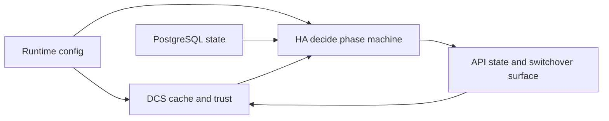
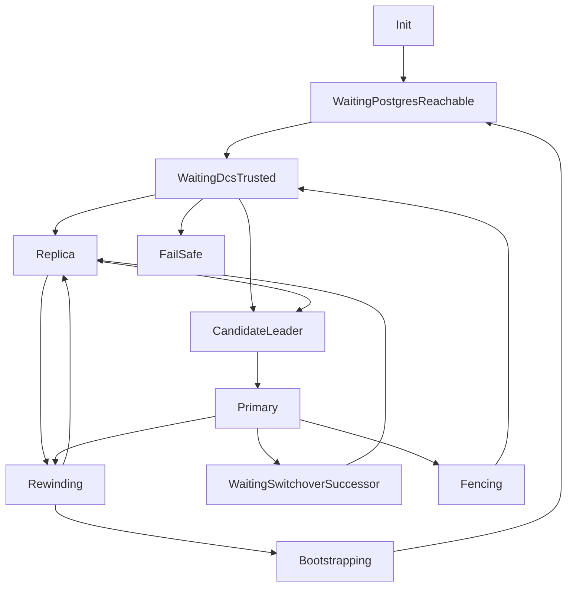
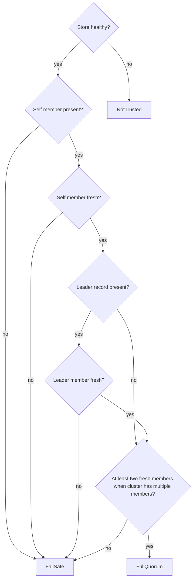

You are drafting exactly one documentation file.

Rules:
- Follow Diataxis strictly.
- Use only the supplied repo facts and supplied Diataxis summary.
- If a fact is missing, say "missing source support" instead of inventing.
- ASCII only.
- No em dashes.
- Add diagrams where deemed fitting

Behavior requirements:
- Read the target path and infer the intended page boundary from it.
- Use the Diataxis type that best matches the supplied target and evidence.
- Keep unsupported claims out of the document.
- If an important fact is missing, write "missing source support" at the exact point where that fact would otherwise be needed.

Follow Diataxis method, write one real page, and include diagrams when needed using the syntax:

[diagram about x, y showing relation between z and a, **more details on diagram**]


# target docs path

docs/src/reference/ha-decisions.md

# docs/src file listing

# docs/src file listing

docs/src/SUMMARY.md
docs/src/explanation/architecture.md
docs/src/explanation/failure-modes.md
docs/src/explanation/introduction.md
docs/src/how-to/bootstrap-cluster.md
docs/src/how-to/check-cluster-health.md
docs/src/how-to/configure-tls-security.md
docs/src/how-to/configure-tls.md
docs/src/how-to/debug-cluster-issues.md
docs/src/how-to/handle-primary-failure.md
docs/src/how-to/perform-switchover.md
docs/src/how-to/run-tests.md
docs/src/reference/http-api.md
docs/src/reference/pgtuskmaster-cli.md
docs/src/reference/pgtuskmasterctl-cli.md
docs/src/reference/runtime-configuration.md
docs/src/tutorial/first-ha-cluster.md
docs/src/tutorial/observing-failover.md


# current docs summary context

===== docs/src/SUMMARY.md =====
# Summary

# Tutorials
- [Tutorials]()
    - [First HA Cluster](tutorial/first-ha-cluster.md)
    - [Observing a Failover Event](tutorial/observing-failover.md)

# How-To

- [How-To]()
    - [Bootstrap a New Cluster from Zero State](how-to/bootstrap-cluster.md)
    - [Check Cluster Health](how-to/check-cluster-health.md)
    - [Configure TLS](how-to/configure-tls.md)
    - [Configure TLS Security](how-to/configure-tls-security.md)
    - [Debug Cluster Issues](how-to/debug-cluster-issues.md)
    - [Handle Primary Failure](how-to/handle-primary-failure.md)
    - [Perform a Planned Switchover](how-to/perform-switchover.md)
    - [Run The Test Suite](how-to/run-tests.md)

# Explanation

- [Explanation]()
    - [Introduction](explanation/introduction.md)
    - [Architecture](explanation/architecture.md)
    - [Failure Modes and Recovery Behavior](explanation/failure-modes.md)

# Reference

- [Reference]()
    - [HTTP API](reference/http-api.md)
    - [pgtuskmaster CLI](reference/pgtuskmaster-cli.md)
    - [pgtuskmasterctl CLI](reference/pgtuskmasterctl-cli.md)
    - [Runtime Configuration](reference/runtime-configuration.md)


# diataxis summary markdown

# Diátaxis Framework: Comprehensive Reference Document

## Introduction and Overview

Diátaxis is a systematic approach to technical documentation authoring that identifies four distinct documentation needs and their corresponding forms. The name derives from Ancient Greek δῐᾰ́τᾰξῐς: "dia" (across) and "taxis" (arrangement). It solves problems related to documentation content (what to write), style (how to write it), and architecture (how to organise it).

The framework is pragmatic and lightweight, designed to be easy to grasp and straightforward to apply without imposing implementation constraints. It is built upon the principle that documentation must serve the needs of its users, specifically practitioners in a domain of skill. Diátaxis has been proven in practice and adopted successfully in hundreds of documentation projects, including major organizations like Vonage, Gatsby, and Cloudflare.

### Core Premise

Documentation serves practitioners in a craft. A craft contains both action (practical knowledge, knowing how, what we do) and cognition (theoretical knowledge, knowing that, what we think). Similarly, a practitioner must both acquire and apply their craft. These two dimensions create four distinct territories, each representing a specific user need that documentation must address.

## The Four Kinds of Documentation

### Tutorials

**Definition and Purpose**: A tutorial is an experience that takes place under the guidance of a tutor and is always learning-oriented. It is a practical activity where the student learns by doing something meaningful towards an achievable goal. Tutorials serve the user's acquisition of skills and knowledge—their study—not to help them get something done, but to help them learn. The user learns through what they do, not because someone has tried to teach them.

**Key Characteristics**:
- Tutorials are lessons that take a student by the hand through a learning experience
- They introduce, educate, and lead the user
- Answer the question: "Can you teach me to...?"
- Oriented to learning
- Form: a lesson
- Analogy: teaching a child how to cook

**Essential Obligations of the Teacher**:
The tutorial creator must realize that nearly all responsibility falls upon the teacher. The teacher is responsible for what the pupil is to learn, what the pupil will do to learn it, and for the pupil's success. The pupil's only responsibility is to be attentive and follow directions. The exercise must be meaningful, successful, logical, and usefully complete.

**Key Principles for Writing Tutorials**:

1. **Show the learner where they'll be going**: Provide a picture of what will be achieved from the start to help set expectations and allow the learner to see themselves building towards the completed goal.

2. **Deliver visible results early and often**: Each step should produce a comprehensible result, however small, to help the learner make connections between causes and effects.

3. **Maintain a narrative of the expected**: Keep providing feedback that the learner is on the right path. Show example output or exact expected output. Flag likely signs of going wrong. Prepare the user for possibly surprising actions.

4. **Point out what the learner should notice**: Learning requires reflection and observation. Close the loops of learning by pointing things out as the lesson moves along.

5. **Target the feeling of doing**: The accomplished practitioner experiences a joined-up purpose, action, thinking, and result that flows in a confident rhythm. The tutorial must tie together purpose and action to cradle this feeling.

6. **Encourage and permit repetition**: Learners will return to exercises that give them success. Repetition is key to establishing the feeling of doing.

7. **Ruthlessly minimise explanation**: A tutorial is not the place for explanation. Users are focused on following directions and getting results. Explanation distracts from learning. Provide minimal explanation and link to extended discussions for later.

8. **Ignore options and alternatives**: Guidance must remain focused on what's required to reach the conclusion. Everything else can be left for another time.

9. **Aspire to perfect reliability**: The tutorial must inspire confidence. At every stage, when the learner follows directions, they must see the promised result. A learner who doesn't get expected results quickly loses confidence.

10. **Focus on concrete and particular**: Maintain focus on this problem, this action, this result, leading the learner from step to concrete step. General patterns emerge naturally from concrete examples.

**Language Patterns**:
- "We ..." (first-person plural affirms tutor-learner relationship)
- "In this tutorial, we will ..." (describe what the learner will accomplish)
- "First, do x. Now, do y. Now that you have done y, do z." (no ambiguity)
- "We must always do x before we do y because..." (minimal explanation, link to details)
- "The output should look something like ..." (clear expectations)
- "Notice that ... Remember that ... Let's check ..." (orientation clues)
- "You have built a secure, three-layer hylomorphic stasis engine..." (admire accomplishment)

**Challenges and Difficulties**: Tutorials are rarely done well because they are genuinely difficult to create. The product often evolves rapidly, requiring constant updates. Unlike other documentation where changes can be made discretely, tutorials often require cascading changes through the entire learning journey. The creator must distinguish between what is to be learned and what is to be done, devising a meaningful journey that delivers all required knowledge.

**Food and Cooking Analogy**: Teaching a child to cook demonstrates tutorial principles. The value lies not in the culinary outcome but what the child gains. Success is measured by acquired knowledge and skills, not by whether the child can repeat the process independently. The lesson might be framed around a particular dish, but what the child actually learns are fundamentals like washing hands, holding a knife, understanding heat, timing, and measurement. The child learns through activities done alongside the teacher, not from explanations. Children's short attention spans mean lessons often end before completion, but as long as the child achieved something and enjoyed it, learning has occurred.

### How-to Guides

**Definition and Purpose**: How-to guides are directions that guide the reader through a problem or towards a result. They are goal-oriented and help the user get something done correctly and safely by guiding the user's action. They're concerned with work—navigating from one side to the other of a real-world problem-field.

**Key Characteristics**:
- How-to guides guide the reader
- Answer the question: "How do I...?"
- Oriented to goals
- Purpose: to help achieve a particular goal
- Form: a series of steps
- Analogy: a recipe in a cookery book

**Essential Nature**: A how-to guide addresses a real-world goal or problem by providing practical directions to help the user who is in that situation. It assumes the user is already competent and expects them to use the guide to help them get work done. The guide's purpose is to help the already-competent user perform a particular task correctly. It serves the user's work, not their study.

**Key Principles**:

1. **Address real-world complexity**: A how-to guide must be adaptable to real-world use-cases. It cannot be useless except for exactly the narrow case addressed. Find ways to remain open to possibilities so users can adapt guidance to their needs.

2. **Omit the unnecessary**: Practical usability is more helpful than completeness. Unlike tutorials that must be complete end-to-end guides, how-to guides should start and end in reasonable, meaningful places, requiring readers to join it to their own work.

3. **Provide a set of instructions**: A how-to guide describes an executable solution to a real-world problem. It's a contract: if you're facing this situation, you can work through it by taking the steps outlined. Steps are actions, which include physical acts, thinking, and judgment.

4. **Describe a logical sequence**: The fundamental structure is a sequence implying logical ordering in time. Sometimes ordering is imposed by necessity (step two requires step one). Sometimes it's more subtle—operations might be possible in either order, but one helps set up the environment or thinking for the other.

5. **Seek flow**: Ground sequences in patterns of user activities and thinking so the guide acquires smooth progress. Flow means successfully understanding the user. Pay attention to what you're asking the user to think about and how their thinking flows from subject to subject. Action has pace and rhythm. Badly-judged pace or disrupted rhythm damage flow. At its best, how-to documentation anticipates the user.

6. **Pay attention to naming**: Choose titles that say exactly what the guide shows. Good: "How to integrate application performance monitoring." Bad: "Integrating application performance monitoring" (maybe it's about deciding whether to). Very bad: "Application performance monitoring" (could be about how, whether, or what it is). Good titles help both humans and search engines.

**What How-to Guides Are NOT**: How-to guides are wholly distinct from tutorials, though often confused. Solving a problem cannot always be reduced to a procedure. Real-world problems don't always offer linear solutions. Sequences sometimes need to fork and overlap with multiple entry and exit points. How-to guides often require users to rely on their judgment.

**Language Patterns**:
- "This guide shows you how to..." (describe the problem or task)
- "If you want x, do y. To achieve w, do z." (conditional imperatives)
- "Refer to the x reference guide for a full list of options." (don't pollute with completeness)

**Food and Cooking Analogy**: A recipe is an excellent model. A recipe clearly defines what will be achieved and addresses a specific question ("How do I make...?" or "What can I make with...?"). It's not the responsibility of a recipe to teach you how to make something. A professional chef who has made the same thing many times may still follow a recipe to ensure correctness. Following a recipe requires at least basic competence—someone who has never cooked should not be expected to succeed with a recipe alone. A good recipe follows a well-established format that excludes both teaching and discussion, focusing only on "how" to make the dish.

### Reference

**Definition and Purpose**: Reference guides are technical descriptions of the machinery and how to operate it. Reference material is information-oriented and contains propositional or theoretical knowledge that a user looks to in their work. The only purpose is to describe, as succinctly as possible and in an orderly way. Reference material is led by the product it describes, not by user needs.

**Key Characteristics**:
- Reference guides state, describe, and inform
- Answer the question: "What is...?"
- Oriented to information
- Purpose: to describe the machinery
- Form: dry description
- Analogy: information on the back of a food packet

**Essential Nature**: Reference material describes the machinery in an austere manner. One hardly "reads" reference material; one "consults" it. There should be no doubt or ambiguity—it must be wholly authoritative. Reference material is like a map: it tells you what you need to know about the territory without having to check the territory yourself.

**Key Principles**:

1. **Describe and only describe**: Neutral description is the key imperative. It's not natural to describe something neutrally. The temptation is to explain, instruct, discuss, or opine, but these run counter to reference needs. Instead, link to how-to guides and explanations.

2. **Adopt standard patterns**: Reference material is useful when consistent. Place material where users expect to find it, in familiar formats. Reference is not the place to delight readers with extensive vocabulary or multiple styles.

3. **Respect the structure of the machinery**: The way a map corresponds to territory helps us navigate. Similarly, documentation structure should mirror product structure so users can work through both simultaneously. This doesn't mean forcing unnatural structures, but the logical, conceptual arrangement within code should help make sense of documentation.

4. **Provide examples**: Examples are valuable for illustration while avoiding distraction from description. An example of command usage can succinctly illustrate context without falling into explanation.

**Language Patterns**:
- "Django's default logging configuration inherits Python's defaults. It's available as `django.utils.log.DEFAULT_LOGGING` and defined in `django/utils/log.py`" (state facts about machinery)
- "Sub-commands are: a, b, c, d, e, f." (list commands, options, operations, features, flags, limitations, error messages)
- "You must use a. You must not apply b unless c. Never d." (provide warnings)

**Food and Cooking Analogy**: Checking information on a food packet helps make decisions. When seeking facts, you don't want opinions, speculation, instructions, or interpretation. You expect standard presentation so you can quickly find nutritional properties, storage instructions, ingredients, health implications. You expect reliability: "May contain traces of wheat" or "Net weight: 1000g". You won't find recipes or marketing claims mixed with this information—that could be dangerous. The presentation is so important it's usually governed by law, and the same seriousness should apply to all reference documentation.

### Explanation

**Definition and Purpose**: Explanation is a discursive treatment of a subject that permits reflection. It is understanding-oriented and deepens/broadens the reader's understanding by bringing clarity, light, and context. The concept of reflection is important—reflection occurs after something else, depends on something else, yet brings something new to the subject matter. Its perspective is higher and wider than other types.

**Key Characteristics**:
- Explanation guides explain, clarify, and discuss
- Answer the question: "Why...?"
- Oriented to understanding
- Purpose: to illuminate a topic
- Form: discursive explanation
- Analogy: an article on culinary social history

**Essential Nature**: For the user, explanation joins things together. It's an answer to: "Can you tell me about...?" It's documentation that makes sense to read while away from the product itself (the only kind that might make sense to read in the bath). It serves the user's study (like tutorials) but belongs to theoretical knowledge (like reference).

**The Value and Place of Explanation**:
Explanation is characterized by distance from active concerns. It's sometimes seen as less important, but this is a mistake—it may be less urgent but is no less important; it's not a luxury. No practitioner can afford to be without understanding of their craft. Explanation helps weave together understanding. Without it, knowledge is loose, fragmented, fragile, and exercise of craft is anxious.

**Alternative Names**: Explanation documentation doesn't need to be called "Explanation." Alternatives include Discussion, Background, Conceptual guides, or Topics.

**Key Principles**:

1. **Make connections**: Help weave a web of understanding by connecting to other things, even outside the immediate topic.

2. **Provide context**: Explain why things are so—design decisions, historical reasons, technical constraints. Draw implications and mention specific examples.

3. **Talk about the subject**: Explanation guides are about a topic in the sense of being around it. Names should reflect this—you should be able to place an implicit (or explicit) "about" in front of each title: "About user authentication" or "About database connection policies."

4. **Admit opinion and perspective**: All human activity is invested with opinion, beliefs, and thoughts. Explanation must consider alternatives, counter-examples, or multiple approaches. You're opening up the topic for consideration, not giving instruction or describing facts.

5. **Keep explanation closely bounded**: One risk is that explanation absorbs other things. Writers feel the urge to include instruction or technical description, but documentation already has other places for these. Allowing them to creep in interferes with explanation and removes material from correct locations.

**Language Patterns**:
- "The reason for x is because historically, y..." (explain)
- "W is better than z, because..." (offer judgments and opinions)
- "An x in system y is analogous to a w in system z. However..." (provide context)
- "Some users prefer w (because z). This can be a good approach, but..." (weigh alternatives)
- "An x interacts with a y as follows: ..." (unfold internal secrets)

**Food and Cooking Analogy**: In 1984, Harold McGee published "On Food and Cooking." The book doesn't teach how to cook, doesn't contain recipes (except as historical examples), and isn't reference. Instead, it places food and cooking in context of history, society, science, and technology. It explains why we do what we do in the kitchen and how that has changed. It's not a book to read while cooking, but when reflecting on cooking. It illuminates the subject from multiple perspectives. After reading, understanding is changed—knowledge is richer and deeper. What is learned may or may not be immediately applicable, but it changes how you think about the craft and affects practice.

## Theoretical Foundations

### Two Dimensions of Craft

Diátaxis is based on understanding that a skill or craft contains both action (practical knowledge, knowing how) and cognition (theoretical knowledge, knowing that). These are completely bound up with each other but are counterparts—wholly distinct aspects of the same thing.

Similarly, a practitioner must both acquire and apply their craft. Being "at work" (applying skill) and being "at study" (acquiring skill) are counterparts, distinct but bound together.

### The Map of the Territory

These two dimensions can be laid out on a map—a complete map of the territory of craft. This is a complete map: there are only two dimensions, and they don't just cover the entire territory, they define it. This is why there are necessarily four quarters, and there could not be three or five. It is not an arbitrary number.

### Serving Needs

The map of craft territory gives us the familiar Diátaxis map of documentation. The map answers: what must documentation do to align with these qualities of skill, and to what need is it oriented in each case?

The four needs are:
1. **Learning**: addressed in tutorials, where the user acquires their craft, and documentation informs action
2. **Goals**: addressed in how-to guides, where the user applies their craft, and documentation informs action
3. **Information**: addressed in reference, where the user applies their craft, and documentation informs cognition
4. **Understanding**: addressed in explanation, where the user acquires their craft, and documentation informs cognition

### Why Four and Only Four

The Diátaxis map is memorable and approachable, but reliable only if it adequately describes reality. Diátaxis is underpinned by systematic description and analysis of generalized user needs. This is why the four types are a complete enumeration of documentation serving practitioners. There is simply no other territory to cover.

## The Map and Compass

### The Map

Diátaxis is effective because it describes a two-dimensional structure rather than a list. It places documentation forms into relationships, each occupying a space in mental territory, with boundaries highlighting distinctions.

**Structure Problems**: When documentation fails to attain good structure, architectural faults infect and undermine content. Without clear architecture, creators structure work around product features, leading to inconsistency. Any orderly attempt to organize into clear content types helps, but authors often find content that fails to fit well within categories.

**Expectations and Guidance**: The Diátaxis structure provides clear expectations (to the reader) and guidance (to the author). It clarifies purpose, specifies writing style, and shows placement.

**Blur and Collapse**: There's natural affinity between neighboring forms and a tendency to blur distinctions. When allowed to blur, documentation bleeds into inappropriate forms, causing structural problems that make maintenance harder. In the worst case, tutorials and how-to guides collapse into each other, making it impossible to meet needs served by either.

**Journey Around the Map**: Diátaxis helps documentation better serve users in their cycle of interaction. While users don't literally encounter types in order (tutorials > how-to > reference > explanation), there is sense and meaning to this ordering corresponding to how people become expert. The learning-oriented phase involves diving in under guidance. The goal-oriented phase puts skill to work. The information-oriented phase requires consulting reference. The explanation-oriented phase reflects away from work. Then the cycle repeats.

### The Compass

The compass is a truth-table or decision-tree reducing a complex two-dimensional problem to simpler parts, providing a course-correction tool. It can be applied to user situations needing documentation or to documentation itself that needs moving or improving.

**Using the Compass**: Ask two questions—action or cognition? acquisition or application? The compass yields the answer.

**Table of Contents**:
- If content informs action and serves acquisition of skill → tutorial
- If content informs action and serves application of skill → how-to guide
- If content informs cognition and serves application of skill → reference
- If content informs cognition and serves acquisition of skill → explanation

**Application**: The compass is particularly effective when you're troubled by doubt or difficulty. It forces reconsideration. Use its terms flexibly:
- action: practical steps, doing
- cognition: theoretical knowledge, thinking
- acquisition: study
- application: work

Use the questions in different ways: "Do I think I am writing for x or y?" "Is this writing engaged in x or y?" "Does the user need x or y?" "Do I want to x or y?" Apply them at sentence/ word level or at entire document level.

## Practical Application

### Workflow

Diátaxis is both a guide to content and to documentation process. Most people must make decisions about how to work as they work. Documentation is usually an ongoing project that evolves with the product. Diátaxis provides an approach that discourages planning and top-down workflows, preferring small, responsive iterations from which patterns emerge.

**Use Diátaxis as a Guide, Not a Plan**: Diátaxis describes a complete picture, but its structure is not a plan to complete. It's a guide, a map to check you're in the right place and going in the right direction. It provides tools to assess documentation, identify problems, and judge improvements.

**Don't Worry About Structure**: Don't spend energy trying to get structure correct. If you follow Diátaxis prompts, documentation will assume Diátaxis structure—but because it has been improved, not the other way around. Getting started doesn't require dividing documentation into four sections. Certainly don't create empty structures for each category with nothing in them.

**Work One Step at a Time**: Diátaxis prescribes structure, but whatever the state of existing documentation—even a complete mess—you can improve it iteratively. Avoid completing large tranches before publishing. Every step in the right direction is worth publishing immediately. Don't work on the big picture. Diátaxis guides small steps; keep taking small steps.

**Just Do Something**: 

1. **Choose something**: Any piece of documentation. If you don't have something specific, look at what's in front of you—the file you're in, the last page you read. If nothing, choose literally at random.

2. **Assess it**: Consider it critically, preferably a small thing (page, paragraph, sentence). Challenge it according to Diátaxis standards: What user need is represented? How well does it serve that need? What can be added, moved, removed, or changed to serve that need better? Do language and logic meet mode requirements?

3. **Decide what to do**: Based on answers, decide what single next action will produce immediate improvement.

4. **Do it**: Complete that single action and consider it completed—publish or commit it. Don't feel you need anything else.

This cycle reduces the paralysis of deciding what to do, keeps work flowing, and expends no energy on planning.

**Allow Organic Development**: Documentation should be as complex as it needs to be but no more. A good model is well-formed organic growth that adapts to external conditions. Growth takes place at the cellular level. The organism's structure is guaranteed by healthy cell development according to appropriate rules, not by imposed structure. Similarly, documentation attains healthy structure when internal components are well-formed, building from the inside-out, one cell at a time.

**Complete, Not Finished**: Like a plant, documentation is never finished—it can always develop further. But at every stage, it should be complete—never missing something, always in a state appropriate to its development stage. Documentation should be complete: useful, appropriate to its current stage, in a healthy structural state, and ready for the next stage.

## Complex Documentation Scenarios

### Basic Structure

Application is straightforward when product boundaries are clear:

```
Home                      <- landing page
    Tutorial              <- landing page
        Part 1
        Part 2
        Part 3
    How-to guides         <- landing page
        Install
        Deploy
        Scale
    Reference             <- landing page
        Command-line tool
        Available endpoints
        API
    Explanation           <- landing page
        Best practice recommendations
        Security overview
        Performance
```

Each landing page contains an overview. After a while, grouping within sections might be wise by adding hierarchy:

```
Home                      <- landing page
    Tutorial              <- landing page
        Part 1
        Part 2
        Part 3
    How-to guides         <- landing page
        Install           <- landing page
            Local installation
            Docker
            Virtual machine
            Linux container
        Deploy
        Scale
```

### Contents Pages

Contents pages (home page and landing pages) provide overview of material. There's an art to creating good contents pages; user experience deserves careful consideration.

**The Problem of Lists**: Lists longer than a few items are hard to read unless they have mechanical order (numerical or alphabetical). Seven items seems a comfortable general limit. If you have longer lists, find ways to break them into smaller ones. What matters most is the reader's experience.

**Overviews and Introductory Text**: Landing page content should read like an overview, not just present lists. Remember you're authoring for humans, not fulfilling scheme demands. Headings and snippets catch the eye and provide context. For example, a how-to landing page should have introductory text for each section grouping.

### Two-Dimensional Problems

A more difficult problem occurs when Diátaxis structure meets another structure—often topic areas within documentation or different user types.

**Examples**:
- Product used on land, sea, and air, used differently in each case
- Documentation addressing users, developers building around the product, and contributors maintaining it
- Product deployable on different public clouds with different workflows, commands, APIs, constraints

These scenarios present two-dimensional problems. You could structure by Diátaxis first, then by audience:

```
tutorial
    for users on land
    for users at sea
    for users in the air
[and so on for how-to, reference, explanation]
```

Or by audience first, then Diátaxis:

```
for users on land
    tutorial
    how-to guides
    reference
    explanation
for users at sea
    [...]
```

Both approaches have repetition. What about material that can be shared?

**Understanding the Problem**: The problem isn't limited to Diátaxis—it exists in any documentation system. However, Diátaxis reveals and brings it into focus. A common misunderstanding is seeing Diátaxis as four boxes into which documentation must be placed. Instead, Diátaxis should be understood as an approach, a way of working that identifies four needs to author and structure documentation effectively.

**User-First Thinking**: Diátaxis is underpinned by attention to user needs. We must document the product as it is for the user, as it is in their hands and minds. If the product on land, sea, and air is effectively three different products for three different users, let that be the starting point. If documentation must meet needs of users, developers, and contributors, consider how they see the product. Perhaps developers need understanding of how it's used, and contributors need what developers know. Then be freer with structure, allowing developer-facing content to follow user-facing material in some parts while separating contributor material completely.

**Let Documentation Be Complex**: Documentation should be as complex as it needs to be. Even complex structures can be straightforward to navigate if logical and incorporate patterns fitting user needs.

## Quality Theory

Diátaxis is an approach to quality in documentation. "Quality" is a word in danger of losing meaning—we all approve of it but rarely describe it rigorously. We can point to examples and identify lapses, suggesting we have a useful grasp of quality.

### Functional Quality

Documentation must meet standards of accuracy, completeness, consistency, usefulness, precision. These are aspects of functional quality. A failure in any one means failing a key function. These properties are independent—documentation can be accurate without complete, complete but inaccurate, or accurate, complete, consistent, and useless.

Attaining functional quality means meeting high, objectively-measurable standards consistently across multiple independent dimensions. It requires discipline, attention to detail, and technical skill. Any failure is readily apparent to users.

### Deep Quality

**Characteristics**:
- Feeling good to use
- Having flow
- Fitting human needs
- Being beautiful
- Anticipating the user

Unlike functional quality, these are interdependent. They cannot be checked or measured but can be identified. They are assessed against human needs, not against the world. Deep quality is conditional upon functional quality—documentation cannot have deep quality without being accurate, complete, and consistent. No user will experience it as beautiful if it's inaccurate.

Functional quality presents as constraints—each is a test or challenge we might fail, requiring constant vigilance. Deep quality represents liberation—the work of creativity or taste. To attain functional quality we must conform to constraints; to attain deep quality we must invent.

**How We Recognize Deep Quality**: Consider clothing quality. Clothes must have functional quality (warmth, durability), which is objectively measurable. But quality of materials or workmanship requires understanding clothing. Being able to judge that an item hangs well or moves well requires developing an eye. Yet even without expertise, anyone can recognize excellent clothing because it feels good to wear—your body knows it. Similarly, good documentation feels good; you feel pleasure and satisfaction using it.

### Diátaxis and Quality

Diátaxis cannot address functional quality—it's concerned only with certain aspects of deep quality. However, it can serve functional quality by exposing lapses. Applying Diátaxis to existing documentation often makes previously obscured problems apparent. For example, recommending that reference architecture reflect code architecture makes gaps more visible. Moving explanatory verbiage out of a tutorial often highlights where readers have been left to work things out themselves.

In deep quality, Diátaxis can do more. It helps documentation fit user needs by describing modes based on them. It preserves flow by preventing disruption (like explanation interrupting a how-to guide). However, Diátaxis can never be all that's required for deep quality. It doesn't make documentation beautiful by itself. It offers principles, not a formula. It cannot bypass skills of user experience, interaction design, or visual design. Using Diátaxis does not guarantee deep quality, but it lays down conditions for the possibility of deep quality.

## Distinguishing Documentation Types

### Tutorials vs. How-to Guides

The most common conflation in software documentation is between tutorials and how-to guides. They are similar in being practical guides containing directions to follow. Both set out steps, promise success if followed, and require hands-on interaction.

**What Matters**: The distinction comes from user needs. Sometimes the user is at study, sometimes at work. A tutorial serves study needs—its obligation is to provide a successful learning experience. A how-to guide serves work needs—its obligation is to help accomplish a task. These are completely different needs.

**Medical Example**: Learning to suture a wound in medical school is a tutorial—it's a lesson safely in an instructor's hands. An appendectomy clinical manual is a how-to guide—it guides already-competent practitioners safely through a task. The manual isn't there to teach; it's there to serve work.

**Key Distinctions**:
- Tutorial purpose: help pupil acquire basic competence vs. How-to guide purpose: help already-competent user perform a task
- Tutorial provides learning experience vs. How-to guide directs user's work
- Tutorial follows carefully-managed path vs. How-to guide path can't be managed (real world)
- Tutorial familiarizes learner with tools vs. How-to guide assumes familiarity
- Tutorial takes place in contrived setting vs. How-to guide applies to real world
- Tutorial eliminates unexpected vs. How-to guide prepares for unexpected
- Tutorial follows single line without choices vs. How-to guide forks and branches
- Tutorial must be safe vs. How-to guide cannot promise safety
- In tutorial, responsibility lies with teacher vs. In how-to guide, user has responsibility
- Tutorial learner may not have competence to ask questions vs. How-to guide user asks right questions
- Tutorial is explicit about basic things vs. How-to guide relies on implicit knowledge
- Tutorial is concrete and particular vs. How-to guide is general
- Tutorial teaches general skills vs. How-to guide user completes particular task

**Not Basic vs. Advanced**: How-to guides can cover basic or well-known procedures. Tutorials can present complex or advanced material. The difference is the need served: study vs. work.

### Reference vs. Explanation

Both belong to the theory half of the Diátaxis map—they contain theoretical knowledge, not steps.

**Mostly Straightforward**: Most of the time it's clear which you're dealing with. Reference is well understood from early education. A tidal chart is clearly reference; an article explaining why there are tides is explanation.

**Rules of Thumb**:
- If it's boring and unmemorable, it's probably reference
- Lists and tables generally belong in reference
- If you can imagine reading it in the bath, it's probably explanation
- Asking a friend "Can you tell me more about <topic>?" yields explanation

**Work vs. Study Test**: The real test is: would someone turn to this while working (executing a task) or while stepping away from work to think about it? Reference helps apply knowledge while working. Explanation helps acquire knowledge during study.

**Dangers**: While writing reference that becomes expansive, it's tempting to develop examples into explanation (showing why, what if, or how it came to be). This results in explanatory material sprinkled into reference, which is bad for both—reference is interrupted, and explanation can't develop appropriately.

## Getting Started and Resources

### Quick Start

You don't need to read everything or wait to understand Diátaxis before applying it. In fact, you won't understand it until you start using it. As soon as you have an idea worth applying, try it. Come back to documentation when you need clarity or reassurance. Iterate between work and reflecting on work.

**The Five-Minute Version**:
1. Learn the four kinds: tutorials, how-to guides, reference, explanation
2. Understand the Diátaxis map showing relationships
3. Use the compass (action/cognition? acquisition/application?) to guide decisions
4. Follow the workflow: consider what you see, ask if it could be improved, decide on one small improvement, do it, repeat
5. Do what you like with Diátaxis—it's pragmatic, no exam required. Use what seems worthwhile

### The Website and Community

Diátaxis is the work of Daniele Procida (https://vurt.eu). It has been developed over years and continues to be elaborated. The original context was software product documentation. In 2021, a Fellowship of the Software Sustainability Institute explored its application in scientific research. More recent exploration includes internal corporate documentation, organizational management, education, and application at scale.

**Contact**: Email Daniele at daniele@vurt.org. He enjoys hearing about experiences and reads everything, though can't promise to respond to every message due to volume. For discussion with other users, see the #diataxis channel on the Write the Docs Slack group or the Discussions section of the GitHub repository for the website.

**Citation**: To cite Diátaxis, refer to the website diataxis.fr. The Git repository contains a CITATION.cff file. APA and BibTeX metadata are available from the "Cite this repository" option. You can submit pull requests for improvements or file issues.

**Website**: Built with Sphinx and hosted on Read the Docs, using a modified version of Pradyun Gedam's Furo theme.

### Applying Diátaxis

The pages concerning application are for putting Diátaxis into practice. Diátaxis is underpinned by systematic theoretical principles, but understanding them isn't necessary for effective use. Most key principles can be grasped intuitively. Don't wait to understand before practicing—you won't understand until you start using it.

The core is the four kinds of documentation. If encountering Diátaxis for the first time, start with these. Once you've begun, tools and methods will help smooth your way: the compass, and the workflow (how-to-use-diataxis).

---

Missing source support: None. All requested information is available in the provided Diátaxis source files.


# project manifests and docs config

===== Cargo.toml =====
[package]
name = "pgtuskmaster_rust"
version = "0.1.0"
edition = "2021"

[features]
default = []

[dependencies]
clap = { version = "4.5.47", features = ["derive", "env"] }
serde = { version = "1.0.219", features = ["derive"] }
serde_json = "1.0.140"
sha2 = "0.10.9"
thiserror = "2.0.12"
tokio = { version = "1.44.1", features = ["sync", "rt", "rt-multi-thread", "macros", "time", "process", "net", "io-util", "fs"] }
tokio-postgres = "0.7.13"
toml = "0.8.20"
httparse = "1.10.1"
etcd-client = "0.14.1"
reqwest = { version = "0.12.24", default-features = false, features = ["blocking", "json", "rustls-tls"] }
rustls = { version = "0.23.28", features = ["ring"] }
rustls-pemfile = "2.2.0"
tokio-rustls = "0.26.4"
tracing = "0.1.41"
tracing-subscriber = "0.3.20"

[target.'cfg(unix)'.dependencies]
libc = "0.2"

[dev-dependencies]
rcgen = "0.14.5"


===== docs/book.toml =====
[book]
authors = ["Joshua Azimullah"]
language = "en"
multilingual = false
src = "src"
title = "pgtuskmaster"

[preprocessor.mermaid]
command = "mdbook-mermaid"

[output]

[output.html]
additional-js = ["mermaid.min.js", "mermaid-init.js"]


# src and test file listing

# src and test file listing

src/api/controller.rs
src/api/fallback.rs
src/api/mod.rs
src/api/worker.rs
src/bin/pgtuskmaster.rs
src/bin/pgtuskmasterctl.rs
src/cli/args.rs
src/cli/client.rs
src/cli/error.rs
src/cli/mod.rs
src/cli/output.rs
src/config/defaults.rs
src/config/mod.rs
src/config/parser.rs
src/config/schema.rs
src/dcs/etcd_store.rs
src/dcs/keys.rs
src/dcs/mod.rs
src/dcs/state.rs
src/dcs/store.rs
src/dcs/worker.rs
src/debug_api/mod.rs
src/debug_api/snapshot.rs
src/debug_api/view.rs
src/debug_api/worker.rs
src/ha/actions.rs
src/ha/apply.rs
src/ha/decide.rs
src/ha/decision.rs
src/ha/events.rs
src/ha/lower.rs
src/ha/mod.rs
src/ha/process_dispatch.rs
src/ha/source_conn.rs
src/ha/state.rs
src/ha/worker.rs
src/lib.rs
src/logging/event.rs
src/logging/mod.rs
src/logging/postgres_ingest.rs
src/logging/raw_record.rs
src/logging/tailer.rs
src/pginfo/conninfo.rs
src/pginfo/mod.rs
src/pginfo/query.rs
src/pginfo/state.rs
src/pginfo/worker.rs
src/postgres_managed.rs
src/postgres_managed_conf.rs
src/process/jobs.rs
src/process/mod.rs
src/process/state.rs
src/process/worker.rs
src/runtime/mod.rs
src/runtime/node.rs
src/state/errors.rs
src/state/ids.rs
src/state/mod.rs
src/state/time.rs
src/state/watch_state.rs
src/test_harness/auth.rs
src/test_harness/binaries.rs
src/test_harness/etcd3.rs
src/test_harness/ha_e2e/config.rs
src/test_harness/ha_e2e/handle.rs
src/test_harness/ha_e2e/mod.rs
src/test_harness/ha_e2e/ops.rs
src/test_harness/ha_e2e/startup.rs
src/test_harness/ha_e2e/util.rs
src/test_harness/mod.rs
src/test_harness/namespace.rs
src/test_harness/net_proxy.rs
src/test_harness/pg16.rs
src/test_harness/ports.rs
src/test_harness/provenance.rs
src/test_harness/runtime_config.rs
src/test_harness/signals.rs
src/test_harness/tls.rs
src/tls.rs
src/worker_contract_tests.rs
tests/bdd_api_http.rs
tests/bdd_state_watch.rs
tests/cli_binary.rs
tests/ha/support/multi_node.rs
tests/ha/support/observer.rs
tests/ha/support/partition.rs
tests/ha_multi_node_failover.rs
tests/ha_partition_isolation.rs
tests/policy_e2e_api_only.rs


# docker and docs support file listing

docker/Dockerfile.dev
docker/Dockerfile.prod
docker/compose/docker-compose.cluster.yml
docker/compose/docker-compose.single.yml
docker/configs/cluster/node-a/runtime.toml
docker/configs/cluster/node-b/runtime.toml
docker/configs/cluster/node-c/runtime.toml
docker/configs/common/pg_hba.conf
docker/configs/common/pg_ident.conf
docker/configs/single/node-a/runtime.toml
docker/entrypoint.sh
docker/secrets/postgres-superuser.password.example
docker/secrets/replicator.password.example
docker/secrets/rewinder.password.example
docs/book.toml
docs/draft/docs/src/explanation/architecture.md
docs/draft/docs/src/explanation/architecture.revised.md
docs/draft/docs/src/explanation/failure-modes.md
docs/draft/docs/src/explanation/failure-modes.revised.md
docs/draft/docs/src/explanation/introduction.md
docs/draft/docs/src/how-to/add-cluster-node.md
docs/draft/docs/src/how-to/bootstrap-cluster.md
docs/draft/docs/src/how-to/bootstrap-cluster.revised.md
docs/draft/docs/src/how-to/check-cluster-health.md
docs/draft/docs/src/how-to/check-cluster-health.revised.md
docs/draft/docs/src/how-to/configure-tls-security.md
docs/draft/docs/src/how-to/configure-tls.md
docs/draft/docs/src/how-to/debug-cluster-issues.md
docs/draft/docs/src/how-to/handle-network-partition.md
docs/draft/docs/src/how-to/handle-primary-failure.md
docs/draft/docs/src/how-to/handle-primary-failure.revised.md
docs/draft/docs/src/how-to/monitor-via-metrics.md
docs/draft/docs/src/how-to/perform-switchover.md
docs/draft/docs/src/how-to/perform-switchover.revised.md
docs/draft/docs/src/how-to/run-tests.md
docs/draft/docs/src/reference/cli-commands.md
docs/draft/docs/src/reference/cli-commands.revised.md
docs/draft/docs/src/reference/cli-pgtuskmasterctl.md
docs/draft/docs/src/reference/cli-pgtuskmasterctl.revised.md
docs/draft/docs/src/reference/cli.md
docs/draft/docs/src/reference/cli.revised.md
docs/draft/docs/src/reference/debug-api.md
docs/draft/docs/src/reference/ha-decisions.md
docs/draft/docs/src/reference/http-api.md
docs/draft/docs/src/reference/http-api.revised.md
docs/draft/docs/src/reference/pgtuskmaster-cli.md
docs/draft/docs/src/reference/pgtuskmaster-cli.revised.md
docs/draft/docs/src/reference/pgtuskmasterctl-cli.md
docs/draft/docs/src/reference/pgtuskmasterctl-cli.revised.md
docs/draft/docs/src/reference/runtime-configuration.md
docs/draft/docs/src/reference/runtime-configuration.revised.md
docs/draft/docs/src/tutorial/first-ha-cluster.final.md
docs/draft/docs/src/tutorial/first-ha-cluster.md
docs/draft/docs/src/tutorial/first-ha-cluster.revised.md
docs/draft/docs/src/tutorial/observing-failover.md
docs/draft/docs/src/tutorial/observing-failover.revised.md
docs/mermaid-init.js
docs/mermaid.min.js
docs/src/SUMMARY.md
docs/src/explanation/architecture.md
docs/src/explanation/failure-modes.md
docs/src/explanation/introduction.md
docs/src/how-to/bootstrap-cluster.md
docs/src/how-to/check-cluster-health.md
docs/src/how-to/configure-tls-security.md
docs/src/how-to/configure-tls.md
docs/src/how-to/debug-cluster-issues.md
docs/src/how-to/handle-primary-failure.md
docs/src/how-to/perform-switchover.md
docs/src/how-to/run-tests.md
docs/src/reference/http-api.md
docs/src/reference/pgtuskmaster-cli.md
docs/src/reference/pgtuskmasterctl-cli.md
docs/src/reference/runtime-configuration.md
docs/src/tutorial/first-ha-cluster.md
docs/src/tutorial/observing-failover.md
docs/tmp/docs/src/explanation/architecture.prompt.md
docs/tmp/docs/src/explanation/failure-modes.prompt.md
docs/tmp/docs/src/explanation/introduction.prompt.md
docs/tmp/docs/src/how-to/add-cluster-node.prompt.md
docs/tmp/docs/src/how-to/bootstrap-cluster.prompt.md
docs/tmp/docs/src/how-to/check-cluster-health.prompt.md
docs/tmp/docs/src/how-to/configure-tls-security.prompt.md
docs/tmp/docs/src/how-to/configure-tls.prompt.md
docs/tmp/docs/src/how-to/debug-cluster-issues.prompt.md
docs/tmp/docs/src/how-to/handle-network-partition.prompt.md
docs/tmp/docs/src/how-to/handle-primary-failure.prompt.md
docs/tmp/docs/src/how-to/monitor-via-metrics.prompt.md
docs/tmp/docs/src/how-to/perform-switchover.prompt.md
docs/tmp/docs/src/how-to/run-tests.prompt.md
docs/tmp/docs/src/reference/cli-commands.prompt.md
docs/tmp/docs/src/reference/cli-pgtuskmasterctl.prompt.md
docs/tmp/docs/src/reference/cli.prompt.md
docs/tmp/docs/src/reference/debug-api.prompt.md
docs/tmp/docs/src/reference/ha-decisions.prompt.md
docs/tmp/docs/src/reference/http-api.prompt.md
docs/tmp/docs/src/reference/pgtuskmaster-cli.prompt.md
docs/tmp/docs/src/reference/pgtuskmasterctl-cli.prompt.md
docs/tmp/docs/src/reference/runtime-configuration.prompt.md
docs/tmp/docs/src/tutorial/first-ha-cluster.prompt.md
docs/tmp/docs/src/tutorial/observing-failover.prompt.md
docs/tmp/k2-batch-2/choose/lane1.md
docs/tmp/k2-batch-2/choose/lane2.md
docs/tmp/k2-batch-2/choose/lane3.md
docs/tmp/k2-batch-2/choose/lane4.md
docs/tmp/k2-batch-2/choose/lane4b.md
docs/tmp/k2-batch-2/choose/lane5.md
docs/tmp/k2-batch-2/context/lane1.out
docs/tmp/k2-batch-2/context/lane2.out
docs/tmp/k2-batch-2/context/lane3.out
docs/tmp/k2-batch-2/context/lane4.out
docs/tmp/k2-batch-2/context/lane5.out
docs/tmp/k2-batch/20260308-architecture.prepare.out
docs/tmp/k2-batch/20260308-batch2-lane1.choose.md
docs/tmp/k2-batch/20260308-batch2-lane2.choose.md
docs/tmp/k2-batch/20260308-batch2-lane3.choose.md
docs/tmp/k2-batch/20260308-batch2-lane4.choose.md
docs/tmp/k2-batch/20260308-batch2-lane5.choose.md
docs/tmp/k2-batch/20260308-batch2-runtime.prepare.out
docs/tmp/k2-batch/20260308-batch3-reroll/lane2.choose.md
docs/tmp/k2-batch/20260308-batch3-reroll/lane3.choose.md
docs/tmp/k2-batch/20260308-batch3-reroll/lane4.choose.md
docs/tmp/k2-batch/20260308-batch3-reroll/lane5.choose.md
docs/tmp/k2-batch/20260308-batch3/lane1.choose.md
docs/tmp/k2-batch/20260308-batch3/lane2.choose.md
docs/tmp/k2-batch/20260308-batch3/lane3.choose.md
docs/tmp/k2-batch/20260308-batch3/lane4.choose.md
docs/tmp/k2-batch/20260308-batch3/lane5.choose.md
docs/tmp/k2-batch/20260308-lane1.choose.md
docs/tmp/k2-batch/20260308-lane2.choose.md
docs/tmp/k2-batch/20260308-lane3.choose.md
docs/tmp/k2-batch/20260308-lane4.choose.md
docs/tmp/k2-batch/20260308-lane5.choose.md
docs/tmp/k2-batch/20260308-reroll-lane1.choose.md
docs/tmp/k2-batch/20260308-reroll-lane3.choose.md
docs/tmp/k2-batch/20260308-reroll-lane4.choose.md
docs/tmp/k2-batch/20260308-reroll-lane5.choose.md
docs/tmp/k2-batch/20260308-runtime.prepare.out
docs/tmp/k2-batch/lane1.choose.md
docs/tmp/k2-batch/lane1.prepare.out
docs/tmp/k2-batch/lane2.choose.md
docs/tmp/k2-batch/lane2.prepare.out
docs/tmp/k2-batch/lane3.choose.md
docs/tmp/k2-batch/lane3.prepare.out
docs/tmp/k2-batch/lane4.choose.md
docs/tmp/k2-batch/lane4.prepare.out
docs/tmp/k2-batch/lane5.choose.md
docs/tmp/k2-batch/lane5.prepare.out
docs/tmp/verbose_extra_context/add-cluster-node-context.md
docs/tmp/verbose_extra_context/architecture-deep-summary.md
docs/tmp/verbose_extra_context/bootstrap-cluster-deep-summary.md
docs/tmp/verbose_extra_context/check-cluster-health-api-and-state.md
docs/tmp/verbose_extra_context/check-cluster-health-cli-overview.md
docs/tmp/verbose_extra_context/check-cluster-health-runtime-evidence.md
docs/tmp/verbose_extra_context/cli-surface-summary.md
docs/tmp/verbose_extra_context/cluster-start-command.md
docs/tmp/verbose_extra_context/configure-tls-extra-context.md
docs/tmp/verbose_extra_context/debug-api-context.md
docs/tmp/verbose_extra_context/debug-cluster-issues-extra-context.md
docs/tmp/verbose_extra_context/failure-modes-deep-summary.md
docs/tmp/verbose_extra_context/ha-decisions-context.md
docs/tmp/verbose_extra_context/handle-primary-failure-deep-summary.md
docs/tmp/verbose_extra_context/http-api-deep-summary.md
docs/tmp/verbose_extra_context/introduction-extra-context.md
docs/tmp/verbose_extra_context/leader-check-command.md
docs/tmp/verbose_extra_context/monitor-via-metrics-context.md
docs/tmp/verbose_extra_context/network-partition-context.md
docs/tmp/verbose_extra_context/observing-failover-deep-summary.md
docs/tmp/verbose_extra_context/perform-switchover-deep-summary.md
docs/tmp/verbose_extra_context/pgtuskmaster-cli-deep-summary.md
docs/tmp/verbose_extra_context/run-tests-extra-context.md
docs/tmp/verbose_extra_context/runtime-config-deep-summary.md
docs/tmp/verbose_extra_context/runtime-config-summary.md


===== src/ha/decision.rs =====
use serde::{Deserialize, Serialize};

use crate::{
    dcs::state::{DcsTrust, MemberRole},
    pginfo::state::{PgInfoState, SqlStatus},
    process::{
        jobs::ActiveJobKind,
        state::{JobOutcome, ProcessState},
    },
    state::{MemberId, TimelineId},
};

use super::state::{HaPhase, WorldSnapshot};

#[derive(Clone, Debug, PartialEq, Eq)]
pub(crate) struct DecisionFacts {
    pub(crate) self_member_id: MemberId,
    pub(crate) trust: DcsTrust,
    pub(crate) postgres_reachable: bool,
    pub(crate) postgres_primary: bool,
    pub(crate) leader_member_id: Option<MemberId>,
    pub(crate) active_leader_member_id: Option<MemberId>,
    pub(crate) available_primary_member_id: Option<MemberId>,
    pub(crate) switchover_requested_by: Option<MemberId>,
    pub(crate) i_am_leader: bool,
    pub(crate) has_other_leader_record: bool,
    pub(crate) has_available_other_leader: bool,
    pub(crate) rewind_required: bool,
    pub(crate) process_state: ProcessState,
}

#[derive(Clone, Debug, PartialEq, Eq)]
pub(crate) enum ProcessActivity {
    Running,
    IdleNoOutcome,
    IdleSuccess,
    IdleFailure,
}

#[derive(Clone, Debug, PartialEq, Eq)]
pub(crate) struct PhaseOutcome {
    pub(crate) next_phase: HaPhase,
    pub(crate) decision: HaDecision,
}

#[derive(Clone, Debug, Default, PartialEq, Eq, Serialize, Deserialize)]
#[serde(tag = "kind", rename_all = "snake_case")]
pub(crate) enum HaDecision {
    #[default]
    NoChange,
    WaitForPostgres {
        start_requested: bool,
        leader_member_id: Option<MemberId>,
    },
    WaitForDcsTrust,
    AttemptLeadership,
    FollowLeader {
        leader_member_id: MemberId,
    },
    BecomePrimary {
        promote: bool,
    },
    StepDown(StepDownPlan),
    RecoverReplica {
        strategy: RecoveryStrategy,
    },
    FenceNode,
    ReleaseLeaderLease {
        reason: LeaseReleaseReason,
    },
    EnterFailSafe {
        release_leader_lease: bool,
    },
}

#[derive(Clone, Debug, PartialEq, Eq, Serialize, Deserialize)]
pub(crate) struct StepDownPlan {
    pub(crate) reason: StepDownReason,
    pub(crate) release_leader_lease: bool,
    pub(crate) clear_switchover: bool,
    pub(crate) fence: bool,
}

#[derive(Clone, Debug, PartialEq, Eq, Serialize, Deserialize)]
#[serde(tag = "kind", rename_all = "snake_case")]
pub(crate) enum StepDownReason {
    Switchover,
    ForeignLeaderDetected { leader_member_id: MemberId },
}

#[derive(Clone, Debug, PartialEq, Eq, Serialize, Deserialize)]
#[serde(tag = "kind", rename_all = "snake_case")]
pub(crate) enum RecoveryStrategy {
    Rewind { leader_member_id: MemberId },
    BaseBackup { leader_member_id: MemberId },
    Bootstrap,
}

#[derive(Clone, Debug, PartialEq, Eq, Serialize, Deserialize)]
#[serde(tag = "kind", rename_all = "snake_case")]
pub(crate) enum LeaseReleaseReason {
    FencingComplete,
    PostgresUnreachable,
}

impl DecisionFacts {
    pub(crate) fn from_world(world: &WorldSnapshot) -> Self {
        let self_member_id = MemberId(world.config.value.cluster.member_id.clone());
        let leader_member_id = world
            .dcs
            .value
            .cache
            .leader
            .as_ref()
            .map(|record| record.member_id.clone());
        let active_leader_member_id = leader_member_id
            .clone()
            .filter(|leader_id| is_available_primary_leader(world, leader_id));
        let available_primary_member_id = active_leader_member_id.clone().or_else(|| {
            world
                .dcs
                .value
                .cache
                .members
                .values()
                .find(|member| {
                    member.member_id != self_member_id
                        && member.role == MemberRole::Primary
                        && member.sql == SqlStatus::Healthy
                })
                .map(|member| member.member_id.clone())
        });
        let i_am_leader = leader_member_id.as_ref() == Some(&self_member_id);
        let has_other_leader_record = leader_member_id
            .as_ref()
            .map(|leader_id| leader_id != &self_member_id)
            .unwrap_or(false);
        let has_available_other_leader = active_leader_member_id
            .as_ref()
            .map(|leader_id| leader_id != &self_member_id)
            .unwrap_or(false);

        Self {
            self_member_id,
            trust: world.dcs.value.trust.clone(),
            postgres_reachable: is_postgres_reachable(&world.pg.value),
            postgres_primary: is_local_primary(&world.pg.value),
            leader_member_id,
            active_leader_member_id: active_leader_member_id.clone(),
            available_primary_member_id: available_primary_member_id.clone(),
            switchover_requested_by: world
                .dcs
                .value
                .cache
                .switchover
                .as_ref()
                .map(|request| request.requested_by.clone()),
            i_am_leader,
            has_other_leader_record,
            has_available_other_leader,
            rewind_required: available_primary_member_id
                .as_ref()
                .map(|leader_id| should_rewind_from_leader(world, leader_id))
                .unwrap_or(false),
            process_state: world.process.value.clone(),
        }
    }
}

impl ProcessActivity {
    fn from_process_state(process: &ProcessState, expected_kinds: &[ActiveJobKind]) -> Self {
        match process {
            ProcessState::Running { active, .. } => {
                if expected_kinds.contains(&active.kind) {
                    Self::Running
                } else {
                    Self::IdleNoOutcome
                }
            }
            ProcessState::Idle {
                last_outcome: Some(JobOutcome::Success { job_kind, .. }),
                ..
            } => {
                if expected_kinds.contains(job_kind) {
                    Self::IdleSuccess
                } else {
                    Self::IdleNoOutcome
                }
            }
            ProcessState::Idle {
                last_outcome:
                    Some(JobOutcome::Failure { job_kind, .. } | JobOutcome::Timeout { job_kind, .. }),
                ..
            } => {
                if expected_kinds.contains(job_kind) {
                    Self::IdleFailure
                } else {
                    Self::IdleNoOutcome
                }
            }
            ProcessState::Idle {
                last_outcome: None, ..
            } => Self::IdleNoOutcome,
        }
    }
}

impl DecisionFacts {
    pub(crate) fn start_postgres_can_be_requested(&self) -> bool {
        !matches!(self.process_state, ProcessState::Running { .. })
    }

    pub(crate) fn rewind_activity(&self) -> ProcessActivity {
        ProcessActivity::from_process_state(&self.process_state, &[ActiveJobKind::PgRewind])
    }

    pub(crate) fn bootstrap_activity(&self) -> ProcessActivity {
        ProcessActivity::from_process_state(
            &self.process_state,
            &[ActiveJobKind::BaseBackup, ActiveJobKind::Bootstrap],
        )
    }

    pub(crate) fn fencing_activity(&self) -> ProcessActivity {
        ProcessActivity::from_process_state(&self.process_state, &[ActiveJobKind::Fencing])
    }
}

impl PhaseOutcome {
    pub(crate) fn new(next_phase: HaPhase, decision: HaDecision) -> Self {
        Self {
            next_phase,
            decision,
        }
    }
}

impl HaDecision {
    pub(crate) fn label(&self) -> &'static str {
        match self {
            Self::NoChange => "no_change",
            Self::WaitForPostgres { .. } => "wait_for_postgres",
            Self::WaitForDcsTrust => "wait_for_dcs_trust",
            Self::AttemptLeadership => "attempt_leadership",
            Self::FollowLeader { .. } => "follow_leader",
            Self::BecomePrimary { .. } => "become_primary",
            Self::StepDown(_) => "step_down",
            Self::RecoverReplica { .. } => "recover_replica",
            Self::FenceNode => "fence_node",
            Self::ReleaseLeaderLease { .. } => "release_leader_lease",
            Self::EnterFailSafe { .. } => "enter_fail_safe",
        }
    }

    pub(crate) fn detail(&self) -> Option<String> {
        match self {
            Self::NoChange | Self::WaitForDcsTrust | Self::AttemptLeadership | Self::FenceNode => {
                None
            }
            Self::WaitForPostgres {
                start_requested,
                leader_member_id,
            } => {
                let leader_detail = leader_member_id
                    .as_ref()
                    .map(|leader| leader.0.as_str())
                    .unwrap_or("none");
                Some(format!(
                    "start_requested={start_requested}, leader_member_id={leader_detail}"
                ))
            }
            Self::FollowLeader { leader_member_id } => Some(leader_member_id.0.clone()),
            Self::BecomePrimary { promote } => Some(format!("promote={promote}")),
            Self::StepDown(plan) => Some(format!(
                "reason={}, release_leader_lease={}, clear_switchover={}, fence={}",
                plan.reason.label(),
                plan.release_leader_lease,
                plan.clear_switchover,
                plan.fence
            )),
            Self::RecoverReplica { strategy } => Some(strategy.label()),
            Self::ReleaseLeaderLease { reason } => Some(reason.label()),
            Self::EnterFailSafe {
                release_leader_lease,
            } => Some(format!("release_leader_lease={release_leader_lease}")),
        }
    }
}

impl StepDownReason {
    fn label(&self) -> String {
        match self {
            Self::Switchover => "switchover".to_string(),
            Self::ForeignLeaderDetected { leader_member_id } => {
                format!("foreign_leader_detected:{}", leader_member_id.0)
            }
        }
    }
}

impl RecoveryStrategy {
    fn label(&self) -> String {
        match self {
            Self::Rewind { leader_member_id } => format!("rewind:{}", leader_member_id.0),
            Self::BaseBackup { leader_member_id } => {
                format!("base_backup:{}", leader_member_id.0)
            }
            Self::Bootstrap => "bootstrap".to_string(),
        }
    }
}

impl LeaseReleaseReason {
    fn label(&self) -> String {
        match self {
            Self::FencingComplete => "fencing_complete".to_string(),
            Self::PostgresUnreachable => "postgres_unreachable".to_string(),
        }
    }
}

fn is_postgres_reachable(state: &PgInfoState) -> bool {
    let sql = match state {
        PgInfoState::Unknown { common } => &common.sql,
        PgInfoState::Primary { common, .. } => &common.sql,
        PgInfoState::Replica { common, .. } => &common.sql,
    };
    matches!(sql, SqlStatus::Healthy)
}

fn is_local_primary(state: &PgInfoState) -> bool {
    matches!(
        state,
        PgInfoState::Primary {
            common,
            ..
        } if matches!(common.sql, SqlStatus::Healthy)
    )
}

fn should_rewind_from_leader(world: &WorldSnapshot, leader_member_id: &MemberId) -> bool {
    let Some(local_timeline) = pg_timeline(&world.pg.value) else {
        return false;
    };

    let leader_timeline = world
        .dcs
        .value
        .cache
        .members
        .get(leader_member_id)
        .and_then(|member| member.timeline);

    leader_timeline
        .map(|timeline| timeline != local_timeline)
        .unwrap_or(false)
}

fn pg_timeline(state: &PgInfoState) -> Option<TimelineId> {
    match state {
        PgInfoState::Unknown { common } => common.timeline,
        PgInfoState::Primary { common, .. } => common.timeline,
        PgInfoState::Replica { common, .. } => common.timeline,
    }
}

fn is_available_primary_leader(world: &WorldSnapshot, leader_member_id: &MemberId) -> bool {
    let leader_record = world.dcs.value.cache.members.get(leader_member_id);

    let Some(member) = leader_record else {
        // Preserve current behavior when leader member metadata is not yet observed.
        return true;
    };

    matches!(member.role, crate::dcs::state::MemberRole::Primary)
        && matches!(member.sql, SqlStatus::Healthy)
}


===== src/ha/state.rs =====
use std::{path::PathBuf, time::Duration};

use crate::{
    config::{RoleAuthConfig, RuntimeConfig},
    dcs::{state::DcsState, store::DcsStore},
    logging::LogHandle,
    pginfo::state::{PgInfoState, PgSslMode},
    process::{
        jobs::ShutdownMode,
        state::{ProcessJobRequest, ProcessState},
    },
    state::{
        MemberId, StatePublisher, StateSubscriber, UnixMillis, Versioned, WorkerError, WorkerStatus,
    },
};
use serde::{Deserialize, Serialize};
use tokio::sync::mpsc::UnboundedSender;

use super::decision::{HaDecision, PhaseOutcome};

#[derive(Clone, Debug, PartialEq, Eq, PartialOrd, Ord, Serialize, Deserialize)]
#[serde(rename_all = "snake_case")]
pub(crate) enum HaPhase {
    Init,
    WaitingPostgresReachable,
    WaitingDcsTrusted,
    WaitingSwitchoverSuccessor,
    Replica,
    CandidateLeader,
    Primary,
    Rewinding,
    Bootstrapping,
    Fencing,
    FailSafe,
}

#[derive(Clone, Debug, PartialEq, Eq)]
pub(crate) struct HaState {
    pub(crate) worker: WorkerStatus,
    pub(crate) phase: HaPhase,
    pub(crate) tick: u64,
    pub(crate) decision: HaDecision,
}

#[derive(Clone, Debug, PartialEq, Eq)]
pub(crate) struct WorldSnapshot {
    pub(crate) config: Versioned<RuntimeConfig>,
    pub(crate) pg: Versioned<PgInfoState>,
    pub(crate) dcs: Versioned<DcsState>,
    pub(crate) process: Versioned<ProcessState>,
}

#[derive(Clone, Debug, PartialEq, Eq)]
pub(crate) struct DecideInput {
    pub(crate) current: HaState,
    pub(crate) world: WorldSnapshot,
}

#[derive(Clone, Debug, PartialEq, Eq)]
pub(crate) struct DecideOutput {
    pub(crate) next: HaState,
    pub(crate) outcome: PhaseOutcome,
}

pub(crate) struct HaWorkerCtx {
    pub(crate) poll_interval: Duration,
    pub(crate) state: HaState,
    pub(crate) publisher: StatePublisher<HaState>,
    pub(crate) config_subscriber: StateSubscriber<RuntimeConfig>,
    pub(crate) pg_subscriber: StateSubscriber<PgInfoState>,
    pub(crate) dcs_subscriber: StateSubscriber<DcsState>,
    pub(crate) process_subscriber: StateSubscriber<ProcessState>,
    pub(crate) process_inbox: UnboundedSender<ProcessJobRequest>,
    pub(crate) dcs_store: Box<dyn DcsStore>,
    pub(crate) scope: String,
    pub(crate) self_id: MemberId,
    pub(crate) process_defaults: ProcessDispatchDefaults,
    pub(crate) now: Box<dyn FnMut() -> Result<UnixMillis, WorkerError> + Send>,
    pub(crate) log: LogHandle,
}

#[derive(Clone, Debug, PartialEq, Eq)]
pub(crate) struct ProcessDispatchDefaults {
    pub(crate) postgres_host: String,
    pub(crate) postgres_port: u16,
    pub(crate) socket_dir: PathBuf,
    pub(crate) log_file: PathBuf,
    pub(crate) replicator_username: String,
    pub(crate) replicator_auth: RoleAuthConfig,
    pub(crate) rewinder_username: String,
    pub(crate) rewinder_auth: RoleAuthConfig,
    pub(crate) remote_dbname: String,
    pub(crate) remote_ssl_mode: PgSslMode,
    pub(crate) connect_timeout_s: u32,
    pub(crate) shutdown_mode: ShutdownMode,
}

impl ProcessDispatchDefaults {
    pub(crate) fn contract_stub() -> Self {
        Self {
            postgres_host: "127.0.0.1".to_string(),
            postgres_port: 5432,
            socket_dir: PathBuf::from("/tmp/pgtuskmaster/socket"),
            log_file: PathBuf::from("/tmp/pgtuskmaster/postgres.log"),
            replicator_username: "replicator".to_string(),
            replicator_auth: contract_stub_password_auth(),
            rewinder_username: "rewinder".to_string(),
            rewinder_auth: contract_stub_password_auth(),
            remote_dbname: "postgres".to_string(),
            remote_ssl_mode: PgSslMode::Prefer,
            connect_timeout_s: 5,
            shutdown_mode: ShutdownMode::Fast,
        }
    }
}

fn contract_stub_password_auth() -> RoleAuthConfig {
    RoleAuthConfig::Password {
        password: crate::config::SecretSource(crate::config::InlineOrPath::Inline {
            content: "secret-password".to_string(),
        }),
    }
}

pub(crate) struct HaWorkerContractStubInputs {
    pub(crate) publisher: StatePublisher<HaState>,
    pub(crate) config_subscriber: StateSubscriber<RuntimeConfig>,
    pub(crate) pg_subscriber: StateSubscriber<PgInfoState>,
    pub(crate) dcs_subscriber: StateSubscriber<DcsState>,
    pub(crate) process_subscriber: StateSubscriber<ProcessState>,
    pub(crate) process_inbox: UnboundedSender<ProcessJobRequest>,
    pub(crate) dcs_store: Box<dyn DcsStore>,
    pub(crate) scope: String,
    pub(crate) self_id: MemberId,
}

impl HaWorkerCtx {
    pub(crate) fn contract_stub(inputs: HaWorkerContractStubInputs) -> Self {
        let HaWorkerContractStubInputs {
            publisher,
            config_subscriber,
            pg_subscriber,
            dcs_subscriber,
            process_subscriber,
            process_inbox,
            dcs_store,
            scope,
            self_id,
        } = inputs;

        Self {
            poll_interval: Duration::from_millis(10),
            state: HaState {
                worker: WorkerStatus::Starting,
                phase: HaPhase::Init,
                tick: 0,
                decision: HaDecision::NoChange,
            },
            publisher,
            config_subscriber,
            pg_subscriber,
            dcs_subscriber,
            process_subscriber,
            process_inbox,
            dcs_store,
            scope,
            self_id,
            process_defaults: ProcessDispatchDefaults::contract_stub(),
            now: Box::new(|| Ok(UnixMillis(0))),
            log: LogHandle::disabled(),
        }
    }
}


===== src/ha/decide.rs =====
use crate::{dcs::state::DcsTrust, process::jobs::ActiveJobKind, state::MemberId};

use super::{
    decision::{
        DecisionFacts, HaDecision, LeaseReleaseReason, PhaseOutcome, ProcessActivity,
        RecoveryStrategy, StepDownPlan, StepDownReason,
    },
    state::{DecideInput, DecideOutput, HaPhase, HaState},
};

pub(crate) fn decide(input: DecideInput) -> DecideOutput {
    let facts = DecisionFacts::from_world(&input.world);
    let current = input.current;
    let outcome = decide_phase(&current, &facts);
    let next = HaState {
        worker: current.worker,
        phase: outcome.next_phase.clone(),
        tick: current.tick.saturating_add(1),
        decision: outcome.decision.clone(),
    };

    DecideOutput { next, outcome }
}

pub(crate) fn decide_phase(current: &HaState, facts: &DecisionFacts) -> PhaseOutcome {
    if !matches!(facts.trust, DcsTrust::FullQuorum) {
        if facts.postgres_primary {
            return PhaseOutcome::new(
                HaPhase::FailSafe,
                HaDecision::EnterFailSafe {
                    release_leader_lease: false,
                },
            );
        }
        return PhaseOutcome::new(HaPhase::FailSafe, HaDecision::NoChange);
    }

    match current.phase {
        HaPhase::Init => PhaseOutcome::new(
            HaPhase::WaitingPostgresReachable,
            HaDecision::WaitForPostgres {
                start_requested: false,
                leader_member_id: None,
            },
        ),
        HaPhase::WaitingPostgresReachable => decide_waiting_postgres_reachable(facts),
        HaPhase::WaitingDcsTrusted => decide_waiting_dcs_trusted(current, facts),
        HaPhase::WaitingSwitchoverSuccessor => decide_waiting_switchover_successor(facts),
        HaPhase::Replica => decide_replica(facts),
        HaPhase::CandidateLeader => decide_candidate_leader(facts),
        HaPhase::Primary => decide_primary(facts),
        HaPhase::Rewinding => decide_rewinding(facts),
        HaPhase::Bootstrapping => decide_bootstrapping(facts),
        HaPhase::Fencing => decide_fencing(facts),
        HaPhase::FailSafe => decide_fail_safe(facts),
    }
}

fn decide_waiting_postgres_reachable(facts: &DecisionFacts) -> PhaseOutcome {
    if facts.postgres_reachable {
        return PhaseOutcome::new(HaPhase::WaitingDcsTrusted, HaDecision::WaitForDcsTrust);
    }

    if completed_start_postgres(facts) {
        return PhaseOutcome::new(HaPhase::WaitingDcsTrusted, HaDecision::WaitForDcsTrust);
    }

    wait_for_postgres(facts)
}

fn decide_waiting_dcs_trusted(current: &HaState, facts: &DecisionFacts) -> PhaseOutcome {
    if !facts.postgres_reachable {
        let released_after_fencing = matches!(
            current.decision,
            HaDecision::ReleaseLeaderLease {
                reason: LeaseReleaseReason::FencingComplete,
            }
        );
        if released_after_fencing {
            if let Some(leader_member_id) =
                recovery_leader_member_id(facts).or_else(|| other_leader_record(facts))
            {
                return PhaseOutcome::new(
                    HaPhase::Bootstrapping,
                    HaDecision::RecoverReplica {
                        strategy: RecoveryStrategy::BaseBackup { leader_member_id },
                    },
                );
            }

            return PhaseOutcome::new(HaPhase::WaitingDcsTrusted, HaDecision::WaitForDcsTrust);
        }

        return wait_for_postgres(facts);
    }

    if facts.active_leader_member_id.as_ref() == Some(&facts.self_member_id) {
        return PhaseOutcome::new(
            HaPhase::Primary,
            HaDecision::BecomePrimary { promote: false },
        );
    }

    match follow_target(facts) {
        Some(leader_member_id) => PhaseOutcome::new(
            HaPhase::Replica,
            HaDecision::FollowLeader { leader_member_id },
        ),
        None if !facts.postgres_primary => {
            PhaseOutcome::new(HaPhase::WaitingDcsTrusted, HaDecision::WaitForDcsTrust)
        }
        None => PhaseOutcome::new(HaPhase::CandidateLeader, HaDecision::AttemptLeadership),
    }
}

fn decide_waiting_switchover_successor(facts: &DecisionFacts) -> PhaseOutcome {
    if facts
        .leader_member_id
        .as_ref()
        .map(|leader_member_id| leader_member_id == &facts.self_member_id)
        .unwrap_or(true)
    {
        return PhaseOutcome::new(
            HaPhase::WaitingSwitchoverSuccessor,
            HaDecision::WaitForDcsTrust,
        );
    }

    if !facts.postgres_reachable {
        return wait_for_postgres(facts);
    }

    match follow_target(facts) {
        Some(leader_member_id) => PhaseOutcome::new(
            HaPhase::Replica,
            HaDecision::FollowLeader { leader_member_id },
        ),
        None => PhaseOutcome::new(
            HaPhase::WaitingSwitchoverSuccessor,
            HaDecision::WaitForDcsTrust,
        ),
    }
}

fn decide_replica(facts: &DecisionFacts) -> PhaseOutcome {
    if !facts.postgres_reachable {
        return wait_for_postgres(facts);
    }

    if facts.switchover_requested_by.is_some()
        && facts.active_leader_member_id.as_ref() == Some(&facts.self_member_id)
    {
        return PhaseOutcome::new(HaPhase::Replica, HaDecision::NoChange);
    }

    match facts.active_leader_member_id.as_ref() {
        Some(leader_member_id) if leader_member_id == &facts.self_member_id => PhaseOutcome::new(
            HaPhase::Primary,
            HaDecision::BecomePrimary { promote: true },
        ),
        Some(leader_member_id) if facts.rewind_required => PhaseOutcome::new(
            HaPhase::Rewinding,
            HaDecision::RecoverReplica {
                strategy: RecoveryStrategy::Rewind {
                    leader_member_id: leader_member_id.clone(),
                },
            },
        ),
        Some(leader_member_id) => PhaseOutcome::new(
            HaPhase::Replica,
            HaDecision::FollowLeader {
                leader_member_id: leader_member_id.clone(),
            },
        ),
        None => PhaseOutcome::new(HaPhase::CandidateLeader, HaDecision::AttemptLeadership),
    }
}

fn decide_candidate_leader(facts: &DecisionFacts) -> PhaseOutcome {
    if !facts.postgres_reachable {
        return wait_for_postgres(facts);
    }

    if facts.i_am_leader {
        return PhaseOutcome::new(
            HaPhase::Primary,
            HaDecision::BecomePrimary {
                promote: !facts.postgres_primary,
            },
        );
    }

    if let Some(leader_member_id) = follow_target(facts) {
        return PhaseOutcome::new(
            HaPhase::Replica,
            HaDecision::FollowLeader { leader_member_id },
        );
    }

    PhaseOutcome::new(HaPhase::CandidateLeader, HaDecision::AttemptLeadership)
}

fn decide_primary(facts: &DecisionFacts) -> PhaseOutcome {
    if facts.switchover_requested_by.is_some() && facts.i_am_leader {
        return PhaseOutcome::new(
            HaPhase::WaitingSwitchoverSuccessor,
            HaDecision::StepDown(StepDownPlan {
                reason: StepDownReason::Switchover,
                release_leader_lease: true,
                clear_switchover: true,
                fence: false,
            }),
        );
    }

    if !facts.postgres_reachable {
        if facts.i_am_leader {
            return PhaseOutcome::new(
                HaPhase::Rewinding,
                HaDecision::ReleaseLeaderLease {
                    reason: LeaseReleaseReason::PostgresUnreachable,
                },
            );
        }
        return match recovery_leader_member_id(facts) {
            Some(leader_member_id) => PhaseOutcome::new(
                HaPhase::Rewinding,
                HaDecision::RecoverReplica {
                    strategy: RecoveryStrategy::Rewind { leader_member_id },
                },
            ),
            None => PhaseOutcome::new(HaPhase::Rewinding, HaDecision::NoChange),
        };
    }

    match other_active_leader(facts) {
        Some(leader_member_id) => PhaseOutcome::new(
            HaPhase::Fencing,
            HaDecision::StepDown(StepDownPlan {
                reason: StepDownReason::ForeignLeaderDetected { leader_member_id },
                release_leader_lease: true,
                clear_switchover: false,
                fence: true,
            }),
        ),
        None => {
            if facts.i_am_leader {
                PhaseOutcome::new(HaPhase::Primary, HaDecision::NoChange)
            } else {
                PhaseOutcome::new(HaPhase::Primary, HaDecision::AttemptLeadership)
            }
        }
    }
}

fn decide_rewinding(facts: &DecisionFacts) -> PhaseOutcome {
    match facts.rewind_activity() {
        ProcessActivity::Running => PhaseOutcome::new(HaPhase::Rewinding, HaDecision::NoChange),
        ProcessActivity::IdleSuccess => match follow_target(facts) {
            Some(leader_member_id) => PhaseOutcome::new(
                HaPhase::Replica,
                HaDecision::FollowLeader { leader_member_id },
            ),
            None => PhaseOutcome::new(HaPhase::Replica, HaDecision::NoChange),
        },
        ProcessActivity::IdleFailure => match recovery_after_rewind_failure(facts) {
            Some(strategy) => PhaseOutcome::new(
                HaPhase::Bootstrapping,
                HaDecision::RecoverReplica { strategy },
            ),
            None => PhaseOutcome::new(HaPhase::Rewinding, HaDecision::NoChange),
        },
        ProcessActivity::IdleNoOutcome => match recovery_leader_member_id(facts) {
            Some(leader_member_id) => PhaseOutcome::new(
                HaPhase::Rewinding,
                HaDecision::RecoverReplica {
                    strategy: RecoveryStrategy::Rewind { leader_member_id },
                },
            ),
            None => PhaseOutcome::new(HaPhase::Rewinding, HaDecision::NoChange),
        },
    }
}

fn decide_bootstrapping(facts: &DecisionFacts) -> PhaseOutcome {
    match facts.bootstrap_activity() {
        ProcessActivity::Running => PhaseOutcome::new(HaPhase::Bootstrapping, HaDecision::NoChange),
        ProcessActivity::IdleSuccess => wait_for_postgres(facts),
        ProcessActivity::IdleFailure => PhaseOutcome::new(HaPhase::Fencing, HaDecision::FenceNode),
        ProcessActivity::IdleNoOutcome => match recovery_after_rewind_failure(facts) {
            Some(strategy) => PhaseOutcome::new(
                HaPhase::Bootstrapping,
                HaDecision::RecoverReplica { strategy },
            ),
            None => PhaseOutcome::new(HaPhase::Bootstrapping, HaDecision::NoChange),
        },
    }
}

fn decide_fencing(facts: &DecisionFacts) -> PhaseOutcome {
    match facts.fencing_activity() {
        ProcessActivity::Running => PhaseOutcome::new(HaPhase::Fencing, HaDecision::NoChange),
        ProcessActivity::IdleSuccess => PhaseOutcome::new(
            HaPhase::WaitingDcsTrusted,
            HaDecision::ReleaseLeaderLease {
                reason: LeaseReleaseReason::FencingComplete,
            },
        ),
        ProcessActivity::IdleFailure => PhaseOutcome::new(
            HaPhase::FailSafe,
            HaDecision::EnterFailSafe {
                release_leader_lease: false,
            },
        ),
        ProcessActivity::IdleNoOutcome => {
            PhaseOutcome::new(HaPhase::Fencing, HaDecision::FenceNode)
        }
    }
}

fn decide_fail_safe(facts: &DecisionFacts) -> PhaseOutcome {
    match facts.fencing_activity() {
        ProcessActivity::Running => PhaseOutcome::new(HaPhase::FailSafe, HaDecision::NoChange),
        _ if facts.postgres_primary => decide_primary(facts),
        _ if facts.i_am_leader => PhaseOutcome::new(
            HaPhase::FailSafe,
            HaDecision::ReleaseLeaderLease {
                reason: LeaseReleaseReason::FencingComplete,
            },
        ),
        _ => PhaseOutcome::new(HaPhase::WaitingDcsTrusted, HaDecision::WaitForDcsTrust),
    }
}

fn wait_for_postgres(facts: &DecisionFacts) -> PhaseOutcome {
    PhaseOutcome::new(
        HaPhase::WaitingPostgresReachable,
        HaDecision::WaitForPostgres {
            start_requested: facts.start_postgres_can_be_requested(),
            leader_member_id: recovery_leader_member_id(facts)
                .or_else(|| other_leader_record(facts)),
        },
    )
}

fn recovery_after_rewind_failure(facts: &DecisionFacts) -> Option<RecoveryStrategy> {
    recovery_leader_member_id(facts)
        .map(|leader_member_id| RecoveryStrategy::BaseBackup { leader_member_id })
}

fn recovery_leader_member_id(facts: &DecisionFacts) -> Option<MemberId> {
    facts
        .available_primary_member_id
        .clone()
        .filter(|leader_member_id| leader_member_id != &facts.self_member_id)
}

fn follow_target(facts: &DecisionFacts) -> Option<MemberId> {
    facts
        .available_primary_member_id
        .clone()
        .filter(|leader_member_id| leader_member_id != &facts.self_member_id)
}

fn other_leader_record(facts: &DecisionFacts) -> Option<MemberId> {
    facts
        .leader_member_id
        .clone()
        .filter(|leader_member_id| leader_member_id != &facts.self_member_id)
}

fn other_active_leader(facts: &DecisionFacts) -> Option<MemberId> {
    facts
        .active_leader_member_id
        .clone()
        .filter(|leader_member_id| leader_member_id != &facts.self_member_id)
}

fn completed_start_postgres(facts: &DecisionFacts) -> bool {
    matches!(
        &facts.process_state,
        crate::process::state::ProcessState::Idle {
            last_outcome: Some(
                crate::process::state::JobOutcome::Success {
                    job_kind: ActiveJobKind::StartPostgres,
                    ..
                } | crate::process::state::JobOutcome::Failure {
                    job_kind: ActiveJobKind::StartPostgres,
                    ..
                } | crate::process::state::JobOutcome::Timeout {
                    job_kind: ActiveJobKind::StartPostgres,
                    ..
                }
            ),
            ..
        }
    )
}

#[cfg(test)]
mod tests {
    use std::collections::BTreeMap;

    use crate::{
        dcs::state::{
            DcsCache, DcsState, DcsTrust, LeaderRecord, MemberRecord, MemberRole, SwitchoverRequest,
        },
        ha::{
            decision::{
                HaDecision, LeaseReleaseReason, RecoveryStrategy, StepDownPlan, StepDownReason,
            },
            lower::{
                lower_decision, HaEffectPlan, LeaseEffect, PostgresEffect, ReplicationEffect,
                SafetyEffect, SwitchoverEffect,
            },
            state::{DecideInput, HaPhase, HaState, WorldSnapshot},
        },
        pginfo::state::{PgConfig, PgInfoCommon, PgInfoState, Readiness, SqlStatus},
        process::{
            jobs::{ActiveJob, ActiveJobKind},
            state::{JobOutcome, ProcessState},
        },
        state::{JobId, MemberId, UnixMillis, Version, Versioned, WorkerStatus},
    };

    use super::decide;

    #[derive(Clone)]
    struct WorldBuilder {
        trust: DcsTrust,
        pg: PgInfoState,
        leader: Option<MemberId>,
        process: ProcessState,
        members: BTreeMap<MemberId, MemberRecord>,
        switchover_requested_by: Option<MemberId>,
    }

    impl WorldBuilder {
        fn new() -> Self {
            Self {
                trust: DcsTrust::FullQuorum,
                pg: pg_replica(SqlStatus::Healthy),
                leader: None,
                process: process_idle(None),
                members: BTreeMap::new(),
                switchover_requested_by: None,
            }
        }

        fn with_trust(self, trust: DcsTrust) -> Self {
            Self { trust, ..self }
        }

        fn with_pg(self, pg: PgInfoState) -> Self {
            Self { pg, ..self }
        }

        fn with_process(self, process: ProcessState) -> Self {
            Self { process, ..self }
        }

        fn with_leader(self, leader_member_id: &str) -> Self {
            Self {
                leader: Some(MemberId(leader_member_id.to_string())),
                ..self
            }
        }

        fn with_switchover_request(self, requested_by: &str) -> Self {
            Self {
                switchover_requested_by: Some(MemberId(requested_by.to_string())),
                ..self
            }
        }

        fn with_member(self, record: MemberRecord) -> Self {
            let members = self
                .members
                .into_iter()
                .chain(std::iter::once((record.member_id.clone(), record)))
                .collect();
            Self { members, ..self }
        }

        fn build(self) -> WorldSnapshot {
            world(
                self.trust,
                self.pg,
                self.leader,
                self.process,
                self.members,
                self.switchover_requested_by,
            )
        }
    }

    struct Case {
        name: &'static str,
        current_phase: HaPhase,
        trust: DcsTrust,
        pg: PgInfoState,
        leader: Option<&'static str>,
        process: ProcessState,
        expected_phase: HaPhase,
        expected_decision: HaDecision,
    }

    #[test]
    fn transition_matrix_cases() {
        let cases = vec![
            Case {
                name: "init moves to waiting postgres",
                current_phase: HaPhase::Init,
                trust: DcsTrust::FullQuorum,
                pg: pg_unknown(SqlStatus::Unknown),
                leader: None,
                process: process_idle(None),
                expected_phase: HaPhase::WaitingPostgresReachable,
                expected_decision: HaDecision::WaitForPostgres {
                    start_requested: false,
                    leader_member_id: None,
                },
            },
            Case {
                name: "waiting postgres emits start when unreachable",
                current_phase: HaPhase::WaitingPostgresReachable,
                trust: DcsTrust::FullQuorum,
                pg: pg_unknown(SqlStatus::Unreachable),
                leader: None,
                process: process_idle(None),
                expected_phase: HaPhase::WaitingPostgresReachable,
                expected_decision: HaDecision::WaitForPostgres {
                    start_requested: true,
                    leader_member_id: None,
                },
            },
            Case {
                name: "waiting postgres enters dcs trusted when healthy",
                current_phase: HaPhase::WaitingPostgresReachable,
                trust: DcsTrust::FullQuorum,
                pg: pg_replica(SqlStatus::Healthy),
                leader: None,
                process: process_idle(None),
                expected_phase: HaPhase::WaitingDcsTrusted,
                expected_decision: HaDecision::WaitForDcsTrust,
            },
            Case {
                name: "waiting dcs to replica with known leader",
                current_phase: HaPhase::WaitingDcsTrusted,
                trust: DcsTrust::FullQuorum,
                pg: pg_replica(SqlStatus::Healthy),
                leader: Some("node-b"),
                process: process_idle(None),
                expected_phase: HaPhase::Replica,
                expected_decision: HaDecision::FollowLeader {
                    leader_member_id: MemberId("node-b".to_string()),
                },
            },
            Case {
                name: "waiting dcs replica without leader stays waiting",
                current_phase: HaPhase::WaitingDcsTrusted,
                trust: DcsTrust::FullQuorum,
                pg: pg_replica(SqlStatus::Healthy),
                leader: None,
                process: process_idle(None),
                expected_phase: HaPhase::WaitingDcsTrusted,
                expected_decision: HaDecision::WaitForDcsTrust,
            },
            Case {
                name: "candidate becomes primary when lease self",
                current_phase: HaPhase::CandidateLeader,
                trust: DcsTrust::FullQuorum,
                pg: pg_replica(SqlStatus::Healthy),
                leader: Some("node-a"),
                process: process_idle(None),
                expected_phase: HaPhase::Primary,
                expected_decision: HaDecision::BecomePrimary { promote: true },
            },
            Case {
                name: "primary split brain fences",
                current_phase: HaPhase::Primary,
                trust: DcsTrust::FullQuorum,
                pg: pg_primary(SqlStatus::Healthy),
                leader: Some("node-b"),
                process: process_idle(None),
                expected_phase: HaPhase::Fencing,
                expected_decision: HaDecision::StepDown(StepDownPlan {
                    reason: StepDownReason::ForeignLeaderDetected {
                        leader_member_id: MemberId("node-b".to_string()),
                    },
                    release_leader_lease: true,
                    clear_switchover: false,
                    fence: true,
                }),
            },
            Case {
                name: "no quorum enters fail safe",
                current_phase: HaPhase::CandidateLeader,
                trust: DcsTrust::FailSafe,
                pg: pg_replica(SqlStatus::Healthy),
                leader: None,
                process: process_idle(None),
                expected_phase: HaPhase::FailSafe,
                expected_decision: HaDecision::NoChange,
            },
            Case {
                name: "rewinding success re-enters replica",
                current_phase: HaPhase::Rewinding,
                trust: DcsTrust::FullQuorum,
                pg: pg_replica(SqlStatus::Healthy),
                leader: Some("node-b"),
                process: process_idle(Some(JobOutcome::Success {
                    id: JobId("job-1".to_string()),
                    job_kind: ActiveJobKind::PgRewind,
                    finished_at: UnixMillis(10),
                })),
                expected_phase: HaPhase::Replica,
                expected_decision: HaDecision::FollowLeader {
                    leader_member_id: MemberId("node-b".to_string()),
                },
            },
            Case {
                name: "rewinding failure goes bootstrap",
                current_phase: HaPhase::Rewinding,
                trust: DcsTrust::FullQuorum,
                pg: pg_replica(SqlStatus::Healthy),
                leader: Some("node-b"),
                process: process_idle(Some(JobOutcome::Failure {
                    id: JobId("job-1".to_string()),
                    job_kind: ActiveJobKind::PgRewind,
                    error: crate::process::jobs::ProcessError::OperationFailed,
                    finished_at: UnixMillis(10),
                })),
                expected_phase: HaPhase::Bootstrapping,
                expected_decision: HaDecision::RecoverReplica {
                    strategy: RecoveryStrategy::BaseBackup {
                        leader_member_id: MemberId("node-b".to_string()),
                    },
                },
            },
            Case {
                name: "rewinding failure without active leader waits",
                current_phase: HaPhase::Rewinding,
                trust: DcsTrust::FullQuorum,
                pg: pg_replica(SqlStatus::Healthy),
                leader: None,
                process: process_idle(Some(JobOutcome::Failure {
                    id: JobId("job-1".to_string()),
                    job_kind: ActiveJobKind::PgRewind,
                    error: crate::process::jobs::ProcessError::OperationFailed,
                    finished_at: UnixMillis(10),
                })),
                expected_phase: HaPhase::Rewinding,
                expected_decision: HaDecision::NoChange,
            },
            Case {
                name: "bootstrap failure goes fencing",
                current_phase: HaPhase::Bootstrapping,
                trust: DcsTrust::FullQuorum,
                pg: pg_replica(SqlStatus::Healthy),
                leader: Some("node-b"),
                process: process_idle(Some(JobOutcome::Timeout {
                    id: JobId("job-1".to_string()),
                    job_kind: ActiveJobKind::Bootstrap,
                    finished_at: UnixMillis(11),
                })),
                expected_phase: HaPhase::Fencing,
                expected_decision: HaDecision::FenceNode,
            },
            Case {
                name: "bootstrapping without active leader emits nothing",
                current_phase: HaPhase::Bootstrapping,
                trust: DcsTrust::FullQuorum,
                pg: pg_replica(SqlStatus::Healthy),
                leader: None,
                process: process_idle(None),
                expected_phase: HaPhase::Bootstrapping,
                expected_decision: HaDecision::NoChange,
            },
            Case {
                name: "fencing success returns waiting dcs",
                current_phase: HaPhase::Fencing,
                trust: DcsTrust::FullQuorum,
                pg: pg_replica(SqlStatus::Healthy),
                leader: Some("node-b"),
                process: process_idle(Some(JobOutcome::Success {
                    id: JobId("job-2".to_string()),
                    job_kind: ActiveJobKind::Fencing,
                    finished_at: UnixMillis(12),
                })),
                expected_phase: HaPhase::WaitingDcsTrusted,
                expected_decision: HaDecision::ReleaseLeaderLease {
                    reason: LeaseReleaseReason::FencingComplete,
                },
            },
            Case {
                name: "fencing failure enters fail safe",
                current_phase: HaPhase::Fencing,
                trust: DcsTrust::FullQuorum,
                pg: pg_replica(SqlStatus::Healthy),
                leader: Some("node-b"),
                process: process_idle(Some(JobOutcome::Failure {
                    id: JobId("job-2".to_string()),
                    job_kind: ActiveJobKind::Fencing,
                    error: crate::process::jobs::ProcessError::OperationFailed,
                    finished_at: UnixMillis(12),
                })),
                expected_phase: HaPhase::FailSafe,
                expected_decision: HaDecision::EnterFailSafe {
                    release_leader_lease: false,
                },
            },
        ];

        for case in cases {
            let input = DecideInput {
                current: HaState {
                    worker: WorkerStatus::Running,
                    phase: case.current_phase.clone(),
                    tick: 41,
                    decision: HaDecision::NoChange,
                },
                world: WorldBuilder::new()
                    .with_trust(case.trust)
                    .with_pg(case.pg.clone())
                    .with_process(process_clone(&case.process))
                    .build_with_optional_leader(case.leader),
            };

            let output = decide(input);
            assert_eq!(
                output.next.phase, case.expected_phase,
                "case: {}",
                case.name
            );
            assert_eq!(
                output.outcome.decision, case.expected_decision,
                "case: {}",
                case.name
            );
            assert_eq!(
                output.next.decision, case.expected_decision,
                "case: {}",
                case.name
            );
            assert_eq!(output.next.tick, 42, "case: {}", case.name);
        }
    }

    #[test]
    fn actions_are_reissued_while_conditions_persist() {
        let current = HaState {
            worker: WorkerStatus::Running,
            phase: HaPhase::WaitingDcsTrusted,
            tick: 0,
            decision: HaDecision::NoChange,
        };
        let world = WorldBuilder::new()
            .with_pg(pg_primary(SqlStatus::Healthy))
            .build();

        let first = decide(DecideInput {
            current: current.clone(),
            world: world.clone(),
        });
        assert_eq!(
            lower_decision(&first.outcome.decision),
            HaEffectPlan {
                lease: LeaseEffect::AcquireLeader,
                switchover: SwitchoverEffect::None,
                replication: ReplicationEffect::None,
                postgres: PostgresEffect::None,
                safety: SafetyEffect::None,
            }
        );

        let second = decide(DecideInput {
            current: first.next,
            world,
        });
        assert_eq!(
            lower_decision(&second.outcome.decision),
            HaEffectPlan {
                lease: LeaseEffect::AcquireLeader,
                switchover: SwitchoverEffect::None,
                replication: ReplicationEffect::None,
                postgres: PostgresEffect::None,
                safety: SafetyEffect::None,
            }
        );
    }

    #[test]
    fn fail_safe_holds_without_quorum_and_exits_when_restored() {
        let start = HaState {
            worker: WorkerStatus::Running,
            phase: HaPhase::FailSafe,
            tick: 100,
            decision: HaDecision::NoChange,
        };

        let held = decide(DecideInput {
            current: start.clone(),
            world: WorldBuilder::new().with_trust(DcsTrust::NotTrusted).build(),
        });
        assert_eq!(held.next.phase, HaPhase::FailSafe);
        assert_eq!(held.outcome.decision, HaDecision::NoChange);

        let recovered = decide(DecideInput {
            current: start,
            world: WorldBuilder::new().with_trust(DcsTrust::FullQuorum).build(),
        });
        assert_eq!(recovered.next.phase, HaPhase::WaitingDcsTrusted);
        assert_eq!(recovered.outcome.decision, HaDecision::WaitForDcsTrust);
    }

    #[test]
    fn no_quorum_failsafe_with_stale_self_lease_but_stopped_postgres_stays_quiescent() {
        let output = decide(DecideInput {
            current: HaState {
                worker: WorkerStatus::Running,
                phase: HaPhase::FailSafe,
                tick: 44,
                decision: HaDecision::NoChange,
            },
            world: WorldBuilder::new()
                .with_trust(DcsTrust::NotTrusted)
                .with_leader("node-a")
                .with_pg(pg_unknown(SqlStatus::Unreachable))
                .build(),
        });

        assert_eq!(output.next.phase, HaPhase::FailSafe);
        assert_eq!(output.outcome.decision, HaDecision::NoChange);
    }

    #[test]
    fn fail_safe_with_restored_quorum_and_stale_self_lease_retries_release_without_refencing() {
        let output = decide(DecideInput {
            current: HaState {
                worker: WorkerStatus::Running,
                phase: HaPhase::FailSafe,
                tick: 17,
                decision: HaDecision::NoChange,
            },
            world: WorldBuilder::new()
                .with_trust(DcsTrust::FullQuorum)
                .with_leader("node-a")
                .with_pg(pg_unknown(SqlStatus::Unreachable))
                .build(),
        });

        assert_eq!(output.next.phase, HaPhase::FailSafe);
        assert_eq!(
            output.outcome.decision,
            HaDecision::ReleaseLeaderLease {
                reason: LeaseReleaseReason::FencingComplete,
            }
        );
        assert_eq!(
            lower_decision(&output.outcome.decision).lease,
            LeaseEffect::ReleaseLeader
        );
        assert_eq!(
            lower_decision(&output.outcome.decision).safety,
            SafetyEffect::None
        );
    }

    #[test]
    fn primary_with_switchover_demotes_releases_and_clears_request() {
        let output = decide(DecideInput {
            current: HaState {
                worker: WorkerStatus::Running,
                phase: HaPhase::Primary,
                tick: 10,
                decision: HaDecision::NoChange,
            },
            world: WorldBuilder::new()
                .with_pg(pg_primary(SqlStatus::Healthy))
                .with_leader("node-a")
                .with_switchover_request("node-b")
                .build(),
        });

        assert_eq!(output.next.phase, HaPhase::WaitingSwitchoverSuccessor);
        assert_eq!(
            lower_decision(&output.outcome.decision),
            HaEffectPlan {
                lease: LeaseEffect::ReleaseLeader,
                switchover: SwitchoverEffect::ClearRequest,
                replication: ReplicationEffect::None,
                postgres: PostgresEffect::Demote,
                safety: SafetyEffect::None,
            }
        );
    }

    #[test]
    fn waiting_switchover_successor_holds_until_new_leader_exists() {
        let output = decide(DecideInput {
            current: HaState {
                worker: WorkerStatus::Running,
                phase: HaPhase::WaitingSwitchoverSuccessor,
                tick: 11,
                decision: HaDecision::WaitForDcsTrust,
            },
            world: WorldBuilder::new()
                .with_pg(pg_replica(SqlStatus::Healthy))
                .build(),
        });

        assert_eq!(output.next.phase, HaPhase::WaitingSwitchoverSuccessor);
        assert_eq!(output.outcome.decision, HaDecision::WaitForDcsTrust);
    }

    #[test]
    fn waiting_switchover_successor_does_not_restart_while_demote_runs() {
        let output = decide(DecideInput {
            current: HaState {
                worker: WorkerStatus::Running,
                phase: HaPhase::WaitingSwitchoverSuccessor,
                tick: 12,
                decision: HaDecision::WaitForDcsTrust,
            },
            world: WorldBuilder::new()
                .with_pg(pg_unknown(SqlStatus::Unreachable))
                .with_process(process_running(ActiveJobKind::Demote))
                .build(),
        });

        assert_eq!(output.next.phase, HaPhase::WaitingSwitchoverSuccessor);
        assert_eq!(output.outcome.decision, HaDecision::WaitForDcsTrust);
    }

    #[test]
    fn waiting_switchover_successor_follows_new_leader_once_visible() {
        let output = decide(DecideInput {
            current: HaState {
                worker: WorkerStatus::Running,
                phase: HaPhase::WaitingSwitchoverSuccessor,
                tick: 13,
                decision: HaDecision::WaitForDcsTrust,
            },
            world: WorldBuilder::new()
                .with_pg(pg_replica(SqlStatus::Healthy))
                .with_leader("node-b")
                .with_member(MemberRecord {
                    member_id: MemberId("node-b".to_string()),
                    postgres_host: "10.0.0.10".to_string(),
                    postgres_port: 5432,
                    role: MemberRole::Primary,
                    sql: SqlStatus::Healthy,
                    readiness: Readiness::Ready,
                    timeline: None,
                    write_lsn: None,
                    replay_lsn: None,
                    updated_at: UnixMillis(1),
                    pg_version: Version(1),
                })
                .build(),
        });

        assert_eq!(output.next.phase, HaPhase::Replica);
        assert_eq!(
            output.outcome.decision,
            HaDecision::FollowLeader {
                leader_member_id: MemberId("node-b".to_string()),
            }
        );
    }

    #[test]
    fn waiting_postgres_reachable_with_active_demote_does_not_request_start() {
        let output = decide(DecideInput {
            current: HaState {
                worker: WorkerStatus::Running,
                phase: HaPhase::WaitingPostgresReachable,
                tick: 21,
                decision: HaDecision::NoChange,
            },
            world: WorldBuilder::new()
                .with_pg(pg_unknown(SqlStatus::Unreachable))
                .with_process(process_running(ActiveJobKind::Demote))
                .build(),
        });

        assert_eq!(output.next.phase, HaPhase::WaitingPostgresReachable);
        assert_eq!(
            output.outcome.decision,
            HaDecision::WaitForPostgres {
                start_requested: false,
                leader_member_id: None,
            }
        );
    }

    #[test]
    fn waiting_dcs_trusted_after_fencing_with_known_leader_reenters_basebackup() {
        let output = decide(DecideInput {
            current: HaState {
                worker: WorkerStatus::Running,
                phase: HaPhase::WaitingDcsTrusted,
                tick: 34,
                decision: HaDecision::ReleaseLeaderLease {
                    reason: LeaseReleaseReason::FencingComplete,
                },
            },
            world: WorldBuilder::new()
                .with_pg(pg_unknown(SqlStatus::Unreachable))
                .with_leader("node-b")
                .build(),
        });

        assert_eq!(output.next.phase, HaPhase::Bootstrapping);
        assert_eq!(
            output.outcome.decision,
            HaDecision::RecoverReplica {
                strategy: RecoveryStrategy::BaseBackup {
                    leader_member_id: MemberId("node-b".to_string()),
                },
            }
        );
    }

    #[test]
    fn waiting_dcs_trusted_with_wait_for_dcs_and_known_leader_retries_postgres() {
        let output = decide(DecideInput {
            current: HaState {
                worker: WorkerStatus::Running,
                phase: HaPhase::WaitingDcsTrusted,
                tick: 35,
                decision: HaDecision::WaitForDcsTrust,
            },
            world: WorldBuilder::new()
                .with_pg(pg_unknown(SqlStatus::Unreachable))
                .with_leader("node-b")
                .build(),
        });

        assert_eq!(output.next.phase, HaPhase::WaitingPostgresReachable);
        assert_eq!(
            output.outcome.decision,
            HaDecision::WaitForPostgres {
                start_requested: true,
                leader_member_id: Some(MemberId("node-b".to_string())),
            }
        );
    }

    #[test]
    fn bootstrapping_success_waits_for_postgres_before_becoming_replica() {
        let output = decide(DecideInput {
            current: HaState {
                worker: WorkerStatus::Running,
                phase: HaPhase::Bootstrapping,
                tick: 35,
                decision: HaDecision::RecoverReplica {
                    strategy: RecoveryStrategy::BaseBackup {
                        leader_member_id: MemberId("node-b".to_string()),
                    },
                },
            },
            world: WorldBuilder::new()
                .with_pg(pg_unknown(SqlStatus::Unreachable))
                .with_leader("node-b")
                .with_process(process_idle(Some(JobOutcome::Success {
                    id: JobId("job-basebackup".to_string()),
                    job_kind: ActiveJobKind::BaseBackup,
                    finished_at: UnixMillis(35),
                })))
                .build(),
        });

        assert_eq!(output.next.phase, HaPhase::WaitingPostgresReachable);
        assert_eq!(
            output.outcome.decision,
            HaDecision::WaitForPostgres {
                start_requested: true,
                leader_member_id: Some(MemberId("node-b".to_string())),
            }
        );
    }

    #[test]
    fn waiting_dcs_trusted_without_leader_follows_healthy_primary_member() {
        let output = decide(DecideInput {
            current: HaState {
                worker: WorkerStatus::Running,
                phase: HaPhase::WaitingDcsTrusted,
                tick: 35,
                decision: HaDecision::WaitForDcsTrust,
            },
            world: WorldBuilder::new()
                .with_pg(pg_replica(SqlStatus::Healthy))
                .with_member(MemberRecord {
                    member_id: MemberId("node-b".to_string()),
                    postgres_host: "10.0.0.20".to_string(),
                    postgres_port: 5432,
                    role: MemberRole::Primary,
                    sql: SqlStatus::Healthy,
                    readiness: Readiness::Ready,
                    timeline: None,
                    write_lsn: None,
                    replay_lsn: None,
                    updated_at: UnixMillis(1),
                    pg_version: Version(1),
                })
                .build(),
        });

        assert_eq!(output.next.phase, HaPhase::Replica);
        assert_eq!(
            output.outcome.decision,
            HaDecision::FollowLeader {
                leader_member_id: MemberId("node-b".to_string()),
            }
        );
    }

    #[test]
    fn waiting_dcs_trusted_after_fencing_without_leader_waits_for_dcs() {
        let output = decide(DecideInput {
            current: HaState {
                worker: WorkerStatus::Running,
                phase: HaPhase::WaitingDcsTrusted,
                tick: 35,
                decision: HaDecision::ReleaseLeaderLease {
                    reason: LeaseReleaseReason::FencingComplete,
                },
            },
            world: WorldBuilder::new()
                .with_pg(pg_unknown(SqlStatus::Unreachable))
                .build(),
        });

        assert_eq!(output.next.phase, HaPhase::WaitingDcsTrusted);
        assert_eq!(output.outcome.decision, HaDecision::WaitForDcsTrust);
    }

    #[test]
    fn waiting_dcs_trusted_after_fencing_uses_stale_foreign_leader_record_for_basebackup() {
        let output = decide(DecideInput {
            current: HaState {
                worker: WorkerStatus::Running,
                phase: HaPhase::WaitingDcsTrusted,
                tick: 36,
                decision: HaDecision::ReleaseLeaderLease {
                    reason: LeaseReleaseReason::FencingComplete,
                },
            },
            world: WorldBuilder::new()
                .with_pg(pg_unknown(SqlStatus::Unreachable))
                .with_member(MemberRecord {
                    member_id: MemberId("node-b".to_string()),
                    postgres_host: "10.0.0.10".to_string(),
                    postgres_port: 5432,
                    role: MemberRole::Replica,
                    sql: SqlStatus::Unreachable,
                    readiness: Readiness::NotReady,
                    timeline: None,
                    write_lsn: None,
                    replay_lsn: None,
                    updated_at: UnixMillis(1),
                    pg_version: Version(1),
                })
                .build_with_optional_leader(Some("node-b")),
        });

        assert_eq!(output.next.phase, HaPhase::Bootstrapping);
        assert_eq!(
            output.outcome.decision,
            HaDecision::RecoverReplica {
                strategy: RecoveryStrategy::BaseBackup {
                    leader_member_id: MemberId("node-b".to_string()),
                },
            }
        );
    }

    #[test]
    fn primary_without_leader_reacquires_lease_without_leaving_primary() {
        let output = decide(DecideInput {
            current: HaState {
                worker: WorkerStatus::Running,
                phase: HaPhase::Primary,
                tick: 12,
                decision: HaDecision::NoChange,
            },
            world: WorldBuilder::new()
                .with_pg(pg_primary(SqlStatus::Healthy))
                .build(),
        });

        assert_eq!(output.next.phase, HaPhase::Primary);
        assert_eq!(output.outcome.decision, HaDecision::AttemptLeadership);
        assert_eq!(
            lower_decision(&output.outcome.decision).lease,
            LeaseEffect::AcquireLeader
        );
    }

    #[test]
    fn replica_with_self_leader_and_pending_switchover_does_not_repromote() {
        let output = decide(DecideInput {
            current: HaState {
                worker: WorkerStatus::Running,
                phase: HaPhase::Replica,
                tick: 10,
                decision: HaDecision::NoChange,
            },
            world: WorldBuilder::new()
                .with_leader("node-a")
                .with_switchover_request("node-b")
                .build(),
        });

        assert_eq!(output.next.phase, HaPhase::Replica);
        assert_eq!(output.outcome.decision, HaDecision::NoChange);
        assert_eq!(
            lower_decision(&output.outcome.decision),
            HaEffectPlan::default()
        );
    }

    #[test]
    fn rewinding_while_running_emits_nothing() {
        let output = decide(DecideInput {
            current: HaState {
                worker: WorkerStatus::Running,
                phase: HaPhase::Rewinding,
                tick: 8,
                decision: HaDecision::NoChange,
            },
            world: WorldBuilder::new()
                .with_leader("node-b")
                .with_process(process_running(ActiveJobKind::PgRewind))
                .build(),
        });

        assert_eq!(output.next.phase, HaPhase::Rewinding);
        assert_eq!(lower_decision(&output.outcome.decision).len(), 0);
    }

    #[test]
    fn primary_ignores_unavailable_foreign_leader_record_and_reacquires_lease() {
        let output = decide(DecideInput {
            current: HaState {
                worker: WorkerStatus::Running,
                phase: HaPhase::Primary,
                tick: 12,
                decision: HaDecision::NoChange,
            },
            world: WorldBuilder::new()
                .with_pg(pg_primary(SqlStatus::Healthy))
                .with_member(MemberRecord {
                    member_id: MemberId("node-b".to_string()),
                    postgres_host: "10.0.0.20".to_string(),
                    postgres_port: 5432,
                    role: MemberRole::Replica,
                    sql: SqlStatus::Unreachable,
                    readiness: Readiness::NotReady,
                    timeline: None,
                    write_lsn: None,
                    replay_lsn: None,
                    updated_at: UnixMillis(1),
                    pg_version: Version(1),
                })
                .build_with_optional_leader(Some("node-b")),
        });

        assert_eq!(output.next.phase, HaPhase::Primary);
        assert_eq!(output.outcome.decision, HaDecision::AttemptLeadership);
    }

    #[test]
    fn primary_outage_without_foreign_leader_waits_in_rewinding_without_self_target() {
        let output = decide(DecideInput {
            current: HaState {
                worker: WorkerStatus::Running,
                phase: HaPhase::Primary,
                tick: 9,
                decision: HaDecision::NoChange,
            },
            world: WorldBuilder::new()
                .with_pg(pg_primary(SqlStatus::Unreachable))
                .build(),
        });

        assert_eq!(output.next.phase, HaPhase::Rewinding);
        assert_eq!(output.outcome.decision, HaDecision::NoChange);
        assert_eq!(lower_decision(&output.outcome.decision).len(), 0);
    }

    #[test]
    fn primary_outage_with_self_leader_releases_lease_before_rewinding() {
        let output = decide(DecideInput {
            current: HaState {
                worker: WorkerStatus::Running,
                phase: HaPhase::Primary,
                tick: 10,
                decision: HaDecision::NoChange,
            },
            world: WorldBuilder::new()
                .with_pg(pg_primary(SqlStatus::Unreachable))
                .with_leader("node-a")
                .build(),
        });

        assert_eq!(output.next.phase, HaPhase::Rewinding);
        assert_eq!(
            output.outcome.decision,
            HaDecision::ReleaseLeaderLease {
                reason: LeaseReleaseReason::PostgresUnreachable,
            }
        );
        assert_eq!(
            lower_decision(&output.outcome.decision).lease,
            LeaseEffect::ReleaseLeader
        );
        assert_eq!(
            lower_decision(&output.outcome.decision).replication,
            ReplicationEffect::None
        );
    }

    #[test]
    fn rewinding_without_foreign_leader_and_no_process_outcome_emits_nothing() {
        let output = decide(DecideInput {
            current: HaState {
                worker: WorkerStatus::Running,
                phase: HaPhase::Rewinding,
                tick: 10,
                decision: HaDecision::NoChange,
            },
            world: WorldBuilder::new()
                .with_pg(pg_primary(SqlStatus::Unreachable))
                .build(),
        });

        assert_eq!(output.next.phase, HaPhase::Rewinding);
        assert_eq!(output.outcome.decision, HaDecision::NoChange);
        assert_eq!(lower_decision(&output.outcome.decision).len(), 0);
    }

    #[test]
    fn rewinding_ignores_stale_start_postgres_failure_until_rewind_runs() {
        let output = decide(DecideInput {
            current: HaState {
                worker: WorkerStatus::Running,
                phase: HaPhase::Rewinding,
                tick: 11,
                decision: HaDecision::NoChange,
            },
            world: WorldBuilder::new()
                .with_leader("node-b")
                .with_process(process_idle(Some(JobOutcome::Failure {
                    id: JobId("job-start".to_string()),
                    job_kind: ActiveJobKind::StartPostgres,
                    error: crate::process::jobs::ProcessError::OperationFailed,
                    finished_at: UnixMillis(15),
                })))
                .build(),
        });

        assert_eq!(output.next.phase, HaPhase::Rewinding);
        assert_eq!(
            output.outcome.decision,
            HaDecision::RecoverReplica {
                strategy: RecoveryStrategy::Rewind {
                    leader_member_id: MemberId("node-b".to_string()),
                },
            }
        );
    }

    #[test]
    fn waiting_postgres_does_not_reissue_start_while_start_job_is_running() {
        let output = decide(DecideInput {
            current: HaState {
                worker: WorkerStatus::Running,
                phase: HaPhase::WaitingPostgresReachable,
                tick: 12,
                decision: HaDecision::NoChange,
            },
            world: WorldBuilder::new()
                .with_pg(pg_unknown(SqlStatus::Unreachable))
                .with_process(process_running(ActiveJobKind::StartPostgres))
                .build(),
        });

        assert_eq!(output.next.phase, HaPhase::WaitingPostgresReachable);
        assert_eq!(
            output.outcome.decision,
            HaDecision::WaitForPostgres {
                start_requested: false,
                leader_member_id: None,
            }
        );
    }

    #[test]
    fn waiting_postgres_after_failed_start_with_foreign_leader_waits_for_dcs() {
        let output = decide(DecideInput {
            current: HaState {
                worker: WorkerStatus::Running,
                phase: HaPhase::WaitingPostgresReachable,
                tick: 13,
                decision: HaDecision::WaitForPostgres {
                    start_requested: true,
                    leader_member_id: Some(MemberId("node-b".to_string())),
                },
            },
            world: WorldBuilder::new()
                .with_pg(pg_unknown(SqlStatus::Unreachable))
                .with_leader("node-b")
                .with_process(process_idle(Some(JobOutcome::Failure {
                    id: JobId("job-start".to_string()),
                    job_kind: ActiveJobKind::StartPostgres,
                    error: crate::process::jobs::ProcessError::OperationFailed,
                    finished_at: UnixMillis(16),
                })))
                .build(),
        });

        assert_eq!(output.next.phase, HaPhase::WaitingDcsTrusted);
        assert_eq!(output.outcome.decision, HaDecision::WaitForDcsTrust);
    }

    #[test]
    fn waiting_postgres_after_failed_start_without_foreign_leader_waits_for_dcs() {
        let output = decide(DecideInput {
            current: HaState {
                worker: WorkerStatus::Running,
                phase: HaPhase::WaitingPostgresReachable,
                tick: 14,
                decision: HaDecision::WaitForPostgres {
                    start_requested: true,
                    leader_member_id: None,
                },
            },
            world: WorldBuilder::new()
                .with_pg(pg_unknown(SqlStatus::Unreachable))
                .with_process(process_idle(Some(JobOutcome::Failure {
                    id: JobId("job-start".to_string()),
                    job_kind: ActiveJobKind::StartPostgres,
                    error: crate::process::jobs::ProcessError::OperationFailed,
                    finished_at: UnixMillis(16),
                })))
                .build(),
        });

        assert_eq!(output.next.phase, HaPhase::WaitingDcsTrusted);
        assert_eq!(output.outcome.decision, HaDecision::WaitForDcsTrust);
    }

    #[test]
    fn waiting_postgres_after_failed_start_without_leader_uses_healthy_primary_member_waits_for_dcs(
    ) {
        let output = decide(DecideInput {
            current: HaState {
                worker: WorkerStatus::Running,
                phase: HaPhase::WaitingPostgresReachable,
                tick: 14,
                decision: HaDecision::WaitForPostgres {
                    start_requested: true,
                    leader_member_id: Some(MemberId("node-b".to_string())),
                },
            },
            world: WorldBuilder::new()
                .with_pg(pg_unknown(SqlStatus::Unreachable))
                .with_member(MemberRecord {
                    member_id: MemberId("node-b".to_string()),
                    postgres_host: "10.0.0.20".to_string(),
                    postgres_port: 5432,
                    role: MemberRole::Primary,
                    sql: SqlStatus::Healthy,
                    readiness: Readiness::Ready,
                    timeline: None,
                    write_lsn: None,
                    replay_lsn: None,
                    updated_at: UnixMillis(1),
                    pg_version: Version(1),
                })
                .with_process(process_idle(Some(JobOutcome::Failure {
                    id: JobId("job-start".to_string()),
                    job_kind: ActiveJobKind::StartPostgres,
                    error: crate::process::jobs::ProcessError::OperationFailed,
                    finished_at: UnixMillis(16),
                })))
                .build(),
        });

        assert_eq!(output.next.phase, HaPhase::WaitingDcsTrusted);
        assert_eq!(output.outcome.decision, HaDecision::WaitForDcsTrust);
    }

    #[test]
    fn waiting_postgres_after_failed_start_as_leader_waits_for_dcs() {
        let output = decide(DecideInput {
            current: HaState {
                worker: WorkerStatus::Running,
                phase: HaPhase::WaitingPostgresReachable,
                tick: 15,
                decision: HaDecision::WaitForPostgres {
                    start_requested: true,
                    leader_member_id: None,
                },
            },
            world: WorldBuilder::new()
                .with_pg(pg_unknown(SqlStatus::Unreachable))
                .with_leader("node-a")
                .with_process(process_idle(Some(JobOutcome::Failure {
                    id: JobId("job-start".to_string()),
                    job_kind: ActiveJobKind::StartPostgres,
                    error: crate::process::jobs::ProcessError::OperationFailed,
                    finished_at: UnixMillis(16),
                })))
                .build(),
        });

        assert_eq!(output.next.phase, HaPhase::WaitingDcsTrusted);
        assert_eq!(output.outcome.decision, HaDecision::WaitForDcsTrust);
    }

    #[test]
    fn waiting_postgres_after_successful_start_as_follower_waits_for_dcs() {
        let output = decide(DecideInput {
            current: HaState {
                worker: WorkerStatus::Running,
                phase: HaPhase::WaitingPostgresReachable,
                tick: 16,
                decision: HaDecision::WaitForPostgres {
                    start_requested: true,
                    leader_member_id: None,
                },
            },
            world: WorldBuilder::new()
                .with_pg(pg_unknown(SqlStatus::Unreachable))
                .with_process(process_idle(Some(JobOutcome::Success {
                    id: JobId("job-start".to_string()),
                    job_kind: ActiveJobKind::StartPostgres,
                    finished_at: UnixMillis(16),
                })))
                .build(),
        });

        assert_eq!(output.next.phase, HaPhase::WaitingDcsTrusted);
        assert_eq!(output.outcome.decision, HaDecision::WaitForDcsTrust);
    }

    #[test]
    fn waiting_postgres_after_successful_start_as_leader_waits_for_dcs() {
        let output = decide(DecideInput {
            current: HaState {
                worker: WorkerStatus::Running,
                phase: HaPhase::WaitingPostgresReachable,
                tick: 17,
                decision: HaDecision::WaitForPostgres {
                    start_requested: true,
                    leader_member_id: None,
                },
            },
            world: WorldBuilder::new()
                .with_pg(pg_unknown(SqlStatus::Unreachable))
                .with_leader("node-a")
                .with_process(process_idle(Some(JobOutcome::Success {
                    id: JobId("job-start".to_string()),
                    job_kind: ActiveJobKind::StartPostgres,
                    finished_at: UnixMillis(16),
                })))
                .build(),
        });

        assert_eq!(output.next.phase, HaPhase::WaitingDcsTrusted);
        assert_eq!(output.outcome.decision, HaDecision::WaitForDcsTrust);
    }

    #[test]
    fn replica_with_unhealthy_leader_becomes_candidate() {
        let output = decide(DecideInput {
            current: HaState {
                worker: WorkerStatus::Running,
                phase: HaPhase::Replica,
                tick: 11,
                decision: HaDecision::NoChange,
            },
            world: WorldBuilder::new()
                .with_leader("node-b")
                .with_member(MemberRecord {
                    member_id: MemberId("node-b".to_string()),
                    postgres_host: "10.0.0.10".to_string(),
                    postgres_port: 5432,
                    role: MemberRole::Unknown,
                    sql: SqlStatus::Unreachable,
                    readiness: Readiness::NotReady,
                    timeline: None,
                    write_lsn: None,
                    replay_lsn: None,
                    updated_at: UnixMillis(1),
                    pg_version: Version(1),
                })
                .build(),
        });

        assert_eq!(output.next.phase, HaPhase::CandidateLeader);
        assert_eq!(output.outcome.decision, HaDecision::AttemptLeadership);
    }

    #[test]
    fn candidate_leader_with_unhealthy_foreign_leader_keeps_attempting() {
        let output = decide(DecideInput {
            current: HaState {
                worker: WorkerStatus::Running,
                phase: HaPhase::CandidateLeader,
                tick: 12,
                decision: HaDecision::NoChange,
            },
            world: WorldBuilder::new()
                .with_leader("node-b")
                .with_member(MemberRecord {
                    member_id: MemberId("node-b".to_string()),
                    postgres_host: "10.0.0.10".to_string(),
                    postgres_port: 5432,
                    role: MemberRole::Unknown,
                    sql: SqlStatus::Unreachable,
                    readiness: Readiness::NotReady,
                    timeline: None,
                    write_lsn: None,
                    replay_lsn: None,
                    updated_at: UnixMillis(1),
                    pg_version: Version(1),
                })
                .build(),
        });

        assert_eq!(output.next.phase, HaPhase::CandidateLeader);
        assert_eq!(output.outcome.decision, HaDecision::AttemptLeadership);
    }

    #[test]
    fn candidate_leader_without_leader_follows_healthy_primary_member() {
        let output = decide(DecideInput {
            current: HaState {
                worker: WorkerStatus::Running,
                phase: HaPhase::CandidateLeader,
                tick: 12,
                decision: HaDecision::NoChange,
            },
            world: WorldBuilder::new()
                .with_pg(pg_replica(SqlStatus::Healthy))
                .with_member(MemberRecord {
                    member_id: MemberId("node-b".to_string()),
                    postgres_host: "10.0.0.20".to_string(),
                    postgres_port: 5432,
                    role: MemberRole::Primary,
                    sql: SqlStatus::Healthy,
                    readiness: Readiness::Ready,
                    timeline: None,
                    write_lsn: None,
                    replay_lsn: None,
                    updated_at: UnixMillis(1),
                    pg_version: Version(1),
                })
                .build(),
        });

        assert_eq!(output.next.phase, HaPhase::Replica);
        assert_eq!(
            output.outcome.decision,
            HaDecision::FollowLeader {
                leader_member_id: MemberId("node-b".to_string()),
            }
        );
    }

    #[test]
    fn candidate_leader_with_self_lease_and_primary_postgres_skips_promote() {
        let output = decide(DecideInput {
            current: HaState {
                worker: WorkerStatus::Running,
                phase: HaPhase::CandidateLeader,
                tick: 13,
                decision: HaDecision::NoChange,
            },
            world: WorldBuilder::new()
                .with_pg(pg_primary(SqlStatus::Healthy))
                .with_leader("node-a")
                .build(),
        });

        assert_eq!(output.next.phase, HaPhase::Primary);
        assert_eq!(
            output.outcome.decision,
            HaDecision::BecomePrimary { promote: false }
        );
    }

    #[test]
    fn decide_is_deterministic_for_identical_inputs() {
        let input = DecideInput {
            current: HaState {
                worker: WorkerStatus::Running,
                phase: HaPhase::Primary,
                tick: 9,
                decision: HaDecision::NoChange,
            },
            world: WorldBuilder::new()
                .with_pg(pg_primary(SqlStatus::Healthy))
                .with_leader("node-b")
                .build(),
        };

        let first = decide(input.clone());
        let second = decide(input.clone());
        let third = decide(input);

        assert_eq!(first, second);
        assert_eq!(second, third);
    }

    #[test]
    fn non_quorum_trust_always_routes_to_fail_safe() {
        struct FailSafeCase {
            name: &'static str,
            current_phase: HaPhase,
            trust: DcsTrust,
            pg: PgInfoState,
            expected_decision: HaDecision,
        }

        let cases = [
            FailSafeCase {
                name: "primary loses full quorum and fences without lease release",
                current_phase: HaPhase::Primary,
                trust: DcsTrust::NotTrusted,
                pg: pg_primary(SqlStatus::Healthy),
                expected_decision: HaDecision::EnterFailSafe {
                    release_leader_lease: false,
                },
            },
            FailSafeCase {
                name: "replica enters fail safe without extra actions",
                current_phase: HaPhase::Replica,
                trust: DcsTrust::NotTrusted,
                pg: pg_replica(SqlStatus::Healthy),
                expected_decision: HaDecision::NoChange,
            },
            FailSafeCase {
                name: "candidate leader in failsafe trust stays quiescent",
                current_phase: HaPhase::CandidateLeader,
                trust: DcsTrust::FailSafe,
                pg: pg_replica(SqlStatus::Healthy),
                expected_decision: HaDecision::NoChange,
            },
            FailSafeCase {
                name: "already failsafe replica stays quiescent",
                current_phase: HaPhase::FailSafe,
                trust: DcsTrust::FailSafe,
                pg: pg_replica(SqlStatus::Healthy),
                expected_decision: HaDecision::NoChange,
            },
        ];

        for case in cases {
            let output = decide(DecideInput {
                current: HaState {
                    worker: WorkerStatus::Running,
                    phase: case.current_phase.clone(),
                    tick: 3,
                    decision: HaDecision::NoChange,
                },
                world: WorldBuilder::new()
                    .with_trust(case.trust)
                    .with_pg(case.pg)
                    .build(),
            });

            assert_eq!(output.next.phase, HaPhase::FailSafe, "case: {}", case.name);
            assert_eq!(
                output.outcome.decision, case.expected_decision,
                "case: {}",
                case.name
            );
            assert_eq!(
                assert_plan_has_no_contradictions(&lower_decision(&output.outcome.decision)),
                Ok(()),
                "case: {}",
                case.name
            );
        }
    }

    #[test]
    fn failsafe_primary_with_full_quorum_returns_to_primary_decision_path() {
        let output = decide(DecideInput {
            current: HaState {
                worker: WorkerStatus::Running,
                phase: HaPhase::FailSafe,
                tick: 7,
                decision: HaDecision::NoChange,
            },
            world: WorldBuilder::new()
                .with_trust(DcsTrust::FullQuorum)
                .with_pg(pg_primary(SqlStatus::Healthy))
                .build(),
        });

        assert_eq!(output.next.phase, HaPhase::Primary);
        assert_eq!(output.outcome.decision, HaDecision::AttemptLeadership);
        assert_eq!(
            lower_decision(&output.outcome.decision).lease,
            LeaseEffect::AcquireLeader
        );
        assert_eq!(
            lower_decision(&output.outcome.decision).safety,
            SafetyEffect::None
        );
    }

    #[test]
    fn lowered_ha_plans_never_encode_contradictory_actions() {
        let decisions = [
            HaDecision::NoChange,
            HaDecision::WaitForPostgres {
                start_requested: false,
                leader_member_id: None,
            },
            HaDecision::WaitForPostgres {
                start_requested: true,
                leader_member_id: None,
            },
            HaDecision::WaitForDcsTrust,
            HaDecision::AttemptLeadership,
            HaDecision::FollowLeader {
                leader_member_id: MemberId("node-b".to_string()),
            },
            HaDecision::BecomePrimary { promote: false },
            HaDecision::BecomePrimary { promote: true },
            HaDecision::StepDown(StepDownPlan {
                reason: StepDownReason::Switchover,
                release_leader_lease: true,
                clear_switchover: true,
                fence: false,
            }),
            HaDecision::StepDown(StepDownPlan {
                reason: StepDownReason::ForeignLeaderDetected {
                    leader_member_id: MemberId("node-c".to_string()),
                },
                release_leader_lease: true,
                clear_switchover: false,
                fence: true,
            }),
            HaDecision::RecoverReplica {
                strategy: RecoveryStrategy::Rewind {
                    leader_member_id: MemberId("node-b".to_string()),
                },
            },
            HaDecision::RecoverReplica {
                strategy: RecoveryStrategy::BaseBackup {
                    leader_member_id: MemberId("node-b".to_string()),
                },
            },
            HaDecision::RecoverReplica {
                strategy: RecoveryStrategy::Bootstrap,
            },
            HaDecision::FenceNode,
            HaDecision::ReleaseLeaderLease {
                reason: LeaseReleaseReason::FencingComplete,
            },
            HaDecision::EnterFailSafe {
                release_leader_lease: false,
            },
            HaDecision::EnterFailSafe {
                release_leader_lease: true,
            },
        ];

        for decision in decisions {
            let plan = lower_decision(&decision);
            assert_eq!(
                assert_plan_has_no_contradictions(&plan),
                Ok(()),
                "decision: {}",
                decision.label()
            );
        }
    }

    impl WorldBuilder {
        fn build_with_optional_leader(self, leader: Option<&str>) -> WorldSnapshot {
            match leader {
                Some(leader_member_id) => self.with_leader(leader_member_id).build(),
                None => self.build(),
            }
        }
    }

    fn assert_plan_has_no_contradictions(plan: &HaEffectPlan) -> Result<(), String> {
        if matches!(plan.replication, ReplicationEffect::FollowLeader { .. })
            && matches!(plan.postgres, PostgresEffect::Promote)
        {
            return Err("plan cannot follow a leader and promote locally".to_string());
        }

        if matches!(plan.safety, SafetyEffect::SignalFailSafe)
            && (!matches!(plan.replication, ReplicationEffect::None)
                || !matches!(plan.postgres, PostgresEffect::None)
                || !matches!(plan.switchover, SwitchoverEffect::None))
        {
            return Err(
                "fail-safe plan cannot carry replication, postgres, or switchover side effects"
                    .to_string(),
            );
        }

        if matches!(plan.lease, LeaseEffect::AcquireLeader)
            && matches!(plan.postgres, PostgresEffect::Demote)
        {
            return Err("plan cannot acquire the leader lease while demoting postgres".to_string());
        }

        if matches!(plan.safety, SafetyEffect::FenceNode)
            && matches!(plan.postgres, PostgresEffect::Promote)
        {
            return Err("fence plan cannot promote postgres".to_string());
        }

        Ok(())
    }

    fn process_clone(process: &ProcessState) -> ProcessState {
        match process {
            ProcessState::Running { worker, active } => ProcessState::Running {
                worker: worker.clone(),
                active: active.clone(),
            },
            ProcessState::Idle {
                worker,
                last_outcome,
            } => ProcessState::Idle {
                worker: worker.clone(),
                last_outcome: last_outcome.clone(),
            },
        }
    }

    fn process_idle(last_outcome: Option<JobOutcome>) -> ProcessState {
        ProcessState::Idle {
            worker: WorkerStatus::Running,
            last_outcome,
        }
    }

    fn process_running(kind: ActiveJobKind) -> ProcessState {
        ProcessState::Running {
            worker: WorkerStatus::Running,
            active: ActiveJob {
                id: JobId("active-1".to_string()),
                kind,
                started_at: UnixMillis(1),
                deadline_at: UnixMillis(2),
            },
        }
    }

    fn pg_unknown(sql: SqlStatus) -> PgInfoState {
        PgInfoState::Unknown {
            common: pg_common(sql),
        }
    }

    fn pg_primary(sql: SqlStatus) -> PgInfoState {
        PgInfoState::Primary {
            common: pg_common(sql),
            wal_lsn: crate::state::WalLsn(10),
            slots: vec![],
        }
    }

    fn pg_replica(sql: SqlStatus) -> PgInfoState {
        PgInfoState::Replica {
            common: pg_common(sql),
            replay_lsn: crate::state::WalLsn(10),
            follow_lsn: None,
            upstream: None,
        }
    }

    fn pg_common(sql: SqlStatus) -> PgInfoCommon {
        PgInfoCommon {
            worker: WorkerStatus::Running,
            sql,
            readiness: Readiness::Ready,
            timeline: None,
            pg_config: PgConfig {
                port: None,
                hot_standby: None,
                primary_conninfo: None,
                primary_slot_name: None,
                extra: BTreeMap::new(),
            },
            last_refresh_at: Some(UnixMillis(1)),
        }
    }

    fn world(
        trust: DcsTrust,
        pg: PgInfoState,
        leader: Option<MemberId>,
        process: ProcessState,
        members: BTreeMap<MemberId, MemberRecord>,
        switchover_requested_by: Option<MemberId>,
    ) -> WorldSnapshot {
        let cfg = crate::test_harness::runtime_config::sample_runtime_config();

        let leader_record = leader.map(|member_id| LeaderRecord { member_id });

        WorldSnapshot {
            config: Versioned::new(Version(1), UnixMillis(1), cfg.clone()),
            pg: Versioned::new(Version(1), UnixMillis(1), pg),
            dcs: Versioned::new(
                Version(1),
                UnixMillis(1),
                DcsState {
                    worker: WorkerStatus::Running,
                    trust,
                    cache: DcsCache {
                        members,
                        leader: leader_record,
                        switchover: switchover_requested_by
                            .map(|requested_by| SwitchoverRequest { requested_by }),
                        config: cfg,
                        init_lock: None,
                    },
                    last_refresh_at: Some(UnixMillis(1)),
                },
            ),
            process: Versioned::new(Version(1), UnixMillis(1), process),
        }
    }
}


===== docs/src/reference/http-api.md =====
# HTTP API Reference

The PGTuskmaster HTTP API provides programmatic access to cluster state, high-availability operations, and diagnostic information. The API server listens on a TCP address configured in the runtime configuration.

## Base URL

```text
http(s)://<listen_addr>
```

The protocol depends on TLS configuration.

## Authentication and Authorization

### Bearer Token Authentication

When role tokens are configured, all requests must include an `Authorization` header with a Bearer token.

```text
Authorization: Bearer <token>
```

### Role-Based Access Control

The API distinguishes two authorization levels:

- **Read**: Grants access to state observation endpoints
- **Admin**: Grants access to control-plane endpoints

If no role tokens are configured, all requests are allowed.

#### Token Configuration
- **read_token**: Grants read access
- **admin_token**: Grants admin access (also grants read access)

#### Endpoint Roles

**Admin Endpoints**
- `POST /switchover`
- `POST /fallback/heartbeat`
- `DELETE /ha/switchover`

**Read Endpoints**
- All other endpoints listed in this reference

#### Authorization Outcomes

- Missing token when tokens are configured: `401 Unauthorized`
- Read token accessing admin endpoint: `403 Forbidden`
- Valid token for required role: `200 OK` or other appropriate status

### TLS Security

TLS mode is configured independently of authorization:

- **Disabled**: Plain HTTP only
- **Optional**: Accepts plain HTTP or HTTPS
- **Required**: HTTPS only

Optional client certificate verification can be enforced when TLS is enabled.

---

## Endpoints

### High Availability Control

#### Request Switchover

```text
POST /switchover
```

Initiates a planned leader switchover.

**Authorization**: Admin

**Request Body** (`SwitchoverRequestInput`)
```text
{
  "requested_by": "<member_id>"
}
```

- `requested_by`: Non-empty string identifying the requester

**Response** (`AcceptedResponse`)
```text
{
  "accepted": true
}
```

**Status Codes**
- `202 Accepted`: Switchover request accepted and written to DCS
- `400 Bad Request`: Invalid JSON or empty `requested_by` field
- `401 Unauthorized`: Missing or invalid token
- `403 Forbidden`: Read token used for admin endpoint
- `503 Service Unavailable`: DCS store error

#### Cancel Switchover Request

```text
DELETE /ha/switchover
```

Removes a pending switchover request from DCS.

**Authorization**: Admin

**Response** (`AcceptedResponse`)
```text
{
  "accepted": true
}
```

**Status Codes**
- `202 Accepted`: Switchover request cleared
- `401 Unauthorized`: Missing or invalid token
- `403 Forbidden`: Read token used for admin endpoint
- `503 Service Unavailable`: DCS store error

#### Get HA State

```text
GET /ha/state
```

Retrieves current high-availability state.

**Authorization**: Read

**Response** (`HaStateResponse`)
```text
{
  "cluster_name": "<string>",
  "scope": "<string>",
  "self_member_id": "<string>",
  "leader": "<string>" | null,
  "switchover_requested_by": "<string>" | null,
  "member_count": <number>,
  "dcs_trust": "<trust_variant>",
  "ha_phase": "<phase_variant>",
  "ha_tick": <number>,
  "ha_decision": <decision_variant>,
  "snapshot_sequence": <number>
}
```

**Field Details**
- `cluster_name`: Configured cluster name
- `scope`: DCS scope for this cluster
- `self_member_id`: Local member identifier
- `leader`: Current leader member ID if one exists
- `switchover_requested_by`: Member ID that requested switchover if pending
- `member_count`: Number of members in DCS cache
- `dcs_trust`: Trust level of DCS (see DcsTrustResponse variants)
- `ha_phase`: Current HA phase (see HaPhaseResponse variants)
- `ha_tick`: HA decision loop counter
- `ha_decision`: Current HA decision (see HaDecisionResponse variants)
- `snapshot_sequence`: Monotonic snapshot version

**Status Codes**
- `200 OK`: State retrieved successfully
- `401 Unauthorized`: Missing or invalid token
- `503 Service Unavailable`: Snapshot subscriber unavailable

---

### Fallback Cluster

#### Get Fallback Cluster Name

```text
GET /fallback/cluster
```

Retrieves the configured fallback cluster name.

**Authorization**: Read

**Response**
```text
{
  "name": "<cluster_name>"
}
```

**Status Codes**
- `200 OK`: Cluster name returned
- `401 Unauthorized`: Missing or invalid token

#### Send Fallback Heartbeat

```text
POST /fallback/heartbeat
```

Records a heartbeat from a fallback cluster member.

**Authorization**: Admin

**Request Body** (`FallbackHeartbeatInput`)
```text
{
  "source": "<member_id>"
}
```

- `source`: Non-empty string identifying the heartbeat source

**Response** (`AcceptedResponse`)
```text
{
  "accepted": true
}
```

**Status Codes**
- `202 Accepted`: Heartbeat accepted
- `400 Bad Request`: Invalid JSON or empty `source` field
- `401 Unauthorized`: Missing or invalid token
- `403 Forbidden`: Read token used for admin endpoint

---

### Debug and Diagnostics

#### Get System Snapshot (Debug)

```text
GET /debug/snapshot
```

Returns a debug-formatted snapshot of all system state.

**Authorization**: Read

**Availability**: Only when `debug.enabled` is true in runtime configuration

**Response**: Plain text debug dump (not stable JSON)

**Status Codes**
- `200 OK`: Snapshot returned
- `401 Unauthorized`: Missing or invalid token
- `404 Not Found`: Debug endpoints disabled
- `503 Service Unavailable`: Snapshot subscriber unavailable

#### Get Verbose Debug Data

```text
GET /debug/verbose[?since=<sequence>]
```

Returns structured system state and recent changes.

**Authorization**: Read

**Availability**: Only when `debug.enabled` is true in runtime configuration

**Query Parameters**
- `since` (optional): Sequence number to filter changes/timeline events

**Response** (`DebugVerbosePayload`)
```text
{
  "meta": {
    "schema_version": "v1",
    "generated_at_ms": <number>,
    "channel_updated_at_ms": <number>,
    "channel_version": <number>,
    "app_lifecycle": "<string>",
    "sequence": <number>
  },
  "config": {
    "version": <number>,
    "updated_at_ms": <number>,
    "cluster_name": "<string>",
    "member_id": "<string>",
    "scope": "<string>",
    "debug_enabled": <boolean>,
    "tls_enabled": <boolean>
  },
  "pginfo": { "..." : "see field list below" },
  "dcs": { "..." : "see field list below" },
  "process": { "..." : "see field list below" },
  "ha": { "..." : "see field list below" },
  "api": {
    "endpoints": [
      "/debug/snapshot",
      "/debug/verbose",
      "/debug/ui",
      "/fallback/cluster",
      "/switchover",
      "/ha/state",
      "/ha/switchover"
    ]
  },
  "debug": {
    "history_changes": <number>,
    "history_timeline": <number>,
    "last_sequence": <number>
  },
  "changes": [],
  "timeline": []
}
```

The structured sections are:

- `pginfo`: `version`, `updated_at_ms`, `variant`, `worker`, `sql`, `readiness`, `timeline`, `summary`
- `dcs`: `version`, `updated_at_ms`, `worker`, `trust`, `member_count`, `leader`, `has_switchover_request`
- `process`: `version`, `updated_at_ms`, `worker`, `state`, `running_job_id`, `last_outcome`
- `ha`: `version`, `updated_at_ms`, `worker`, `phase`, `tick`, `decision`, `decision_detail`, `planned_actions`
- `changes[]`: `sequence`, `at_ms`, `domain`, `previous_version`, `current_version`, `summary`
- `timeline[]`: `sequence`, `at_ms`, `category`, `message`

**Status Codes**
- `200 OK`: Verbose data returned
- `400 Bad Request`: Invalid `since` parameter
- `401 Unauthorized`: Missing or invalid token
- `404 Not Found`: Debug endpoints disabled
- `503 Service Unavailable`: Snapshot subscriber unavailable

#### Debug Web UI

```text
GET /debug/ui
```

Returns HTML for an interactive debug dashboard.

**Authorization**: Read

**Availability**: Only when `debug.enabled` is true in runtime configuration

**Response**: HTML content

**Status Codes**
- `200 OK`: UI page returned
- `401 Unauthorized`: Missing or invalid token
- `404 Not Found`: Debug endpoints disabled

---

## Data Types Reference

### DcsTrustResponse

Enumeration of DCS trust levels:

- `full_quorum`: Full member quorum established
- `fail_safe`: Operating in fail-safe mode
- `not_trusted`: DCS not trusted for HA decisions

### HaPhaseResponse

Enumeration of HA worker phases:

- `init`: Initial startup phase
- `waiting_postgres_reachable`: Waiting for PostgreSQL connectivity
- `waiting_dcs_trusted`: Waiting for DCS to become trusted
- `waiting_switchover_successor`: Waiting for switchover successor selection
- `replica`: Operating as replica
- `candidate_leader`: Candidate for leader election
- `primary`: Operating as primary
- `rewinding`: Rewinding state to align with leader
- `bootstrapping`: Initial cluster bootstrap
- `fencing`: Fencing previous primary
- `fail_safe`: Operating in fail-safe mode

### HaDecisionResponse

Tagged union of HA decisions:

- `no_change`: No state change required
- `wait_for_postgres`: Waiting for PostgreSQL with start/leaders fields
- `wait_for_dcs_trust`: Waiting for DCS trust restoration
- `attempt_leadership`: Attempting to become leader
- `follow_leader`: Following specified leader
- `become_primary`: Promoting to primary role
- `step_down`: Stepping down with reason and flags
- `recover_replica`: Recovering replica with strategy
- `fence_node`: Fencing node
- `release_leader_lease`: Releasing leader lease with reason
- `enter_fail_safe`: Entering fail-safe mode

---

## Error Responses

All endpoints may return error responses with consistent status codes:

| Status Code | Meaning | When Returned |
|--------------|---------|---------------|
| `400 Bad Request` | Invalid request format | Malformed JSON, invalid fields, bad query parameters |
| `401 Unauthorized` | Missing authentication | No bearer token when tokens are configured |
| `403 Forbidden` | Insufficient privileges | Read token accessing admin endpoint |
| `404 Not Found` | Endpoint not found | Unknown path or debug endpoints disabled |
| `500 Internal Server Error` | Internal failure | Unexpected processing errors |
| `503 Service Unavailable` | Dependency unavailable | DCS store error or snapshot subscriber missing |

Error response bodies contain plain text descriptions of the failure cause.

## TLS Configuration

TLS mode determines connection requirements:

- **Disabled**: Plain HTTP only; TLS handshake attempts fail
- **Optional**: Accepts both plain HTTP and HTTPS on same port
- **Required**: HTTPS only; plain HTTP connections are rejected

When TLS is enabled, client certificates can be required for mutual TLS authentication.


===== docs/src/explanation/architecture.md =====
# Architecture

pgtuskmaster is a high-availability orchestrator for PostgreSQL that prioritizes split-brain prevention through a state-driven decision loop, explicit trust modeling, and clear boundaries between DCS state, HA decisions, and API projection.

## Core Design Principles

The HA worker is structured as a deterministic state machine. Each decision tick derives `DecisionFacts` from the current world snapshot and emits a single `HaDecision`. The decision logic in [`src/ha/decide.rs`](/home/joshazimullah.linux/work_mounts/patroni_rewrite/pgtuskmaster_rust/src/ha/decide.rs) is phase-driven rather than ad hoc, which makes promotion, following, rewinding, fencing, and fail-safe handling explicit.

Safety is enforced through trust gating. The DCS trust model in [`src/dcs/state.rs`](/home/joshazimullah.linux/work_mounts/patroni_rewrite/pgtuskmaster_rust/src/dcs/state.rs) can downgrade the node to `FailSafe` or `NotTrusted` when etcd health, member freshness, or leader freshness is not good enough for normal HA decisions. That means the system does not treat DCS availability as a convenience layer; it is a prerequisite for leadership behavior.

The module split in [`src/lib.rs`](/home/joshazimullah.linux/work_mounts/patroni_rewrite/pgtuskmaster_rust/src/lib.rs) also reflects those boundaries. `ha` owns decision logic, `dcs` owns cluster-state storage concerns, `config` owns runtime configuration, and `api` maps internal state into response types and switchover control entry points.



## Component Organization

The crate root exposes the major public areas: `api`, `cli`, `config`, `dcs`, `pginfo`, `runtime`, and `state`. Internal modules such as `ha`, `logging`, `process`, `postgres_managed`, and `tls` carry the coordination and implementation details.

The HA layer produces decisions such as:
- `WaitForPostgres`
- `WaitForDcsTrust`
- `AttemptLeadership`
- `FollowLeader`
- `BecomePrimary`
- `RecoverReplica`
- `StepDown`
- `FenceNode`
- `ReleaseLeaderLease`
- `EnterFailSafe`

Those decisions are visible in [`src/ha/decision.rs`](/home/joshazimullah.linux/work_mounts/patroni_rewrite/pgtuskmaster_rust/src/ha/decision.rs) and are emitted by the phase handlers in [`src/ha/decide.rs`](/home/joshazimullah.linux/work_mounts/patroni_rewrite/pgtuskmaster_rust/src/ha/decide.rs).

The DCS layer stores membership and leadership data in a cache that contains member records, leader state, switchover state, the runtime config snapshot, and an optional init lock. Member records include role, readiness, SQL state, timeline, WAL position fields, update timestamp, and PostgreSQL version. Trust evaluation uses that cache together with store health to decide whether the HA layer can act normally.

The API layer in [`src/api/controller.rs`](/home/joshazimullah.linux/work_mounts/patroni_rewrite/pgtuskmaster_rust/src/api/controller.rs) has two main responsibilities:
- project internal HA and DCS state into stable response enums and structs
- write or clear switchover requests in the DCS namespace

That keeps the API as a control and observability surface rather than the place where HA decisions are computed.

## HA Phase Machine

The HA state includes these phases:
- `Init`
- `WaitingPostgresReachable`
- `WaitingDcsTrusted`
- `WaitingSwitchoverSuccessor`
- `Replica`
- `CandidateLeader`
- `Primary`
- `Rewinding`
- `Bootstrapping`
- `Fencing`
- `FailSafe`

The phase handlers in [`src/ha/decide.rs`](/home/joshazimullah.linux/work_mounts/patroni_rewrite/pgtuskmaster_rust/src/ha/decide.rs) show the intended flow:
- startup moves from `Init` toward PostgreSQL reachability and then DCS trust
- a trusted node without a leader can move into `CandidateLeader`
- a trusted node with a follow target stays or becomes `Replica`
- a node that holds leadership moves into `Primary`
- degraded trust can move the node into `FailSafe`
- unsafe leader situations can move the node into `Fencing`
- replica recovery can route through `Rewinding` or `Bootstrapping`



The exact next state still depends on the current facts. For example, `Primary` can step down on switchover, enter fencing when another active leader is detected, or release leadership when PostgreSQL becomes unreachable.

## Trust and Safety Model

Trust evaluation in [`src/dcs/state.rs`](/home/joshazimullah.linux/work_mounts/patroni_rewrite/pgtuskmaster_rust/src/dcs/state.rs) is one of the key architectural constraints:
- `NotTrusted` is used when the backing store is unhealthy
- `FailSafe` is used when the store is healthy but the local or leader records are missing or stale, or when a multi-member view lacks enough fresh members
- `FullQuorum` is used only when the store is healthy and the cache is fresh enough to support normal HA behavior

Freshness is checked against `ha.lease_ttl_ms`, using each member record's `updated_at` timestamp. In multi-member caches, the code requires at least two fresh members before returning `FullQuorum`.

The HA decision logic uses that trust result immediately. At the top of `decide_phase`, if trust is not `FullQuorum`, the node enters `FailSafe`; if it is still primary at that moment, the decision carries `EnterFailSafe { release_leader_lease: false }`.



This trust gate is the reason the architecture puts so much weight on DCS freshness instead of only local PostgreSQL status. Local primary state is not enough on its own.

## Configuration in the Architecture

Runtime configuration shapes almost every subsystem. The schema in [`src/config/schema.rs`](/home/joshazimullah.linux/work_mounts/patroni_rewrite/pgtuskmaster_rust/src/config/schema.rs) defines top-level sections for:
- `cluster`
- `postgres`
- `dcs`
- `ha`
- `process`
- `logging`
- `api`
- `debug`

That config controls cluster identity, DCS scope, PostgreSQL connection and authentication details, process binary paths, HA timing, log sinks, and API security settings. The Docker example at [`docker/configs/cluster/node-a/runtime.toml`](/home/joshazimullah.linux/work_mounts/patroni_rewrite/pgtuskmaster_rust/docker/configs/cluster/node-a/runtime.toml) shows the sections together in a complete runtime config file.

Because `DcsCache` carries a `RuntimeConfig`, configuration is not just startup input. It is part of the state used by trust evaluation and other worker behavior.

## Observability and Control

The controller surface in [`src/api/controller.rs`](/home/joshazimullah.linux/work_mounts/patroni_rewrite/pgtuskmaster_rust/src/api/controller.rs) maps internal state into API responses that include:
- cluster name
- scope
- self member id
- leader
- switchover requester
- member count
- DCS trust
- HA phase
- HA decision
- snapshot sequence

The same controller also accepts switchover input and writes it into the DCS namespace. That means operator intent enters through the API, but the HA loop still decides what to do with that request.

The HA observer in [`tests/ha/support/observer.rs`](/home/joshazimullah.linux/work_mounts/patroni_rewrite/pgtuskmaster_rust/tests/ha/support/observer.rs) gives another useful architectural clue: the project explicitly measures whether more than one primary is observed during a sample window. Split-brain avoidance is not implicit; it is a tested operational invariant.

## Summary

The core architectural pattern is: collect state, evaluate trust, run the HA phase machine, then expose the result through the API. The important constraint is that leadership is trust-gated. DCS freshness, member freshness, and explicit phase transitions are the mechanisms that keep high availability behavior explainable and defensive.


===== docs/tmp/verbose_extra_context/ha-decisions-context.md =====
# Verbose extra context for docs/src/reference/ha-decisions.md

This note is intentionally exhaustive and based only on the requested sources plus targeted searches.

## Why this page belongs in reference

- `src/ha/decision.rs` defines the decision enum and its payload types.
- `src/api/controller.rs` maps those internal variants into API response variants.
- `docs/src/reference/http-api.md` already exposes `ha_decision` in `GET /ha/state`, but it does not currently explain each variant in one place.
- `docs/src/explanation/architecture.md` explains the phase machine conceptually, but not as a reference catalog.

## Decision catalog

- `HaDecision::NoChange`
- `HaDecision::WaitForPostgres { start_requested, leader_member_id }`
- `HaDecision::WaitForDcsTrust`
- `HaDecision::AttemptLeadership`
- `HaDecision::FollowLeader { leader_member_id }`
- `HaDecision::BecomePrimary { promote }`
- `HaDecision::StepDown(StepDownPlan)`
- `HaDecision::RecoverReplica { strategy }`
- `HaDecision::FenceNode`
- `HaDecision::ReleaseLeaderLease { reason }`
- `HaDecision::EnterFailSafe { release_leader_lease }`

## Related payload types

- `StepDownPlan` contains:
- `reason`
- `release_leader_lease`
- `clear_switchover`
- `fence`
- `StepDownReason` variants:
- `Switchover`
- `ForeignLeaderDetected { leader_member_id }`
- `RecoveryStrategy` variants:
- `Rewind { leader_member_id }`
- `BaseBackup { leader_member_id }`
- `Bootstrap`
- `LeaseReleaseReason` variants:
- `FencingComplete`
- `PostgresUnreachable`

## API projection facts

- `src/api/controller.rs` maps each decision to a corresponding `HaDecisionResponse`.
- That mapping is the source of the JSON contract returned from `GET /ha/state`.
- The reference page should preserve the exact JSON-facing structure:
- `wait_for_postgres` has `start_requested` and optional `leader_member_id`
- `follow_leader` carries `leader_member_id`
- `become_primary` carries `promote`
- `step_down` expands to `reason`, `release_leader_lease`, `clear_switchover`, `fence`
- `recover_replica` carries nested `strategy`
- `release_leader_lease` carries nested `reason`
- `enter_fail_safe` carries `release_leader_lease`

## Phase machine context

- `src/ha/state.rs` defines the HA phases:
- `Init`
- `WaitingPostgresReachable`
- `WaitingDcsTrusted`
- `WaitingSwitchoverSuccessor`
- `Replica`
- `CandidateLeader`
- `Primary`
- `Rewinding`
- `Bootstrapping`
- `Fencing`
- `FailSafe`
- Decisions are emitted by the phase handlers in `src/ha/decide.rs`.
- `docs/src/explanation/architecture.md` already explains that the system is phase-driven and trust-gated; this page should cross-link that explanation rather than re-explaining the whole architecture.

## Global trust gate

- At the top of `decide_phase`, if `facts.trust` is not `FullQuorum`, normal HA progression is bypassed.
- If local PostgreSQL is primary while trust is degraded, the outcome is `HaPhase::FailSafe` with `HaDecision::EnterFailSafe { release_leader_lease: false }`.
- If local PostgreSQL is not primary while trust is degraded, the outcome is `HaPhase::FailSafe` with `HaDecision::NoChange`.
- That means many decision variants are only reachable while trust is `FullQuorum`.

## Important per-variant behavior cues from the decision logic

- `WaitForPostgres` is the startup or recovery hold state while PostgreSQL is unreachable or not ready to continue. It can include `start_requested = true` when the worker is allowed to ask the process layer to start Postgres.
- `WaitForDcsTrust` is a distinct hold state used when PostgreSQL is reachable enough to continue but DCS trust has not yet stabilized for normal HA decisions.
- `AttemptLeadership` is used when a node should try to acquire leadership rather than follow another member.
- `FollowLeader` carries the selected leader member id and corresponds to replica-follow behavior.
- `BecomePrimary { promote }` differentiates between becoming primary without promotion and promotion-based takeover. The `promote` boolean matters and should not be flattened away in docs.
- `StepDown` is not a single reason string. It is a structured plan with side-effect booleans that tell the apply/lower layers whether to release the lease, clear switchover, and fence.
- `RecoverReplica` is also structured. Recovery can happen by rewind, base backup, or bootstrap.
- `FenceNode` is the hard safety action when the node should stop serving writable primary behavior.
- `ReleaseLeaderLease` is narrower than step-down and has its own reason enum.
- `EnterFailSafe` is the trust-degradation decision. Its `release_leader_lease` boolean indicates whether fail-safe entry should also release the current leader lease.

## Lowering to effect plans

- Targeted search in `src/ha/lower.rs` shows the decisions are later lowered into effect plans.
- `NoChange` and `WaitForDcsTrust` lower to no-op plans.
- `WaitForPostgres` can carry a postgres-start effect when `start_requested` is true.
- `AttemptLeadership` lowers to lease-acquisition effects.
- `FollowLeader` lowers to replication-follow effects.
- `RecoverReplica` lowers to recovery effects keyed by strategy.
- `FenceNode` and `EnterFailSafe` both influence safety effects.
- `ReleaseLeaderLease` lowers to a dedicated release effect.
- `StepDown` lowers to a combination of safety, replication, lease, and switchover effects based on the booleans in `StepDownPlan`.
- This is useful reference context because the decision names are not arbitrary labels; they are the compact control surface for downstream effect dispatch.

## Relationship to `GET /ha/state`

- The HA state response currently includes:
- cluster identity
- DCS trust
- HA phase
- HA tick
- HA decision
- snapshot sequence
- That means operators already see one decision at a time through `/ha/state`.
- This page should define the full decision vocabulary so operators can interpret that field without reading Rust enums.

## Important documentation boundaries

- Keep this page dry and technical.
- Do not turn it into a tutorial or incident playbook.
- Cross-link the architecture page for flow explanations and the HTTP API page for endpoint/auth details.
- The main value of this page is authoritative variant-by-variant semantics and field definitions.
