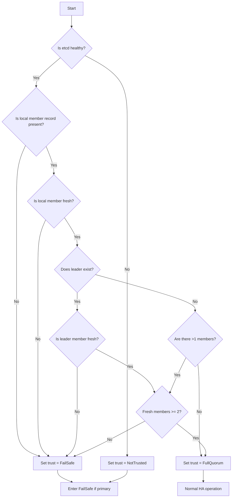
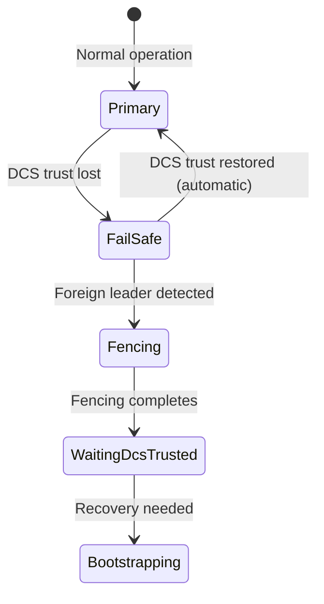

# Handle a Network Partition

This guide shows you how to detect, monitor, and recover from network partitions in a pgtuskmaster cluster without causing a split-brain.

## Detect a Partition

### Step 1: Check DCS Trust State on All Nodes

Run on every node to detect trust loss:

```bash
pgtuskmasterctl ha state --format=json | jq '.dcs_trust'
```

Expected outputs:
- `full_quorum` - Node has full DCS connectivity
- `fail_safe` - Node lost trust but store is reachable
- `not_trusted` - Node cannot reach DCS store

A partition exists if any node reports `fail_safe` or `not_trusted`.

### Step 2: Check HA Phase Distribution

Fetch the HA phase from each node:

```bash
for node in node-a node-b node-c; do
  echo -n "$node: "
  curl -s http://${node}:8080/ha/state | jq '.ha_phase'
done
```

During a partition you will see:
```
node-a: "FailSafe"
node-b: "Primary"
node-c: "Replica"
```

Primary nodes in `FailSafe` stop accepting writes. This is the intended safety response.

### Step 3: Verify No Split-Brain

Check that only one node believes it is primary:

```bash
count=0
for node in node-a node-b node-c; do
  phase=$(curl -s http://${node}:8080/ha/state | jq -r '.ha_phase')
  if [ "$phase" = "Primary" ]; then
    count=$((count + 1))
  fi
done
echo "Primary count: $count"
```

The result must be `1`. If you see `2` or more, this indicates a critical bug.

## Understand Partition Behavior

### Trust Evaluation Logic



Freshness is calculated as `now - updated_at <= lease_ttl_ms`. The default `lease_ttl_ms` is `10000` (10 seconds).

### Primary Node State Transition



When a primary loses DCS trust:
- It enters `FailSafe` phase
- It keeps its leader lease (does not release)
- It stops accepting new writes
- It continues heartbeating locally

### Replica Node State Transition

Replicas in a partition:
- Enter `FailSafe` if they lose DCS trust
- Stay in `FailSafe` until trust returns
- Do not attempt promotion while in `FailSafe`
- Maintain existing replication connections

## Monitor Partition Impact

### Check PostgreSQL Status

On each node verify PostgreSQL state:

```bash
pgtuskmasterctl node status | jq '.postgres.sql_status'
```

Possible values:
- `Healthy` - PostgreSQL is reachable
- `Unreachable` - PostgreSQL is down or isolated

### Monitor Write Availability

Attempt a write on the primary:

```sql
CREATE TABLE IF NOT EXISTS health_check (t timestamptz);
INSERT INTO health_check VALUES (now());
```

If the primary is in `FailSafe`, the `INSERT` will fail because the HA layer prevents writes.

### Watch Logs for Trust Transitions

```bash
journalctl -u pgtuskmaster -f | grep "dcs trust transition"
```

You should see events like:

```
{"level":"info","msg":"dcs trust transition","trust_prev":"full_quorum","trust_next":"fail_safe"}
{"level":"info","msg":"dcs trust transition","trust_prev":"fail_safe","trust_next":"full_quorum"}
```

## Recover from a Partition

### Step 1: Restore Network Connectivity

Fix the underlying network issue:
- Reconnect failed network links
- Restart failed etcd members
- Resolve DNS issues
- Clear firewall rules blocking traffic

### Step 2: Wait for Automatic Trust Recovery

The system automatically recovers when:
- Etcd becomes reachable
- Member records become fresh
- Sufficient nodes are visible

Monitor trust restoration:

```bash
watch -n 1 "pgtuskmasterctl ha state --format=json | jq '.dcs_trust'"
```

Trust returns to `full_quorum` within one to two `lease_ttl_ms` intervals (10-20 seconds by default).

### Step 3: Verify Leader Stability

Wait for a stable primary:

```bash
pgtuskmasterctl ha state --format=json | jq '.leader_id'
```

Poll repeatedly until the same leader appears for 5 consecutive checks:

```bash
for i in {1..5}; do
  leader=$(pgtuskmasterctl ha state --format=json | jq -r '.leader_id')
  echo "Check $i: leader=$leader"
  sleep 2
done
```

If leader flaps, check logs for `ForeignLeaderDetected` events.

### Step 4: Verify Replication Convergence

On the primary insert a test record:

```sql
CREATE TABLE IF NOT EXISTS recovery_check (id int, t timestamptz);
INSERT INTO recovery_check VALUES (1, now());
```

On each replica verify replication:

```bash
for replica in node-b node-c; do
  echo -n "$replica: "
  psql -h $replica -c "SELECT count(*) FROM recovery_check"
done
```

All replicas should show `1` within `lease_ttl_ms` * 2.

### Step 5: Confirm No Data Loss

On the primary check the latest WAL LSN:

```bash
psql -c "SELECT pg_current_wal_lsn()"
```

On each replica check replay LSN:

```bash
psql -c "SELECT pg_last_wal_replay_lsn()"
```

The replica LSNs should be close to the primary LSN (within a few MB).

## Common Partition Scenarios

### Scenario: Single Node Isolated from etcd

**Detection:**
```bash
# On isolated node
pgtuskmasterctl ha state --format=json | jq '.dcs_trust'  # shows "fail_safe"
```

**Behavior:**
- Node enters `FailSafe` within 10-20 seconds
- No split-brain occurs
- No manual intervention needed

**Recovery:**
1. Restore etcd connectivity
2. Wait 10-20 seconds
3. Verify `dcs_trust` returns to `full_quorum`

### Scenario: Primary Isolated from etcd Majority

**Detection:**
```bash
# On isolated primary
pgtuskmasterctl ha state --format=json | jq '.dcs_trust'  # "fail_safe"
pgtuskmasterctl ha state --format=json | jq '.ha_phase'    # "FailSafe"
```

**Behavior:**
- Primary stops accepting writes
- Replicas continue following the last known leader
- New leader election does not occur until the old primary is confirmed down

**Recovery:**
1. Heal the partition
2. The old primary will either:
   - Resume as primary if still leader
   - Rewind and rejoin as replica if a new leader was promoted
3. Check `ha_decision` for `Rewind` or `RecoveryStrategy` actions

## Verification Checklist

After recovery, confirm:

- [ ] All nodes report `dcs_trust = full_quorum`
- [ ] All nodes agree on a single leader
- [ ] Only one node reports `ha_phase = Primary`
- [ ] No node reports `ha_phase = FailSafe`
- [ ] All replicas report `ha_phase = Replica`
- [ ] All replicas have replayed recent WAL
- [ ] No `dual primary` errors in logs

If any check fails, collect logs and reach out to support.
