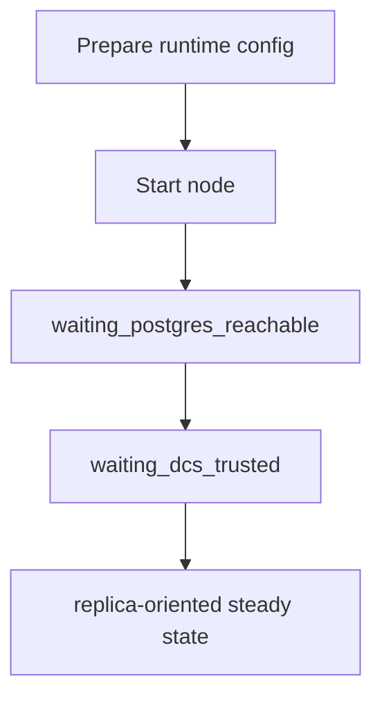
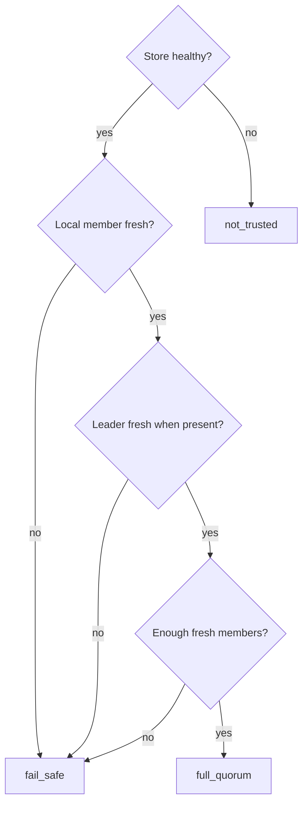
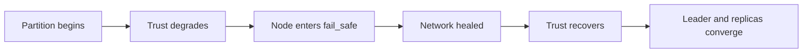
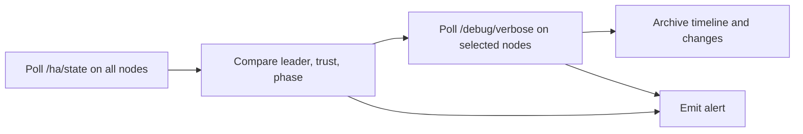
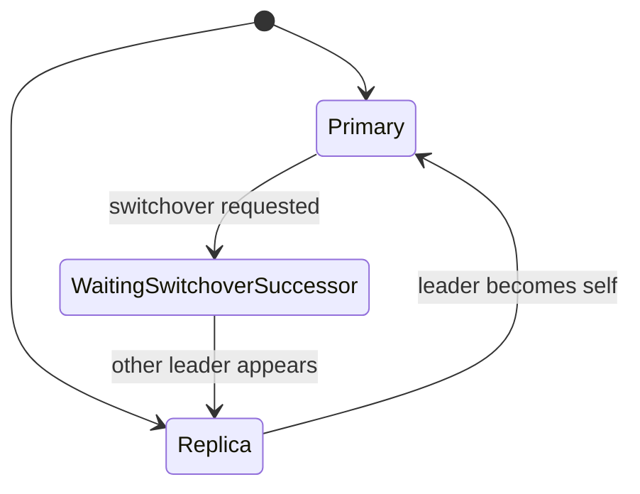

Write exactly one Markdown page for docs/src/how-to/overview.md.

Requirements:
- This page is the chapter overview for the How-To Guides section of the mdBook docs.
- It must introduce what belongs in this chapter according to the Diataxis context below.
- It must act as a navigation hub that links to the actual pages in this chapter.
- Keep claims grounded in the provided raw context only.
- Use relative links appropriate for docs/src/how-to/overview.md.
- Do not write any text outside the page body.

Current docs tree:
docs/src/SUMMARY.md
docs/src/explanation/architecture.md
docs/src/explanation/failure-modes.md
docs/src/explanation/ha-decision-engine.md
docs/src/explanation/introduction.md
docs/src/how-to/add-cluster-node.md
docs/src/how-to/bootstrap-cluster.md
docs/src/how-to/check-cluster-health.md
docs/src/how-to/configure-tls-security.md
docs/src/how-to/configure-tls.md
docs/src/how-to/debug-cluster-issues.md
docs/src/how-to/handle-network-partition.md
docs/src/how-to/handle-primary-failure.md
docs/src/how-to/monitor-via-metrics.md
docs/src/how-to/perform-switchover.md
docs/src/how-to/remove-cluster-node.md
docs/src/how-to/run-tests.md
docs/src/reference/dcs-state-model.md
docs/src/reference/debug-api.md
docs/src/reference/ha-decisions.md
docs/src/reference/http-api.md
docs/src/reference/pgtuskmaster-cli.md
docs/src/reference/pgtuskmasterctl-cli.md
docs/src/reference/runtime-configuration.md
docs/src/tutorial/debug-api-usage.md
docs/src/tutorial/first-ha-cluster.md
docs/src/tutorial/observing-failover.md
docs/src/tutorial/single-node-setup.md

Current SUMMARY.md:
# Summary

# Tutorials
- [Tutorials]()
    - [First HA Cluster](tutorial/first-ha-cluster.md)
    - [Single-Node Setup](tutorial/single-node-setup.md)
    - [Observing a Failover Event](tutorial/observing-failover.md)
    - [Debug API Usage](tutorial/debug-api-usage.md)

# How-To

- [How-To]()
    - [Bootstrap a New Cluster from Zero State](how-to/bootstrap-cluster.md)
    - [Check Cluster Health](how-to/check-cluster-health.md)
    - [Add a Cluster Node](how-to/add-cluster-node.md)
    - [Configure TLS](how-to/configure-tls.md)
    - [Configure TLS Security](how-to/configure-tls-security.md)
    - [Debug Cluster Issues](how-to/debug-cluster-issues.md)
    - [Handle a Network Partition](how-to/handle-network-partition.md)
    - [Handle Primary Failure](how-to/handle-primary-failure.md)
    - [Monitor via API and CLI Signals](how-to/monitor-via-metrics.md)
    - [Remove a Cluster Node](how-to/remove-cluster-node.md)
    - [Perform a Planned Switchover](how-to/perform-switchover.md)
    - [Run The Test Suite](how-to/run-tests.md)

# Explanation

- [Explanation]()
    - [Introduction](explanation/introduction.md)
    - [Architecture](explanation/architecture.md)
    - [Failure Modes and Recovery Behavior](explanation/failure-modes.md)
    - [HA Decision Engine](explanation/ha-decision-engine.md)

# Reference

- [Reference]()
    - [HTTP API](reference/http-api.md)
    - [HA Decisions](reference/ha-decisions.md)
    - [Debug API](reference/debug-api.md)
    - [DCS State Model](reference/dcs-state-model.md)
    - [pgtuskmaster CLI](reference/pgtuskmaster-cli.md)
    - [pgtuskmasterctl CLI](reference/pgtuskmasterctl-cli.md)
    - [Runtime Configuration](reference/runtime-configuration.md)

Pages in docs/src/how-to/:

===== docs/src/how-to/add-cluster-node.md =====
# Add a Cluster Node

This guide shows how to add a new node to an existing cluster and verify that it joins safely.

## Goal

Bring up a new node that:

- uses the same cluster identity and DCS scope as the existing cluster
- publishes its own member record
- converges into expected replica behavior when a healthy primary already exists

## Prerequisites

- a running cluster with a known `cluster.name` and `dcs.scope`
- PostgreSQL 16 binaries installed on the new node
- valid runtime-config paths for PostgreSQL data, socket, and logs
- network reachability to the cluster's DCS endpoints
- network reachability to the relevant PostgreSQL endpoints in the cluster

## Step 1: Prepare a runtime config for the new node

Use an existing runtime config as your starting point and change the node-specific identity and addresses.

The docker example at `docker/configs/cluster/node-a/runtime.toml` shows the full shape.

Fields that must be correct for the new node:

- `cluster.name`
- `cluster.member_id`
- `postgres.listen_host`
- `postgres.listen_port`
- `dcs.endpoints`
- `dcs.scope`
- `process.binaries.*`
- `api.listen_addr`

The new node must use:

- the same `cluster.name` as the rest of the cluster
- a unique `cluster.member_id`
- the same DCS scope and endpoints as the rest of the cluster

## Step 2: Check connectivity before you start it

Before starting the new node, verify:

- it can reach the configured DCS endpoints
- the relevant PostgreSQL listen address and port are reachable in your environment

The DCS member model includes `postgres_host` and `postgres_port`, so PostgreSQL network reachability is part of normal follow and recovery behavior.

## Step 3: Start the node with the prepared config

Start pgtuskmaster using your normal service method for this environment.

The node starts from the HA phase machine defined in the runtime:

- `init`
- `waiting_postgres_reachable`
- `waiting_dcs_trusted`

From there, the next phase depends on the observed world state.

## Step 4: Watch the node's HA state

Poll the new node directly:

```bash
curl --fail --silent http://127.0.0.1:8080/ha/state | jq .
```

Or use the CLI:

```bash
pgtuskmasterctl --base-url http://127.0.0.1:8080 --output json ha state
```

Watch these fields:

- `self_member_id`
- `leader`
- `member_count`
- `dcs_trust`
- `ha_phase`
- `ha_decision`

When a healthy primary already exists, the usual steady-state goal is replica behavior rather than leadership.

## Step 5: Verify that the node is joining the existing topology

For a normal join into a healthy cluster, look for:

- trusted DCS state
- a visible leader
- the new node settling into replica-oriented behavior

In practice that means:

- `dcs_trust` reaches `full_quorum`
- `leader` is populated and agrees with the rest of the cluster
- `ha_phase` stops moving through startup transitions
- `ha_decision` stops showing startup or recovery churn

If you also inspect DCS directly with your environment's store tooling, look for the new node's member record under the cluster scope. The internal member record model includes:

- `member_id`
- `postgres_host`
- `postgres_port`
- `role`
- `sql`
- `readiness`
- `timeline`
- WAL position fields

## Step 6: Verify the node behaves like a replica

Use PostgreSQL-level checks that fit your environment to confirm the new node is following the current primary.

The exact SQL and access path depend on your deployment, but the goal is:

- the new node is not acting as a second primary
- the new node can follow the current leader
- fresh writes on the primary become visible after replication catches up

## Step 7: Compare more than one node before you declare success

Sample `GET /ha/state` on multiple nodes:

```bash
for node in node-a node-b node-c; do
  curl --fail --silent "http://${node}:8080/ha/state" | jq -r '"\(.self_member_id) leader=\(.leader // "none") trust=\(.dcs_trust) phase=\(.ha_phase) decision=\(.ha_decision.kind)"'
done
```

You want:

- agreement on the same leader
- no sustained dual-primary evidence
- no node stuck in `fail_safe`
- the new node no longer bouncing through startup transitions

## Troubleshooting

### The node stays in `waiting_postgres_reachable`

Check:

- local PostgreSQL startup
- `process.binaries.*`
- PostgreSQL data, socket, and log paths

### The node stays in `waiting_dcs_trusted` or enters `fail_safe`

Check:

- DCS endpoint reachability
- DCS scope correctness
- whether the node can publish fresh membership

### The node attempts leadership unexpectedly

Check:

- whether the existing primary is still visible and healthy
- whether the cluster is suffering a trust or freshness problem
- whether the new node was started against the correct scope and endpoints

## Diagram



===== docs/src/how-to/bootstrap-cluster.md =====
# Bootstrap a New Cluster from Zero State

This guide shows you how to bootstrap a new PostgreSQL high-availability cluster from zero state using a single initiating node.

## Goal

You will establish a new cluster scope in your distributed coordination service (etcd), elect an initial primary, and prepare the environment for subsequent replica nodes to join.

## Prerequisites

- Running etcd cluster accessible from all intended cluster members
- PostgreSQL 16 binaries installed on each node
- Runtime configuration file (TOML) for the bootstrap node with complete [postgres], [dcs], [ha], and [process] sections
- Network connectivity between nodes on PostgreSQL and API ports

## Configure DCS Init Payload

Provide the DCS initialization payload in your runtime configuration. The schema supports `dcs.init = { payload_json, write_on_bootstrap }`, and the HA startup harness uses that payload to materialize both `/{scope}/init` and `/{scope}/config` during first-node bootstrap.

Two details matter:

- `payload_json` must carry a complete runtime configuration snapshot
- the stored config sets `dcs.init` to `null`, so the configuration written into DCS does not recursively contain another bootstrap-init stanza

## Start the Bootstrap Node

Launch the first node with your configuration file and wait for HA to move through its startup phases.

The node enters the following state sequence:

1. **Init** - Worker starts with no prior state
2. **WaitingPostgresReachable** - Attempts to start PostgreSQL if not running
3. **WaitingDcsTrusted** - Monitors etcd health and member freshness

## Wait for Primary Election

Monitor the node's API endpoint for phase progression. The node will transition to **Primary** phase when:

- DCS trust evaluates to FullQuorum
- No other active leader lease exists
- Local PostgreSQL is healthy or can be promoted

The election uses create-if-absent semantics for the `/{scope}/leader` key. The HA observer in the test suite also treats more than one primary as split-brain and fails immediately when it samples that condition.

## Verify DCS Bootstrap Completion

Confirm successful bootstrap by checking etcd contents:

1. `/{scope}/init` exists with non-empty value
2. `/{scope}/config` exists and matches your `payload_json` exactly
3. `/{scope}/leader` contains your bootstrap node's member ID
4. `/{scope}/member/{member_id}` exists for your node

The bootstrap node publishes its member record including PostgreSQL host, port, role, and timeline information.

## Provision Replication Roles

Before starting additional nodes, create the replication roles on the elected primary. The replicator role requires `LOGIN REPLICATION` privileges. The rewinder role requires `LOGIN SUPERUSER` privileges for `pg_rewind` operations.

After the first node becomes primary, provision the replication roles on that primary before you start later nodes. The harness requires:

- a replicator role with `LOGIN REPLICATION`
- a rewinder role with `LOGIN SUPERUSER`

These credentials must match the PostgreSQL role settings in your runtime configuration.

## Deploy Subsequent Nodes

For each additional node:

1. Update `cluster.member_id` in the runtime configuration
2. Configure `[postgres]` with unique `listen_port` and data directory
3. Keep `[dcs]` endpoints and scope identical to bootstrap node
4. Do not include `[dcs.init]` section

When started, nodes automatically:
- Detect the existing primary from DCS member records
- Transition to **Replica** phase
- Follow the active leader using streaming replication
- Publish their own member records for health monitoring

**join behavior**: A node observing a healthy primary member record in DCS will follow that primary without attempting leadership, even if no explicit leader lease exists.

## Troubleshooting

### Bootstrap Node Stays in WaitingPostgresReachable

- Check PostgreSQL logs for startup failures
- Verify `postgres.listen_host` and `listen_port` are not in use
- Confirm `[process.binaries]` paths point to valid PostgreSQL executables

### Bootstrap Node Enters FailSafe

- Verify etcd cluster health: DCS trust becomes `NotTrusted` if etcd is unreachable
- Check member record freshness: ensure system clocks are synchronized
- In multi-member setups, ensure at least two members remain fresh within `lease_ttl_ms`

### Duplicate Primary Detected

If two nodes appear primary at the same time, treat that as a split-brain signal. The HA observer used in tests fails immediately when API or SQL sampling sees more than one primary, and the HA state machine includes fencing paths for foreign-leader detection.

### Subsequent Node Fails to Join

- Confirm replication roles exist on primary with correct passwords
- Verify `rewind_conn_identity` points to a superuser role
- Check DCS member records show primary as healthy
- Review `pg_hba.conf` on primary allows replication connections from new node

===== docs/src/how-to/check-cluster-health.md =====
# How to check cluster health

This guide shows you how to inspect the runtime health of a PGTuskMaster cluster using the administrative CLI.

## Prerequisites

- The `pgtuskmasterctl` CLI is available to run.
- At least one cluster node is running with an accessible API endpoint.
- You know the base URL for the node you want to inspect. The CLI default is `http://127.0.0.1:8080`.

## Inspect current HA state

Run the HA state command against a node:

```bash
pgtuskmasterctl ha state
```

For a specific node or non-default port:

```bash
pgtuskmasterctl --base-url http://127.0.0.1:18081 ha state
```

## Choose output format

The CLI supports two output formats:

- `--output json` for machine-readable output. This is the default.
- `--output text` for newline-delimited key-value output.

Examples:

```bash
pgtuskmasterctl --output json ha state
```

```bash
pgtuskmasterctl --output text ha state
```

## Interpret the output

The `ha state` response includes these fields:

- `cluster_name`: cluster name from runtime configuration.
- `scope`: DCS scope for the cluster.
- `self_member_id`: member ID of the node you queried.
- `leader`: current leader member ID, or `<none>` in text output when no leader is present.
- `switchover_requested_by`: member ID that requested a switchover, or `<none>` in text output when no request is present.
- `member_count`: count of cached DCS members in the API response.
- `dcs_trust`: DCS trust state. The response values are `full_quorum`, `fail_safe`, and `not_trusted`.
- `ha_phase`: current HA phase such as `primary`, `replica`, `candidate_leader`, `rewinding`, `fencing`, or another transition phase.
- `ha_tick`: current HA worker tick.
- `ha_decision`: current HA decision such as `no_change`, `follow_leader(...)`, `become_primary(...)`, or another decision variant.
- `snapshot_sequence`: sequence number of the system snapshot behind the response.

## Check more than one node

A single successful request only tells you about one node. For cluster-level checks, run `ha state` against multiple nodes and compare:

- whether they agree on the same `leader`
- whether more than one node reports `ha_phase=primary`
- whether `member_count` is consistent
- whether any node reports degraded `dcs_trust`
- whether nodes are stuck in transition phases instead of stabilizing

The HA observer support used in tests treats multiple primaries as a split-brain condition and also treats too little successful sampling as insufficient evidence. That is a useful model for operator checks: sample repeatedly and compare nodes rather than trusting one snapshot.

## Troubleshoot connectivity

If the CLI reports a `transport error`, verify:

- the base URL is correct and reachable
- the node API is listening on the configured port
- network access from the host running `pgtuskmasterctl`

In this documentation cycle, the command below failed with a transport error because no responsive API was reachable at `127.0.0.1:18081` at the time of capture:

```bash
pgtuskmasterctl --base-url http://127.0.0.1:18081 --output json ha state
```

## Text output shape

The text formatter emits newline-delimited key-value lines in this order:

```text
cluster_name=...
scope=...
self_member_id=...
leader=...
switchover_requested_by=...
member_count=...
dcs_trust=...
ha_phase=...
ha_tick=...
ha_decision=...
snapshot_sequence=...
```

That shape is reconstructed from the CLI formatter source. No successful runtime `ha state` response was captured during this documentation cycle.

===== docs/src/how-to/configure-tls-security.md =====
# Configure TLS Security

This guide focuses on the security posture around TLS-enabled deployments. Use it after you understand the basic enablement steps in [Configure TLS](configure-tls.md).

The runtime has two separate security layers:

- transport security through TLS
- request authorization through API role tokens

They are independent. You can enable one without the other, but production deployments usually need both.

## Goal

Harden a node so that:

- the API is served over TLS
- PostgreSQL traffic can be protected with TLS
- API callers are authenticated with the right bearer token
- optional client certificate verification is enabled only when you have the required CA material

## Decide What You Are Protecting

The runtime exposes two very different surfaces:

- `api.security.tls` protects the HTTP control plane
- `postgres.tls` protects the PostgreSQL server side

Think about them separately during rollout:

- API TLS protects operator traffic such as `/ha/state`, `/switchover`, and debug endpoints.
- PostgreSQL TLS protects database client and replication traffic.

## Harden The API Surface

Start from an API security block that enables TLS and authorization together:

```toml
[api]
listen_addr = "0.0.0.0:8080"
security = { tls = { mode = "required", identity = { cert_chain = { path = "/etc/pgtuskmaster/tls/api-chain.pem" }, private_key = { path = "/etc/pgtuskmaster/tls/api-key.pem" } } }, auth = { type = "role_tokens", read_token = "read-secret", admin_token = "admin-secret" } }
```

The role split matters operationally:

- `read_token` is enough for observation endpoints such as `/ha/state`
- `admin_token` is required for write operations such as `POST /switchover` and `DELETE /ha/switchover`

If `read_token` is absent but `admin_token` is present, the admin token still authorizes reads.

## Decide Whether To Require Client Certificates

The TLS schema supports optional client certificate verification:

```toml
security = { tls = { mode = "required", identity = { cert_chain = { path = "/etc/pgtuskmaster/tls/api-chain.pem" }, private_key = { path = "/etc/pgtuskmaster/tls/api-key.pem" } }, client_auth = { client_ca = { path = "/etc/pgtuskmaster/tls/client-ca.pem" }, require_client_cert = true } }, auth = { type = "role_tokens", read_token = "read-secret", admin_token = "admin-secret" } }
```

Use `require_client_cert = true` only when every intended client has a certificate chain rooted in the configured CA bundle.

Use `require_client_cert = false` if you want the server to validate presented client certificates without making them mandatory for every caller.

## Harden PostgreSQL Transport

For PostgreSQL, the runtime schema supports the same TLS shape:

```toml
[postgres]
local_conn_identity = { user = "postgres", dbname = "postgres", ssl_mode = "require" }
rewind_conn_identity = { user = "postgres", dbname = "postgres", ssl_mode = "require" }
tls = { mode = "required", identity = { cert_chain = { path = "/etc/pgtuskmaster/tls/postgres-chain.pem" }, private_key = { path = "/etc/pgtuskmaster/tls/postgres-key.pem" } } }
```

Security-sensitive points to verify:

- the runtime can read the configured key material
- connection identities use a TLS-capable `ssl_mode`
- replication and rewind paths are updated alongside ordinary SQL clients

## Verify Authorization After Enabling TLS

Query a read endpoint with the read token:

```bash
curl --fail --silent \
  -H "Authorization: Bearer $PGTUSKMASTER_READ_TOKEN" \
  https://127.0.0.1:8080/ha/state
```

Try an admin operation with the admin token:

```bash
pgtuskmasterctl \
  --base-url https://127.0.0.1:8080 \
  --admin-token "$PGTUSKMASTER_ADMIN_TOKEN" \
  ha switchover request \
  --requested-by node-a
```

That verifies both layers at once:

- the transport accepts HTTPS
- the API enforces admin-vs-read privileges correctly

## Keep The Layers Mentally Separate

When a request fails, ask which layer failed:

- TLS handshake problem: certs, keys, CA bundle, or TLS mode
- HTTP `401 Unauthorized`: missing or invalid bearer token
- HTTP `403 Forbidden`: valid token for the wrong role
- application-level `503` or other runtime errors: the request reached the application, but the underlying operation failed

This distinction matters because bearer-token failures are not evidence that TLS is misconfigured, and TLS handshake failures are not evidence that role-token auth is broken.

## Troubleshooting

### API starts, but every request is rejected

Check the `Authorization: Bearer ...` header first. If role tokens are enabled, the API rejects unauthenticated requests even when TLS itself is working.

### HTTPS works, but admin operations fail

Confirm you are using the admin token, not a read-only token. Read-role access is not enough for switchover endpoints.

### Enabling client certificate verification locks out clients

Check the configured `client_ca` bundle and whether the callers actually present certificates rooted in that CA. If you are still migrating clients, use optional verification instead of mandatory client certs.

### PostgreSQL traffic still appears to be plaintext

Check whether the deployment is still on `mode = "optional"` or whether clients are still connecting with a non-TLS `sslmode`.

===== docs/src/how-to/configure-tls.md =====
# Configure TLS

This guide shows how to turn the runtime's TLS knobs into an actual deployment procedure.

The important starting point is that the shipped Docker cluster configs currently keep both `postgres.tls.mode` and `api.security.tls.mode` set to `disabled`. This guide therefore describes how to adapt a deployment for TLS; it is not a claim that the checked-in cluster example already runs with TLS enabled.

## Goal

Enable TLS for one or both of these server surfaces:

- the pgtuskmaster HTTP API
- the managed PostgreSQL server

## What The Schema Supports

The runtime schema defines the same TLS shape for both servers:

```toml
tls = { mode = "disabled" }
tls = { mode = "optional", identity = { cert_chain = { path = "/path/to/chain.pem" }, private_key = { path = "/path/to/key.pem" } } }
tls = { mode = "required", identity = { cert_chain = { path = "/path/to/chain.pem" }, private_key = { path = "/path/to/key.pem" } } }
```

When `mode` is `optional` or `required`, the runtime expects:

- `identity.cert_chain`
- `identity.private_key`

If `client_auth` is configured, it also expects:

- `client_auth.client_ca`
- `client_auth.require_client_cert`

If those values are missing, the TLS loader rejects the config during startup.

## Choose The Rollout Shape

Use `mode = "optional"` when you need a staged rollout and still have clients that connect without TLS.

Use `mode = "required"` when all clients are ready to connect with TLS and you want the server surface to reject plaintext traffic.

## Enable API TLS

Update the `api.security` block:

```toml
[api]
listen_addr = "0.0.0.0:8080"
security = { tls = { mode = "required", identity = { cert_chain = { path = "/etc/pgtuskmaster/tls/api-chain.pem" }, private_key = { path = "/etc/pgtuskmaster/tls/api-key.pem" } } }, auth = { type = "disabled" } }
```

If you want client certificate verification, add `client_auth`:

```toml
[api]
listen_addr = "0.0.0.0:8080"
security = { tls = { mode = "required", identity = { cert_chain = { path = "/etc/pgtuskmaster/tls/api-chain.pem" }, private_key = { path = "/etc/pgtuskmaster/tls/api-key.pem" } }, client_auth = { client_ca = { path = "/etc/pgtuskmaster/tls/client-ca.pem" }, require_client_cert = true } }, auth = { type = "disabled" } }
```

## Enable PostgreSQL TLS

Update the PostgreSQL block:

```toml
[postgres]
data_dir = "/var/lib/postgresql/data"
listen_host = "node-a"
listen_port = 5432
socket_dir = "/var/lib/pgtuskmaster/socket"
log_file = "/var/log/pgtuskmaster/postgres.log"
local_conn_identity = { user = "postgres", dbname = "postgres", ssl_mode = "require" }
rewind_conn_identity = { user = "postgres", dbname = "postgres", ssl_mode = "require" }
tls = { mode = "required", identity = { cert_chain = { path = "/etc/pgtuskmaster/tls/postgres-chain.pem" }, private_key = { path = "/etc/pgtuskmaster/tls/postgres-key.pem" } } }
pg_hba = { source = { path = "/etc/pgtuskmaster/pg_hba.conf" } }
pg_ident = { source = { path = "/etc/pgtuskmaster/pg_ident.conf" } }
```

Two details matter here:

- `local_conn_identity.ssl_mode` and `rewind_conn_identity.ssl_mode` must match the fact that the server now expects TLS-capable connections.
- If `postgres.tls.mode` stays `disabled`, the runtime rejects TLS-required client modes such as `require`, `verify_ca`, or `verify_full`.

## Put The Certificate Material In Place

The repository does not currently ship a dedicated certificate-generation workflow or checked-in certificate assets. Treat certificate generation and secret distribution as deployment-specific work.

Before restarting nodes, make sure every configured path exists on disk and is readable by the runtime:

- API server cert chain and private key
- PostgreSQL server cert chain and private key
- optional client CA bundle for mutual TLS

## Roll Out The Config

Apply the updated runtime config and TLS files to each node, then restart the runtime in a controlled sequence.

For a staged rollout:

1. Deploy cert/key files to every node.
2. Change the target surface to `mode = "optional"`.
3. Restart the node.
4. Update clients to use TLS.
5. Once all clients are migrated, change `mode = "required"`.

For an all-at-once rollout:

1. Stop client traffic or schedule a maintenance window.
2. Deploy cert/key files and config changes.
3. Restart the nodes.
4. Verify clients reconnect with TLS.

## Verify API TLS

Once API TLS is enabled, query an endpoint over HTTPS:

```bash
curl --fail --silent https://127.0.0.1:8080/ha/state
```

If the certificate is not yet trusted by your local client environment, add the appropriate CA configuration for your environment rather than assuming insecure verification is acceptable as a steady state.

If API bearer tokens are enabled, include the required header as usual. TLS and bearer-token auth are separate controls.

## Verify PostgreSQL TLS

Once PostgreSQL TLS is enabled, connect with a client mode that requires TLS:

```bash
psql "host=node-a port=5432 user=postgres dbname=postgres sslmode=require"
```

The exact client certificate flags depend on your deployment and are not prescribed by the repository, but the important validation point is that plaintext connections should no longer be the only successful path once you have switched clients over.

## Troubleshooting

### Startup fails immediately after enabling TLS

Check the configured paths first. The TLS loader fails startup if `mode` requires TLS but `identity` is missing or unreadable, or if the PEM files cannot be parsed.

### API still serves plaintext traffic

Check whether you left `api.security.tls.mode = "optional"`. Optional mode is useful for migration, but it is not an enforcement mode.

### PostgreSQL clients fail after the change

Confirm that:

- the server-side TLS files exist on the node
- client connection strings now request TLS
- `local_conn_identity` and `rewind_conn_identity` use an `ssl_mode` compatible with the server mode

### Mutual TLS rejects clients unexpectedly

Check `client_auth.require_client_cert` and the configured `client_ca` path. The runtime uses the supplied CA bundle to build the client certificate verifier.

===== docs/src/how-to/debug-cluster-issues.md =====
# Debug Cluster Issues

This guide shows how to investigate cluster incidents with the observation surfaces the runtime already exposes.

Use it when the cluster is unhealthy, a node is stuck in the wrong phase, or you need to understand why HA decisions changed.

## Goal

Answer four questions quickly:

1. What does the node think the cluster looks like?
2. Does it trust that cluster view enough to act?
3. What HA phase and decision is it currently in?
4. What changed immediately before the incident?

## Prerequisites

- the node has `[debug] enabled = true`
- you can reach the node's API port
- you have `curl` or another HTTP client

## Step 1: Read `/ha/state` First

Start with the lightweight cluster summary:

```bash
curl --fail --silent http://node-a:8080/ha/state
```

Focus on these fields first:

- `leader`
- `member_count`
- `dcs_trust`
- `ha_phase`
- `ha_decision`
- `switchover_requested_by`

These values tell you whether the node sees a healthy leader, whether DCS is trusted, and whether it is waiting, following, promoting, rewinding, fencing, or in fail-safe behavior.

## Step 2: Interpret `dcs_trust`

The DCS worker classifies trust into three states:

- `full_quorum`
- `fail_safe`
- `not_trusted`

Read them as follows.

### `full_quorum`

The node has enough fresh DCS information to behave normally.

### `fail_safe`

etcd is reachable, but the node does not have a safe-enough cluster view for ordinary leadership behavior. In source terms, this can happen when:

- the local member record is missing
- the local or leader record is stale
- there are too few fresh members for the current cluster view

### `not_trusted`

etcd itself is unhealthy or unreachable, so the node does not trust DCS state at all.

## Step 3: Inspect `/debug/verbose`

Use the verbose endpoint when `/ha/state` is not enough:

```bash
curl --fail --silent http://node-a:8080/debug/verbose
```

For repeated polling during an incident, narrow the response with a sequence cursor:

```bash
curl --fail --silent "http://node-a:8080/debug/verbose?since=42"
```

The verbose payload is organized into sections that map directly to the runtime:

- `config`
- `pginfo`
- `dcs`
- `process`
- `ha`
- `api`
- `debug`
- `changes`
- `timeline`

## Step 4: Read The Most Useful Sections

### `pginfo`

Use this section to answer whether PostgreSQL is actually reachable and what role it appears to be in.

Important fields:

- `variant`
- `sql`
- `readiness`
- `timeline`
- `summary`

If `sql` is unhealthy or unknown, start treating the incident as a PostgreSQL reachability or readiness problem, not only as an HA logic problem.

### `dcs`

Use this section to confirm the cluster view:

- `trust`
- `member_count`
- `leader`
- `has_switchover_request`

If `trust` is degraded, fix that before expecting normal promotions or switchovers.

### `ha`

This section explains what the decision engine is doing:

- `phase`
- `tick`
- `decision`
- `decision_detail`
- `planned_actions`

The decision labels come from the HA decision engine and include values such as:

- `wait_for_postgres`
- `wait_for_dcs_trust`
- `attempt_leadership`
- `follow_leader`
- `become_primary`
- `step_down`
- `recover_replica`
- `fence_node`
- `release_leader_lease`
- `enter_fail_safe`

### `process`

When the runtime is actively doing work, this section tells you whether the process worker is currently running a job or whether the last job ended in success, failure, or timeout.

## Step 5: Use `timeline` And `changes` To Reconstruct The Incident

The `timeline` section is the most useful place to read the story of the incident in order.

Use it to answer:

- when trust degraded
- when PostgreSQL became reachable or unreachable
- when a promotion or step-down decision appeared
- whether a fencing or recovery path started

The `changes` section is complementary: it shows which domain changed version and when.

## Common Investigation Patterns

### The node never leaves a waiting phase

Check these in order:

1. `pginfo.sql`
2. `dcs.trust`
3. `ha.decision`
4. `process.state` and `last_outcome`

That sequence tells you whether the blocker is database reachability, DCS trust, decision logic, or an already-failed background job.

### The cluster is stuck in fail-safe behavior

Check:

- etcd health
- member freshness
- whether the local node is present in the DCS cache
- whether the recorded leader is stale

`fail_safe` means the node still has some DCS visibility, but not enough to behave as if the cluster view were fully trustworthy.

### You suspect a split-brain or dual-primary window

Query `/ha/state` on more than one node and compare the answers. The HA test observer treats more than one sampled primary as a split-brain signal, and that is the right operational mindset as well.

At the same time, inspect `timeline` and `changes` to see whether the cluster was stepping down, fencing, or recovering around the same moment.

### A switchover request seems stuck

Check:

- `switchover_requested_by`
- `dcs_trust`
- `ha_phase`
- `ha_decision`
- `leader`

If DCS trust is degraded, fix that before expecting the switchover to complete normally.

## Next Step

Once you understand the immediate failure mode, move to the relevant operator action:

- trust problem: restore etcd reachability or freshness
- PostgreSQL problem: inspect PostgreSQL process status and logs
- leadership transition problem: keep sampling `/ha/state` and `debug/verbose` while the node converges or fails

===== docs/src/how-to/handle-network-partition.md =====
# Handle a Network Partition

This guide shows how to detect, monitor, and recover from a network partition using the runtime surfaces that pgtuskmaster already exposes.

## Goal

Determine:

- whether trust has degraded
- whether the nodes still agree on a single leader
- whether the cluster has converged again after the fault is healed

## Prerequisites

- access to the API listener on each node
- `curl` and `jq`
- optional: `pgtuskmasterctl`

## Step 1: Check trust on every node

Start with `GET /ha/state`.

```bash
for node in node-a node-b node-c; do
  curl --fail --silent "http://${node}:8080/ha/state" | jq -r '"\(.self_member_id) trust=\(.dcs_trust) phase=\(.ha_phase)"'
done
```

Trust values are:

- `full_quorum`
- `fail_safe`
- `not_trusted`

Operationally:

- `full_quorum` means the node has a fresh enough cluster view for normal HA behavior
- `fail_safe` means the store is reachable but freshness or coverage is not good enough for normal coordination
- `not_trusted` means the store itself is unhealthy or unreachable from that node

## Step 2: Check whether the nodes still agree on one leader

```bash
for node in node-a node-b node-c; do
  curl --fail --silent "http://${node}:8080/ha/state" | jq -r '"\(.self_member_id) leader=\(.leader // "none") phase=\(.ha_phase)"'
done
```

Look for:

- disagreement about `leader`
- more than one node reporting `ha_phase = "primary"`
- nodes stuck in `fail_safe`

To count sampled primaries:

```bash
primary_count=0
for node in node-a node-b node-c; do
  phase=$(curl --fail --silent "http://${node}:8080/ha/state" | jq -r '.ha_phase')
  if [ "${phase}" = "primary" ]; then
    primary_count=$((primary_count + 1))
  fi
done
printf 'primary_count=%s\n' "${primary_count}"
```

Treat any sustained value greater than `1` as critical. The HA observer used in tests treats multiple sampled primaries as a split-brain condition.

## Step 3: Understand what the trust gate is doing

Trust evaluation is based on:

- backing-store health
- presence of the local member record
- freshness of the local member record
- freshness of the leader record when a leader exists
- the count of fresh members when the cache contains more than one member

Freshness is checked against `ha.lease_ttl_ms`. The docker example configuration uses:

- `loop_interval_ms = 1000`
- `lease_ttl_ms = 10000`

That means trust transitions are bounded by publish cadence and lease TTL, not by a single instantaneous packet loss.



## Step 4: Inspect the current decision and recent history

If the summary state is not enough, poll `/debug/verbose` on the affected node.

```bash
curl --fail --silent http://127.0.0.1:8080/debug/verbose | jq '{dcs,ha,process,changes,timeline}'
```

Focus on:

- `dcs.trust`
- `dcs.leader`
- `ha.phase`
- `ha.decision`
- `process.state`
- recent `changes`
- recent `timeline`

Use `?since=` for repeated polling during the incident:

```bash
last_seq=$(curl --fail --silent http://127.0.0.1:8080/debug/verbose | jq '.meta.sequence')
curl --fail --silent "http://127.0.0.1:8080/debug/verbose?since=${last_seq}" | jq .
```

## Step 5: Interpret fail-safe behavior carefully

When trust is not `FullQuorum`, the node routes into `FailSafe`.

- If local PostgreSQL is primary at that moment, the decision becomes `enter_fail_safe`
- If local PostgreSQL is not primary, the node enters `fail_safe` with `no_change`

The lowered effect plan for `enter_fail_safe` includes the safety effect for fencing, and may also release the leader lease when `release_leader_lease` is true.

Do not assume that a partitioned node should be forced back into service manually while trust is degraded. The system is intentionally conservative here.

## Step 6: Heal the fault

Restore the failed network path:

- repair connectivity to the DCS endpoints
- remove proxy, firewall, or routing blocks
- restore the node-to-node paths your environment requires

The partition tests in this repo exercise several distinct cases:

- a node isolated from etcd
- the primary isolated from etcd
- API-path isolation
- mixed network faults followed by healing

That distinction matters operationally. Diagnose which path failed before assuming the cluster needs the same recovery steps every time.

## Step 7: Wait for convergence after healing

After the fault is removed, keep polling all nodes until:

- trust returns to `full_quorum`
- the nodes agree on a single leader
- replicas settle back into expected follower behavior
- no node remains stuck in `fail_safe`

Example loop:

```bash
for node in node-a node-b node-c; do
  curl --fail --silent "http://${node}:8080/ha/state" | jq -r '"\(.self_member_id) trust=\(.dcs_trust) leader=\(.leader // "none") phase=\(.ha_phase) decision=\(.ha_decision.kind)"'
done
```

## Step 8: Verify replication again

Once HA state looks stable, verify that replicas have actually converged.

This guide cannot prescribe one exact SQL verification command for every deployment, but the goal is straightforward:

- confirm there is one stable primary
- confirm replicas are back in replica behavior
- confirm recent writes from the primary are visible after replication catches up

## Quick checklist

- `dcs_trust` is back to `full_quorum` on every node
- every node reports the same `leader`
- only one node reports `ha_phase = "primary"`
- replicas are no longer stuck in `fail_safe`
- `changes` and `timeline` no longer show ongoing trust churn

## Diagram



===== docs/src/how-to/handle-primary-failure.md =====
# Handle Primary Failure

This guide shows you how to detect, assess, and respond to a PostgreSQL primary node failure in a pgtuskmaster cluster.

## Prerequisites

- A running pgtuskmaster cluster with more than one node
- Access to the HTTP API
- Access to PostgreSQL on the cluster nodes

## Detect Primary Failure

Monitor primary health through `/ha/state`.

Parse these fields from the response:

- `ha_phase`: Current operational phase (string)
- `dcs_trust`: Trust level state (`full_quorum`, `fail_safe`, or `not_trusted`)
- `leader`: Member ID of the current leader (optional string)

A primary failure can surface through HA phase and trust changes such as:

```text
{
  "ha_phase": "rewinding",
  "dcs_trust": "fail_safe",
  "leader": null
}
```

If etcd is unreachable, `dcs_trust` becomes `not_trusted`. If member records are stale, it becomes `fail_safe`. These states are part of the safety model that prevents split-brain.

## Assess Cluster State

Query all reachable nodes to build a complete picture.

Look for:

- **Exactly one** node in `primary` phase (or `rewinding` if recently failed)
- **All other** nodes in `replica`, `candidate_leader`, or `rewinding`
- `dcs_trust: "full_quorum"` on the majority of nodes

Use the observer pattern from test tooling to programmatically assert no split-brain:

- Collect `/ha/state` responses from all nodes
- Fail if more than one node reports `ha_phase: "primary"` at any sample
- The observer requires a minimum sample count to assert safety

The Docker cluster example uses `ha.lease_ttl_ms = 10000` and `ha.loop_interval_ms = 1000`. Those values bound freshness checks and influence when stale member or leader state is treated as unsafe.

## Respond to Primary Failure

No manual intervention is required for most failures. The HA decision engine automatically:

1. Detects PostgreSQL unreachability
2. Releases the leader lease if held by the failed node
3. Transitions to `rewinding` phase
4. Selects a recovery target from healthy members
5. Executes `pg_rewind` or base backup to rejoin the cluster

To monitor automated recovery, keep sampling `/ha/state` across the cluster and compare leader identity, trust state, phase, and decision.

### If automation stalls

If decisions remain unchanged and trust stays at `fail_safe` or `not_trusted`, resolve the underlying etcd, network, or PostgreSQL problem before expecting promotion to proceed.

## Verify Recovery

Once a new primary is visible in HA state, verify data consistency:

1. Confirm exactly one primary via SQL:

```bash
for node in node-a node-b node-c; do
  psql -h ${node} -U postgres -c "SELECT pg_is_in_recovery();"
done
```

Exactly one node should return `false`.

2. Check replication lag on replicas:

```bash
psql -h <replica-ip> -U postgres -c "SELECT now() - pg_last_xact_replay_timestamp();"
```

3. Validate DCS trust restoration through the `dcs_trust` field in `/ha/state`.

## Troubleshoot Common Scenarios

### All Nodes in `fail_safe` Phase

**Cause**: etcd unreachable or most member records stale.  
**Action**: Restore etcd cluster health first.

### New Primary Elected but Replicas Stuck in `rewinding`

**Cause**: `pg_rewind` fails due to timeline divergence or WAL gaps.  
**Action**: The node can escalate from rewind-related recovery to bootstrap or base-backup paths automatically.

### Split-Brain Detected

**Cause**: Network partition created multiple primaries. The observer flags this when samples show `max_concurrent_primaries > 1`.  
**Action**: pgtuskmaster can enter fencing when a foreign leader is detected.

### Leader Lease Release Stalls

**Cause**: The previous primary cannot reach etcd to release its lease.  
`ha.lease_ttl_ms` bounds member-record freshness and therefore affects how stale leader or member state is treated.

## Verification Checklist

- [ ] Exactly one node in `primary` phase
- [ ] All other nodes in `replica` phase
- [ ] `dcs_trust: "full_quorum"` on majority
- [ ] `pg_is_in_recovery()` returns `false` on one node only
- [ ] Replication lag on replicas is acceptable
- [ ] No split-brain warnings in observer logs
- [ ] Application traffic can write to the new primary

===== docs/src/how-to/monitor-via-metrics.md =====
# Monitor via API and CLI Signals

This guide shows how to monitor a running cluster using the JSON observation surfaces that pgtuskmaster already exposes.

At the time of writing, the source-backed observability surfaces in this repo are JSON API and CLI outputs rather than a dedicated Prometheus or StatsD exporter.

## Goal

Track:

- leader changes
- trust degradation
- fail-safe entry
- recovery and fencing activity
- recent state-change history

## Prerequisites

- access to each node's API listener
- `curl` and `jq`
- optional: `pgtuskmasterctl`
- `[debug] enabled = true` on the nodes you want to poll with `/debug/verbose`

## Step 1: Poll `GET /ha/state` on every node

Use the lightweight HA summary first.

```bash
for node in node-a node-b node-c; do
  curl --fail --silent "http://${node}:8080/ha/state" | jq .
done
```

The response includes:

- `leader`
- `member_count`
- `dcs_trust`
- `ha_phase`
- `ha_tick`
- `ha_decision`
- `snapshot_sequence`

Focus on these signals:

- `leader`: change means failover or switchover
- `dcs_trust`: `fail_safe` or `not_trusted` means degraded coordination safety
- `ha_phase`: `fail_safe`, `rewinding`, `bootstrapping`, or `fencing` are high-signal operational states
- `ha_decision.kind`: `step_down`, `recover_replica`, `fence_node`, `release_leader_lease`, and `enter_fail_safe` all deserve attention

## Step 2: Use `pgtuskmasterctl` for the same state

The CLI wraps the same `GET /ha/state` API:

```bash
pgtuskmasterctl --base-url http://127.0.0.1:8080 --output json ha state
```

Use text output when you want a compact shell-friendly view:

```bash
pgtuskmasterctl --base-url http://127.0.0.1:8080 --output text ha state
```

## Step 3: Collect rich state with `/debug/verbose`

`/debug/verbose` is the structured debug surface. It returns:

- `meta`
- `config`
- `pginfo`
- `dcs`
- `process`
- `ha`
- `api`
- `debug`
- `changes`
- `timeline`

Example:

```bash
curl --fail --silent http://127.0.0.1:8080/debug/verbose | jq .
```

Use it when you need more than the coarse HA summary:

- PostgreSQL role and readiness via `pginfo`
- DCS trust and leader cache via `dcs`
- background job activity via `process`
- decision detail and planned action count via `ha`

## Step 4: Poll incrementally with `since`

The debug endpoint supports incremental history polling.

```bash
last_seq=$(curl --fail --silent http://127.0.0.1:8080/debug/verbose | jq '.meta.sequence')
curl --fail --silent "http://127.0.0.1:8080/debug/verbose?since=${last_seq}" | jq .
```

Use these fields to manage your poller:

- `meta.sequence`
- `debug.last_sequence`
- `debug.history_changes`
- `debug.history_timeline`

The current in-memory retention limit is 300 entries for `changes` and `timeline`, so incremental polling is the safest way to keep event history without missing rollovers.

## Step 5: Alert on leader and trust anomalies

Sample all nodes repeatedly and compare them.

### Leader disagreement

```bash
for node in node-a node-b node-c; do
  curl --fail --silent "http://${node}:8080/ha/state" | jq -r '"\(.self_member_id) leader=\(.leader // "none") phase=\(.ha_phase)"'
done
```

Alert if nodes disagree for more than a brief transition window.

### Dual-primary evidence

```bash
primary_count=0
for node in node-a node-b node-c; do
  phase=$(curl --fail --silent "http://${node}:8080/ha/state" | jq -r '.ha_phase')
  if [ "${phase}" = "primary" ]; then
    primary_count=$((primary_count + 1))
  fi
done
printf 'primary_count=%s\n' "${primary_count}"
```

Treat any sustained value greater than `1` as critical. The HA observer used in tests treats more than one sampled primary as a split-brain condition.

### Trust degradation

```bash
for node in node-a node-b node-c; do
  curl --fail --silent "http://${node}:8080/ha/state" | jq -r '"\(.self_member_id) trust=\(.dcs_trust)"'
done
```

Alert when any node reports:

- `fail_safe`
- `not_trusted`

## Step 6: Watch decision kinds, not only phases

`ha_phase` tells you where the node is. `ha_decision` tells you what it wants to do next.

Useful decision kinds to alert on:

- `enter_fail_safe`
- `fence_node`
- `release_leader_lease`
- `step_down`
- `recover_replica`

Example:

```bash
curl --fail --silent http://127.0.0.1:8080/ha/state | jq '.ha_decision'
```

## Step 7: Archive recent history during incidents

When an incident starts, capture the debug payloads for later analysis.

```bash
stamp=$(date -u +%Y%m%dT%H%M%SZ)
curl --fail --silent http://127.0.0.1:8080/debug/verbose > "/var/log/pgtuskmaster/debug-${stamp}.json"
```

The `timeline` and `changes` sections are especially useful for reconstructing:

- when trust degraded
- when leadership changed
- when recovery started
- when fencing or fail-safe behavior appeared

## Monitoring pattern



===== docs/src/how-to/perform-switchover.md =====
# Perform a Planned Switchover

This guide shows how to transfer primary leadership to another cluster member without stopping the cluster.

## Before you begin

Verify cluster state is healthy:

```bash
pgtuskmasterctl ha state
```

Expected output shows `dcs_trust` as `full_quorum`. If trust is `fail_safe` or `not_trusted`, resolve DCS health before proceeding.

Identify the relevant member IDs:

```bash
pgtuskmasterctl ha state
```

The API response includes `self_member_id`, `leader`, and `switchover_requested_by`. Use those fields to confirm the current primary and the member ID you want represented in the switchover request.

## Submit the switchover request

Run the request against a node API endpoint that can accept admin requests:

```bash
pgtuskmasterctl --base-url http://127.0.0.1:18081 ha switchover request --requested-by node-b
```

Replace `node-b` with the member ID you want recorded in the switchover request. A successful request returns:

```text
{"accepted": true}
```

The shipped CLI sends the request to exactly the `--base-url` you provide. If the request fails against one node, target another node manually.

## Monitor the transition

Poll HA state while the switchover is in progress:

```bash
watch -n 2 'pgtuskmasterctl --base-url http://127.0.0.1:18081 ha state | jq .'
```

Observe these source-backed state changes:

1. The current primary moves from `ha_phase=primary` to `ha_phase=waiting_switchover_successor`.
2. The current primary reports a `ha_decision.kind` of `step_down` while processing the switchover path.
3. After a different leader appears, the former primary converges back to replica behavior and follows the new leader.
4. The new primary reports `ha_phase=primary`, and the `leader` field changes to that member ID.

The transition is complete when `/ha/state` shows one primary and the other nodes have converged on follower behavior.

## Verify the new primary

Use `/ha/state` on more than one node and compare the results:

- confirm all nodes agree on the same `leader`
- confirm only one node reports `ha_phase=primary`
- confirm `switchover_requested_by` is no longer needed for the operation you just completed

If you also want a PostgreSQL-level confirmation, connect to the suspected new primary and run:

```bash
psql -h new-primary-host -p 5432 -U postgres -d postgres -c "SELECT pg_is_in_recovery();"
```

`f` means the server is acting as primary.

## Clear a pending switchover request

The successful primary step-down path clears the switchover marker automatically. The manual clear command is still available when you need to remove a pending switchover request:

```bash
pgtuskmasterctl --base-url http://127.0.0.1:18081 ha switchover clear
```

A successful clear returns:

```text
{"accepted": true}
```

## Troubleshooting

### Request fails with a transport error

The CLI does not retry across nodes automatically. Retry the same command with a different `--base-url` that points to another reachable node API.

### Transition stalls in `waiting_switchover_successor`

Check the affected nodes with:

```bash
pgtuskmasterctl --base-url http://127.0.0.1:18081 ha state | jq '.dcs_trust, .ha_phase'
```

The normal switchover path depends on `full_quorum` DCS trust. If trust has fallen to `fail_safe` or `not_trusted`, resolve cluster and DCS health first.

### Multiple primaries appear in observation

Treat that as an immediate incident. Recheck `/ha/state` across all nodes, inspect DCS connectivity, and verify PostgreSQL reachability before continuing operator actions.

## State Transition Diagram



===== docs/src/how-to/remove-cluster-node.md =====
# Remove a Cluster Node

This guide describes the most conservative operator-facing removal flow supported by the current codebase: move leadership away first when needed, stop the node externally, then verify the remaining cluster converges. The repository does not currently expose a dedicated "remove node" command.

## Goal

Decommission a node without leaving the rest of the cluster in an unclear HA state.

## Important boundary

The requested source files establish these limits:

- there is no dedicated remove-node job in the process layer
- there is no dedicated remove-node key in the DCS model
- there is no first-class operator API or CLI for deleting `member/<member_id>` records

The normal supported control surfaces are:

- observe state through `GET /ha/state`
- request a switchover through the switchover API or CLI
- stop the node or its PostgreSQL process externally in the environment you run

## Step 1: If the node is primary, move leadership first

Do not begin by deleting DCS state. If the node you want to remove is currently primary, use the planned switchover flow first so that another node becomes leader cleanly.

After the switchover, confirm from a surviving node that:

- `leader` points at the new primary
- `dcs_trust` is healthy
- the node you are removing is no longer the active leader

## Step 2: Stop the node externally

Use the service mechanism that matches your environment. The codebase models node loss as an external event, not as an internal HA command.

Examples of environment-specific actions:

- stop the service unit that runs `pgtuskmaster`
- stop the container that runs the node
- if needed, stop PostgreSQL on that host as part of your decommission flow

## Step 3: Watch the surviving cluster converge

Poll HA state from at least one surviving node:

```bash
cargo run --bin pgtuskmasterctl -- --base-url http://127.0.0.1:18081 --output json ha state
```

Keep checking until the remaining cluster has a stable view of:

- the current leader
- the current trust level
- the local HA phase on the nodes you care about

If you are running a multi-node cluster, also compare more than one surviving node so that you are not relying on a single view.

## Step 4: Understand what the DCS layer actually stores

Member presence is represented by ordinary member records under:

```text
/{scope}/member/{member_id}
```

The DCS helpers in the requested sources provide explicit deletion support for:

- `/{scope}/leader`
- `/{scope}/switchover`

They do not provide a dedicated helper for operator-driven member removal.

## Step 5: Treat manual member-key deletion as unsupported cleanup

The watch/update path can observe member-key deletion, but that is not the same thing as a documented operator workflow.

If your operational policy requires cleaning up a stale member key manually:

- do it only after the node is permanently decommissioned
- do it only after the remaining cluster has converged without that node
- treat it as manual DCS surgery, not as the standard path

The key pattern is:

```text
/{scope}/member/{member_id}
```

## Verification

Before you consider the node removed, check that:

- a surviving node reports the expected leader
- the surviving cluster is not stuck in `fail_safe`
- the removed node is no longer participating in the topology you observe
- any application or load-balancer references to the old node have been removed

## What this page does not claim

This page does not claim that:

- a dedicated remove-node command exists
- stale member keys are always harmless
- manual etcd key deletion is the preferred operator path

Those guarantees are not established by the requested source files.

===== docs/src/how-to/run-tests.md =====
# Run The Test Suite

This guide explains how contributors run the repository's test and validation gates.

The important context is that this project does not treat real-binary HA validation as optional. The test harness and Makefile expect actual etcd and PostgreSQL 16 binaries for substantial parts of the suite.

## Goal

Pick the right validation command for the change you made:

- `make check` for a fast compile gate
- `make test` for the default automated suite
- `make test-long` for the longest HA and Docker validation path
- `make lint` for docs and clippy enforcement

## Prerequisites

Make sure these are available in your environment:

- Rust toolchain with `cargo`
- `cargo-nextest`
- `timeout` or `gtimeout`
- etcd real binary installed through the repository tooling
- PostgreSQL 16 real binaries installed through the repository tooling
- Docker and Docker Compose plugin for the longest validation targets

The repository itself points to helper installers for the real-binary prerequisites:

```bash
./tools/install-etcd.sh
./tools/install-postgres16.sh
```

## Fast Compile Gate

Run:

```bash
make check
```

This executes `cargo check --all-targets` through the Makefile gate wrapper.

Use it when you want a quick signal that the workspace still compiles before spending time on the longer suites.

## Default Test Suite

Run:

```bash
make test
```

This uses `cargo nextest run --workspace --all-targets --profile default --no-fail-fast --no-tests fail`.

That is the normal validation path for most code changes.

## Long HA And Docker Validation

Run:

```bash
make test-long
```

This target is intentionally heavier than `make test`. It runs:

1. the `ultra-long` nextest profile
2. Docker Compose config validation
3. single-node Docker smoke coverage
4. cluster Docker smoke coverage

Use it when your change can affect HA behavior, Docker packaging, or longer-running operational scenarios.

## Lint And Docs Validation

Run:

```bash
make lint
```

This is more than a clippy pass. The Makefile wires in:

- docs Mermaid linting
- docs no-code guard checks
- silent-error linting
- multiple strict clippy passes, including unwrap/expect/panic/todo restrictions

## What The Tests Cover

The requested source files give a good picture of the suite layout:

- `tests/bdd_api_http.rs`: HTTP API behavior and auth-path tests
- `tests/ha_multi_node_failover.rs`: multi-node HA scenario entrypoints
- `tests/ha/support/multi_node.rs`: scenario orchestration, convergence, stress, and switchover flows
- `tests/ha/support/observer.rs`: split-brain and HA observation checks
- `src/worker_contract_tests.rs`: contract-style runtime and debug API expectations

## Real-Binary Expectations

The HA harness allocates dynamic ports, builds isolated namespaces, and starts real etcd/PostgreSQL processes. That means you should expect:

- a more realistic environment than unit-only testing
- higher runtime cost than a lightweight mock suite
- failures that can come from system prerequisites, not only from Rust code

## Picking The Right Command

Use this rule of thumb:

- touched only Rust code and want a fast compile signal: `make check`
- changed behavior and need normal validation: `make test`
- touched HA flow, Docker assets, or anything likely to affect system behavior over time: `make test-long`
- changed docs or want the full style and lint gate: `make lint`

## Troubleshooting

### `make test` fails before executing scenarios

Check whether `cargo-nextest` is installed and on `PATH`.

### HA scenarios fail because binaries are missing

Use the repository installer scripts for etcd and PostgreSQL 16, then rerun the target.

### `make test-long` fails immediately

Check Docker availability first:

- Docker daemon reachable
- Docker Compose plugin installed

### Lint fails on documentation-only work

Read the docs-lint output first. The Makefile treats docs validation as a real gate, not as an optional afterthought.

Diataxis summary:
# Diátaxis Framework: Comprehensive Reference Document

## Introduction and Overview

Diátaxis is a systematic approach to technical documentation authoring that identifies four distinct documentation needs and their corresponding forms. The name derives from Ancient Greek δῐᾰ́τᾰξῐς: "dia" (across) and "taxis" (arrangement). It solves problems related to documentation content (what to write), style (how to write it), and architecture (how to organise it).

The framework is pragmatic and lightweight, designed to be easy to grasp and straightforward to apply without imposing implementation constraints. It is built upon the principle that documentation must serve the needs of its users, specifically practitioners in a domain of skill. Diátaxis has been proven in practice and adopted successfully in hundreds of documentation projects, including major organizations like Vonage, Gatsby, and Cloudflare.

### Core Premise

Documentation serves practitioners in a craft. A craft contains both action (practical knowledge, knowing how, what we do) and cognition (theoretical knowledge, knowing that, what we think). Similarly, a practitioner must both acquire and apply their craft. These two dimensions create four distinct territories, each representing a specific user need that documentation must address.

## The Four Kinds of Documentation

### Tutorials

**Definition and Purpose**: A tutorial is an experience that takes place under the guidance of a tutor and is always learning-oriented. It is a practical activity where the student learns by doing something meaningful towards an achievable goal. Tutorials serve the user's acquisition of skills and knowledge—their study—not to help them get something done, but to help them learn. The user learns through what they do, not because someone has tried to teach them.

**Key Characteristics**:
- Tutorials are lessons that take a student by the hand through a learning experience
- They introduce, educate, and lead the user
- Answer the question: "Can you teach me to...?"
- Oriented to learning
- Form: a lesson
- Analogy: teaching a child how to cook

**Essential Obligations of the Teacher**:
The tutorial creator must realize that nearly all responsibility falls upon the teacher. The teacher is responsible for what the pupil is to learn, what the pupil will do to learn it, and for the pupil's success. The pupil's only responsibility is to be attentive and follow directions. The exercise must be meaningful, successful, logical, and usefully complete.

**Key Principles for Writing Tutorials**:

1. **Show the learner where they'll be going**: Provide a picture of what will be achieved from the start to help set expectations and allow the learner to see themselves building towards the completed goal.

2. **Deliver visible results early and often**: Each step should produce a comprehensible result, however small, to help the learner make connections between causes and effects.

3. **Maintain a narrative of the expected**: Keep providing feedback that the learner is on the right path. Show example output or exact expected output. Flag likely signs of going wrong. Prepare the user for possibly surprising actions.

4. **Point out what the learner should notice**: Learning requires reflection and observation. Close the loops of learning by pointing things out as the lesson moves along.

5. **Target the feeling of doing**: The accomplished practitioner experiences a joined-up purpose, action, thinking, and result that flows in a confident rhythm. The tutorial must tie together purpose and action to cradle this feeling.

6. **Encourage and permit repetition**: Learners will return to exercises that give them success. Repetition is key to establishing the feeling of doing.

7. **Ruthlessly minimise explanation**: A tutorial is not the place for explanation. Users are focused on following directions and getting results. Explanation distracts from learning. Provide minimal explanation and link to extended discussions for later.

8. **Ignore options and alternatives**: Guidance must remain focused on what's required to reach the conclusion. Everything else can be left for another time.

9. **Aspire to perfect reliability**: The tutorial must inspire confidence. At every stage, when the learner follows directions, they must see the promised result. A learner who doesn't get expected results quickly loses confidence.

10. **Focus on concrete and particular**: Maintain focus on this problem, this action, this result, leading the learner from step to concrete step. General patterns emerge naturally from concrete examples.

**Language Patterns**:
- "We ..." (first-person plural affirms tutor-learner relationship)
- "In this tutorial, we will ..." (describe what the learner will accomplish)
- "First, do x. Now, do y. Now that you have done y, do z." (no ambiguity)
- "We must always do x before we do y because..." (minimal explanation, link to details)
- "The output should look something like ..." (clear expectations)
- "Notice that ... Remember that ... Let's check ..." (orientation clues)
- "You have built a secure, three-layer hylomorphic stasis engine..." (admire accomplishment)

**Challenges and Difficulties**: Tutorials are rarely done well because they are genuinely difficult to create. The product often evolves rapidly, requiring constant updates. Unlike other documentation where changes can be made discretely, tutorials often require cascading changes through the entire learning journey. The creator must distinguish between what is to be learned and what is to be done, devising a meaningful journey that delivers all required knowledge.

**Food and Cooking Analogy**: Teaching a child to cook demonstrates tutorial principles. The value lies not in the culinary outcome but what the child gains. Success is measured by acquired knowledge and skills, not by whether the child can repeat the process independently. The lesson might be framed around a particular dish, but what the child actually learns are fundamentals like washing hands, holding a knife, understanding heat, timing, and measurement. The child learns through activities done alongside the teacher, not from explanations. Children's short attention spans mean lessons often end before completion, but as long as the child achieved something and enjoyed it, learning has occurred.

### How-to Guides

**Definition and Purpose**: How-to guides are directions that guide the reader through a problem or towards a result. They are goal-oriented and help the user get something done correctly and safely by guiding the user's action. They're concerned with work—navigating from one side to the other of a real-world problem-field.

**Key Characteristics**:
- How-to guides guide the reader
- Answer the question: "How do I...?"
- Oriented to goals
- Purpose: to help achieve a particular goal
- Form: a series of steps
- Analogy: a recipe in a cookery book

**Essential Nature**: A how-to guide addresses a real-world goal or problem by providing practical directions to help the user who is in that situation. It assumes the user is already competent and expects them to use the guide to help them get work done. The guide's purpose is to help the already-competent user perform a particular task correctly. It serves the user's work, not their study.

**Key Principles**:

1. **Address real-world complexity**: A how-to guide must be adaptable to real-world use-cases. It cannot be useless except for exactly the narrow case addressed. Find ways to remain open to possibilities so users can adapt guidance to their needs.

2. **Omit the unnecessary**: Practical usability is more helpful than completeness. Unlike tutorials that must be complete end-to-end guides, how-to guides should start and end in reasonable, meaningful places, requiring readers to join it to their own work.

3. **Provide a set of instructions**: A how-to guide describes an executable solution to a real-world problem. It's a contract: if you're facing this situation, you can work through it by taking the steps outlined. Steps are actions, which include physical acts, thinking, and judgment.

4. **Describe a logical sequence**: The fundamental structure is a sequence implying logical ordering in time. Sometimes ordering is imposed by necessity (step two requires step one). Sometimes it's more subtle—operations might be possible in either order, but one helps set up the environment or thinking for the other.

5. **Seek flow**: Ground sequences in patterns of user activities and thinking so the guide acquires smooth progress. Flow means successfully understanding the user. Pay attention to what you're asking the user to think about and how their thinking flows from subject to subject. Action has pace and rhythm. Badly-judged pace or disrupted rhythm damage flow. At its best, how-to documentation anticipates the user.

6. **Pay attention to naming**: Choose titles that say exactly what the guide shows. Good: "How to integrate application performance monitoring." Bad: "Integrating application performance monitoring" (maybe it's about deciding whether to). Very bad: "Application performance monitoring" (could be about how, whether, or what it is). Good titles help both humans and search engines.

**What How-to Guides Are NOT**: How-to guides are wholly distinct from tutorials, though often confused. Solving a problem cannot always be reduced to a procedure. Real-world problems don't always offer linear solutions. Sequences sometimes need to fork and overlap with multiple entry and exit points. How-to guides often require users to rely on their judgment.

**Language Patterns**:
- "This guide shows you how to..." (describe the problem or task)
- "If you want x, do y. To achieve w, do z." (conditional imperatives)
- "Refer to the x reference guide for a full list of options." (don't pollute with completeness)

**Food and Cooking Analogy**: A recipe is an excellent model. A recipe clearly defines what will be achieved and addresses a specific question ("How do I make...?" or "What can I make with...?"). It's not the responsibility of a recipe to teach you how to make something. A professional chef who has made the same thing many times may still follow a recipe to ensure correctness. Following a recipe requires at least basic competence—someone who has never cooked should not be expected to succeed with a recipe alone. A good recipe follows a well-established format that excludes both teaching and discussion, focusing only on "how" to make the dish.

### Reference

**Definition and Purpose**: Reference guides are technical descriptions of the machinery and how to operate it. Reference material is information-oriented and contains propositional or theoretical knowledge that a user looks to in their work. The only purpose is to describe, as succinctly as possible and in an orderly way. Reference material is led by the product it describes, not by user needs.

**Key Characteristics**:
- Reference guides state, describe, and inform
- Answer the question: "What is...?"
- Oriented to information
- Purpose: to describe the machinery
- Form: dry description
- Analogy: information on the back of a food packet

**Essential Nature**: Reference material describes the machinery in an austere manner. One hardly "reads" reference material; one "consults" it. There should be no doubt or ambiguity—it must be wholly authoritative. Reference material is like a map: it tells you what you need to know about the territory without having to check the territory yourself.

**Key Principles**:

1. **Describe and only describe**: Neutral description is the key imperative. It's not natural to describe something neutrally. The temptation is to explain, instruct, discuss, or opine, but these run counter to reference needs. Instead, link to how-to guides and explanations.

2. **Adopt standard patterns**: Reference material is useful when consistent. Place material where users expect to find it, in familiar formats. Reference is not the place to delight readers with extensive vocabulary or multiple styles.

3. **Respect the structure of the machinery**: The way a map corresponds to territory helps us navigate. Similarly, documentation structure should mirror product structure so users can work through both simultaneously. This doesn't mean forcing unnatural structures, but the logical, conceptual arrangement within code should help make sense of documentation.

4. **Provide examples**: Examples are valuable for illustration while avoiding distraction from description. An example of command usage can succinctly illustrate context without falling into explanation.

**Language Patterns**:
- "Django's default logging configuration inherits Python's defaults. It's available as `django.utils.log.DEFAULT_LOGGING` and defined in `django/utils/log.py`" (state facts about machinery)
- "Sub-commands are: a, b, c, d, e, f." (list commands, options, operations, features, flags, limitations, error messages)
- "You must use a. You must not apply b unless c. Never d." (provide warnings)

**Food and Cooking Analogy**: Checking information on a food packet helps make decisions. When seeking facts, you don't want opinions, speculation, instructions, or interpretation. You expect standard presentation so you can quickly find nutritional properties, storage instructions, ingredients, health implications. You expect reliability: "May contain traces of wheat" or "Net weight: 1000g". You won't find recipes or marketing claims mixed with this information—that could be dangerous. The presentation is so important it's usually governed by law, and the same seriousness should apply to all reference documentation.

### Explanation

**Definition and Purpose**: Explanation is a discursive treatment of a subject that permits reflection. It is understanding-oriented and deepens/broadens the reader's understanding by bringing clarity, light, and context. The concept of reflection is important—reflection occurs after something else, depends on something else, yet brings something new to the subject matter. Its perspective is higher and wider than other types.

**Key Characteristics**:
- Explanation guides explain, clarify, and discuss
- Answer the question: "Why...?"
- Oriented to understanding
- Purpose: to illuminate a topic
- Form: discursive explanation
- Analogy: an article on culinary social history

**Essential Nature**: For the user, explanation joins things together. It's an answer to: "Can you tell me about...?" It's documentation that makes sense to read while away from the product itself (the only kind that might make sense to read in the bath). It serves the user's study (like tutorials) but belongs to theoretical knowledge (like reference).

**The Value and Place of Explanation**:
Explanation is characterized by distance from active concerns. It's sometimes seen as less important, but this is a mistake—it may be less urgent but is no less important; it's not a luxury. No practitioner can afford to be without understanding of their craft. Explanation helps weave together understanding. Without it, knowledge is loose, fragmented, fragile, and exercise of craft is anxious.

**Alternative Names**: Explanation documentation doesn't need to be called "Explanation." Alternatives include Discussion, Background, Conceptual guides, or Topics.

**Key Principles**:

1. **Make connections**: Help weave a web of understanding by connecting to other things, even outside the immediate topic.

2. **Provide context**: Explain why things are so—design decisions, historical reasons, technical constraints. Draw implications and mention specific examples.

3. **Talk about the subject**: Explanation guides are about a topic in the sense of being around it. Names should reflect this—you should be able to place an implicit (or explicit) "about" in front of each title: "About user authentication" or "About database connection policies."

4. **Admit opinion and perspective**: All human activity is invested with opinion, beliefs, and thoughts. Explanation must consider alternatives, counter-examples, or multiple approaches. You're opening up the topic for consideration, not giving instruction or describing facts.

5. **Keep explanation closely bounded**: One risk is that explanation absorbs other things. Writers feel the urge to include instruction or technical description, but documentation already has other places for these. Allowing them to creep in interferes with explanation and removes material from correct locations.

**Language Patterns**:
- "The reason for x is because historically, y..." (explain)
- "W is better than z, because..." (offer judgments and opinions)
- "An x in system y is analogous to a w in system z. However..." (provide context)
- "Some users prefer w (because z). This can be a good approach, but..." (weigh alternatives)
- "An x interacts with a y as follows: ..." (unfold internal secrets)

**Food and Cooking Analogy**: In 1984, Harold McGee published "On Food and Cooking." The book doesn't teach how to cook, doesn't contain recipes (except as historical examples), and isn't reference. Instead, it places food and cooking in context of history, society, science, and technology. It explains why we do what we do in the kitchen and how that has changed. It's not a book to read while cooking, but when reflecting on cooking. It illuminates the subject from multiple perspectives. After reading, understanding is changed—knowledge is richer and deeper. What is learned may or may not be immediately applicable, but it changes how you think about the craft and affects practice.

## Theoretical Foundations

### Two Dimensions of Craft

Diátaxis is based on understanding that a skill or craft contains both action (practical knowledge, knowing how) and cognition (theoretical knowledge, knowing that). These are completely bound up with each other but are counterparts—wholly distinct aspects of the same thing.

Similarly, a practitioner must both acquire and apply their craft. Being "at work" (applying skill) and being "at study" (acquiring skill) are counterparts, distinct but bound together.

### The Map of the Territory

These two dimensions can be laid out on a map—a complete map of the territory of craft. This is a complete map: there are only two dimensions, and they don't just cover the entire territory, they define it. This is why there are necessarily four quarters, and there could not be three or five. It is not an arbitrary number.

### Serving Needs

The map of craft territory gives us the familiar Diátaxis map of documentation. The map answers: what must documentation do to align with these qualities of skill, and to what need is it oriented in each case?

The four needs are:
1. **Learning**: addressed in tutorials, where the user acquires their craft, and documentation informs action
2. **Goals**: addressed in how-to guides, where the user applies their craft, and documentation informs action
3. **Information**: addressed in reference, where the user applies their craft, and documentation informs cognition
4. **Understanding**: addressed in explanation, where the user acquires their craft, and documentation informs cognition

### Why Four and Only Four

The Diátaxis map is memorable and approachable, but reliable only if it adequately describes reality. Diátaxis is underpinned by systematic description and analysis of generalized user needs. This is why the four types are a complete enumeration of documentation serving practitioners. There is simply no other territory to cover.

## The Map and Compass

### The Map

Diátaxis is effective because it describes a two-dimensional structure rather than a list. It places documentation forms into relationships, each occupying a space in mental territory, with boundaries highlighting distinctions.

**Structure Problems**: When documentation fails to attain good structure, architectural faults infect and undermine content. Without clear architecture, creators structure work around product features, leading to inconsistency. Any orderly attempt to organize into clear content types helps, but authors often find content that fails to fit well within categories.

**Expectations and Guidance**: The Diátaxis structure provides clear expectations (to the reader) and guidance (to the author). It clarifies purpose, specifies writing style, and shows placement.

**Blur and Collapse**: There's natural affinity between neighboring forms and a tendency to blur distinctions. When allowed to blur, documentation bleeds into inappropriate forms, causing structural problems that make maintenance harder. In the worst case, tutorials and how-to guides collapse into each other, making it impossible to meet needs served by either.

**Journey Around the Map**: Diátaxis helps documentation better serve users in their cycle of interaction. While users don't literally encounter types in order (tutorials > how-to > reference > explanation), there is sense and meaning to this ordering corresponding to how people become expert. The learning-oriented phase involves diving in under guidance. The goal-oriented phase puts skill to work. The information-oriented phase requires consulting reference. The explanation-oriented phase reflects away from work. Then the cycle repeats.

### The Compass

The compass is a truth-table or decision-tree reducing a complex two-dimensional problem to simpler parts, providing a course-correction tool. It can be applied to user situations needing documentation or to documentation itself that needs moving or improving.

**Using the Compass**: Ask two questions—action or cognition? acquisition or application? The compass yields the answer.

**Table of Contents**:
- If content informs action and serves acquisition of skill → tutorial
- If content informs action and serves application of skill → how-to guide
- If content informs cognition and serves application of skill → reference
- If content informs cognition and serves acquisition of skill → explanation

**Application**: The compass is particularly effective when you're troubled by doubt or difficulty. It forces reconsideration. Use its terms flexibly:
- action: practical steps, doing
- cognition: theoretical knowledge, thinking
- acquisition: study
- application: work

Use the questions in different ways: "Do I think I am writing for x or y?" "Is this writing engaged in x or y?" "Does the user need x or y?" "Do I want to x or y?" Apply them at sentence/ word level or at entire document level.

## Practical Application

### Workflow

Diátaxis is both a guide to content and to documentation process. Most people must make decisions about how to work as they work. Documentation is usually an ongoing project that evolves with the product. Diátaxis provides an approach that discourages planning and top-down workflows, preferring small, responsive iterations from which patterns emerge.

**Use Diátaxis as a Guide, Not a Plan**: Diátaxis describes a complete picture, but its structure is not a plan to complete. It's a guide, a map to check you're in the right place and going in the right direction. It provides tools to assess documentation, identify problems, and judge improvements.

**Don't Worry About Structure**: Don't spend energy trying to get structure correct. If you follow Diátaxis prompts, documentation will assume Diátaxis structure—but because it has been improved, not the other way around. Getting started doesn't require dividing documentation into four sections. Certainly don't create empty structures for each category with nothing in them.

**Work One Step at a Time**: Diátaxis prescribes structure, but whatever the state of existing documentation—even a complete mess—you can improve it iteratively. Avoid completing large tranches before publishing. Every step in the right direction is worth publishing immediately. Don't work on the big picture. Diátaxis guides small steps; keep taking small steps.

**Just Do Something**: 

1. **Choose something**: Any piece of documentation. If you don't have something specific, look at what's in front of you—the file you're in, the last page you read. If nothing, choose literally at random.

2. **Assess it**: Consider it critically, preferably a small thing (page, paragraph, sentence). Challenge it according to Diátaxis standards: What user need is represented? How well does it serve that need? What can be added, moved, removed, or changed to serve that need better? Do language and logic meet mode requirements?

3. **Decide what to do**: Based on answers, decide what single next action will produce immediate improvement.

4. **Do it**: Complete that single action and consider it completed—publish or commit it. Don't feel you need anything else.

This cycle reduces the paralysis of deciding what to do, keeps work flowing, and expends no energy on planning.

**Allow Organic Development**: Documentation should be as complex as it needs to be but no more. A good model is well-formed organic growth that adapts to external conditions. Growth takes place at the cellular level. The organism's structure is guaranteed by healthy cell development according to appropriate rules, not by imposed structure. Similarly, documentation attains healthy structure when internal components are well-formed, building from the inside-out, one cell at a time.

**Complete, Not Finished**: Like a plant, documentation is never finished—it can always develop further. But at every stage, it should be complete—never missing something, always in a state appropriate to its development stage. Documentation should be complete: useful, appropriate to its current stage, in a healthy structural state, and ready for the next stage.

## Complex Documentation Scenarios

### Basic Structure

Application is straightforward when product boundaries are clear:

```
Home                      <- landing page
    Tutorial              <- landing page
        Part 1
        Part 2
        Part 3
    How-to guides         <- landing page
        Install
        Deploy
        Scale
    Reference             <- landing page
        Command-line tool
        Available endpoints
        API
    Explanation           <- landing page
        Best practice recommendations
        Security overview
        Performance
```

Each landing page contains an overview. After a while, grouping within sections might be wise by adding hierarchy:

```
Home                      <- landing page
    Tutorial              <- landing page
        Part 1
        Part 2
        Part 3
    How-to guides         <- landing page
        Install           <- landing page
            Local installation
            Docker
            Virtual machine
            Linux container
        Deploy
        Scale
```

### Contents Pages

Contents pages (home page and landing pages) provide overview of material. There's an art to creating good contents pages; user experience deserves careful consideration.

**The Problem of Lists**: Lists longer than a few items are hard to read unless they have mechanical order (numerical or alphabetical). Seven items seems a comfortable general limit. If you have longer lists, find ways to break them into smaller ones. What matters most is the reader's experience.

**Overviews and Introductory Text**: Landing page content should read like an overview, not just present lists. Remember you're authoring for humans, not fulfilling scheme demands. Headings and snippets catch the eye and provide context. For example, a how-to landing page should have introductory text for each section grouping.

### Two-Dimensional Problems

A more difficult problem occurs when Diátaxis structure meets another structure—often topic areas within documentation or different user types.

**Examples**:
- Product used on land, sea, and air, used differently in each case
- Documentation addressing users, developers building around the product, and contributors maintaining it
- Product deployable on different public clouds with different workflows, commands, APIs, constraints

These scenarios present two-dimensional problems. You could structure by Diátaxis first, then by audience:

```
tutorial
    for users on land
    for users at sea
    for users in the air
[and so on for how-to, reference, explanation]
```

Or by audience first, then Diátaxis:

```
for users on land
    tutorial
    how-to guides
    reference
    explanation
for users at sea
    [...]
```

Both approaches have repetition. What about material that can be shared?

**Understanding the Problem**: The problem isn't limited to Diátaxis—it exists in any documentation system. However, Diátaxis reveals and brings it into focus. A common misunderstanding is seeing Diátaxis as four boxes into which documentation must be placed. Instead, Diátaxis should be understood as an approach, a way of working that identifies four needs to author and structure documentation effectively.

**User-First Thinking**: Diátaxis is underpinned by attention to user needs. We must document the product as it is for the user, as it is in their hands and minds. If the product on land, sea, and air is effectively three different products for three different users, let that be the starting point. If documentation must meet needs of users, developers, and contributors, consider how they see the product. Perhaps developers need understanding of how it's used, and contributors need what developers know. Then be freer with structure, allowing developer-facing content to follow user-facing material in some parts while separating contributor material completely.

**Let Documentation Be Complex**: Documentation should be as complex as it needs to be. Even complex structures can be straightforward to navigate if logical and incorporate patterns fitting user needs.

## Quality Theory

Diátaxis is an approach to quality in documentation. "Quality" is a word in danger of losing meaning—we all approve of it but rarely describe it rigorously. We can point to examples and identify lapses, suggesting we have a useful grasp of quality.

### Functional Quality

Documentation must meet standards of accuracy, completeness, consistency, usefulness, precision. These are aspects of functional quality. A failure in any one means failing a key function. These properties are independent—documentation can be accurate without complete, complete but inaccurate, or accurate, complete, consistent, and useless.

Attaining functional quality means meeting high, objectively-measurable standards consistently across multiple independent dimensions. It requires discipline, attention to detail, and technical skill. Any failure is readily apparent to users.

### Deep Quality

**Characteristics**:
- Feeling good to use
- Having flow
- Fitting human needs
- Being beautiful
- Anticipating the user

Unlike functional quality, these are interdependent. They cannot be checked or measured but can be identified. They are assessed against human needs, not against the world. Deep quality is conditional upon functional quality—documentation cannot have deep quality without being accurate, complete, and consistent. No user will experience it as beautiful if it's inaccurate.

Functional quality presents as constraints—each is a test or challenge we might fail, requiring constant vigilance. Deep quality represents liberation—the work of creativity or taste. To attain functional quality we must conform to constraints; to attain deep quality we must invent.

**How We Recognize Deep Quality**: Consider clothing quality. Clothes must have functional quality (warmth, durability), which is objectively measurable. But quality of materials or workmanship requires understanding clothing. Being able to judge that an item hangs well or moves well requires developing an eye. Yet even without expertise, anyone can recognize excellent clothing because it feels good to wear—your body knows it. Similarly, good documentation feels good; you feel pleasure and satisfaction using it.

### Diátaxis and Quality

Diátaxis cannot address functional quality—it's concerned only with certain aspects of deep quality. However, it can serve functional quality by exposing lapses. Applying Diátaxis to existing documentation often makes previously obscured problems apparent. For example, recommending that reference architecture reflect code architecture makes gaps more visible. Moving explanatory verbiage out of a tutorial often highlights where readers have been left to work things out themselves.

In deep quality, Diátaxis can do more. It helps documentation fit user needs by describing modes based on them. It preserves flow by preventing disruption (like explanation interrupting a how-to guide). However, Diátaxis can never be all that's required for deep quality. It doesn't make documentation beautiful by itself. It offers principles, not a formula. It cannot bypass skills of user experience, interaction design, or visual design. Using Diátaxis does not guarantee deep quality, but it lays down conditions for the possibility of deep quality.

## Distinguishing Documentation Types

### Tutorials vs. How-to Guides

The most common conflation in software documentation is between tutorials and how-to guides. They are similar in being practical guides containing directions to follow. Both set out steps, promise success if followed, and require hands-on interaction.

**What Matters**: The distinction comes from user needs. Sometimes the user is at study, sometimes at work. A tutorial serves study needs—its obligation is to provide a successful learning experience. A how-to guide serves work needs—its obligation is to help accomplish a task. These are completely different needs.

**Medical Example**: Learning to suture a wound in medical school is a tutorial—it's a lesson safely in an instructor's hands. An appendectomy clinical manual is a how-to guide—it guides already-competent practitioners safely through a task. The manual isn't there to teach; it's there to serve work.

**Key Distinctions**:
- Tutorial purpose: help pupil acquire basic competence vs. How-to guide purpose: help already-competent user perform a task
- Tutorial provides learning experience vs. How-to guide directs user's work
- Tutorial follows carefully-managed path vs. How-to guide path can't be managed (real world)
- Tutorial familiarizes learner with tools vs. How-to guide assumes familiarity
- Tutorial takes place in contrived setting vs. How-to guide applies to real world
- Tutorial eliminates unexpected vs. How-to guide prepares for unexpected
- Tutorial follows single line without choices vs. How-to guide forks and branches
- Tutorial must be safe vs. How-to guide cannot promise safety
- In tutorial, responsibility lies with teacher vs. In how-to guide, user has responsibility
- Tutorial learner may not have competence to ask questions vs. How-to guide user asks right questions
- Tutorial is explicit about basic things vs. How-to guide relies on implicit knowledge
- Tutorial is concrete and particular vs. How-to guide is general
- Tutorial teaches general skills vs. How-to guide user completes particular task

**Not Basic vs. Advanced**: How-to guides can cover basic or well-known procedures. Tutorials can present complex or advanced material. The difference is the need served: study vs. work.

### Reference vs. Explanation

Both belong to the theory half of the Diátaxis map—they contain theoretical knowledge, not steps.

**Mostly Straightforward**: Most of the time it's clear which you're dealing with. Reference is well understood from early education. A tidal chart is clearly reference; an article explaining why there are tides is explanation.

**Rules of Thumb**:
- If it's boring and unmemorable, it's probably reference
- Lists and tables generally belong in reference
- If you can imagine reading it in the bath, it's probably explanation
- Asking a friend "Can you tell me more about <topic>?" yields explanation

**Work vs. Study Test**: The real test is: would someone turn to this while working (executing a task) or while stepping away from work to think about it? Reference helps apply knowledge while working. Explanation helps acquire knowledge during study.

**Dangers**: While writing reference that becomes expansive, it's tempting to develop examples into explanation (showing why, what if, or how it came to be). This results in explanatory material sprinkled into reference, which is bad for both—reference is interrupted, and explanation can't develop appropriately.

## Getting Started and Resources

### Quick Start

You don't need to read everything or wait to understand Diátaxis before applying it. In fact, you won't understand it until you start using it. As soon as you have an idea worth applying, try it. Come back to documentation when you need clarity or reassurance. Iterate between work and reflecting on work.

**The Five-Minute Version**:
1. Learn the four kinds: tutorials, how-to guides, reference, explanation
2. Understand the Diátaxis map showing relationships
3. Use the compass (action/cognition? acquisition/application?) to guide decisions
4. Follow the workflow: consider what you see, ask if it could be improved, decide on one small improvement, do it, repeat
5. Do what you like with Diátaxis—it's pragmatic, no exam required. Use what seems worthwhile

### The Website and Community

Diátaxis is the work of Daniele Procida (https://vurt.eu). It has been developed over years and continues to be elaborated. The original context was software product documentation. In 2021, a Fellowship of the Software Sustainability Institute explored its application in scientific research. More recent exploration includes internal corporate documentation, organizational management, education, and application at scale.

**Contact**: Email Daniele at daniele@vurt.org. He enjoys hearing about experiences and reads everything, though can't promise to respond to every message due to volume. For discussion with other users, see the #diataxis channel on the Write the Docs Slack group or the Discussions section of the GitHub repository for the website.

**Citation**: To cite Diátaxis, refer to the website diataxis.fr. The Git repository contains a CITATION.cff file. APA and BibTeX metadata are available from the "Cite this repository" option. You can submit pull requests for improvements or file issues.

**Website**: Built with Sphinx and hosted on Read the Docs, using a modified version of Pradyun Gedam's Furo theme.

### Applying Diátaxis

The pages concerning application are for putting Diátaxis into practice. Diátaxis is underpinned by systematic theoretical principles, but understanding them isn't necessary for effective use. Most key principles can be grasped intuitively. Don't wait to understand before practicing—you won't understand until you start using it.

The core is the four kinds of documentation. If encountering Diátaxis for the first time, start with these. Once you've begun, tools and methods will help smooth your way: the compass, and the workflow (how-to-use-diataxis).

---

Missing source support: None. All requested information is available in the provided Diátaxis source files.
